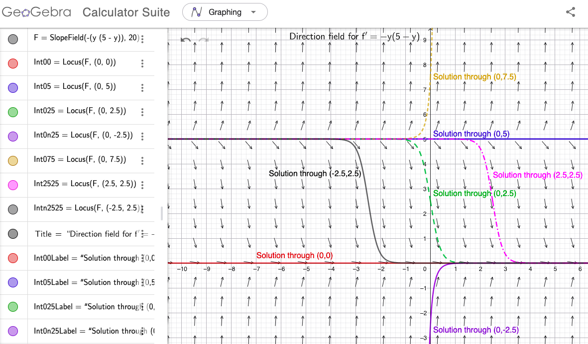
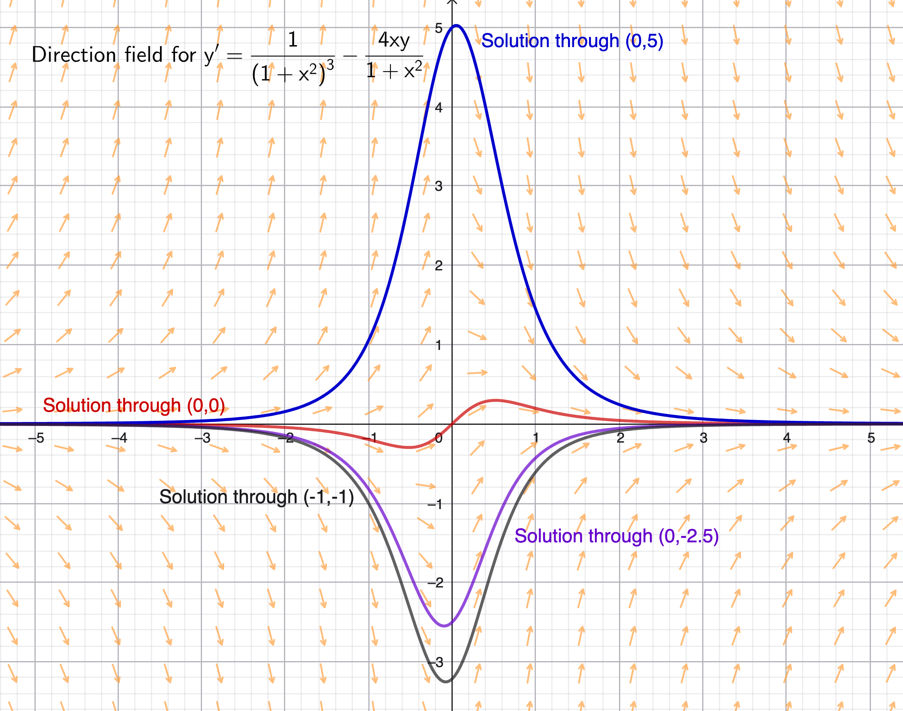
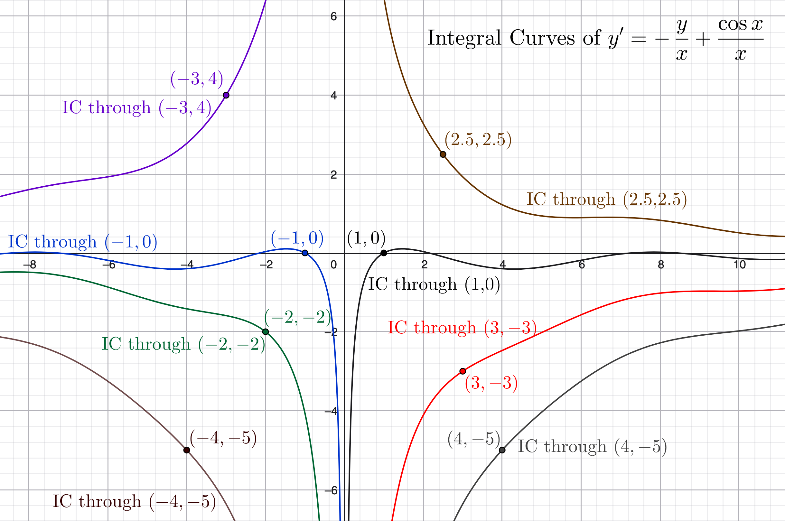

<link rel="stylesheet" href="../../Styles.css">
<title>Solutions of Selected Problems from Boyce/DiPrima "Elem. DEs & BVPs 5th Ed. Chapters 1 and 2"</title>
$\require{cancel}
\newcommand{\t}{\theta}
\newcommand{\u}{\upsilon}
\newcommand{\box}{\boxed}
\newcommand{\chec}{\checkmark}
\newcommand{\Frac}{\displaystyle \frac}
\newcommand{\Lim}{\displaystyle \lim}
\newcommand{\Int}{\large{\int}\small}
\newcommand{\DefInt}[2]
{
  \large\int_{\small{#1}}^{\small{#2}}\small
}
$
## 
Selected Problem Solutions

from

### 
Boyce, W. E. & R. C. DiPrima, 1992. <i>Elementary Differential Equations and</i> <i>Boundary Value Problems, Fifth Edition</i>. John Wiley & Sons, New York.
### 
Chapter 1, Section 1 (&quot;Introduction, Classification of Differential Equations&quot;)

and

### 
Chapter 2 (&quot;First Order Differential Equations&quot;)
### 
&copy; 2026 by
### 
[David Lawrence Goldsmith](https://www.linkedin.com/in/olydlg)

for

## 
[SelectedSolutionsDotNet](https://olydlg.github.io/selectedsolutionsdotnet/)

<i>Notes: These solutions are provided &quot;as-is,&quot; for informational purposes only, with no warranty of any kind, expressed or implied, including that of correctness, adequacy, and/or suitability for any purpose, whatsoever.</i> Corrections are welcome and should be emailed to selectedsolutionsdotnet@gmail.com.

Purple font indicates clicking on the text will return you to your prior place; $\blacksquare$ inidicates the end of a proof; unlike the text, but consistent with most mathematical usage after &quot;Algebra 2,&quot; we use $\log$ to denote the &quot;natural&quot; logarithm, $\log_e$.

### Contents

<table>
  <tr>
    <th colspan=9><b>Chapter 1, Section 1</b></th>
  </tr>
  <tr>
    <th >Problem #: </th>
    <td><a href="#P1.1.6">1.1.6</a></td>
    <td><a href="#P1.1.14">1.1.14</a></td>
    <td><a href="#P1.1.18">1.1.18</a></td>
    <td><a href="#P1.1.20">1.1.20</a></td>
    <td><a href="#P1.1.26">1.1.26</a></td>
    <td><a href="#P1.1.32">1.1.32</a></td>
    <td><a href="#P1.1.40">1.1.40</a></td>
  </tr>
  <tr>
    <th colspan=9><b>Chapter 2, Section 1</b></th>
  </tr>
  <tr>
    <th >Problem #: </th>
    <td><a href="#P2.1.4">2.1.4</a></td>
    <td><a href="#P2.1.8">2.1.8</a></td>
    <td><a href="#P2.1.12">2.1.12</a></td>
    <td><a href="#P2.1.16">2.1.16</a></td>
    <td><a href="#P2.1.20">2.1.20</a></td>
    <td><a href="#P2.1.21">2.1.21</a></td>
    <td><a href="#P2.1.22b">2.1.22b</a></td>
    <td><a href="#P2.1.24">2.1.24</a></td>
  </tr>
  <tr>
    <th colspan=9><b>Section 2</b></th>
  </tr>
  <tr>
    <th >Problem #: </th>
    <td><a href="#P2.2.4">2.2.4</a></td>
    <td><a href="#P2.2.7">2.2.7</a></td>
    <td><a href="#P2.2.10">2.2.10</a></td>
    <td><a href="#P2.2.16">2.2.16</a></td>
    <td><a href="#P2.2.20">2.2.20</a></td>
    <td><a href="#P2.2.24">2.2.24</a></td>
    <td><a href="#P2.2.26">2.2.26</a></td>
    <td><a href="#P2.2.27b">2.2.27b</a></td>
    <td><a href="#P2.2.31">2.2.31</a></td>
  </tr>
  <tr>
    <th colspan=9><b>Section 3</b></th>
  </tr>
  <tr>
    <th >Problem #: </th>
    <td><a href="#P2.3.2">2.3.2</a></td>
    <td><a href="#P2.3.6">2.3.6</a></td>
    <td><a href="#P2.3.10">2.3.10</a></td>
    <td><a href="#P2.3.14">2.3.14</a></td>
    <td><a href="#P2.3.18">2.3.18</a></td>
    <td><a href="#P2.3.22">2.3.22</a></td>
  </tr>
  <tr>
    <th colspan=9><b>Section 4</b></th>
  </tr>
  <tr>
    <th >Problem #: </th>
    <td><a href="#P2.4.2">2.4.2</a></td>
    <td><a href="#P2.4.5">2.4.5</a></td>
    <td><a href="#P2.4.8">2.4.8</a></td>
    <td><a href="#P2.4.12">2.4.12</a></td>
    <td><a href="#P2.4.14">2.4.14</a></td>
  </tr>
  <tr>
    <th colspan=9><b>Section 5</b></th>
  </tr>
  <tr>
    <th >Problem #: </th>
    <td><a href="#P2.5.4">2.5.4</a></td>
    <td><a href="#P2.5.13">2.5.13</a></td>
    <td><a href="#P2.5.17">2.5.17</a></td>
    <td><a href="#P2.5.22">2.5.22</a></td>
  </tr>
  <tr>
    <th colspan=9><b>Section 6</b></th>
  </tr>
  <tr>
    <th >Problem #: </th>
    <td><a href="#P2.6.6">2.6.6</a></td>
    <td><a href="#P2.6.7">2.6.7</a></td>
    <td><a href="#P2.6.11">2.6.11</a></td>
    <td><a href="#P2.6.16">2.6.16</a></td>
    <td><a href="#P2.6.19">2.6.19</a></td>
    <td><a href="#P2.6.22">2.6.22</a></td>
    <td><a href="#P2.6.23">2.6.23</a></td>
  </tr>
</table>

### Chapter 1, Section 1

<a name="P1.1.6" class="goback" onclick="winhisback()">__1.1.6__)</a>
State the order and linearity or nonlinearity of $\Frac{d^3y}{dx^3} + x\Frac{dy}{dx} + (\cos^2 x)y = x^3$.

__Sln__: The highest&#8209;order derivative occurring in the equation is three, so this equation is $\box{3^{\text{rd}}\text{ order}}.$&nbsp; It is $\box{\text{linear}}$ because it is of the form $a_0(x)y^{(n)} + a_1(x)y^{(n-1)} + ... + a_n(x)y = g(x)$.
  

<a name="P1.1.14" class="goback" onclick="winhisback()">__1.1.14__)</a> 
Verify that $y = e^{x^2}\DefInt{0}{x}$ $e^{-t^2} dt + e^{x^2}$ is a solution of $y’ - 2xy = 1$.

__Sln__: $y’ = 2xe^{x^2}\DefInt{0}{x}$ $e^{-t^2} dt + e^{x^2}(e^{-x^2}) + 2xe^{x^2} = 2xe^{x^2}\DefInt{0}{x}$ $e^{-t^2} dt + 1 + 2xe^{x^2}$ so $y’ - 2xy = \color{red}{\cancel{2xe^{x^2}\DefInt{0}{x}\normalsize e^{-t^2} dt}} + 1 + \color{blue}{\cancel{2xe^{x^2}}} - \color{red}{\cancel{2xe^{x^2}\DefInt{0}{x}\normalsize e^{-t^2} dt}} - \color{blue}{\cancel{2xe^{x^2}}} = 1.~~~\blacksquare$
  

<a name="P1.1.18" class="goback" onclick="winhisback()">__1.1.18__)</a>
Which values of $r$ make $y = e^{rx}$ a solution of $y’’’ - 3y’’ + 2y’ = 0$?

__Sln__: First note that for $y=f(x)$ to be a solution of a differential equation, it must make the equation a true statement <i>for all</i> $x$ over which the DE is supposed to hold.&nbsp; Now, $y = e^{rx} \implies y’ = re^{rx}, y’’ = r^2e^{rx}, y’’’ = r^3e^{rx}$ so $0 = y’’’ - 3y’’ + 2y’ = r^3e^{rx} - 3r^2e^{rx} + 2re^{rx} = (r^3 - 3r^2 + 2r)e^{rx} \implies r^3 - 3r^2 + 2r = 0$ because $e^{rx} \ne 0$ for all $x$ and $r$.&nbsp; $0 = r^3 - 3r^2 + 2r = r(r-1)(r-2) \implies \box{r = 0, 1, 2}$ as the values of $r$ which make $y = e^{rx}$ a solution of $y’’’ - 3y’’ + 2y’ = 0$.&nbsp; (The reader should check that $y = e^{0x}=1, y = e^{1x} = e^x,$ and $y = e^{2x}$ all do indeed make $y’’’ - 3y’’ + 2y’ = 0$ a true statement.)
  

<a name="P1.1.20" class="goback" onclick="winhisback()">__1.1.20__)</a>
Which values of $r$ make $y = x^r, x \gt 0$ a solution of $x^2y’’ - 4xy’ + 4y = 0$?

__Sln__: $y = x^r, x \gt 0 \implies y’ = rx^{r-1}, y’’ = r(r-1)x^{r-2} \implies x^2y’’ - 4xy’ + 4y = r(r-1)x^{r-2+2} - 4rx^{r-1+1} + 4x^r = (r^2 - r - 4r + 4)x^r = 0$ $\implies r^2 - 5r + 4 = 0$ since $x^r \ne 0$ for all $x \gt 0$.&nbsp; Now, $0 = r^2 - 5r + 4 = (r-1)(r-4) \implies \box{r = 1, 4}$ as the values of $r$ that make $x^r$ a solution of $x^2y’’ - 4xy’ + 4y = 0$ for all $x \gt 0$. 
Check: $y = x^1 \implies y’ = 1, y’’ = 0 \implies x^2y’’ - 4xy’ + 4y = x^2(0) - 4x(1) + 4x \overset{\chec}{=} 0$; $y = x^4 \implies y’ = 4x^3, y’’ = 12x^2 \implies x^2y’’ - 4xy’ + 4y = x^2(12x^2) - 4x(4x^3) + 4(x^4) = (12 - 16 + 4)x^4 \overset{\chec}{=} 0$.
  

<a name="P1.1.26" class="goback" onclick="winhisback()">__1.1.26__)</a>
State the order and linearity or nonlinearity of $u_t + uu_x = 1 + u_{xx}$.

__Sln__: (Note: this PDE is the one (spatial) dimension version of the conservation of momentum portion of the [Navier-Stokes equations](https://en.wikipedia.org/wiki/Navier%E2%80%93Stokes_equations), which give a &quot;field description&quot; of the motion of (in this version) an incompressible, viscous fluid.) 
The highest&#8209;order derivative occurring in the equation is two ($u_{xx}$), so this is a $\box{\text{second order}}$ equation. (However, for at least a couple of reasons you’ll learn later, it is useful to distinguish the order of a PDE with respect to each of its independent variables, so we will learn to characterize this equation as second&#8209;order in $x$, first&#8209;order in $t$.)&nbsp; It is $\box{\text{nonlinear}}$ because of the presence of the $uu_x$ term.
  

<a name="P1.1.32" class="goback" onclick="winhisback()">__1.1.32__)</a>
Given: $f, g$ are twice&#8209;differentiable functions; Verify: $u(x,t) = f(x-at) + g(x+at)$ is a solution of $a^2u_{xx} = u_{tt}$. 

__Sln__: By the [Chain Rule for multivariable functions](https://en.wikipedia.org/wiki/Chain_rule#Multivariable_case), $ u_x = f’(x-at)\Frac{\partial}{\partial x}(x-at) + g’(x+at)\Frac{\partial}{\partial x}(x+at) = f’(x-at)(1) + g’(x+at)(1) = f’(x-at) + g’(x+at)$ and thus, similarly, $u_{xx} = f’’(x-at) + g’’(x+at)$. Also: $ u_t = f’(x-at)\Frac{\partial}{\partial t}(x-at) + g’(x+at)\Frac{\partial}{\partial t}(x+at) = f’(x-at)(-a) + g’(x+at)(a) = -af’(x-at) + ag’(x+at) \implies$ $u_{tt} = (-a)^2f’’(x-at) + a^2g’’(x+at) = a^2(f’’(x-at) + g’’(x+at)) = a^2u_{xx}$ as was to be shown.&nbsp; (Note: this is the [d’Alembert solution](https://en.wikipedia.org/wiki/Wave_equation#Algebraic_approach) of the one (spatial) dimension wave equation&mdash;the reader should read about what the form of this solution implies about this solution’s physical nature.)
  

<a name="P1.1.40" class="goback" onclick="winhisback()">__1.1.40__)</a>
Use technology to sketch the direction field of $y’ = -y(5-y)$ and thereby determine the behavior of $y$ as $x \rightarrow \infty$.

__Sln__: When this edition of the text was published, the options available to students to do this exercise were, compared to when I write this in 2026, MUCH more primitive, less accessible, and required considerably more programming work and creativity on the part of the student; presently, however, there exist a plurality of options which render this problem little more than a graphing calculator exercise!&nbsp; My personal favorite for most needs is [GeoGebra](www.geogebra.org), which is free, very powerful, has various specialized versions (e.g., a dedicated 3-D graphing version), and is available both as stand&#8209;alone apps for handheld devices and as a Web app, i.e., runs inside a Web browser such as Google Chrome. 

In GeoGebra, one can do this exercise with one command: `SlopeField(f(x,y))` (with additional optional inputs), where $f(x,y)$ is whatever formula $y’$ equals; and the command to generate a solution through a specific point&mdash;useful to better understand what the direction field is showing you&mdash;is `Locus(<SlopeField>, <Point>)`, where `<SlopeField>` is the output of the `SlopeField` command, and `Point` is a point object, which may be provided as an ordered pair (as well as in other ways).&nbsp; GeoGebra supports &quot;naming&quot; objects (i.e., assigning them to &quot;variables,&quot; i.e., properly&#8209;formatted character strings), so if we begin by entering `F=SlopeField(-y(5-y))` (no spaces), we can subsequently use `F` as the first argument to repeated uses of `Locus`: `Locus(F, (0,0))` plots the solution of $y’=-y(5-y)$ passing through the point $(0,0)$, `Locus(F, (2.5,2.5))` plots its solution passing through $(2.5,2.5)$, and `Locus(F,(a,b))` plots its solution passing through $(a,b)$.&nbsp; (Indeed, if you’re doing this interactively, you could equate `a` and `b` to numerical values, issue the command as `Locus(F,(a,b))`, and then generate solution curves to your heart’s content simply by editing the numerical values assigned to `a` and `b`.) Below I’ve provided a screenshot of a GeoGebra&#8209;rendered solution, including the commands used (the various IntXLabel variables, assigned to `Text(<string>, <Point>)` commands, merely place labels in specific locations&mdash;one of the few failings of GeoGebra is limited control over custom placement of auto&#8209;generated labels); however, many desirable features of the graph, e.g., color and varying line&#8209;type, and arrows at the ends of the direction field segments, were added using `Settings` customizations, available by clicking on the three vertical dots at the right end of the command input cell&mdash;the reader is encouraged to explore these `Settings`. 

  

### Chapter 2, Section 1

__First, a bit of problem solving strategy__  
The objective of the integrating factor method is to find $f(x)$ that will make the left hand side of $y’ + p(x)y = g(x)$ an ___exact differential___, i.e., to find $f(x)$ such that $f(x)p(x) = f’(x)$ so that $f(x)y’ + f(x)p(x)y = f(x)y’ + f’(x)y = \left[f(x)y\right]’$.&nbsp; However, ___sometimes___, especially in the problems below, we’re given the DE in the form $f(x)y’ + q(x)y = h(x)$ and it turns out that $q(x) = f’(x)$ so that the left hand side starts out as $f(x)y’ + f’(x)y = \left[f(x)y\right]’$, i.e., an exact differential: in such an instance, it is a waste of time to go through the process of finding the integrating factor, because we can immediately write the DE as $\left[f(x)y\right]’ = h(x)$ and proceed to integrating both sides.&nbsp; Since differentiating is typically easier than integrating, for each problem given in the form $f(x)y’ + q(x)y = h(x)$, before converting it to $y’ + p(x)y = g(x)$ and computing the integrating factor, we will first compute the derivative of $f(x)$ to see if it equals the coefficient of $y$, i.e., we will first check to see if the left hand side is ___given to us___ as an exact differential.
  

Problems 2.1.4 and 2.1.8: find the general solution of the given differential equation.

<a name="P2.1.4" class="goback" onclick="winhisback()">__2.1.4__)</a>
$y’ + (1/x)y = 3\cos 2x,~~~~~x \gt 0$

__Sln__: (I prefer to solve these using the method rather than the formula.)&nbsp; This is of the form $y’ + p(x)y = g(x)$ with $p(x) = 1/x, g(x) = 3\cos 2x$; thus the integrating factor $\mu(x) = \exp\left(\Int\Frac1x dx\right) = e^{\log x} = x$.&nbsp; Multiplying through by $x$ (which we can do without concern since it’s stipulated that $x \gt 0$), we get: 

$xy’ + y = \Frac d{dx}(xy)$ $= 3x\cos 2x \implies xy = \Int3x\cos 2x dx = \Frac34\left(2x\sin 2x + \cos 2x\right) + C \implies$ 

$$\box{y = \Frac32\sin 2x + \Frac{3\cos 2x}{4x} + \Frac Cx}$$
Check: $ y’ = \Frac32 (2)\cos 2x + \Frac{4x(-6\sin 2x) - 4(3\cos 2x)}{16x^2} - \Frac C{x^2} = 3\cos 2x - \Frac{3\sin 2x}{2x} - \Frac{3\cos 2x}{4x^2} - \Frac C{x^2}$, 
$ (1/x)y = \Frac{3\sin 2x}{2x} + \Frac{3\cos 2x}{4x^2} + \Frac C{x^2}$ so 
$ y’ + (1/x) = 3\cos 2x \cancel{- \Frac{3\sin 2x}{2x} + \Frac{3\sin 2x}{2x}} \cancel{- \Frac{3\cos 2x}{4x^2} + \Frac{3\cos 2x}{4x^2}} \cancel{- \Frac C{x^2} + \Frac C{x^2}}.~~\chec$
  

<a name="P2.1.8" class="goback" onclick="winhisback()">__2.1.8__)</a>
$(1+x^2)y’ + 4xy = (1+x^2)^{-2}$

__Sln__: This is in the form $f(x)y’ + q(x)y = h(x)$ so we begin by checking to see if $f’(x) = 2x$ equals $q(x) = 4x$; since it does not we proceed to the integrating factor method. 

Noting that $1+x^2 \ne 0$ for all real $x$, divide through by it to yield the equivalent DE $y’ + 4x(1+x^2)^{-1}y = (1+x^2)^{-3} \equiv$ $y’ + p(x)y = g(x)$ with $p(x) = 4x(1+x^2)^{-1}, g(x) = (1+x^2)^{-3}$.&nbsp; Thus the integrating factor $\mu(x) = \exp\left(\Int\Frac{4x}{1+x^2}dx\right) = \exp\left(2\Int\Frac{du}{u}\right) \text{ (letting } u = 1+x^2 \implies du = 2xdx\text{) } = e^{2\log u} = (1+x^2)^2$.&nbsp; Multiplying the $y’ + p(x)y = g(x)$ form of the equation through by $\mu(x)$ yields: 
$(1+x^2)^2 y’ + 4x(1+x^2)y = \Frac d{dx}\left[(1+x^2)^2 y\right] = \Frac1{1+x^2} \implies (1+x^2)^2y = \int\Frac1{1+x^2}dx = \tan^{-1}x + C \implies$
$$\box{y = \frac{\tan^{-1}x + C}{(1+x^2)^2}}$$
Check: $ (1+x^2)y’ = (1+x^2)\left[\Frac{(1+x^2)^2(1+x^2)^{-1} - 4x(1+x^2)(\tan^{-1}x + C)}{(1+x^2)^4}\right] = (1+x^2)^{-2}(1 - 4x(\tan^{-1}x + C)$ 
$4xy = 4x(\tan^{-1}x + C)(1+x^2)^{-2}$ so $(1+x^2)y’ + 4xy = (1+x^2)^{-2} \cancel{- 4x(\tan^{-1}x + C)(1+x^2)^{-2} + 4x(\tan^{-1}x + C)(1+x^2)^{-2}}~~\chec$
  

Problems 2.1.12 and 2.1.16: find the solution of the given initial value problem (IVP).

<a name="P2.1.12" class="goback" onclick="winhisback()">__2.1.12__)</a>
$ y’ + \Frac2x y = \Frac{\cos x}{x^2},~~~y(\pi) = 0,~~~x \gt 0$

__Sln__: $p(x) = \Frac2x \implies \mu(x) = \exp\left(\small{\int\frac2x dx}\right) = x^2$; multiplying through, we obtain $x^2y’ + 2xy = \Frac{d}{dx}\left(x^2y\right) = \cos x \implies x^2y = \sin x + C$; the IC requires $\pi^2(0) = 0 = \sin\pi + C = C$ so the solution is
$$\box{y = \frac{\sin x}{x^2}}$$
IC check: $\Frac{\sin\pi}{\pi^2} = 0~~\chec$ 
DE check: $y’ = \Frac{x^2\cos x - 2x\sin x}{x^4} = \Frac{\cos x}{x^2} - \Frac{2\sin x}{x^3}$ 
$\Frac2x y = \Frac{2\sin x}{x^3} \implies y’ + \Frac2x y = \Frac{\cos x}{x^2} \cancel{- \Frac{2\sin x}{x^3} + \Frac{2\sin x}{x^3}}~~\chec$
  

<a name="P2.1.16" class="goback" onclick="winhisback()">__2.1.16__)</a>
$xy’ + (x+1)y = x,~~~y(\log 2) = 1$

__Sln__: First check to see if the equation is already exact: $(x)’ = 1 \ne x + 1$ so it is not. 

At $x = 0$ the DE reduces to $y(x) \equiv 0$, and there is no differentiable function consistent with this and the specified initial condition, so assume $x \ne 0$.&nbsp; Then the given DE is equivalent to $y’ + (1+\Frac1x)y = 1 \equiv y’ + p(x)y = g(x)$ with $g(x) = 1, p(x) = 1 + \Frac1x \implies \mu(x) = \exp\left[\int\left(1+\frac1x\right)dx\right] = e^{x+\log x} = xe^x$.&nbsp; Multiplying this through the $y’ + p(x)y = g(x)$ form of the equation yields $xe^x y’ + (x+1)e^x y = \Frac{d}{dx}(xe^x y) = xe^x \implies$ $xe^x y = \Int xe^x dx = (x-1)e^x + C$.&nbsp; The IC requires $\log 2 e^{\log 2}(1) = \cancel{2\log 2} = (\log 2 - 1)e^{\log 2} + C = \cancel{2\log 2} - 2 + C \implies C = 2$ so we have $xe^x y = (x-1)e^x + 2 \implies$
$$\box{y = 1 - \frac{1 - 2e^{-x}}x}$$
IC check: $1 - \Frac{1-2e^{-\log 2}}{\log 2} = 1 - \Frac0{\log 2} = 1~~\chec$ 
DE check: $xy’ = x\left(0 - \Frac{x(2e^{-x}) - (1)(1 - 2e^{-x})}{x^2}\right) = \Frac{1 - 2e^{-x} - 2xe^{-x}}{x}$ 
$(x+1)y = x + \cancel{1 - 1} + 2e^{-x} - \Frac{1 - 2e^{-x}}{x} = x - \Frac{1 - 2e^{-x} - 2xe^{-x}}{x} \implies$ 
$xy’ + (x+1)y = \cancel{\Frac{1 - 2e^{-x} - 2xe^{-x}}{x}} + x \cancel{- \Frac{1 - 2e^{-x} - 2xe^{-x}}{x}} = x~~\chec$
  

<a name="P2.1.20" class="goback" onclick="winhisback()">__2.1.20__)</a>
Use technology to graph the direction field of the given differential equation, use the graph to predict the behavior of solutions as $x \rightarrow \infty$, and check the prediction by evaluating that limit for the exact solution (found in Problem 8).

__Sln__: See 1.1.40 above for guidance regarding how to use GeoGebra to produce the following graph:

Clearly, the graph implies that all solutions &quot;go to&quot; zero as $x$ goes to both positive and negative infinity; and indeed,  
$ \lim_{x\rightarrow\pm\infty} \Frac{\tan^{-1}x + C}{(1+x^2)^2} \rightarrow \Frac{\pm\Frac{\pi}2 + C}{\infty} \rightarrow 0$.
  

<a name="P2.1.21" class="goback" onclick="winhisback()">__2.1.21__)</a>
Solve the IVP $\Frac{dy}{dx} = \Frac1{e^y - x},~~~y(1)=0$; hint: consider $x$ as a function of $y$.

__Sln__: Following the hint, begin by rewriting the equation as $\Frac{dx}{dy} = e^y - x \equiv x’ + p(y)x = g(y)$ with $g(y) = e^y, p(y) = 1 \implies \mu(y) = \exp\left(\Int dy \right) = e^y$; multiplying through gives $e^{2y} = e^y x’ + e^y x = \Frac{dx}{dy}(e^y x) \implies$ $e^y x = \Int e^{2y}dy = \Frac12e^{2y} + C$; the IC gives $e^0(1) = 1 = \Frac12e^{2(0)} + C \implies C = \Frac12$; thus $e^{y} x = \Frac{e^{2y} + 1}2 \implies x = \Frac{e^y + e^{-y}}2 = \cosh y \implies $
$$\box{y = \cosh^{-1}x,~~x \ge 1}$$
IC check: $\cosh^{-1}(1) = 0~~\chec$ 
DE check: $\Frac{d}{dy}\cosh y = \sinh y = \Frac12(e^y - e^{-y}) = \Frac12(2e^y - (e^y + e^{-y}) = e^y - \cosh y = e^y - x \implies \Frac{dy}{dx} = \Frac1{e^y - x}~~\chec$ 
  

<a name="P2.1.22b" class="goback" onclick="winhisback()">__2.1.22b__)</a>
Show that $\phi(x) = c/x$ is a solution of $y’ + y^2 = 0~(x \gt 0)$ if and only if $c=0$ or $c=1$.
 
__Pf__: $\phi’(x) = -c/x^2 \implies \phi’ + \phi^2 = -\Frac{c}{x^2} + \Frac{c^2}{x^2}$; setting this equal to zero and utilizing the given that $x \gt 0$ to multiply through by $x^2 \implies c(c-1) = 0 \implies c = 0$ or $c=1$ as the only values of $c$ which make the equation a true statement.$~~~\blacksquare$
  

<a name="P2.1.24" class="goback" onclick="winhisback()">__2.1.24__)</a>
Given $y_1(x)$ is a solution of $y’ + p(x)y = 0$ and $y_2(x)$ is a solution of $y’ + p(x)y = g(x)$, show that $y_1 + y_2$ is also a solution of $y’ + p(x)y = g(x)$.

__Pf__: $(y_1 + y_2)’ + p(x)(y_1 + y_2) = (y_1’ + p(x)y_1) + (y_2’ + p(x)y_2) = 0 + g(x)$ (because it is given that $y_1’ + p(x)y_1 = 0$ and $y_2’ + p(x)y_2 = g(x)$) $ = g(x)$, i.e., $y_1 + y_2$ is a solution of $y’ + p(x)y = g(x).~~~\blacksquare$ 
  

### Chapter 2, Section 2

<a name="P2.2.4" class="goback" onclick="winhisback()">__2.2.4__)</a>
Find the general solution of $xy’ + 2y = e^x,~~~x \gt 0$.

__Sln__: $x’ = 1 \ne 2$ so the equation is not exact. 

$\mu(x) = \exp\left(\Int \Frac2x dx\right) = x^2 \implies x^2y’ + 2xy = (x^2y)’ = xe^x \implies x^2y = (x-1)e^x + C \implies$ $$\box{\frac{e^x}x - \frac{e^x}{x^2} + \frac C{x^2}}$$. 
Check: $xy’ = x\left(\Frac{xe^x-e^x}{x^2} - \Frac{x^2e^x-2xe^x}{x^4} - \Frac{2C}{x^3}\right) = e^x - 2\Frac{e^x}x + 2\Frac{e^x}{x^2} - 2\Frac C{x^2}$;  
$2y = 2\Frac{e^x}x - 2\Frac{e^x}{x^2} + 2\Frac C{x^2}$ so  
$xy’ + 2y = e^x \cancel{- 2\Frac{e^x}x + 2\Frac{e^x}x} \cancel{+ 2\Frac{e^x}{x^2} - 2\Frac{e^x}{x^2}} \cancel{- 2\Frac C{x^2} + 2\Frac C{x^2}}~~\chec$.
  

Problems 2.2.7 and 2.2.10: Solve the given IVP and state the interval in which the solution is valid. 

<a name="P2.2.7" class="goback" onclick="winhisback()">__2.2.7__)</a>
$y’ + (\cot x)y = 2\csc x,~~~y(\pi/2) = 1$

__Sln__: Both cot and csc are discontinuous at integer multiples of $\pi$, and the interval bounded by such containing $x=\Frac{\pi}2$ is $\box{(0,\pi)}$, so that is the interval in which the solution is valid.&nbsp; To obtain the solution: $\mu(x) = \exp\left(\Int\cot xdx\right) = \exp(\log|\sin x|) = \sin x$ ($|\sin x| = \sin x$ on the interval of validity) $\implies (\sin x)y’ + (\cos x)y = \left[(\sin x)y\right]’ = 2 \implies (\sin x)y = 2x + C$; $y(\pi/2) = 1 \implies \sin\left(\Frac{\pi}2\right)(1) = 1 = 2\left(\Frac{\pi}2\right) + C \implies C = 1-\pi \implies $
$$\box{y = (2x + 1 - \pi)\csc x}$$
Check: IC: $(2(\pi/2) + 1 - \pi)\csc(\pi/2) = 1~\chec$  
DE: $y’ = 2\csc x - (2x + 1 - \pi)\csc x\cot x,~(\cot x)y = (2x + 1 - \pi)\csc x \cot x$ so 
$y’ + (\cot x)y = 2\csc x\cancel{ - (2x + 1 - \pi)\csc x\cot x + (2x + 1 - \pi)\csc x \cot x}~\chec$
  

<a name="P2.2.10" class="goback" onclick="winhisback()">__2.2.10__)</a>
$x(2+x)y’ + 2(1+x)y = 1+3x^2,~~~y(-1) = 1$

__Sln__: $\left[x(2+x)\right]’ = (1)(2+x) + (x)(1) = 2 + 2x = 2(1+x)$ so the equation is exact as given:
$x(2+x)y’ + 2(1+x)y = \left[x(2+x)y\right]’ = 1 + 3x^2$ so $x(2+x)y = \Int\!\left(1+3x^2\right)dx = x^3 + x + C$. Using the IC we obtain $(-1)(2-1)(1) = -1 = (-1)^3 - 1 + C \implies C = 1 \implies$
$$\box{y = \frac{x^3 + x + 1}{x(x+2)} = x - 2 + \frac{5x + 1}{x^2+2x}}$$
Check: IC: $\Frac{(-1)^3 + (-1) + 1}{(-1)(-1+2)} = (-1)/(-1) = 1~\chec$ 
DE: $x(2+x)y’ = x(2+x)\left[1 + \Frac{(x^2+2x)(5) - (5x+1)(2x+2)}{(x^2+2x)^2}\right] = \Frac{(x^2+2x)^2 - 5x^2 - 2x - 2}{x^2+2x} = \Frac{x^4 + 4x^3 - x^2 - 2x - 2}{x^2+2x}$, 
$2(1+x)y = 2(1+x)\left(\Frac{x^3 + x + 1}{x(x+2)}\right) = \Frac{2x^4 + 2x^3 + 2x^2 + 4x + 2 }{x^2+2x}$ so  
$x(2+x)y’ + 2(1+x)y = \Frac{3x^4 + 6x^3 + x^2 + 2x}{x(x+2)} \underset{x\ne 0}{=} \Frac{3x^3 + 6x^2 + x + 2}{x+2} = \Frac{3x^2(x+2) + 1(x+2)}{x+2} \underset{x\ne -2}{=} 3x^2 + 1~\chec$. 
The equation is not a differential equation at $x = -2, 0$ so the interval of validity is $\box{(-2,0)}$.
  

<a name="P2.2.16" class="goback" onclick="winhisback()">__2.2.16__)</a>
Given $y’ + (1/x)y = (\cos x)/x$:  
__a__) Solve for $x \gt 0$.  

__Sln__: In instances like this, it is worth checking to see if simply &quot;clearing the denominators&quot; results in the left hand side being exact: for $x \gt 0, y’ + (1/x)y = (\cos x)/x \equiv xy’ + y = (xy)’ = \cos x \implies xy = \Int\!\cos x\:dx = \sin x + C \implies$ 
$$\box{y = \frac{\sin x}x + \frac Cx}$$
Check: $y’ + (1/x)y = \Frac{\cancel{x}\cos x - \cancel{\sin x}}{x^{\cancel{2}}} - \cancel{\Frac C{x^2}} + \cancel{\Frac{\sin x}{x^2}} + \cancel{\Frac C{x^2}} = \Frac{\cos x}x~~\chec$
 

__b__) Determine $\Lim_{x\rightarrow 0} y(x)$ for various values of the integration constant.  

__Sln__: $\Lim_{~~x \rightarrow 0^+} \left[\Frac{\sin x}x + \Frac Cx\right] = $ 
$\Lim_{~~x \rightarrow 0^+} \Frac{\sin x}x + \Lim_{~~x \rightarrow 0^+} \Frac Cx = 1 + \left\{
\begin{array}{cc}
0, & C = 0 \\ 
\infty, & C \gt 0 \\
-\infty, & C \lt 0 
\end{array}
\right.$ 
(The reader should know, or at least know how to compute, the required limits from elementary Calculus.)
 

__c__) Graph several members of the family of integral curves (i.e., solutions through specific &quot;initial&quot; conditions).

__Sln__: Using GeoGebra Graphing mode:

  * Step 1: define (enter) `y’ = -y/x + (cos x)/x`; if necessary, &quot;undisplay&quot; the result (by clicking on the circle to the left of the definition).

  * Step 2: define `S = SlopeField(y’)` (number of grid points&mdash;the optional second parameter&mdash;is unnecessary because we’re not going to display `S`); undisplay the result.

  * Step 3: define a point, `P_ab = (<a>,<b>)`, through which you want to see the integral curve (`<>` around something means you supply an actual value).

  * Step 4: define its integral curve `IC_ab = Locus(y’,P_ab)`.

  * Step 5: Repeat Steps 3 and 4 as much as you like!

Here’s the result for IC’s (solutions) through $(2.5,2.5), (1,0), (3,-3), (4,-5), (-4,-5), (-2,-2), (-1,0), \&~(-3,4)$: 
 

 

<a name="P2.2.20" class="goback" onclick="winhisback()">__2.2.20__)</a>
Given the IVP $(\log x)y’ + y = \cot x,~~y(2) = 3$, without solving it, in what interval is its solution certain to exist.

__Sln__: The interval in which the solution is certain to exist is that portion of the intersection of the domains of $p(x)$ and $g(x)$ containing the initial condition-specified value of $x = 2$, where $p~\&~g$ are defined by the DE in the form $y’ + p(x)y = g(x)$; thus, here, $p(x) = 1/\log x$, the domain of which is $(0,1) \cup (1,\infty)$ and $g(x) = 1/\left[(\log x)(\sin x)\right]$, the domain of which is $(0,1) \cup \mathbb{R}^+\backslash \{(2k-1)\pi, k \in \mathbb{Z}^+\}$, i.e., the positive real numbers ___except___ $1$ and the positive odd multiples of $\pi$; the intersection of these two sets containing $2$ is the open interval $\box{(1,\pi)}$, which is thus the required interval.
  

<a name="P2.2.24" class="goback" onclick="winhisback()">__2.2.24__)</a> 
__a__) Show that the solution $\Frac{\int\mu(x)g(x)dx + c}{\mu(x)}$ of $y’ + p(x)y = g(x)$ where $\mu(x) = \exp\left(\Int p(x)dx\right)$ can be written as $y = cy_1(x) + y_2(x)$ for suitably chosen $y_1$ and $y_2$ and identify the functions $y_1$ and $y_2$. 

__Sln__: &quot;Trivial&quot;: $\Frac{\int\mu(x)g(x)dx + c}{\mu(x)} = \Frac{\int\mu(x)g(x)dx}{\mu(x)} + \Frac c{\mu(x)} = cy_1(x) + y_2(x)$ with $\box{y_1 = \frac1{\mu(x)}}$ and $y_2 = \box{\frac{\int\mu(x)g(x)dx}{\mu(x)}}~~~\blacksquare$.
 

__b__) Show that $y_1$ is a solution of $y’ + p(x)y = 0$. 

__Sln__: $y_1’ = \left[\exp\left(-\Int p(x)dx\right)\right]’ = -p(x)\exp\left(-\Int p(x)dx\right)$ and $p(x)y_1 = p(x)/\mu(x) = p(x)\exp\left(-\Int p(x)dx\right)$ so $y_1’ + p(x)y_1 \equiv 0.~~~\blacksquare$
 

__c__) Show that $y_2$ is a solution of the full DE, $y’ + p(x)y = g(x)$. 

__Sln__: Let $\nu(x) = \Int\mu(x)g(x)dx \implies \nu’(x) = \mu(x)g(x)$; then $y_2’ = \Frac{\mu \nu’ - \mu’ \nu}{\mu^2} = \Frac{\cancel{\mu^2} g}{\cancel{\mu^2}} - \Frac{p\mu\nu}{\mu^2}$ and $py_2 = \Frac{p\nu}{\mu} = \Frac{p\mu\nu}{\mu^2}$ so $y_2’ + py_2 = g \cancel{- \Frac{p\mu\nu}{\mu^2} + \Frac{p\mu\nu}{\mu^2}}~~~\blacksquare$
  

<a name="P2.2.26" class="goback" onclick="winhisback()">__2.2.26__)</a>
Sove the IVPs 
__a__) $$\begin{eqnarray}
y’ + 2y & = & g(x) \\
y(0) & = & 0 \\
g(x) & = & \left\{\begin{array}{1 1}
1, & 0 \le x \le 1 \\
0, & x \gt 1
\end{array}\right.
\end{eqnarray}
$$

__Sln__: The solution is is going to be a piece&#8209;wise continuous function $y = \left\{
\begin{array}{ll}
y_{\lt}(x), & x \in [0,1] \\
y_{\gt}(x), & x \in (1,\infty) 
\end{array}
\right.$; since the initial condition $x=0$ is in the interval $[0,1]$, it will determine the integration constant for $y_{\lt}$; the integration constant for $y_{\gt}$ will be determined so as to make the function continuous at $x=1$.&nbsp; Since we’re able to fully determine $y_{\lt}$ with the given information, we solve for that first; however, note that $\mu(x) = \exp\left(\Int 2dx\right) = e^{2x}$ is the same for both equations: all that differs is the right hand side.

On $[0,1]$ we have $e^{2x}y_{\lt}’ + 2e^{2x}y_{\lt} = \left(e^{2x}y_{\lt}\right)’ = e^{2x} \implies e^{2x}y_{\lt} = \Frac12 e^{2x} + C_{\lt}$; $y(0) = 0 \implies \left(e^{2(0)}\right)(0) = 0 = \Frac12 e^{2(0)} + C_{\lt} \implies C_{\lt} = -\Frac12$ so $\box{y_{\lt} = \frac12\left(1 - e^{-2x}\right)}$. Check: IC: $\Frac12\left(1-e^{-2(0)}\right) = 0~\chec$; DE: $y_{\lt}’ + 2y_{\lt} = (-2)\Frac{-e^{-2x}}2 + 2\left(\Frac12\right )\left(1-e^{-2x}\right) = 1.~\chec$  
On $(1, \infty)$ we have $\left(e^{2x}y_{\gt}\right)’ = 0 \implies e^{2x}y_{\gt} = C_{\gt} \implies y_{\gt} = C_{\gt}e^{-2x}$; we choose $C_{\gt}$ by &quot;pretending&quot; that $y_{\gt}$ is defined at $x=1$ and equating it there to $y_{\lt}$: $y_{\gt}(1) = y_{\lt}(1) \implies C_{\gt}\left(e^{-2}\right) = \Frac12\left(1 - e^{-2}\right) \implies C_{\gt} = \Frac12\left(e^2-1\right) \implies \box{y_{\gt} = \frac12\left(e^2-1\right)e^{-2x}}$. Check: &quot;boundary&quot; condition: $y_{\gt}(1) = \Frac12\left(e^2-1\right)e^{-2(1)} = \Frac12(1-e^{-2}~\chec$; DE: $y’ + 2y = (-2)\Frac12\left(e^2-1\right)e^{-2x} + 2\Frac12\left(e^2-1\right)e^{-2x} = 0~\chec$. All together, we have: 
$$\box{y(x) = \left\{
\begin{array}{ll}
\left(1 - e^{-2x}\right)/2, & x \in [0,1] \\
\left(e^{2}-1\right)/\left(2e^{2x}\right), & x \in (1,\infty) 
\end{array}
\right.}
$$
 

__b__) $$\begin{eqnarray}
y’ + p(x)y & = & 0 \\
y(0) & = & 1 \\
p(x) & = & \left\{\begin{array}{1 1}
2, & 0 \le x \le 1 \\
1, & x \gt 1
\end{array}\right.
\end{eqnarray}
$$

__Sln__: The approach is the same&mdash;we first solve completely over the domain which contains the initial condition, then we solve over the rest of the domain, choosing the integration constant for that solution so that the function is continuous at $x=1$&mdash;but in this instance each subdomain requires a different integrating factor.

On $[0,1]$: $\mu_{\lt}(x) = \exp\left(\Int 2dx\right) = e^{2x} \implies \left(e^{2x}y_{\lt}\right)’ = 0 \implies y_{\lt} = C_{\lt}e^{-2x}$ and the IC requires that $1 = C_{\lt}e^{-2(0)} \implies C_{\lt} = 1 \implies \box{y_{\lt} = e^{-2x}}$. Check: IC: $e^{-2(0)} = 1~\chec$; DE: $y_{\lt}’ + 2y_{\lt} = -2e^{-2x} + 2e^{-2x} = 0~\chec$.

On $(1,\infty)$: $\mu_{\gt}(x) = \exp\left(\Int 1dx\right) = e^x \implies \left(e^x y_{\gt}\right)’ = 0 \implies y_{\gt} = C_{\gt}e^{-x}$; continuity at $x=1$ requires that $C_{\gt}e^{-1} = e^{-2(1)} \implies C_{\gt} = e^{-1} \implies \box{y_{\gt} = e^{-x-1}}$. Check: continuity condition: $e^{-1-1} = e^{-2(1)}~\chec$; DE: $y_{\gt}’ + y_{\gt} = -e^{-x-1} + e^{-x-1} = 0~\chec$. All together we have:

$$\box{y(x) = \left\{
\begin{array}{ll}
e^{-2x}, & x \in [0,1] \\
e^{-x-1}, & x \in (1,\infty) 
\end{array}
\right.}
$$

  

<a name="P2.2.27b" class="goback" onclick="winhisback()">__2.2.27b__)</a>
Show that for $n \ne 0, 1$, the substitution $\u = y^{1-n}$ reduces $y’ + p(x)y = q(x)y^n$ to a linear equation.

__Sln__:
  

<a name="P2.2.31" class="goback" onclick="winhisback()">__2.2.31__)</a>
Solve $dy/dt = (\Gamma\cos t + T)y - y^3$, where $\Gamma$ and $T$ are constants.

__Sln__:
  

### Chapter 2, Section 3

Problems 2.3.2 and 2.3.6: Solve the given DE. 

<a name="P2.3.2" class="goback" onclick="winhisback()">__2.3.2__)</a>
$y’ = x^2 / \left[y(1+x^3)\right]$

__Sln__:
  

<a name="P2.3.6" class="goback" onclick="winhisback()">__2.3.6__)</a>
$xy’ = (1 - y^2)^{1/2}$

__Sln__:
  

Problems 2.3.10 and 2.3.14: Solve the given IVP in explicit form and determine (at least approximately) the interval in which it is well&#8209;defined. 

<a name="P2.3.10" class="goback" onclick="winhisback()">__2.3.10__)</a>
$dr/d\t = r^2/\t,~~r(1) = 2$

__Sln__:
  

<a name="P2.3.14" class="goback" onclick="winhisback()">__2.3.14__)</a>
$y’ = x(x^2 + 1)/(4y^3),~~y(0) = -1/\sqrt2$

__Sln__:
  

<a name="P2.3.18" class="goback" onclick="winhisback()">__2.3.18__)</a>
Solve the IVP $y’ = 3x^2/(3y^2 - 4),~~y(1) = 0$ and determine the interval in which the solution is valid.

__Sln__:
  

<a name="P2.3.22" class="goback" onclick="winhisback()">__2.3.22__)</a>
Show that the equation $$\frac{dy}{dx} = \frac{y-4x}{x-y}$$
is not separable &quot;as is,&quot; but that changing $y$ to $\u = y/x$ renders the equation separable in $x$ and $\u$ and thence find the solution of the given equation.

__Sln__:
  

### Chapter 2, Section 4

Problems 2.4.2, 2.4.5, and 2.4.8: State the region in the $xy$ plane in which the hypotheses of text Theorem 2.4.1 are satisfied. 

<a name="P2.4.2" class="goback" onclick="winhisback()">__2.4.2__)</a>
$y’ = (1 - x^2 - y^2)^{1/2}$

__Sln__:
  

<a name="P2.4.5" class="goback" onclick="winhisback()">__2.4.5__)</a>
$y’ = \Frac{\log|xy|}{1 - x^2 + y^2}$

__Sln__:
  

<a name="P2.4.8" class="goback" onclick="winhisback()">__2.4.8__)</a>
$\Frac{dy}{dx} = \Frac{(\cot x)y}{1 + y}$

__Sln__:
  

<a name="P2.4.12" class="goback" onclick="winhisback()">__2.4.12__)</a>
Solve the IVP $y’ = x^2/\left[y(1+x^3)\right],~~y(0) = y_0$ and determine how the interval in which the solution exists depends on $y_0$.

__Sln__:
  

<a name="P2.4.14" class="goback" onclick="winhisback()">__2.4.14__)</a>

__a__) Verify that $y_1(x) = 1 - x$ and $y_2(x) = -x^2/4$ are both solutions of the IVP
$$y’ = \frac{-x + (x^2 + 4y)^{1/2}}2,~~~y(2) = -1$$
and indicate their domains of validity.

__Sln__:
 

__b__) Explain why the existence of two solutions does not contradict the the uniqueness part of text Theorem 2.4.1.

__Sln__:
 

__c__) Show that $y = cx + c^2, c$ an arbitrary constant, satisfies the differential equation in part a) for $x \ge -2c$; if $c = -1$, the IC is also satisfied, yielding the solution $y_1$: show that no choice of $c$ gives the solution $y_2$. 

__Sln__:
  

### Please Donate:

<table>
  <tr>
    <td> <b>Venmo: @David-Goldsmith-13</b> </td>
    <td>
      <form action="https://www.paypal.com/cgi-bin/webscr"
            method="post"><input name="cmd"
            value="_xclick" type="hidden"> <input name="business"
            value="dgoldsmith_89@alumni.brown.edu" type="hidden"> <input
            name="item_name" value="SelectedSolutions Donation"
            type="hidden"> <input name="cn" value="Special Instructions
            (optional" type="hidden"> <input
            src="https://www.paypal.com/images/x-click-but04.gif"
            name="submit" alt="Make payments with PayPal - it's fast,
            free and secure!" align="middle" border="0" type="image"></form>
    </td>
  </tr>
</table>

