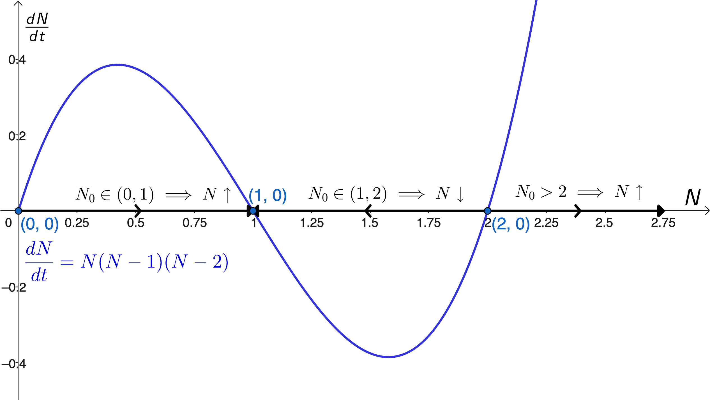

<link rel="stylesheet" href="../../Styles.css">
<title>Solutions of Selected Problems from Boyce/DiPrima "Elem. DEs & BVPs 5th Ed. Chapter 2 Part 2"</title>
$\require{cancel}
\newcommand{\b}{\beta}
\newcommand{\G}{\Gamma}
\newcommand{\t}{\theta}
\newcommand{\u}{\upsilon}
\newcommand{\rarrow}{\rightarrow}
\newcommand{\box}{\boxed}
\newcommand{\chec}{\checkmark}
\newcommand{\blksq}{\blacksquare}
\newcommand{\Frac}{\displaystyle \frac}
\newcommand{\Lim}{\displaystyle \lim}
\newcommand{\Int}{\large{\int}\normalsize}
\newcommand{\DefInt}[2]
{
  \large\int_{\small{#1}}^{\small{#2}}\small
}
$

## 
Selected Problem Solutions

from

### 
Boyce, W. E. & R. C. DiPrima, 1992. <i>Elementary Differential Equations and</i> <i>Boundary Value Problems, Fifth Edition</i>. John Wiley & Sons, New York.
### 
Chapter 2, Part 2: First Order Differential Equations, Sections 5 through 8
### 
&copy; 2026 by
### 
[David Lawrence Goldsmith](https://www.linkedin.com/in/olydlg)

for

## 
[SelectedSolutionsDotNet](https://olydlg.github.io/selectedsolutionsdotnet/)

<i>Notes: These solutions are provided &quot;as-is,&quot; for informational purposes only, with no warranty of any kind, expressed or implied, including that of correctness, adequacy, and/or suitability for any purpose, whatsoever.</i> Corrections are welcome and should be emailed to selectedsolutionsdotnet@gmail.com.

Purple font indicates clicking on the text will return you to your prior place; $\blksq$ indicates the end of a proof; unlike the text, but consistent with most mathematical usage after &quot;Algebra 2,&quot; we use $\log$ to denote the &quot;natural&quot; logarithm, $\log_e$.

### Contents

<table>
  <tr>
    <th colspan=9><b>Section 5: Applications of First Order Linear Equations</b></th>
  </tr>
  <tr>
    <th >Problem #: </th>
    <td><a href="#P2.5.4">4</a></td>
    <td><a href="#P2.5.13">13</a></td>
    <td><a href="#P2.5.17">17</a></td>
    <td><a href="#P2.5.22">22</a></td>
  </tr>
  <tr>
    <th colspan=9><b>Section 6: Population Dynamics and Some Related Problems</b></th>
  </tr>
  <tr>
    <th >Problem #: </th>
    <td><a href="#P2.6.3">3</a></td>
    <td><a href="#P2.6.7">7</a></td>
    <td><a href="#P2.6.11">11</a></td>
    <td><a href="#P2.6.16">16</a></td>
    <td><a href="#P2.6.19">19</a></td>
    <td><a href="#P2.6.22">22</a></td>
    <td><a href="#P2.6.23">23</a></td>
  </tr>
  <tr>
    <th colspan=9><b>Section 7: Some Problems in Mechanics</b></th>
  </tr>
  <tr>
    <th >Problem #: </th>
    <td><a href="#P2.7.7">7</a></td>
    <td><a href="#P2.7.10">10</a></td>
    <td><a href="#P2.7.13">13</a></td>
    <td><a href="#P2.7.16">16</a></td>
    <td><a href="#P2.7.17">17</a></td>
  </tr>
  <tr>
    <th colspan=9><b>Section 8: Exact Equations and Integrating Factors</b></th>
  </tr>
  <tr>
    <th >Problem #: </th>
    <td><a href="#P2.8.6">6</a></td>
    <td><a href="#P2.8.10">10</a></td>
    <td><a href="#P2.8.14">14</a></td>
    <td><a href="#P2.8.18">18</a></td>
    <td><a href="#P2.8.22">22</a></td>
    <td><a href="#P2.8.24">24</a></td>
    <td><a href="#P2.8.26">26</a></td>
    <td><a href="#P2.8.31">31</a></td>
  </tr>
</table>

### Section 5: Applications of First Order Linear Equations

<a name="P2.5.4" class="goback" onclick="winhisback()">__2.5.4__)</a>
100 mg of thorium&#8209;234 (234Th), which has a half&#8209;life of 24.5 days, are initially present in a closed container, and more of it is added at a rate of 1 mg/day.

__a__) Find the amount of it as a function of time, $Q(t)$.

__Sln__: The governing model is $\Frac{dQ}{dt} = -rQ + 1,~Q(0) = 100\text{ mg},~r = \Frac{\log 2}{24.5\text{ days}}$; the DE is separable yielding $dt = \Frac{dQ}{1-rQ} \implies t + C = -\Frac1r\log|1-rQ| \implies |1-rQ| = A’e^{-rt} \implies 1 - rQ = Ae^{-rt}$ where we have incorporated the indeterminacy of the sign corresponding to the absolute value into the yet&#8209;to&#8209;be&#8209;determined integration constant, which we now determine: $1-100r = Ae^{0} \implies \box{A = 1-100r} \implies$
$$\box{Q(t) = (1 - Ae^{-rt})/r \doteq 35.35 + 64.65\exp(-0.02829t)\text{ mg, } t\text{ in days}}$$
The check is left to the reader.&nbsp; (My calculations result in a (rounded) difference from the answer in the back of my edition of the text of 1 unit in the fourth significant figure; I’m not sure why, but given the copyright date, I’d conjecture the use of single&#8209;precision floating point arithmetic on the part of the answer generators, especially if the answers were not updated between the first copyright date, 1986, and that of my edition, 1992; in any event, I’m not worried about it, but I feel it would be dishonest to simply regurgitate the text answer when I obtained something different, albeit negligibly.)
 

__b__) Find $Q_{\infty} = \lim_{t \rarrow \infty} Q(t)$.

__Sln__: $\lim_{t \rarrow \infty} 35.35 + 64.65\exp(-0.02829t) = 35.35 + 64.65(0) = \box{35.35\text{ mg}}$.
 

__c__) How long before $Q(t) - Q_{\infty} \lt 0.5$ mg?

__Sln__: $0.5 = 35.35 + 64.65\exp(-0.02829t) - 35.35 \implies t = \log(0.5/64.65)/(-0.02829) \implies \box{t \doteq 171.9\text{ days}}$.
 

__d__) At what rate $k$ mg/d must it be added to maintain a constant level of 100 mg?

__Sln__: In order to maintain a constant level of $Q = 100$ mg, $dQ/dt = 0 = -rQ + k \implies k = rQ = 100(0.02829) = \box{2.829\text{ mg/d}}$. 
  

<a name="P2.5.13" class="goback" onclick="winhisback()">__2.5.13__)</a> 
Assume the earth’s human population, $P$, grows continuously in proportion to its present value; that the population in 1650 AD ($t=0$) was $6 \times 10^8$; and that the population in 1950 AD ($t=300$) was $2.8 \times 10^9$: find the population at time $t$ years from 1650, and when the population will reach $2.5 \times 10^{10}$.

__Sln__: The governing model is $\Frac{dP}{dt} = kP \implies P(t) = P_0e^{kt}$; $P_0 = P(0) = 6 \times 10^8$, so $P(300) = 2.8 \times 10^9 = 6 \times 10^8e^{300k} \implies$ $k = \Frac1{300}\log\left(\Frac{2.8 \times 10^9}{6 \times 10^8}\right) \doteq 5.13 \times 10^{-3} \implies$
$$\box{P(t) = 6 \times 10^8\exp(5.13 \times 10^{-3}t)\text{ humans, } t \text{ years since 1650 AD}}$$
To find when this model predicts the population will reach $2.5 \times 10^{10}$, we solve $2.5 \times 10^{10} = 6 \times 10^8\exp(5.13 \times 10^{-3}t)$ for $t$, yielding $t = \Frac1{5.13 \times 10^{-3}}\log\left(\Frac{2.5 \times 10^{10}}{6 \times 10^8}\right) \doteq 727.03$ years after 1650, i.e., $\box{2377\text{ AD}}$.&nbsp; (Again our answer differs from that given in the back of our copy of the text by one unit in the fourth significant figure...but just barely.) 
  

<a name="P2.5.17" class="goback" onclick="winhisback()">__2.5.17__)</a>
Assume a spherical raindrop of radius $r$ evaporates at a rate proportional to its surface area $S = 4\pi r^2$; that $r$ is initially 3 mm; and 30 minutes later it is 2 mm: find an expression for $r(t)$.

__Sln__: We have $\Frac{dV}{dt} = \Frac{d}{dt}\left(\Frac43\pi r^3\right) = 4\pi r^2\Frac{dr}{dt} = k(4\pi r^2) \implies \Frac{dr}{dt} = k \implies r(t) = kt + b$.&nbsp; The initial condition $r(0) = 3 = k(0) + b$ $\implies b =3$; $r(0.5\text{ hours}) = 2 = 0.5k + 3 \implies k = -2 \implies$
$$\box{r(t) = 3 - 2t\text{ mm, }t \in [0, 1.5] \text{ in hours}}$$
The check is trivial and left to the reader, who should understand/explain the domain restriction.
  

<a name="P2.5.22" class="goback" onclick="winhisback()">__2.5.22__)</a>
In a room containing 1200 ft$^3$ of air initially free of carbon monoxide (CO), at time $t=0$, cigarette smoke containing 4% CO is introduced at a rate of 0.1 ft$^3$/min., and the well&#8209;circulated mixture leaves the room at the same rate. 

 __a__) Find an expression for the concentration $x(t)$ of CO for $t \gt 0$.

__Sln__: To get the answer in the back of my copy of my text, we must assume, in order for the units to be consistent in the model, that the specific volumes, i.e., volumes per unit mass, of the CO and of the total gas mixture, are constant and consequently volume may serve as a proxy for mass, which is actually the conserved quantity.&nbsp; Thus $x(t)$ has units of $\Frac{\text{ft}^3\text{ CO}}{\text{ft}^3\text{ gas}}$; the total cubic feet of CO in the tank at any given time is $(1200\text{ ft}^3\text{ gas})x(t)$; and the rate of change of CO in the room is therefore $1200\Frac{dx}{dt}$.&nbsp; Now, CO leaves the room at the rate $0.1\Frac{\text{ft}^3\text{ gas}}{\text{min}} \times x$ and enters the room at the rate $0.1\Frac{\text{ft}^3\text{ gas}}{\text{min}} \times 0.04\Frac{\text{ft}^3\text{ CO}}{\text{ft}^3\text{ gas}}$ yielding the governing differential equation:
$$1200\frac{dx}{dt} = 0.1(0.04 - x)$$
Multiplying through by 10, separating the variables, and strategically placing the constants yields: $\Frac{dx}{0.04 - x} = \Frac{dt}{12000} \implies -\log|0.04 - x| = \Frac t{12000} + C \implies 0.04 - x = A\exp(-t/12000)$, where we have incorporated the sign indeterminacy of the absolute value into the undetermined coefficient, which we now determine: $x(0) = 0 \implies 0.04 = A(1) \implies 0.04 - x = 0.04\exp(-t/12000)$ or
$$\box{x(t) = 0.04[1 - \exp(-t/12000)]~\frac{\text{ft}^3\text{ CO}}{\text{ft}^3\text{ gas}}, t\text{ in minutes}}$$
The check is left to the reader.
  

__b__) When will that concentration reach $1.2 \times 10^{-4}$?

__Sln__: We need to solve $1.2 \times 10^{-4} = 0.04[1 - \exp(-t/12000)]$ for $t$: $1.2 \times 10^{-4} = 0.04[1 - \exp(-t/12000)] \implies \exp(-t/12000) = 1 - (1.2 \times 10^{-4})/(4 \times 10^{-2}) = 0.997 \implies$
$$\box{t = -12000\log(0.997) \doteq 36\text{ min}}.$$
 

### Section 6: Population Dynamics and Some Related Problems

<a name="P2.6.3" class="goback" onclick="winhisback()">__2.6.3__)</a>
Plot $dN/dt = N(N-1)(N-2),~N_0 \gt 0$ versus $N$, determine the critical points, and classify each as stable or unstable.

__Sln__: Here’s the GeoGebra&#8209;produced plot:

Setting $dN/dt = N(N-1)(N-2) = 0 \implies$ the critical points are $\box{N = 0, 1, 2}$. 

$dN/dt \gt 0$ for $N \in (0,1)$ and $\lt 0$ for $N \in (1,2)$, so $\box{N=0\text{ is unstable}}$ and $\box{N=1\text{ is stable}}$, and $dN/dt \gt 0$ for $N \gt 2 \implies \box{N=2\text{ is unstable}}$.
  

<a name="P2.6.7" class="goback" onclick="winhisback()">__2.6.7__)</a>
Consider the DE $dN/dt = k(1 - N)^2$, $k \gt 0$ constant.

__a__) Show that $N = 1$ is the only critical point, with corresponding equilibrium solution $\phi(t) = 1$.

__Sln__:
 

__b__) Plot $dN/dt$ versus $N$, and show that $N$ is an increasing function of $t$ for $N \lt 1$ and also for $N \gt 1$ (thus implying that the equilibrium solution $\phi(t) = 1$ is semistable).

__Sln__:
 

__c__) Solve the DE subject to the IC $N(0) =N_0$ and thereby confirm the conclusions of Part b).

__Sln__:
  

<a name="P2.6.11" class="goback" onclick="winhisback()">__2.6.11__)</a>
Plot $dN/dt = aN - b\sqrt N,~a,b \gt 0,~N_0 \ge 0$, vs. $N$, determine the critical points, and classify each as stable, unstable, or semistable.
 
__Sln__: 
  

<a name="P2.6.16" class="goback" onclick="winhisback()">__2.6.16__)</a>
Consider the Gompertz equation $dN/dt = rN\log(K/N), r, K \gt 0$ constant.

__a__) Plot $dN/dt$ vs. $N$, determine the critical points and their (un)stability.

__Sln__:
 

__b__) For $0 \le N \le K$ determine where $N$ vs. $t$ is concave up and concave down. 

__Sln__:
 

__c__) For each $N \in (0,K]$ show that this $dN/dt$ is never less than the logistic $dN/dt$.

__Sln__:
  

<a name="P2.6.19" class="goback" onclick="winhisback()">__2.6.19__)</a>
$dN/dt = r(1-N/K)N-h$ adds a constant harvest rate to the logistic model. 

__a__) Show, constructively, that if $h \lt rK/4$ the model has two equilibria, $N_1 \lt N_2$. 

__Sln__:
 

__b__) Show that $N_1$ is unstable and $N_2$ is stable. 

__Sln__:
 

__c__) Graph $dN/dt$ vs. $N$ and reason from it that if $N(0) = N_0 \gt N_1$ then $\lim_{t\rarrow\infty}N(t) = N_2$, but if $N_0 \lt N_1$ then $N$ is decreasing as $t$ increases $\implies N = 0$ for finite $t$ since $N=0$ is not an equilibrium point.  

__Sln__:
 

__d__) If $h \gt rK/4$ show that $N(t)$ decreases to zero as $t$ increases regardless of the value of $N_0$. 

__Sln__:
 

__e__) If $h = rK/4$ show there is a single equilibrium point, $N = K/2$, and that this point is semistable; thus the maximum sustainable yield, $h_m$, is $rK/4$.  

__Sln__:
  

<a name="P2.6.22" class="goback" onclick="winhisback()">__2.6.22__)</a>
Given the model:
$$\begin{eqnarray}
dx/dt & = & -[\b + \mu(t)]x & ~~~~~~~~~~~~~~~~~~\text{(i)} \\
dn/dt & = & -\nu\b x - \mu(t)n & ~~~~~~~~~~~~~~~~~\text{(ii)}
\end{eqnarray}
$$
where:
$~~~n(t) = $ number of individuals, born in year $t=0$, surviving at year $t$; 
$~~~x(t) = $ number of these individuals who have not had smallpox by year $t$; 
$~~~\b = $ rate at which &quot;susceptibles&quot; contract smallpox (assumed constant); 
$~~~\nu = $ death rate of those who contract the disease (assumed constant); 
$~~~\mu(t) = $ death rate from all other causes. 
  
__a__) Show that $z = x/n$ satisfies the IVP:
$$dz/dt = -\b z (1 - \nu z),~~~z(0) = 1~~~~~\text{(iii)}$$
and note that this is independent of $\mu(t)$. 

__Sln__: 
 

__b__) Solve IVP (iii) 

__Sln__: 
 

__c__) Using $\nu = \b = 1/8$, determine the proportion of twenty&#8209;year&#8209;olds who have not had smallpox.

__Sln__: This is simply $z(20) = $ 
  

<a name="P2.6.23" class="goback" onclick="winhisback()">__2.6.23__)</a>
Consider the model:
$$dx/dt = (R - R_c)x - ax^3$$
where $a$ and $R_c$ are positive constants and $R$ is a parameter. 

__a__) Show that $R \lt R_c \implies x = 0$ is the only equilibrium solution and that it is stable.  

__Sln__:
 

__b__) Show that $R \gt R_c \implies$ three equilibrium solutions: $x = 0$, which is unstable, and $x = \pm\sqrt{(R-R_c)/a}$, both of which are stable.  

__Sln__:
 

__c__) Draw a graph in the $Rx$ plane showing all equilibrium solutions, and label each as stable or unstable.  

__Sln__:
 

### Section 7: Some Problems in Mechanics

<a name="P2.7.7" class="goback" onclick="winhisback()">__2.7.7__)</a>
A skydiver weighing 180 lb falls falls from an altitude $x = 5000$ ft and opens the parachute after 10 sec of free fall; assume that the force of air resistance is $0.75|\u|$ when the parachute is closed and $12|\u|$ when the parachute is open ($\u$ in ft/sec). 

__a__) What is $|\u|$ when the parachute opens?

__Sln__:

 

__b__) What is the distance fallen when the parachute opens?

__Sln__:

 

__c__) What is the limiting velocity $\u_{\ell}$ after the parachute opens?

__Sln__:

 

__d__) How long (approximately) is the skydiver in the air after the parachute opens?

__Sln__:

  

<a name="P2.7.10" class="goback" onclick="winhisback()">__2.7.10__)</a>
A body of mass $m$ falls in a medium offering resistance proportional to $|\u|^r, r \gt 0$ constant; assuming constant $g$, find the limiting velocity of the body.

__Sln__:

  

<a name="P2.7.13" class="goback" onclick="winhisback()">__2.7.13__)</a>
A body falling in a fluid of non-negligible density experiences three forces: its weight $w$, buoyancy $B = $ weight of the fluid it displaces, and viscous (frictional) resistance $R$; for a sphere of radius $a, R = 6\pi\mu a|\u|$, where $\u = $ velocity of the body and $\mu =$ the coefficient of viscosity of the fluid. 
   
__a__) Find the limiting velocity $\u_{\ell}$ of a solid sphere of radius $a$ and density $\rho$ falling freely in a medium of density $\rho’$ and coefficient of viscosity $\mu$.

__Sln__:

 

__b__) Assume a force counter to gravity of magnitude $Ee$, $E = $ electrostatic field magnitude, $e = $ electric charge on the falling sphere, and the other parameters as in part a), and assume that $E$ has been adjusted so that $\u = 0$: find a formula for $e$.

__Sln__:

  

<a name="P2.7.16" class="goback" onclick="winhisback()">__2.7.16__)</a>
Find the escape velocity $\u_e$ for an object projected upward with an initial velocity $\u_0$ from a point $x_0 = \xi R$ above the surface of the earth where $R =$ radius of the earth and $\xi$ is a constant; neglect air resistance.&nbsp; Find the altitude from which the body must be launched to reduce $\u_e$ to 85% of its value at the earth’s surface.&nbsp; (This is effectively the &quot;initial&quot; altitude and velocity pair a rocket must achieve after launch from zero velocity to achieve the target $\u_e$.) 

__Sln__:

  

<a name="P2.7.17" class="goback" onclick="winhisback()">__2.7.17__)</a>
The Brachistochrone Problem, described in the text, is modeled by the DE
$$(1 + y’^2)y = k^2~~~~~~~~~~\text{Eq. (i)}$$
$k^2 \gt 0$ constant. 

__a__) Solve (i) for $y’$ and explain why it is necessary to take the positive square root. 

__Sln__:

 

__b__) Show that setting $y = k^2 \sin^2 t$ [Eq. (ii)] $\implies$ the equation found in part a) takes the form:
$$2k^2\sin^2 t dt = dx~~~~~~~~~~\text{Eq. (iii)}$$

__Sln__:

 

__c__) Show that setting $\t = 2t \implies$ Eq. (iii) with the IC’s $x=0, y=0$ has parametrically&#8209;given solution:
$$x = k^2(\t - \sin\t)/2,~~~~~y = k^2(1 - \cos\t)/2$$

__Sln__:

  

### Section 8: Exact Equations and Integrating Factors

Problems 2.8.6 and 2.8.10: Determine if the given DE is exact and if it is, find the solution.

<a name="P2.8.6" class="goback" onclick="winhisback()">__2.8.6__)</a>
$\Frac{dy}{dx} = -\Frac{ax - by}{bx - cy}$

__Sln__:

  

<a name="P2.8.10" class="goback" onclick="winhisback()">__2.8.10__)</a>
$(y/x + 6x)dx + (\log x - 2)dy = 0,~~~~~x \gt 0$

__Sln__:

  

<a name="P2.8.14" class="goback" onclick="winhisback()">__2.8.14__)</a>
Solve the IVP $(9x^2 + y - 1)dx - (4y - x)dy = 0, ~~~~~y(1) = 0$ and determine at least approximately where the solution is valid.

__Sln__:

  

<a name="P2.8.18" class="goback" onclick="winhisback()">__2.8.18__)</a>
Show that any equation which is separable, i.e., can be put in the form
$$M(x) + N(y)y’ = 0$$
is also exact.

__Pf__:

  

<a name="P2.8.22" class="goback" onclick="winhisback()">__2.8.22__)</a>
Show that $(x + 2)\sin y dx + x\cos y dy = 0$ is not exact but becomes exact when multiplied through by $\mu(x,y) = xe^x$ and then solve the equation.

__Sln__:

  

<a name="P2.8.24" class="goback" onclick="winhisback()">__2.8.24__)</a>
Show that $\Frac{N_x - M_y}{xM - yN} = R(xy) \implies M + Ny’ = 0$ has an integrating factor of the form $\mu(xy)$ and find a general formula for $\mu$.

__Pf__:

  

Problems 2.8.26 and 2.8.31: Find an integrating factor for, and then solve the given DE.

<a name="P2.8.26" class="goback" onclick="winhisback()">__2.8.26__)</a>
$y’ = e^{2x} + y - 1$

__Sln__:

  

<a name="P2.8.31" class="goback" onclick="winhisback()">__2.8.31__)</a>
$\left(3x + \Frac6y\right) + \left(\Frac{x^2}y + 3 \Frac yx\right)\Frac{dy}{dx} = 0$ (Hint: see Problem 24).

__Sln__:

  

### Credits

Graphs generated using [GeoGebra](http://www.geogebra.org/).

### Please Donate:

<table>
  <tr>
    <td> <b>Venmo: @David-Goldsmith-13</b> </td>
    <td>
      <form action="https://www.paypal.com/cgi-bin/webscr"
            method="post"><input name="cmd"
            value="_xclick" type="hidden"> <input name="business"
            value="dgoldsmith_89@alumni.brown.edu" type="hidden"> <input
            name="item_name" value="SelectedSolutions Donation"
            type="hidden"> <input name="cn" value="Special Instructions
            (optional" type="hidden"> <input
            src="https://www.paypal.com/images/x-click-but04.gif"
            name="submit" alt="Make payments with PayPal - it's fast,
            free and secure!" align="middle" border="0" type="image"></form>
    </td>
  </tr>
</table>

