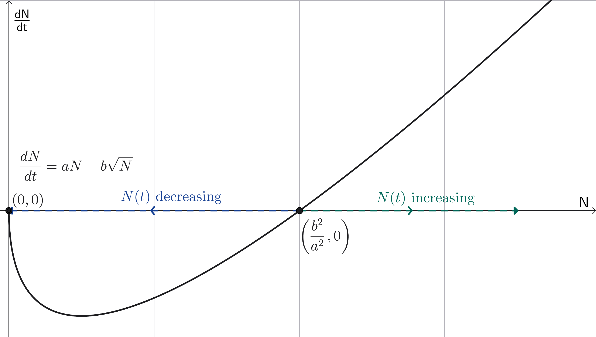
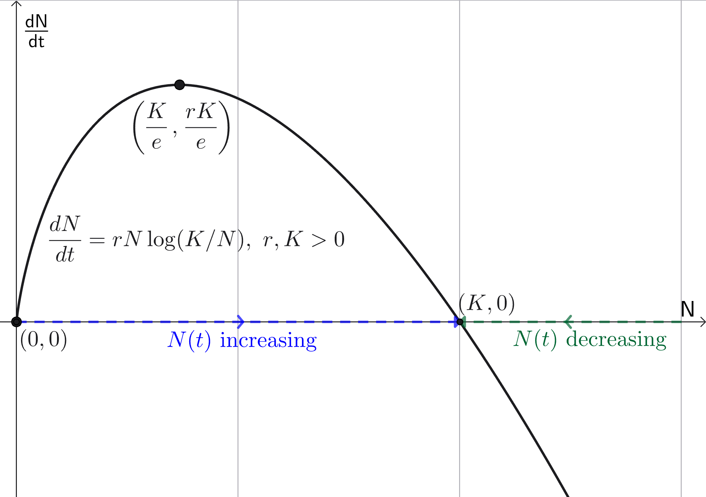
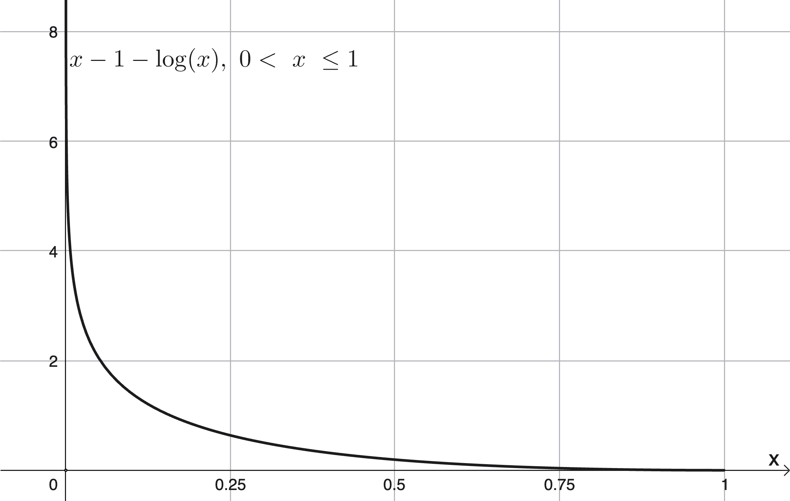
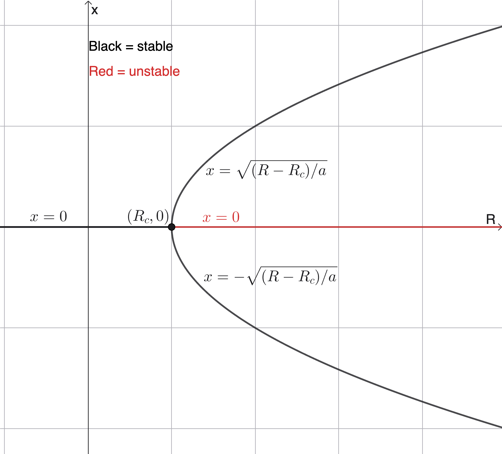

<link rel="stylesheet" href="../../Styles.css">
<title>Solutions of Selected Problems from Boyce/DiPrima "Elem. DEs & BVPs 5th Ed. Chapter 2 Part 2"</title>
$\require{cancel}
\newcommand{\part}{\partial}
\newcommand{\b}{\beta}
\newcommand{\G}{\Gamma}
\newcommand{\t}{\theta}
\newcommand{\u}{\upsilon}
\newcommand{\rarrow}{\rightarrow}
\newcommand{\box}{\boxed}
\newcommand{\chec}{\checkmark}
\newcommand{\blksq}{\blacksquare}
\newcommand{\Frac}{\displaystyle \frac}
\newcommand{\Lim}{\displaystyle \lim}
\newcommand{\Int}{\large{\int}\normalsize}
\newcommand{\DefInt}[2]
{
  \displaystyle\int_{\normalsize{#1}}^{\normalsize{#2}}\normalsize
}
$

## 
Selected Problem Solutions

from

### 
Boyce, W. E. & R. C. DiPrima, 1992. <i>Elementary Differential Equations and</i> <i>Boundary Value Problems, Fifth Edition</i>. John Wiley & Sons, New York.
### 
Chapter 2, Part 2: First Order Differential Equations, Sections 5 through 8
### 
&copy; 2026 by
### 
[David Lawrence Goldsmith](https://www.linkedin.com/in/olydlg)

for

## 
[SelectedSolutionsDotNet](https://olydlg.github.io/selectedsolutionsdotnet/)

<i>Notes: These solutions are provided &quot;as-is,&quot; for informational purposes only, with no warranty of any kind, expressed or implied, including that of correctness, adequacy, and/or suitability for any purpose, whatsoever.</i> Corrections are welcome and should be emailed to selectedsolutionsdotnet@gmail.com.

Purple font indicates clicking on the text will return you to your prior place; $\blksq$ indicates the end of a proof; unlike the text, but consistent with most mathematical usage after &quot;Algebra 2,&quot; we use $\log$ to denote the &quot;natural&quot; logarithm, $\log_e$; wrt = with respect to.

### Contents

<table>
  <tr>
    <th colspan=9><b>Section 5: Applications of First Order Linear Equations</b></th>
  </tr>
  <tr>
    <th >Problem #: </th>
    <td><a href="#P2.5.4">4</a></td>
    <td><a href="#P2.5.13">13</a></td>
    <td><a href="#P2.5.17">17</a></td>
    <td><a href="#P2.5.22">22</a></td>
  </tr>
  <tr>
    <th colspan=9><b>Section 6: Population Dynamics and Some Related Problems</b></th>
  </tr>
  <tr>
    <th >Problem #: </th>
    <td><a href="#P2.6.3">3</a></td>
    <td><a href="#P2.6.7">7</a></td>
    <td><a href="#P2.6.11">11</a></td>
    <td><a href="#P2.6.16">16</a></td>
    <td><a href="#P2.6.19">19</a></td>
    <td><a href="#P2.6.22">22</a></td>
    <td><a href="#P2.6.23">23</a></td>
  </tr>
  <tr>
    <th colspan=9><b>Section 7: Some Problems in Mechanics</b></th>
  </tr>
  <tr>
    <th >Problem #: </th>
    <td><a href="#P2.7.7">7</a></td>
    <td><a href="#P2.7.10">10</a></td>
    <td><a href="#P2.7.13">13</a></td>
    <td><a href="#P2.7.16">16</a></td>
    <td><a href="#P2.7.17">17</a></td>
  </tr>
  <tr>
    <th colspan=9><b>Section 8: Exact Equations and Integrating Factors</b></th>
  </tr>
  <tr>
    <th >Problem #: </th>
    <td><a href="#P2.8.6">6</a></td>
    <td><a href="#P2.8.10">10</a></td>
    <td><a href="#P2.8.14">14</a></td>
    <td><a href="#P2.8.18">18</a></td>
    <td><a href="#P2.8.22">22</a></td>
    <td><a href="#P2.8.24">24</a></td>
    <td><a href="#P2.8.26">26</a></td>
    <td><a href="#P2.8.31">31</a></td>
  </tr>
</table>

### Section 5: Applications of First Order Linear Equations

<a name="P2.5.4" class="goback" onclick="winhisback()">__2.5.4__)</a>
100 mg of thorium&#8209;234 (234Th), which has a half&#8209;life of 24.5 days, are initially present in a closed container, and more of it is added at a rate of 1 mg/day.

__a__) Find the amount of it as a function of time, $Q(t)$.

__Sln__: The governing model is $\Frac{dQ}{dt} = -rQ + 1,~Q(0) = 100\text{ mg},~r = \Frac{\log 2}{24.5\text{ days}}$; the DE is separable yielding $dt = \Frac{dQ}{1-rQ} \implies t + C = -\Frac1r\log|1-rQ| \implies |1-rQ| = A’e^{-rt} \implies 1 - rQ = Ae^{-rt}$ where we have incorporated the indeterminacy of the sign corresponding to the absolute value into the yet&#8209;to&#8209;be&#8209;determined integration constant, which we now determine: $1-100r = Ae^{0} \implies \box{A = 1-100r} \implies$
$$\box{Q(t) = (1 - Ae^{-rt})/r \doteq 35.35 + 64.65\exp(-0.02829t)\text{ mg, } t\text{ in days}}$$
The check is left to the reader.&nbsp; (My calculations result in a (rounded) difference from the answer in the back of my edition of the text of 1 unit in the fourth significant figure; I’m not sure why, but given the copyright date, I’d conjecture the use of single&#8209;precision floating point arithmetic on the part of the answer generators, especially if the answers were not updated between the first copyright date, 1986, and that of my edition, 1992; in any event, I’m not worried about it, but I feel it would be dishonest to simply regurgitate the text answer when I obtained something different, albeit negligibly.)
 

__b__) Find $Q_{\infty} = \lim_{t \rarrow \infty} Q(t)$.

__Sln__: $\lim_{t \rarrow \infty} 35.35 + 64.65\exp(-0.02829t) = 35.35 + 64.65(0) = \box{35.35\text{ mg}}$.
 

__c__) How long before $Q(t) - Q_{\infty} \lt 0.5$ mg?

__Sln__: $0.5 = 35.35 + 64.65\exp(-0.02829t) - 35.35 \implies t = \log(0.5/64.65)/(-0.02829) \implies \box{t \doteq 171.9\text{ days}}$.
 

__d__) At what rate $k$ mg/d must it be added to maintain a constant level of 100 mg?

__Sln__: In order to maintain a constant level of $Q = 100$ mg, $dQ/dt = 0 = -rQ + k \implies k = rQ = 100(0.02829) = \box{2.829\text{ mg/d}}$. 
  

<a name="P2.5.13" class="goback" onclick="winhisback()">__2.5.13__)</a> 
Assume the earth’s human population, $P$, grows continuously in proportion to its present value; that the population in 1650 AD ($t=0$) was $6 \times 10^8$; and that the population in 1950 AD ($t=300$) was $2.8 \times 10^9$: find the population at time $t$ years from 1650, and when the population will reach $2.5 \times 10^{10}$.

__Sln__: The governing model is $\Frac{dP}{dt} = kP \implies P(t) = P_0e^{kt}$; $P_0 = P(0) = 6 \times 10^8$, so $P(300) = 2.8 \times 10^9 = 6 \times 10^8e^{300k} \implies$ $k = \Frac1{300}\log\left(\Frac{2.8 \times 10^9}{6 \times 10^8}\right) \doteq 5.13 \times 10^{-3} \implies$
$$\box{P(t) = 6 \times 10^8\exp(5.13 \times 10^{-3}t)\text{ humans, } t \text{ years since 1650 AD}}$$
To find when this model predicts the population will reach $2.5 \times 10^{10}$, we solve $2.5 \times 10^{10} = 6 \times 10^8\exp(5.13 \times 10^{-3}t)$ for $t$, yielding $t = \Frac1{5.13 \times 10^{-3}}\log\left(\Frac{2.5 \times 10^{10}}{6 \times 10^8}\right) \doteq 727.03$ years after 1650, i.e., $\box{2377\text{ AD}}$.&nbsp; (Again our answer differs from that given in the back of our copy of the text by one unit in the fourth significant figure...but just barely.) 
  

<a name="P2.5.17" class="goback" onclick="winhisback()">__2.5.17__)</a>
Assume a spherical raindrop of radius $r$ evaporates at a rate proportional to its surface area $S = 4\pi r^2$; that $r$ is initially 3 mm; and 30 minutes later it is 2 mm: find an expression for $r(t)$.

__Sln__: We have $\Frac{dV}{dt} = \Frac{d}{dt}\left(\Frac43\pi r^3\right) = 4\pi r^2\Frac{dr}{dt} = k(4\pi r^2) \implies \Frac{dr}{dt} = k \implies r(t) = kt + b$.&nbsp; The initial condition $r(0) = 3 = k(0) + b$ $\implies b =3$; $r(0.5\text{ hours}) = 2 = 0.5k + 3 \implies k = -2 \implies$
$$\box{r(t) = 3 - 2t\text{ mm, }t \in [0, 1.5] \text{ in hours}}$$
The check is trivial and left to the reader, who should understand/explain the domain restriction.
  

<a name="P2.5.22" class="goback" onclick="winhisback()">__2.5.22__)</a>
In a room containing 1200 ft$^3$ of air initially free of carbon monoxide (CO), at time $t=0$, cigarette smoke containing 4% CO is introduced at a rate of 0.1 ft$^3$/min., and the well&#8209;circulated mixture leaves the room at the same rate. 

 __a__) Find an expression for the concentration $x(t)$ of CO for $t \gt 0$.

__Sln__: To get the answer in the back of my copy of my text, we must assume, in order for the units to be consistent in the model, that the specific volumes, i.e., volumes per unit mass, of the CO and of the total gas mixture, are constant and consequently volume may serve as a proxy for mass, which is actually the conserved quantity.&nbsp; Thus $x(t)$ has units of $\Frac{\text{ft}^3\text{ CO}}{\text{ft}^3\text{ gas}}$; the total cubic feet of CO in the tank at any given time is $(1200\text{ ft}^3\text{ gas})x(t)$; and the rate of change of CO in the room is therefore $1200\Frac{dx}{dt}$.&nbsp; Now, CO leaves the room at the rate $0.1\Frac{\text{ft}^3\text{ gas}}{\text{min}} \times x$ and enters the room at the rate $0.1\Frac{\text{ft}^3\text{ gas}}{\text{min}} \times 0.04\Frac{\text{ft}^3\text{ CO}}{\text{ft}^3\text{ gas}}$ yielding the governing differential equation:
$$1200\frac{dx}{dt} = 0.1(0.04 - x)$$
Multiplying through by 10, separating the variables, and strategically placing the constants yields: $\Frac{dx}{0.04 - x} = \Frac{dt}{12000} \implies -\log|0.04 - x| = \Frac t{12000} + C \implies 0.04 - x = A\exp(-t/12000)$, where we have incorporated the sign indeterminacy of the absolute value into the undetermined coefficient, which we now determine: $x(0) = 0 \implies 0.04 = A(1) \implies 0.04 - x = 0.04\exp(-t/12000)$ or
$$\box{x(t) = 0.04[1 - \exp(-t/12000)]~\frac{\text{ft}^3\text{ CO}}{\text{ft}^3\text{ gas}}, t\text{ in minutes}}$$
The check is left to the reader.
  

__b__) When will that concentration reach $1.2 \times 10^{-4}$?

__Sln__: We need to solve $1.2 \times 10^{-4} = 0.04[1 - \exp(-t/12000)]$ for $t$: $1.2 \times 10^{-4} = 0.04[1 - \exp(-t/12000)] \implies \exp(-t/12000) = 1 - (1.2 \times 10^{-4})/(4 \times 10^{-2}) = 0.997 \implies$
$$\box{t = -12000\log(0.997) \doteq 36\text{ min}}.$$
 

### Section 6: Population Dynamics and Some Related Problems

<a name="P2.6.3" class="goback" onclick="winhisback()">__2.6.3__)</a>
Plot $\Frac{dN}{dt} = F(N) = N(N-1)(N-2),~N_0 \gt 0$ versus $N$, determine the critical points, and classify each as stable or unstable.

__Sln__: Here’s the GeoGebra&#8209;produced plot:

Setting $\Frac{dN}{dt} = N(N-1)(N-2) = 0 \implies$ the critical points are $\box{N = 0, 1, 2}$. 

$\Frac{dN}{dt} \gt 0$ for $N \in (0,1)$ and $\lt 0$ for $N \in (1,2)$, so $\box{N=0\text{ is unstable}}$ and $\box{N=1\text{ is stable}}$, and $\Frac{dN}{dt} \gt 0$ for $N \gt 2 \implies \box{N=2\text{ is unstable}}$.
  

<a name="P2.6.7" class="goback" onclick="winhisback()">__2.6.7__)</a>
Consider the DE $\Frac{dN}{dt} = F(N) = k(1 - N)^2$, $k \gt 0$ constant.

__a__) Show that $N = 1$ is the only critical point, with corresponding equilibrium solution $\phi(t) = 1$.

__Sln__: Trivial: $\Frac{dN}{dt} = 0 = k(1-N)^2, k \gt 0 \implies N = 1$ is the sole equilibrium value, and thus $\phi(t) = 1$ is the only equilibrium solution.
 

__b__) Plot $F(N)$, and show that $N$ is an increasing function of $t$ for $N \lt 1$ and also for $N \gt 1$ (thus implying that the equilibrium solution $\phi(t) = 1$ is semistable).

__Sln__: $F(N) = k(1-N)^2, k \gt 0$, is an &quot;up&#8209;opening&quot; parabola with vertex at (1,0) (we leave the actual plotting to the reader), and thus for $N \ne 1, F(N) \gt 0$; this implies that if $N_0 \lt 1,$ $N(t)$ increases towards $N=1$ with increasing $t$, and if $N_0 \gt 1$, $N(t)$ increases away from $N=1$ with increasing $t$; thus the equilibrium solution $\phi(t) = 1$ is semistable.
 

__c__) Solve the DE subject to the IC $N(0) =N_0$ and thereby confirm the conclusions of Part b).

__Sln__: $\Frac{dN}{dt} = k(1 - N)^2 \implies kdt = \Frac{dN}{(1-N)^2} \implies kt + C = \Frac1{1-N}$ and the IC $N(0) = N_0 \implies C = \Frac1{1-N_0} \implies$ $kt + \Frac1{1-N_0} = \Frac1{1-N} \implies 1 - N = \Frac{1-N_0}{(1-N_0)kt + 1} \implies$
$$\box{N(t) = 1 - \frac{1-N_0}{(1-N_0)kt + 1}}$$
Check: IC: $N(0) = 1 - \Frac{1-N_0}{0 + 1} = N_0~\chec$; DE: $\Frac{dN}{dt} = -(-1)(1-N_0)k\Frac{1-N_0}{[(1-N_0)kt + 1]^2} = k\left[\Frac{1-N_0}{(1-N_0)kt + 1}\right]^2$ while $k(1-N)^2 = k\left[1 - \left(1 - \Frac{1-N_0}{(1-N_0)kt + 1}\right)\right]^2 = k\left[\Frac{1-N_0}{(1-N_0)kt + 1}\right]^2~\chec$ 

This verification that $N(t)$ solves the IVP also verifies that $N(t)$ is an increasing function of $t$ for both $N \lt 1$ and $N \gt 1$.
  

<a name="P2.6.11" class="goback" onclick="winhisback()">__2.6.11__)</a>
Plot $\Frac{dN}{dt} = F(N) = aN - b\sqrt N,~a,b \gt 0,~N_0 \ge 0$, determine the critical points, and classify each as stable, unstable, or semistable.
 
__Sln__: First, the specification $N_0 \ge 0$ is only necessary to ensure that the initial value of $\Frac{dN}{dt}$ is real; otherwise, the value of $N_0$ does not affect the graph of $F(N)$, nor the equilibria or their (in)stability&mdash;it only affects the actual solution $N(t)$, which we have not been asked to find.  

Now, the critical points are found by solving $0 = \Frac{dN}{dt} = aN - b\sqrt N = (a\sqrt N - b)\sqrt N \implies \sqrt N = 0 \implies \box{N = 0}$ or $a\sqrt N - b = 0 \implies \box{N = \Frac{b^2}{a^2}}$.&nbsp; Examination of the graph of $F(N)$ (given below) clearly shows that for $0 \lt N \lt \Frac{b^2}{a^2}$, $\Frac{dN}{dt} \lt 0 \implies N(t)$ is decreasing with increasing $t$ and $\box{0\text{ is stable}}$; while for $N \gt \Frac{b^2}{a^2}$, $\Frac{dN}{dt} \gt 0 \implies N(t)$ is increasing with increasing $t$ and $\box{\frac{b^2}{a^2}\text{ is unstable}}$. 

Here’s the graph of $F(N)$ indicating the equilibria and the intervals over which $N(t)$ is decreasing and increasing with increasing $t.$ 

  

<a name="P2.6.16" class="goback" onclick="winhisback()">__2.6.16__)</a>
Consider the Gompertz equation $\Frac{dN}{dt} = F(N) = rN\log\left(\Frac KN\right), r, K \gt 0$ constant.

__a__) Plot $F(N)$, determine the critical points and their (un)stability.

__Sln__: $0 = \Frac{dN}{dt} = rN\log\left(\Frac KN\right) \implies \log\left(\Frac KN\right) = 0 \implies \Frac KN = 1 \implies \box{N=K}$ is one critical point; additionally, even though $\log\left(\Frac K0\right)$ is undefined, $\lim_{N\rarrow0^{+}}rN\log\left(\Frac KN\right) = \lim_{N\rarrow0^{+}}\Frac{r\log(K/N)}{1/N}$ &quot;$=$&quot; $\Frac{\infty}{\infty}$, so, applying L’Hopital’s Rule, $ = \lim_{N\rarrow0^{+}}\Frac{r(N/K)(-K/N^2)}{-1/N^2} = \lim_{N\rarrow0^{+}}rN = 0$ so $F(N)$ has a removable discontinuity at $N=0$ and $F$’s limiting value there is $0$, so $\box{N=0}$ is also a critical point.&nbsp; The graph of $F(N)$:

indicates that $\Frac{dN}{dt} \gt 0$ for $0 \lt N \lt K \implies N(t)$ is increasing with increasing $t$ on this interval and thus $\box{0\text{ is unstable}}$, whereas $\Frac{dN}{dt} \lt 0$ for $N \gt K \implies N(t)$ is decreasing with increasing $t$ on that interval and thus $\box{K\text{ is stable}}$.
 

__b__) For $0 \le N \le K$ determine where $N(t)$ is concave up and concave down. 

__Sln__: Since $F(N) \ge 0$ on the given interval, $N(t)$ is concave up (resp. down) where $F(N)$ is increasing (resp. decreasing) with increasing $N$; the transition occurs where $F(N)$ has a maximum, which is where $0 = \Frac{dF}{dN} = r\log\left(\Frac KN\right) - rN\left(\Frac{N}{K}\right)\left(\Frac{K}{N^2}\right) = r\log\left(\Frac KN\right) - r$ $\implies \log\left(\Frac KN\right) = 1 \implies \Frac KN = e \implies N = \Frac Ke$.&nbsp; Thus $N(t)$ is $\box{\text{concave up for } 0 \lt N \lt \frac Ke}$ and $\box{\text{concave down for }\frac Ke \lt N \lt K}$. 
 

__c__) For each $N \in (0,K]$ show that this $\Frac{dN}{dt}$ is never less than the logistic $\Frac{dN}{dt}$.

__Sln__: We need to show that $0 \lt N \le K \implies rN\log\left(\Frac KN\right) \ge rN\left(1-\Frac NK\right) \iff \log\left(\Frac KN\right) - \left(1-\Frac NK\right) \ge 0 \iff \Frac{\log(K/N)}{1 - N/K} \ge 1$; we will show the former equivalency.&nbsp; First, $0 \lt N \le K \implies 0 \lt \Frac NK = x \le 1$; replacing $\Frac NK$ with $x$ in $\log\left(\Frac KN\right) - \left(1-\Frac NK\right)$ yields $x - 1 - \log(x)$ and graphing this for $0 \lt x \le 1$ gives:

clearly indicating that it is strictly $\ge 0.~~\blksq$
  

<a name="P2.6.19" class="goback" onclick="winhisback()">__2.6.19__)</a>
$\Frac{dN}{dt} = F(N) = rN\left(1 - \Frac NK\right) - h$ adds a constant harvest rate, $h$, to the logistic model.&nbsp; __a__) Show that if $h \lt rK/4$ the model has two equilibria, $N_1 \lt N_2$, and provide formulas for them in terms of $h, K,$ and $r$; __b__) show that $N_1$ is unstable and $N_2$ is stable; __c__) graph $F(N)$ and reason from it that if $N(0) = N_0 \gt N_1$ then $\lim_{t\rarrow\infty}N(t) = N_2$, but if $N_0 \lt N_1$ then $N$ is decreasing as $t$ increases $\implies N = 0$ for finite $t$ since $N=0$ is not an equilibrium point; __d__) if $h \gt rK/4$ show that $N(t)$ decreases to zero as $t$ increases regardless of the value of $N_0$; __e__) if $h = rK/4$ show there is a single equilibrium point, $N = K/2$, and that this point is semistable; thus the maximum sustainable yield, $h_m$, is $rK/4$.  

__Sln__: $0 = rN\left(1 - \Frac NK\right) - h \implies N^2 - KN + \Frac{Kh}r = 0 \implies N = \Frac{K \pm \sqrt{K^2 - 4Kh/r}}2$; thus the number and nature of equilibria depends on the value of the discriminant $K^2 - 4Kh/r$:  
__a__) if $K^2 - 4Kh/r \gt 0 \iff K \gt 4h/r \iff rK/4 \gt h$, there are two equilibria, $\box{N_1 = \frac{K - \sqrt{K^2 - 4Kh/r}}2}$ and $\box{N_2 = \frac{K + \sqrt{K^2 - 4Kh/r}}2}$, with $N_2 - N_1 = \sqrt{K^2 - 4Kh/r} \gt 0 \implies N_1 \lt N_2.~~\blksq$ 

__b__) For all values of $h$, $F(N)$ is a &quot;down&#8209;opening&quot; parabola; thus if $F(N)$ has two zeros $\iff h \lt rK/4$, (i) $N \lt N_1$ and (ii) $N \gt N_2 \implies \Frac{dN}{dt} \lt 0$ and (iii) $N_1 \lt N \lt N_2 \implies \Frac{dN}{dt} \gt 0$; now, (i) and (iii) imply $\box{N_1\text{ is unstable}}$, and (ii) and (iii) imply $\box{N_2\text{ is stable}}.~~\blksq$ 

__c__) One doesn’t really need the graph, which is elementary, to reason this out, so we leave that for the reader; $N_0 < N_1 \implies \Frac{dN}{dt} < 0 \implies N(t)$ is decreasing with increasing $t$ and since 0 is not an equilibrium, $N(t) = 0$ in finite time; on the other hand, $N_2$ stable implies $N_0 \gt N_1 \implies N(t)$ approaches $N_2$ as $t \rarrow \infty.~~\blksq$ 

__d__) If $h \gt rK/4$, then $K^2 - 4Kh/r < 0 \implies F(N)$ has no real solutions, and since $F(N)$ is a down&#8209;opening parabola, this implies $\Frac{dN}{dt} \lt 0$ for all $N$ which implies $N(t) = 0$ in finite time for any $N_0.~~\blksq$ 

__e__) Lastly, $h = rK/4 \implies K^2 - 4Kh/r = 0 \implies$ the single equilibrium is at $N^* = K/2$, which is the abscissa of the maximum of the down&#8209;opening parabola $F(N)$, and $\Frac{dN}{dt} \lt 0$ for $N \ne K/2$ implying $N^*$ is semistable; since $N(t)$ has no equilibria for $h \gt rK/4$ (the result of part d), $h = rK/4 = h_m$ is the &quot;maximum sustainable yield,&quot; i.e., harvest.$~~\blksq$ 
  

<a name="P2.6.22" class="go back" onclick="winhisback()">__2.6.22__)</a>
Given the model:
$$\begin{eqnarray}
\Frac{dx}{dt} & = & \dot{x} = -[\b + \mu(t)]x & ~~~~~~~~~~~~~~~~~~\text{(i)} \\
\Frac{dn}{dt} & = & \dot{n} = -\nu\b x - \mu(t)n & ~~~~~~~~~~~~~~~~~\text{(ii)}
\end{eqnarray}
$$
where:
$~~~n(t) = $ number of individuals, born in year $t=0$, surviving at year $t$; 
$~~~x(t) = $ number of these individuals who have not had smallpox by year $t$; 
$~~~\b = $ rate at which &quot;susceptibles&quot; contract smallpox (assumed constant); 
$~~~\nu = $ death rate of those who contract the disease (assumed constant); 
$~~~\mu(t) = $ death rate from all other causes. 
  
__a__) Show that $z = x/n$ satisfies the IVP:
$$\frac{dz}{dt} = -\b z (1 - \nu z),~~~z(0) = 1~~~~~\text{(iii)}$$
and note that this is independent of $\mu(t)$. 

__Sln__: Assuming no one is born with smallpox, $n(0) = x(0) \implies z(0) = 1,$ and $\Frac{dz}{dt} = \Frac d{dt}\left(\Frac xn \right) = \Frac{n\dot{x} - x\dot{n}}{n^2} = -[\b + \mu(t)]\Frac xn + \nu\b \Frac{x^2}{n^2} + \mu(t)\Frac xn = -\b z - \mu z + \nu\b z^2 + \mu z = -\b z(1 - \nu z).~~\blksq$&nbsp; Observe that $\dot{z}$ does not depend on $\mu(t).$
 

__b__) Solve IVP (iii) 

__Sln__: $\dot{z} = -\b z(1 - \nu z) = -\b z\left(1 - \Frac{z}{1/\nu}\right)$ which is the logistic DE with negative intrinsic growth rate and carrying capacity $= 1/\nu$ so the general solution is $\Frac z{1 - \nu z} = ce^{-\b t} \implies \Frac1z - \nu = Ce^{\b t}$ and the IC $\implies 1 - \nu = C \implies$
$$\box{z(t) = \frac1{(1-\nu)e^{\b t} + \nu}}$$
Check: IC: $z(0) = \Frac1{(1-\nu)(1) + \nu} = 1~\chec$; DE: $\dot{z} = \Frac{-\b(1-\nu)e^{\b t}}{[(1-\nu)e^{\b t} + \nu]^2}$ while $-\b z(1 - \nu z) = -\b z + \b\nu z^2 = \Frac{-\b[(1-\nu)e^{\b t} + \nu]}{[(1-\nu)e^{\b t} + \nu]^2} + \Frac{\b\nu}{[(1-\nu)e^{\b t} + \nu]^2} = \Frac{-\b(1-\nu)e^{\b t}}{[(1-\nu)e^{\b t} + \nu]^2}~\chec.$
 

__c__) Using $\nu = \b = 1/8$, determine the proportion of twenty&#8209;year&#8209;olds who have not had smallpox.

__Sln__: Using $1/8$ for $\b$ and $\nu$, $z(20) = \Frac8{7e^{20/8} + 1} \doteq \box{0.0927 = 9.27\%}$ 
  

<a name="P2.6.23" class="goback" onclick="winhisback()">__2.6.23__)</a>
Consider the model:
$$\frac{dx}{dt} = F(x) = (R - R_c)x - ax^3$$
where $a$ and $R_c$ are positive constants and $R$ is a parameter.&nbsp; Show:
__a__) that $R \lt R_c \implies x = 0$ is the only equilibrium solution and that it is stable; __b__) that $R \gt R_c \implies$ three equilibrium solutions: $x = 0$, which is unstable, and $x = \pm\sqrt{(R-R_c)/a}$, both of which are stable; __c__) draw a graph in the $R$&#8209;$x$ plane showing all equilibrium solutions, and label each as stable or unstable.  

__Sln__: $0 = (R - R_c)x - ax^3 = x[(R - R_c) - ax^2] \implies x = 0$ or $=\pm\sqrt{(R - R_c)/a}$ (which $=0$ if $R=R_c$); furthermore, $F(x)$ is a cubic polynomial with negative leading coefficient, so for $x \lt $ its left&#8209;most zero, $F(x) \gt 0$ and for $x \gt$ its right&#8209;most zero, $F(x) \lt 0.$ 

So if __a__) $R - R_c)/a \lt 0 \iff R \lt R_c$ (since $a \gt 0$ by assumption), $x=0$ is the only real solution and thus the only equilibrium (this is actually true for $R = R_c$ as well&mdash;I’m not sure why the authors omitted that case); and $F(x) > 0$ for $x \lt 0$ and $F(x) < 0$ for $x \gt 0 \implies \box{x = 0\text{ is stable}}.~\blksq$&nbsp; (This is true for $R = R_c$ as well: we should be careful that that case doesn’t result in a root $\ne 0$ of $F(x)$ of multiplicity two, for such an equilibrium would be semistable; but $R = R_c \implies F(x) = -ax^3$ which means $x=0$ is a root of multiplicity three, and the stability &quot;driver&quot; $x \lt 0 \implies F(x) \gt 0$ and $x \gt 0 \implies F(x) \lt 0$&mdash; is still valid.) 

__b__) If $(R - R_c)/a \gt 0 \iff R \gt R_c$ (again, since $a \gt 0$ by assumption), $x = \pm\sqrt{(R - R_c)/a} \in \mathbb{R} \implies$ three equilibria: (in ascending order) $\box{-\sqrt{(R - R_c)/a}, 0, \sqrt{(R - R_c)/a}}$.&nbsp; Again, since $F(x)$ is a cubic polynomial with negative leading coefficient and three distinct real roots, $x \lt -\sqrt{(R - R_c)/a}$ and $0 \lt x \lt \sqrt{(R - R_c)/a} \implies F(x) \gt 0$ and elsewhere $F(x) \lt 0$, all of which imply $\box{x = \pm\sqrt{(R - R_c)/a}\text{ are stable, and } x = 0\text{ is unstable}}.~\blksq$
 

__c__) Here’s the required graph: 

Note the resemblance to a pitchfork.
  

### Section 7: Some Problems in Mechanics

<a name="P2.7.7" class="goback" onclick="winhisback()">__2.7.7__)</a>
A skydiver weighing 180 lb falls falls from an altitude $x = 5000$ ft and opens the parachute after 10 sec of free fall; assume that the force of air resistance is $0.75|\u|$ when the parachute is closed and $12|\u|$ when the parachute is open ($\u$ in ft/sec). 

__a__) What is $|\u|$ when the parachute opens?

__Sln__:

 

__b__) What is the distance fallen when the parachute opens?

__Sln__:

 

__c__) What is the limiting velocity $\u_{\ell}$ after the parachute opens?

__Sln__:

 

__d__) How long (approximately) is the skydiver in the air after the parachute opens?

__Sln__:

  

<a name="P2.7.10" class="goback" onclick="winhisback()">__2.7.10__)</a>
A body of mass $m$ falls in a medium offering resistance proportional to $|\u|^r, r \gt 0$ constant; assuming constant $g$, find the limiting velocity of the body.

__Sln__:

  

<a name="P2.7.13" class="goback" onclick="winhisback()">__2.7.13__)</a>
A body falling in a fluid of non-negligible density experiences three forces: its weight $w$, buoyancy $B = $ weight of the fluid it displaces, and viscous (frictional) resistance $R$; for a sphere of radius $a, R = 6\pi\mu a|\u|$, where $\u = $ velocity of the body and $\mu =$ the coefficient of viscosity of the fluid. 
   
__a__) Find the limiting velocity $\u_{\ell}$ of a solid sphere of radius $a$ and density $\rho$ falling freely in a medium of density $\rho’$ and coefficient of viscosity $\mu$.

__Sln__:

 

__b__) Assume a force counter to gravity of magnitude $Ee$, $E = $ electrostatic field magnitude, $e = $ electric charge on the falling sphere, and the other parameters as in part a), and assume that $E$ has been adjusted so that $\u = 0$: find a formula for $e$.

__Sln__:

  

<a name="P2.7.16" class="goback" onclick="winhisback()">__2.7.16__)</a>
Find the escape velocity $\u_e$ for an object projected upward with an initial velocity $\u_0$ from a point $x_0 = \xi R$ above the surface of the earth where $R =$ radius of the earth and $\xi$ is a constant; neglect air resistance.&nbsp; Find the altitude from which the body must be launched to reduce $\u_e$ to 85% of its value at the earth’s surface.&nbsp; (This is effectively the &quot;initial&quot; altitude and velocity pair a rocket must achieve after launch from zero velocity to achieve the target $\u_e$.) 

__Sln__:

  

<a name="P2.7.17" class="goback" onclick="winhisback()">__2.7.17__)</a>
The Brachistochrone Problem, described in the text, is modeled by the DE
$$(1 + y’^2)y = k^2~~~~~~~~~~\text{Eq. (i)}$$
$k^2 \gt 0$ constant. 

__a__) Solve (i) for $y’$ and explain why it is necessary to take the positive square root. 

__Sln__:

 

__b__) Show that setting $y = k^2 \sin^2 t$ [Eq. (ii)] $\implies$ the equation found in part a) takes the form:
$$2k^2\sin^2 t dt = dx~~~~~~~~~~\text{Eq. (iii)}$$

__Sln__:

 

__c__) Show that setting $\t = 2t \implies$ Eq. (iii) with the IC’s $x=0, y=0$ has parametrically&#8209;given solution:
$$x = k^2(\t - \sin\t)/2,~~~~~y = k^2(1 - \cos\t)/2$$

__Sln__:

  

### Section 8: Exact Equations and Integrating Factors

Problems 2.8.6 and 2.8.10: Determine if the given DE is exact and if it is, find the solution.

<a name="P2.8.6" class="goback" onclick="winhisback()">__2.8.6__)</a>
$\Frac{dy}{dx} = -\Frac{ax - by}{bx - cy}$

__Sln__: $\Frac{dy}{dx} = -\Frac{ax - by}{bx - cy} \implies (ax - by)dx + (bx - cy)dy = 0$ so we must check to see if $\part_y(ax-by) = -b$ equals $\part_x(bx - cy) = b$, which, in general, it does not, therefore the equation is $\box{\text{not exact}}.~$ (The exception is if $b=0$: in that case the equation is separable, and we show in Problem 18 below that this implies that it is exact, but just in that case.)
  

<a name="P2.8.10" class="goback" onclick="winhisback()">__2.8.10__)</a>
$(y/x + 6x)dx + (\log x - 2)dy = 0,~~~~~x \gt 0$

__Sln__: $\part_y(y/x + 6x) = 1/x = \part_x(\log x - 2)$ therefore the equation $\box{\text{is exact}}$ and we seek $f(x,y)$ such that $df = \part_x f dx + \part_y f dy = (y/x + 6x)dx + (\log x - 2)dy.~$ Setting $\part_y f = \log x - 2$ and integrating wrt $y$ yields $f(x,y) = (\log x - 2)y +g(x)$; differentiating this wrt $x$ and equating that to $y/x + 6x$ yields $y/x + g’(x) = y/x + 6x \implies g’(x) = 6x \implies g(x) = 3x^2.~$ Thus $0 = (y/x + 6x)dx + (\log x - 2)dy = d(y\log x + 3x^2 - 2y) \implies$
$$\box{y\log x + 3x^2 - 2y = c}$$
Check: &quot;immediate,&quot; left to the reader.
  

<a name="P2.8.14" class="goback" onclick="winhisback()">__2.8.14__)</a>
Solve the IVP $(9x^2 + y - 1)dx - (4y - x)dy = 0, ~~~~~y(1) = 0$ and determine at least approximately where the solution is valid.

__Sln__: $\part_y(9x^2 + y - 1) = 1 = \part_x(x - 4y)$ so the equation is exact; integrating $x-4y$ wrt $y \implies f(x,y) = xy - 2y^2 + g(x)$ and differentiating this wrt $x$ and equating that to $9x^2 + y - 1 \implies y + g’(x) = 9x^2 + y - 1 \implies g’(x) = 9x^2 - 1 \implies$ $g(x) = 3x^3 - x \implies 3x^3 + xy - 2y^2 - x = c$; applying the IC $y(1) = 0 \implies 3 - 1 = 2 = c \implies 3x^3 + xy - 2y^2 - x - 2 = 0$ (it’s at this point that the reader should check the solution) $ = 2y^2 - xy - 3x^3 + x + 2 \implies y = \Frac{x \pm \sqrt{x^2 - 4(2)(-3x^3+x+2)}}4 \implies$
$$\box{y = \frac{x \pm \sqrt{24x^3 + x^2 - 8x - 16}}4}$$
For the solution to be real, $24x^3 + x^2 - 8x - 16 \ge 0$ and using a graphing utility, e.g., one can readily determine that this requires that $\box{x \gt \doteq 0.985}$ (differing by $-0.001$ from the answer in the back of my copy of the text).&nbsp; Reader &quot;challenge&quot;: use a graphing utility to plot the solution as given in implicit form and, based on observing that, devise an alternate approach to estimating the minimum allowable $x$ value.
  

<a name="P2.8.18" class="goback" onclick="winhisback()">__2.8.18__)</a>
Show that any equation which is separable, i.e., can be put in the form
$$M(x) + N(y)y’ = 0$$
is also exact.

__Pf__: Trivial (but we’ll do it anyway): $M(x) + N(y)y’ = 0 \implies M(x)dx + N(y)dy = 0$; now $\part_y M(x) = 0 = \part_x N(y).~~\blksq$
  

<a name="P2.8.22" class="goback" onclick="winhisback()">__2.8.22__)</a>
Show that $(x + 2)\sin y dx + x\cos y dy = 0$ is not exact but becomes exact when multiplied through by $\mu(x,y) = xe^x$ and then solve the equation.

__Sln__: $\part_y[(x + 2)\sin y] = (x+2)\cos y \ne \cos y = \part_x(x\cos y)$ so the equation is not exact as given.&nbsp; However, excluding $x=0$, for that renders the transformed equation an identity, yielding nothing &quot;of interest,&quot; $\part_y[x(x+2)e^x\sin y] = (x^2+2x)e^x\cos y = \part_x[x^2e^x\cos y]$ so $(x^2 + 2x)e^x\sin y dx + x^2e^x\cos y dy = 0$ is exact; $\part_yf(x,y) = x^2e^x\cos y \implies f = x^2e^x\sin y + g(x) \implies$ $\part_x f = (x^2 + 2x)e^x\sin y + g’(x) = (x^2 + 2x)e^x\sin y \implies g’ = 0 \implies g(x) = c$, so $df(x,y) = d(x^2e^x\sin y + c) = 0 \implies$ 
$$\box{x^2e^x\sin y = C,~~x \ne 0}$$
Check: $d(x^2e^x\sin y = C) \implies (x^2+2x)e^x\sin y dx + x^2e^x\cos y dy = 0 \implies$ (since $x\ne 0$ by exclusion and $e^x \ne 0$ for all $x$) $(x+2)\sin y dx + x\cos y dy = 0.~\chec$
  

<a name="P2.8.24" class="goback" onclick="winhisback()">__2.8.24__)</a>
Show that $\Frac{N_x - M_y}{xM - yN} = R(xy) \implies M + Ny’ = 0$ has an integrating factor of the form $\mu(xy)$ and find a general formula for $\mu$.

__Pf__: We must show that if $\Frac{N_x - M_y}{xM - yN} = R(xy)$, i.e., is a function of the product $xy$ only, then there exist a function $\mu$ of $xy$ only such that $\mu M dx + \mu N dy$ is exact; we exclude the case $xM - yN = 0$ for in that case the ratio on the left is undefined.&nbsp; We proceed by finding out what $\mu(xy)$ must be for this to be true and then confirm that this $\mu(xy)$ does indeed make $\mu M dx + \mu N dy$ exact.&nbsp; For $\mu(xy) M dx + \mu(xy) N dy$ to be exact, it must be true that $\part_x(\mu(xy)N) = y\mu’ N + \mu N_x = \part_y(\mu(xy)M) = x\mu’M + \mu M_y \implies \mu(N_x - M_y) = \mu’(xM - yN) \implies$ (having excluded the case $xM - yN = 0$) $\Frac{N_x - M_y}{xM - yN} = \Frac{\mu’(xy)}{\mu(xy)} = [\log(\mu)]’ = R(xy) \implies \log\mu(xy) = \DefInt{c}{xy}R(\xi)d\xi \implies \box{\mu(xy) = \exp\left(\DefInt{c}{xy}R(\xi)d\xi\right)}$. 

Now take $\mu(xy) = \exp\left(\DefInt{c}{xy}R(\xi)d\xi\right)$; note that $\mu \gt 0; \part_x[\mu(xy)] = yR(xy)\mu(xy);\text{ and } \part_y[\mu(xy)] = xR(xy)\mu(xy)$.&nbsp; For $\mu Mdx + \mu Ndy$ to be exact, it must be true that $\part_y(\mu M) = \mu_y M + \mu M_y = xR(xy)\mu M + \mu M_y = \part_x(\mu N) = \mu_x N + \mu N_x = yR(xy)\mu N + \mu N_x \implies$ (since $\mu \gt 0$) $xR(xy)M + M_y = yR(xy)N + N_x \implies N_x - M_y = R(xy)(xM - yN)$; now as long as $xM - yN \ne 0$, $R(xy) = \Frac{N_x - M_y}{xM - yN} \implies R(xy)(xM - yN) = N_x - M_y.~~\blksq$
  

Problems 2.8.26 and 2.8.31: Find an integrating factor (IF) for, and then solve the given DE.

<a name="P2.8.26" class="goback" onclick="winhisback()">__2.8.26__)</a>
$y’ = e^{2x} + y - 1$

__Sln__: If we were given this problem without being told to find an integrating factor, Step 1 would be to check to see if it’s exact as is, so that’s what we do first: $y’ = e^{2x} + y - 1 \implies (e^{2x} + y - 1)dx - dy = 0$ and $\part_y(e^{2x} + y - 1) = 1 \ne 0 = \part_x(-1)$ so not exact.

Now, following the text, we first check to see if this equation has an IF $\mu(x) \implies \part_y[\mu(e^{2x} + y - 1)] = \mu = \part_x(-\mu) = -\mu’ \implies$ $-1 = \Frac{\mu’}{\mu} = [\log(\mu)]’ \implies \log(\mu) = -x \implies \box{\mu(x) = e^{-x}}$; check: $\part_y[e^{-x}(e^{2x} + y - 1)] = e^{-x} = \part_x(-e^{-x}).\chec$&nbsp; Setting $f_y = -e^{-x} \implies$ $f = -ye^{-x} + g(x) \implies f_x = ye^{-x} + g’ = e^{-x}(e^{2x} + y - 1) = 2\sinh x + ye^{-x} \implies g’ = 2\sinh x \implies g = 2\cosh x \implies$ the solution is:
$$\box{2\cosh x - ye^{-x} = C}$$
Check: $d(2\cosh x - ye^{-x} = C) \implies 0 = 2\sinh xdx + ye^{-x}dx - e^{-x}dy = (e^x - e^{-x} + ye^{-x})dx - e^{-x}dy = 0$; multiplying through by $e^x$, which is never zero, yields $(e^{2x} + y - 1)dx - dy = 0.\chec$
  

<a name="P2.8.31" class="goback" onclick="winhisback()">__2.8.31__)</a>
$\left(3x + \Frac6y\right) + \left(\Frac{x^2}y + 3 \Frac yx\right)\Frac{dy}{dx} = 0$ (Hint: see Problem 24).

__Sln__: We begin by noting that, because it implies $x = 0$ or $y = 0$, either of which makes the equation ill&#8209;posed, $xy = 0$ makes the equation ill&#8209;posed, so we exclude this at the outset.&nbsp; Next, we confirm that the equation isn’t exact as is: $\part_y\left(3x + \Frac6y\right) = -\Frac6{y^2} \ne \part_x\left(\Frac{x^2}y + 3 \Frac yx\right) = \Frac{2x}y - \Frac{3y}{x^2}$ so not exact.

Now, following the hint, we calculate $\Frac{\part_xN - \part_yM}{xM - yN} = \Frac{\Frac{2x}y - \Frac{3y}{x^2} - \left(-\Frac6{y^2}\right)}{x\left(3x + \Frac6y\right) - y\left(\Frac{x^2}y + 3 \Frac yx\right)} = \Frac{2x^3y - 3y^3 + 6x^2}{(x^2y^2)\left(3x^2 + \Frac{6x}y - x^2 - \Frac{3y^2}x\right)} =$ $\Frac{2x^3y - 3y^3 + 6x^2}{2x^4y^2 - 3xy^4 + 6x^3y} = \Frac{2x^3y - 3y^3 + 6x^2}{(xy)(2x^3y - 3y^3 + 6x^2)} = \Frac1{xy} = R(xy)$ for $R(\xi) = \Frac1{\xi}$, as long as $2x^3y - 3y^3 + 6x^2 \ne 0$.&nbsp; (This curve&mdash;$2x^3y - 3y^3 + 6x^2 = 0$&mdash;on which $\Frac{\part_xN - \part_yM}{xM - yN}$ is ill&#8209;defined, is pretty interesting: the reader is encouraged to graph it using a graphing utility.)&nbsp; Thus an integrating factor (see the solution to Problem 24 above) is $\exp\left(\DefInt{c}{xy}\Frac1{\xi}d\xi\right) = \exp[\log(xy)] = xy \implies (3x^2y + 6x)dx + (x^3 + 3y^2)dy$ should be exact&mdash;let’s check: $\part_x(x^3 + 3y^2) = 3x^2 = \part_y(3x^2y + 6x).\chec$&nbsp; Now, $\part_y f = x^3 + 3y^2 \implies f = x^3y + y^3 + g(x) \implies$ $\part_x f = 3x^2y + g’(x) = 3x^2y + 6x \implies g’(x) = 6x \implies g(x) = 3x^2 \implies$ the solution is:
$$\box{x^3y + 3x^2 + y^3 = C, xy \ne 0}$$
Check: $d(x^3y + 3x^2 + y^3 = C) \implies 3x^2ydx + x^3dy + 6xdx + 3y^2dy = 0$; now, assuming $xy \ne 0$, divide through by it to obtain $\left(3x + \Frac6y\right)dx + \left(\Frac{x^2}y + 3\Frac yx\right)dy = 0.~\chec$
 

### Credits

Graphs generated using [GeoGebra](http://www.geogebra.org/).

### Please Donate:

<table>
  <tr>
    <td> <b>Venmo: @David-Goldsmith-13</b> </td>
    <td>
      <form action="https://www.paypal.com/cgi-bin/webscr"
            method="post"><input name="cmd"
            value="_xclick" type="hidden"> <input name="business"
            value="dgoldsmith_89@alumni.brown.edu" type="hidden"> <input
            name="item_name" value="SelectedSolutions Donation"
            type="hidden"> <input name="cn" value="Special Instructions
            (optional" type="hidden"> <input
            src="https://www.paypal.com/images/x-click-but04.gif"
            name="submit" alt="Make payments with PayPal - it's fast,
            free and secure!" align="middle" border="0" type="image"></form>
    </td>
  </tr>
</table>

