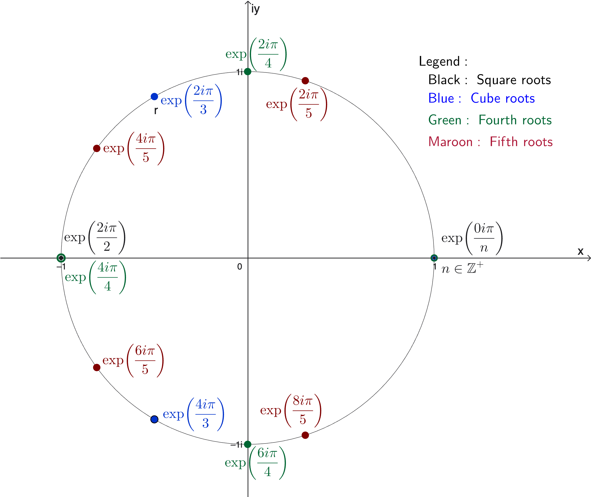
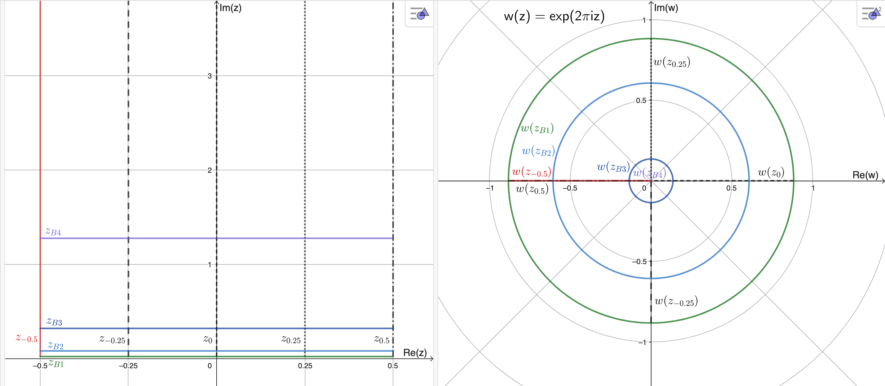

<link rel="stylesheet" href="../../../Styles.css">
<title>Solutions of Selected Exercises from Lang, S "Complex Analysis 3rd Ed. Chapter 1"</title>

$
\newcommand{\t}{\alpha}
\newcommand{\t}{\theta}
\newcommand{\part}{\partial}
\newcommand{\rarrow}{\rightarrow}
\newcommand{\box}{\boxed}
\newcommand{\chec}{\checkmark}
\newcommand{\blksq}{\blacksquare}
\newcommand{\Frac}{\displaystyle \frac}
\newcommand{\Lim}{\displaystyle \lim}
$

## 
Selected Exercise Solutions

from

### 
Lang, S., 1995. <i>Complex Analysis, Third Edition (Corrected).</i> Springer-Verlag GTM, New York
### 
Chapter 1: Complex Numbers and Functions
### 
&copy; 2016, 2025 by
### 
[David Lawrence Goldsmith](https://www.linkedin.com/in/olydlg)

for

## 
[SelectedSolutionsDotNet](https://olydlg.github.io/selectedsolutionsdotnet/)

<i>Notes:  These solutions are provided &quot;as-is,&quot; for informational purposes only, with no warranty of any kind, expressed or implied, including that of correctness, adequacy, and/or suitability for any purpose, whatsoever.</i> Corrections are welcome and should be emailed to selectedsolutionsdotnet@gmail.com.

Acknowledgement and sincerest thanks to [Greg Kuperberg, Ph.D., Professor, UC Davis Dept. of Mathematics](https://www.math.ucdavis.edu/~greg/), for a hint and discussion of 1.4.7, and for a review, input, and discussion of my initial solution to 1.6.1.

Re: notation: although Lang, somewhat mysteriously, doesn't appear to use it in this text, on occasion, e.g., Problem 1.6.1, we will use &quot;[little-o notation](https://en.wikipedia.org/wiki/Big_O_notation#Little-o_notation),&quot; which is analogous to the &quot;big oh&quot; notation presented in the text's &quot;Prerequisites,&quot; except that instead of the relation $\left|f(z)\right| \le C\left|g(z)\right|$ holding for some $C \in \mathbb{R}^+$ as $\left|z\right|$ goes to $a \in \mathbb{R} \cup \infty$, we have $f = o(g) \iff \lim_{z \rightarrow z_0 \in \mathbb{C} \cup \infty} \left|f(z)/g(z)\right| = 0$. More formally, (see, for example, Keener, J. P., 1988. <i>Principles of Applied Mathematics: Transformation and Approximation</i>, Addison-Wesley, Redwood City, CA, Chapter 10, Section 1) given $f(z), g(z)$ defined on $R \subset \mathbb{C} \cup \infty,~f = o(g)$ (in $R$) $\iff \forall$ (real) $\epsilon > 0~\exists$ a neighborhood $U$ of $z_0 : \left|f(z)\right| \le \epsilon \left|g(z)\right| \forall z \in U \cap R$.  

Purple font indicates clicking on the text will return you to your prior place.
 

### Contents

<table>
  <tr>
   <th colspan=4>Section 1</th>
  </tr>
  <tr>
    <td><a href="#E1.5">Exercise 1.5</a></td>
    <td><a href="#E1.7">Exercise 1.7</a></td>
    <td><a href="#E1.8">Exercise 1.8</a></td>
    <td><a href="#E1.9">Exercise 1.9</a></td>
  </tr>
  <tr>
   <th colspan=4>Section 2</th>
  </tr>
  <tr>
    <td><a href="#E2.3">Exercise 2.3</a></td>
    <td><a href="#E2.4">Exercise 2.4</a></td>
    <td><a href="#E2.5">Exercise 2.5</a></td>
    <td><a href="#E2.6">Exercise 2.6</a></td>
  </tr>
  <tr>
    <td><a href="#E2.8-9">Exercise 2.8-9</a></td>
    <td><a href="#E2.12">Exercise 2.12</a></td>
    <td colspan=2><a href="#E2.13">Exercise 2.13</a></td>
  </tr>
  <tr>
   <th colspan=4>Section 3</th>
  </tr>
  <tr>
    <td><a href="#E3.1">Exercise 3.1</a></td>
    <td><a href="#E3.2">Exercise 3.2</a></td>
    <td><a href="#E3.3">Exercise 3.3</a></td>
    <td><a href="#E3.4">Exercise 3.4</a></td>
  </tr>
  <tr>
   <th colspan=4>Section 4</th>
  </tr>
  <tr>
    <td><a href="#E4.1">Exercise 4.1</a></td>
    <td><a href="#E4.2">Exercise 4.2</a></td>
    <td><a href="#E4.3">Exercise 4.3</a></td>
    <td><a href="#E4.4">Exercise 4.4</a></td>
  </tr>
  <tr>
   <th colspan=4>Section 6</th>
  </tr>
  <tr>
    <td><a href="#E6.1">Exercise 6.1</a></td>
  </tr>
</table>

### _Section 1_

<a name="E1.5" class="goback" onclick="winhisback()">__1.5__)</a>
Show: Re$(z) \le \lvert z\rvert$

__Pf__: $\lvert z\rvert^2 = a^2 + b^2 \ge a^2$ (since $b$ is real) $ = [ \text{Re}(z)]^2$ 
and the desired result follows from an elementary fact about the reals. $\blacksquare$

 
<a name="E1.7" class="goback" onclick="winhisback()">__1.7__)</a>
Compute $(1 + i)^{100}$

Soln.: $(1 + i)^{100} = [(1 + i)^2]^{50} = (1 + 2i + i^2)^{50} = (2i)^{50} = -(2^{50}) = \text{Re}[(1 + i)^{100}$], and so $\text{Im}[(1 + i)^{100}$] $= 0$. 
(Note: try to compute it by direct application of the binomial theorem to $(1 + i)^{100}$ and you'll see why I did it this way; indeed, the above approach can be used to prove some otherwise-very-difficult combinatorial identities.) 

 
<a name="E1.8" class="goback" onclick="winhisback()">__1.8__)</a>
Show that:

a) $\lvert z\rvert \le \lvert z - w\rvert + \lvert w\rvert$ 
 
__Pf__: $\lvert z\rvert = \lvert z - w + w\rvert \le \lvert z - w\rvert + \lvert w\rvert$ 
 
(by the triangle inequality).

b) $\lvert z\rvert - \lvert w\rvert \le \lvert z - w\rvert$
 
__Pf__: follows immediately from a)

c) $\lvert z\rvert - \lvert w\rvert \le \lvert z + w\rvert$ 
 
__Pf__: $\lvert z + w\rvert = \lvert z - (-w)\rvert \ge \lvert z\rvert - \lvert -w\rvert = \lvert z\rvert - \lvert w\rvert$ 
$\blacksquare$

 
<a name="E1.9" class="goback" onclick="winhisback()">__1.9__)</a>
$\lvert z - \alpha\rvert = c \iff (x - a)^2 + (y - b)^2 = c^2$,  ($\alpha=a+ib$), i.e., $\lvert z - \alpha\rvert = c$ represents the circle of radius $c$ centered at $\alpha$.

 
### _Section 2_

<a name="E2.3" class="goback" onclick="winhisback()">__2.3__)</a>
Show $\alpha \in \mathbb{C}\setminus\{0\}$ has two distinct square-roots.

__Pf__: $\alpha^{1/2} = \pm\lvert\alpha\rvert^{1/2}\exp(i\arg(\alpha)/2) = \lvert\alpha\rvert^{1/2}\exp[i(\arg(\alpha)/2 + k\pi)], k\in\mathbb{Z}$; but for any given $k$, only $\exp[i(\arg(\alpha)/2+k\pi)]$ and $\exp[i(\arg(\alpha)/2 + (k+1)\pi)]$ are distinct. (Note that the only reason to exclude $0$ is because it is its own square-root and it is known to be unique.) $~~~\blacksquare$

 
<a name="E2.4" class="goback" onclick="winhisback()">__2.4__)</a>
Find ${(x(a, b), y(a, b)): (x + iy)^2 = a + ib}$

$a + ib = (a^2 + b^2)^{1/2}\exp[i(\arg(a+ib)+2k\pi)] = (x + iy)^2 \implies$
$x + iy = (a^2 + b^2)^{1/4}\exp[i(\arg(a+ib)/2+k\pi)] =$
$(a^2+b^2)^{1/4}[\cos(\arg(a+ib)/2+k\pi) + i\sin(\arg(a+ib)/2+k\pi)], k \in \mathbb{Z}, \therefore$
$x(a, b) = (a^2 + b^2)^{1/4}\cos(\arg(a+ib)/2+kπ), \\y(a, b) = (a^2 + b^2)^{1/4}\sin(\arg(a+ib)/2+kπ), k\in\mathbb{Z}$

 
<a name="E2.5" class="goback" onclick="winhisback()">__2.5__)</a>
Plot $\{ z: z^n = 1\} \text{ for } n = 2, 3, 4, 5$

The general case: for $n \in\mathbb{Z} \gt 1, \{z: z^n = 1\}$ are $n$ points on the unit circle, equi-angularly distant from one another, such that one of them is always the point $(1, 0)$.

 
<a name="E2.6" class="goback" onclick="winhisback()">__2.6__)</a>
For $\alpha \in\mathbb{C}\setminus\{0\}$, $n \in \mathbb{N}, \exists n$ distinct $z_{j=0,1,…,n-1}: z_j^n = \alpha$.

**Existence**: $\forall j \in \mathbb{Z}, z_j = \lvert \alpha \rvert^{1/n}\exp[i(\arg(\alpha)+2j\pi)/n]$ is such that $z_j^n = \alpha$; 
indeed, $z_j^n = \lvert \alpha\rvert^{(1/n)\cdot(n)}\exp[i(\arg(\alpha)+2j\pi)/n \cdot n] = \lvert \alpha\rvert\exp[i(\arg(\alpha)+2j\pi)] = \alpha$.

**Uniqueness**: However, except for $z = 0$ (which is unique), if $z_j = \lvert \alpha\rvert^{1/n}\exp[i(\arg(\alpha)+2j\pi)/n]$ such that $j \equiv k\pmod n, k \in\{0, 1, ..., n-1\}$, i.e., $\exists m \in \mathbb{Z} : j = m\cdot n + k$, then 
$z_j = \lvert \alpha\rvert^{1/n}\exp[i(\arg(\alpha)+2(m\cdot n+k)\pi)/n]$
$= \lvert \alpha\rvert^{1/n}\exp[i(\arg(\alpha)+2k\pi)/n]\exp(2im\pi)$
$=\lvert \alpha\rvert^{1/n}\exp[i(\arg(\alpha)+2k\pi)/n], k \in\{0, 1, ..., n -1\}$, i.e., 
 there are precisely $n$ distinct such $z_j$. $\blacksquare$

 
<a name="E2.8-9" class="goback" onclick="winhisback()">__2.8-9__)</a>
Describe: a) $\{z: e^z = 1\}$; 
b) $\{z(\alpha): e^z = w$ given $\alpha: e^\alpha = w\}$; 
c) (1.2.9) Show that $e^z = e^w \Rightarrow \exists k \in \mathbb{Z} : z + 2ik\pi = w$.

a) $e^z = e^{x+iy} = e^xe^{iy} = e^x\cos(y) + ie^x\sin(y) = 1 \implies e^x\cos(y)=1$ and $e^x\sin(y) = 0$. Now $e^x\sin(y)=0 \implies \sin(y) = 0$ (since $e^x \ne 0$ $\forall x \in \mathbb{R}$) $\implies y = k\pi, k \in \mathbb{Z}$; furthermore, $y = k\pi \implies \cos(y) = \pm1, \therefore$ the result that $e^x\cos(y) = 1 \implies e^x = 1$ (since $e^x \gt 0$, i.e., $e^x \ne -1$ $\forall x \in \mathbb{R}$) $\implies x = 0$ and $\implies \cos(k\pi) = 1 \implies k = 2m, m \in \mathbb{Z}$, i.e., $z  = 2ik\pi, k \in \mathbb{Z}$.
  

b) $e^z = e^\alpha \implies e^{z - \alpha} = 1 =$ (by a) $e^{2ik\pi}$ $(k \in \mathbb{Z}) \implies z = \alpha + 2ik\pi$, i.e., $e^z$ is periodic with period $2\pi i$.

c) $e^z = e^w \implies e^{w-z} = 1 \implies \exists k \in \mathbb{Z} : e^{w-z} = e^{2ik\pi} \implies w-z = 2ik\pi~~\blacksquare$.

 
<a name="E2.12" class="goback" onclick="winhisback()">__2.12__)</a>
Using the result of 2.11&mdash;that $\sum_{n=0}^N z^n = (z^{N+1}-1)/(z-1), z \ne 1$&mdash;and taking real parts, show that $$\sum_{n=0}^N\cos(n\theta) = \frac{1}{2} + \frac{\sin[(n+1/2)\theta]}{2\sin\frac{\theta}{2}}$$

__Pf__: Since the identity $\sum_{n=0}^N z^n = (z^{N+1}-1)/(z-1)$ is true $\forall z \in \mathbb{C}\setminus\{1\}$, it is true $\forall z=e^{i\theta}, 0\lt\theta\lt2\pi$. For such $z$, it is &quot;straightforward&quot; (i.e., left to the reader) to show that the real part of $\sum_{n=0}^N \left(e^{i\theta}\right)^n = \sum_{n=0}^N\cos(n\theta)$; the &quot;challenging&quot; part is to show the right-hand-side (RHS). Substituting $e^{i\theta}$ in for $z$ in the RHS of the given identity, we have: $$\frac{e^{i(N+1)\theta}-1}{e^{i\theta}-1} = \frac{e^{i(N+1)\theta/2}}{e^{i\theta/2}}\frac{e^{i(N+1)\theta/2}-e^{-i(N+1)\theta/2}}{e^{i\theta/2}-e^{-i\theta/2}}=e^{iN\theta/2}\frac{\sin[(N+1)\theta/2]}{\sin(\theta/2)}.$$  Since $\displaystyle\frac{\sin[(N+1)\theta/2]}{\sin(\theta/2)}$ is real, the real part of the RHS is this times the real part of $e^{iN\theta/2}$, i.e., $\cos(\frac{N\theta}{2})$, and thus, using various trigonometric identities, we have Re(RHS) $$=\cos\left(\frac{N\theta}{2}\right)\frac{\sin\frac{N\theta}{2}\cos\frac{\theta}{2}+\cos\frac{N\theta}{2}\sin\frac{\theta}{2}}{\sin\frac{\theta}{2}}=\frac{\frac{1}{2}\sin N\theta\cos\frac{\theta}{2}+\cos^2\frac{N\theta}{2}\sin\frac{\theta}{2}}{\sin\frac{\theta}{2}}$$
$$=\frac{\frac{1}{2}\sin N\theta\cos\frac{\theta}{2}+\frac{1}{2}(1+\cos N\theta)\sin\frac{\theta}{2}}{\sin\frac{\theta}{2}}=\frac{\sin N\theta\cos\frac{\theta}{2}+\sin\frac{\theta}{2}+\cos N\theta\sin\frac{\theta}{2}}{2\sin\frac{\theta}{2}}$$
$$=\frac{1}{2}+\frac{\sin[(N+\frac{1}{2})\theta]}{2\sin\frac{\theta}{2}}$$ $\blacksquare$

 
<a name="E2.13" class="goback" onclick="winhisback()">__2.13__)</a>
Given $\bar{z}w \ne 1$, show that $\displaystyle\left\vert\frac{z-w}{1-\bar{z}w}\right\vert \lt 1$ if $\lvert z\rvert$ and $\lvert w\rvert \lt 1$, $= 1$ if $\lvert z\rvert$ or $\lvert w\rvert = 1$.

__Pf__: I shall give a different proof than the one suggested in the text. If $\lvert z\rvert \lt 1$ and $\lvert w\rvert \lt 1$ (respectively, $\lvert z\rvert = 1$ or $\lvert w\rvert = 1$), then $1-\lvert z\rvert^2 \gt 0$, $1-\lvert w\rvert^2 \gt 0$ (resp. $1-\lvert z\rvert^2 = 0$ or $1-\lvert w\rvert^2 = 0$) $\Rightarrow (1-\lvert z\rvert^2)(1-\lvert w\rvert^2) \gt 0$ (resp. $= 0$) $\Rightarrow 1-\lvert z\rvert^2-\lvert w\rvert^2+\lvert z\rvert^2\lvert w\rvert^2 \gt 0$ (resp. $= 0$) $\Rightarrow 1-z\bar{w}-\bar{z}w+\lvert z\rvert^2\lvert w\rvert^2-\lvert z\rvert^2+z\bar{w}+\bar{z}w-\lvert w\rvert^2 \gt 0$ (resp. $= 0$)  
$\Rightarrow 1 - z\bar{w} - \bar{z}w + \lvert z\rvert^2\lvert w\rvert^2 = \lvert 1-\bar{z}w\rvert^2 \gt (\text{resp. }= )~\lvert z\rvert^2 - z\bar{w} - \bar{z}w + \lvert w\rvert^2 = \lvert z-w\rvert^2$. Now, given that $\bar{z}w \ne 1$, divide &quot;through&quot; by $\lvert 1-\bar{z}w\rvert^2$, yielding $\displaystyle\frac{\lvert z-w\rvert^2}{\lvert 1-\bar{z}w\rvert^2} \lt 1$ (resp. $= 1$) $\implies$ $$\left\vert\frac{z-w}{1-\bar{z}w}\right\vert<1 \text{ (resp. = 1).}$$
$\blacksquare$ 

 
### _Section 3_
<a name="E3.1" class="goback" onclick="winhisback()">__3.1__)</a>
Describe the images under $f(z)=\Frac1z$ of the sets $\lvert z\rvert \lt, =, \gt 1$. 

__Sln__: $0$ is mapped to $\infty$ and vice-versa. For $z = re^{i\t}, r \gt 0$ (by convention), $\Frac1{re^{i\theta}} = \Frac1{r^2}re^{-i\theta} = \Frac1{r^2}\bar{z}$. So the map $f(z) = \Frac1z$ can be broken down into three transformations (the order of which doesn’t matter, since complex multiplication is commutative): conjugation, multiplication by $\Frac1r$, and another multiplication by $\Frac1r$. Geometrically, conjugation is an (unscaled) reflection across the real axis; the first multiplication by $\Frac1r$ scales (without rotation or reflection) to the unit circle; and the second multiplication similarly scales to the side of the unit circle opposite from where $z$ started. The net result is a reflection across the real axis and an (unrotated) scaled&#8209;by&#8209;a&#8209;factor&#8209;of $\Frac1r$ &quot;reflection across&quot; the unit circle. Thus: 

Points inside the unit circle ($|z| \lt 0, z \ne 0$) are conjugated and mapped to a point outside the unit circle a distance $\Frac1{|z|} \gt 1$ units away from the origin; 

Points outside the unit circle ($|z| \gt 0$) are conjugated and mapped to a point inside the unit circle a distance $\Frac1{|z|} \lt 1$ units away from the origin; 

Points on the unit circle ($|z| = 1$) are simply conjugated. (Note that this a bijective map of the unit circle to itself, but one distinct from the identity map $f(z) = z$: it reflects the semi-circle $\lvert z\rvert = 1$, Im$(z)\gt 0$ through the $x$-axis to the semi-circle $\lvert z\rvert = 1$, Im$(z) \lt 0$ and vice-versa, and, of course, $1$ and $-1$ are fixed points.)

 
<a name="E3.2" class="goback" onclick="winhisback()">__3.2__)</a>
Describe the images under $f(z) = 1/\bar{z}$ of the sets $\lvert z\rvert \lt, =, \gt 1$. 

__Sln__: This&mdash;reflection through the unit circle&mdash;is as described above in the solution to [__3.1__](#E3.1), except without that mapping’s conjugation (the conjugation in this mapping &quot;undoes&quot; the conjugation in that mapping). Remember though: this isn’t a distance&#8209;preserving reflection, like reflection through a line where the original distance of the point from the line is preserved, but a &quot;scaled&quot; reflection, whereby points starting out $|z|=r$ units away from the origin are mapped (without rotation or reflection) to points $\Frac1r$ units from the origin.
  

<a name="E3.3" class="goback" onclick="winhisback()">__3.3__)</a>
Describe the image under $f(z)=e^{2\pi iz}$ of $S=\{z: z(s,t;B)=s + i(B+t), s, t, B \in \mathbb{R}: -\Frac12 \le s \le \Frac12, t \ge 0, B \gt 0\}$

__Sln__: Substituting, we have: $f(z(s,t;B))=\exp[2\pi i(s + i(B+t))] = e^{-2\pi(B+t)}e^{2\pi is}$. For fixed $s_0 \in \left[-\Frac12,\Frac12\right]$, i.e., the vertical ray $z(t) = s_0 + i(B + t), t \in [0,\infty), B \gt 0$, this is the &quot;half-open&quot; radial segment, $w(t) = e^{-2\pi(B+t)}e^{2\pi i s_0}$, from $e^{-2\pi B}e^{2\pi i s_0}$ (inclusive) to $w=0$ (the origin, exclusive). For fixed $t_0 \in [0, \infty)$, i.e., the horizontal closed segment $z(s) = s + i(B + t_0), s \in \left[-\Frac12,\Frac12\right]$, this is the circle, $w(s) = e^{-2\pi(B+t_0)}e^{2\pi is}$, of radius $e^{-2\pi(B+t_0)}$, with the (real-axis) point $w = -e^{-2\pi(B+t_0)}$ being &quot;hit&quot; twice. Thus $S$ is mapped onto (but not precisely 1-1) the origin-centered-but-excluding disc of radius $e^{-2\pi B}$. Note that the larger $B$ is, the smaller is the radius; and conversely, in the limit as $B \rarrow 0$, the radius approaches $1$ so in this limit the boundary of $f(S)$ is the unit circle. (As we will see shortly, the fact that orthogonal curves in $S$&mdash;e.g., horizontal and vertical (subsets of) lines&mdash;are mapped to orthogonal curves in $f(S)$&mdash;e.g., concentric circles and their radii&mdash;is not a coincidence: it is a signature consequence of $f(z)=e^{2\pi iz}$ being __holomorphic__.) 

Here is a plot of the &quot;action&quot; of $f$ described above:

 

<a name="E3.4" class="goback" onclick="winhisback()">__3.4__)</a>
Describe the image under $f(z)=e^z$ of: 
a) $\{z: z=x+iy, x \le 1, 0 \le y \le \pi\}$ 
b) $\{z: z=x+iy, 0 \le y \le \pi\}$

__Sln__: IMO, it is actually easier to treat the more general case required by b) first, and then deduce the description required by a) as a subset thereof. Accordingly:

b) $w = f(z) = e^{x+iy} = e^xe^{iy} = re^{i\theta}$, where $r=e^x=\lvert w\rvert, \theta=y=\arg w$. Now $0 \le \arg w \le \pi \Rightarrow w$ must lie in the upper-half-plane, $x$-axis included, and since $e^x$ maps $\mathbb{R}$ to the open interval $(0,\infty)$, &quot;no condition on $x$&quot; $\Rightarrow 0 \lt \lvert w\rvert \lt \infty \Rightarrow$ the range excludes the origin, but otherwise &quot;covers&quot; the whole upper-half-plane, $x$-axis included. The image is thus the upper-half-plane, including the $x$-axis but excluding the origin, with horizontal (&quot;constant-$y$&quot;) lines in the domain mapped to open, radial rays emanating from (but not including) the origin, and vertical (&quot;constant-$x$&quot;) closed segments mapped to origin-centered upper-semi-circles, endpoints on the $x$-axis included.

a) Since this domain has the same set of $y$ values, it too must be restricted to the upper-half-plane; furthermore, the same map must map subsets of the domain to subsets of the images of the given domain subsets. In other words, the &quot;constant-$x$&quot; segments must still be mapped to origin-centered, endpoint-inclusive upper-semi-circles, and the &quot;constant-$y$&quot; subsets (now endpoint-inclusive rays from $x=1\rightarrow -\infty$) are mapped to &quot;half-open&quot; radial segments emanating from, but excluding, the origin, but instead of continuing indefinitely, they terminate at and include the point at radius $e$. In brief, the required image is the origin-excluding, $x$-axis-including, &quot;almost closed&quot; upper semi-disc of radius $e$.

 
### _Section 4_
<!---ToDo: make clearer>
**From the Text** 
On page 20, the following important assertion is made without proof, i.e., proof is, implicitly,  &quot;left to the reader&quot;: 
Let $S=\{1, \frac12, \frac13, \frac14,...\},~f(1/n)=z_n$; then
$\displaystyle \lim_{n\rightarrow\infty}z_n=w \iff \lim_{\substack{z\rightarrow 0 \\ z \in S}} f(z) = w.$ 

__Pf__: Since the right-side limit requires that $0$ be adherent to $S$ (pg. 19), we'll prove that first. We need to show that every disc $D(0,r \gt 0),$ contains some element of $S$, i.e., given such an $r$, we need to show the existence of an $n$ such that $1/n \lt r$. Now, for the $r$ and $1/n$ under consideration, i.e., $\gt 0$, if $1/n \lt r$, we have that $1/r \lt n$; so, what we need is that however large $1/r$ is, $\exists n \in \mathbb{N}: n \gt 1/r$, which is true by an elementary property of $\mathbb{R}, \therefore 0$ is adherent to $S$. 

Now, suppose the left side true, i.e., $\lim_{n\rightarrow\infty}z_n=w$, which, by the definition in the text, means $\forall \epsilon \gt 0, \exists N \in \mathbb{N}: n \ge N \implies \lvert z_n - w\rvert \lt \epsilon$. Substituting, we have that $\lvert f(1/n) - w \rvert \lt \epsilon$ for such $n$ and $z = 1/n \in S$ and approaches $\alpha = 0$ as $n \rightarrow \infty$. In particular, let $\delta = 1/N$  (which is $\gt 0~\forall N \in \mathbb{N}$); then $\lvert z - \alpha \rvert \lt \delta~\forall z = 1/n$ such that $n \gt N$, and we've thus shown the existence of a $\delta \gt 0$ such that, for $z \in S$ and $\lvert z - \alpha \rvert \lt \delta, \lvert f(z) - w \rvert \lt \epsilon~\forall \epsilon \gt 0$. (Proving the converse is left to the reader, but follows the same pattern: one needs to show that each of the requirements for the left side to be true follows from some aspect and/or implication of the right side being true.) 
  
<-->
<a name="E4.1" class="goback" onclick="winhisback()">__4.1__)</a>
Given $\alpha \in \mathbb{C} : \lvert \alpha \rvert \lt 1$, what is $\displaystyle \lim_{n\rightarrow \infty} \alpha ^n$?

__Sln__: Write $\alpha$ in polar form: $\alpha = \lvert \alpha \rvert e^{i\arg(\alpha)}$; then $\alpha ^n = \lvert \alpha \rvert ^n e^{in\arg(\alpha)}$ and $\displaystyle \lim_{n \rightarrow \infty} \alpha^n = \lim_{n \rightarrow \infty} \lvert \alpha \rvert ^n e^{in\arg(\alpha)} = (\lim_{n \rightarrow \infty} \lvert \alpha \rvert ^n)(\lim_{n \rightarrow \infty} e^{in\arg(\alpha)}) = (0)(\text{bounded sequence})~(\because \lvert  e^{in\arg(\alpha)} \rvert = 1~\forall n \in \mathbb{N}, \alpha \in \mathbb{C})$ $~~~~= 0$.  Geometrically what is going on is that for any $\alpha$ inside the unit circle, each multiplication by itself moves it closer to the origin; it also rotates it further around the origin&mdash;by its own angle&mdash;but this doesn't matter, regardless of what that angle is, i.e., for any such starting $\alpha$, because of the &quot;contraction&quot; effected by each multiplication: eventually, any such $\alpha$ is brought &quot;arbitrarily close&quot; to the origin; the &quot;orbit&quot; of any such $\alpha$ under this iterated action is a spiral into the origin, $z = 0$.

 
<a name="E4.2" class="goback" onclick="winhisback()">__4.2__)</a>
What about the case $\lvert \alpha \rvert \gt 1$?

__Sln__: In this case, $\because \lvert \alpha ^n \rvert = \lvert \alpha \rvert ^n$, the sequence is unbounded and thus diverges; geometrically, we get a spiral of ever-increasing distance from the origin.

 
<a name="E4.3" class="goback" onclick="winhisback()">__4.3__)</a>
Show that $\displaystyle \lvert z \rvert \lt 1 \implies \sum_{n=0}^{\infty} z^n = (1-z)^{-1}$.

__Pf__: The reader should have already shown that $\displaystyle \sum_{n=0}^N z^n = (z^{N+1} - 1)/(z-1)$, if not previously, at least in Exercise 1.2.11. (Hint: let $\displaystyle S = \sum_{n=0}^{N-1} z^n$, multiply by $z$, subtract $S$ from $zS$,and solve for $S$.) So $\displaystyle \sum_{n=0}^{\infty} z^n = \lim_{N \rightarrow \infty} \sum_{n=0}^N z^n = \lim_{N \rightarrow \infty} (z^{N+1} - 1)/(z-1) = [\lim_{N \rightarrow \infty} (z^{N+1} - 1)]/[\lim_{N \rightarrow \infty} (z-1)] = [(\lim_{N \rightarrow \infty} z^{N+1}) - 1]/(z-1)$. Now, by the result of 1.4.1, if $\displaystyle \lvert z \rvert \lt 1$, $\displaystyle \lim_{N \rightarrow \infty} z^{N+1} = 0 \therefore [(\lim_{N \rightarrow \infty} z^{N+1}) - 1]/(z-1) = -1/(z-1) = (1-z)^{-1}.~~~\blacksquare$ 

 
<a name="E4.4" class="goback" onclick="winhisback()">__4.4__)</a>
Given: $\displaystyle f(z) = \lim_{n \rightarrow \infty} 1/(1 + n^2 z)$, show: $f(0) = 1,~f(z \ne 0) = 0$.

__Pf__: $\displaystyle f(0) = \lim_{n \rightarrow \infty} 1/(1+n^2(0)) = \lim_{n \rightarrow \infty} 1/(1+0)~\therefore \lim_{n \rightarrow \infty} 1/(1+n^2(0)) = 1/1 = 1$; 
$\displaystyle f(z \ne 0) = \lim_{n \rightarrow \infty} 1/(1+n^2z) = \lim_{n \rightarrow \infty} \frac{1/n^2}{(1/n^2+z)} = \frac{\lim_{n \rightarrow \infty}1/n^2}{\lim_{n \rightarrow \infty}(1/n^2 + z)} = \frac{0}{0 + z} = 0.~~~\blacksquare$ 

 
<!---ToDo: improve and expand both 1.4.5 and 1.4.7
<a name="E4.5" class="goback" onclick="winhisback()">__4.5__)</a>
Show that $f(z) = \lim_{n \rightarrow \infty} \left(\frac{z^n -1}{z^n + 1}\right)$ is well-defined, i.e., the limit exists $\iff \left|z\right| \ne 1$.
__Pf__: If $\left|z\right| \lt 1, \lim_{n \rightarrow \infty} z^n = 0 \therefore \lim_{n \rightarrow \infty} f(z) = \frac{0-1}{0+1} = -1.~$ On the other hand, if $\left|z\right| \gt 1,~\lim_{n \rightarrow \infty} z^n$ "dominates" $1,~\therefore \lim_{n \rightarrow \infty} f(z) = \lim_{n \rightarrow \infty} \frac{z^n}{z^n} = \lim_{n \rightarrow \infty} 1~\forall z,\therefore \lim_{n \rightarrow \infty} f(z, \left|z\right| \gt 1) = 1.~$ Since the limit $\forall z$ inside the unit circle is $-1$ and the limit $\forall z$ outside the unit circle is $+1$, there is a "jump"  discontinuity at the unit circle, therefore this discontinuity is not removable.$~~~\blacksquare$
<a name="E4.7" class="goback" onclick="winhisback()">__4.7__)</a>
Show that $\displaystyle \sum \frac{z^{n-1}}{(1-z^n)(1-z^{n+1})}$ converges (uniformly) to $\Bigg\{\!
  \begin{array}{c}
    1/(1-z)^{2},~~~~~\left|z\right|\lt 1 \\
    1/[z(1-z)^2],~\left|z\right|\gt 1
  \end{array}
  \!$  
__Pf__: First note that the summand is undefined (or infinite) $\forall z$ if $n=0$, so we assume that the sum starts from $n=1$. Let $\displaystyle A_n(z) = \frac{z^{n-1}}{(1-z^n)(1-z^{n+1})}$ and consider the partial sum $\displaystyle \sum_{n=1}^{N} A_n(z)$. Computing&mdash;and simplifying&mdash;this for a few small values of $N$ leads to the following conjecture:
$$\sum_{n=1}^N A_n(z) = \frac{\sum_{m=0}^{N-1} z^m}{(1-z)(1-z^{N+1})},$$which we will now prove by induction.
First note that it is true for $N=1$: $\displaystyle \sum_{n=1}^1 A_n(z) = A_1(z) = \frac{1}{(1-z)(1-z^2)} = \frac{\sum_{m=0}^{1-1}z^m}{(1-z)(1-z^{1+1})}$. Now we will show that "true for $N$ implies true for $N+1$":
$\displaystyle \sum_{n=1}^{N+1} A_n(z) = \sum_{n=1}^{N} A_n(z) + \frac{z^N}{(1-z^{N+1})(1-z^{N+2})} = \frac{z^N}{(1-z^{N+1})(1-z^{N+2})} + \frac{\sum_{m=0}^{N-1}z^m}{(1-z)(1-z^{N+1})}$ (this is where we've used "assumed true for $N$")
 $\displaystyle ~~~= \frac{z^N}{(1-z^{N+1})(1-z^{N+2})} + \frac{1-z^N}{(1-z)(1-z)(1-z^{N+1})} = \frac{z^N(1-z)^2 + (1-z^{N+2})(1-z^N)}{(1-z)^2(1-z^{N+1})(1-z^{N+2})}$ $\displaystyle = \frac{1+z^N-z^N-2z^{N+1}+z^{N+2}-z^{N+2}+z^{2N+2}}{(1-z)^2(1-z^{N+1})(1-z^{N+2})} = \frac{(1-z^{N+1})^2}{(1-z)^2(1-z^{N+1})(1-z^{N+2})} = \frac{1-z^{N+1}}{(1-z)^2(1-z^{N+2})}$
$$=\frac{\sum_{m=0}^N z^m}{(1-z)(1-z^{N+2})}$$ which is our formula evaluated for $N+1$. Consequently, $\displaystyle \lim_{N\rightarrow \infty} \sum_{n=1}^N A_n(z) = \lim_{N\rightarrow \infty}\frac{\sum_{m=0}^{N-1} z^m}{(1-z)(1-z^{N+1})} = \lim_{N\rightarrow \infty} \frac{1-z^N}{(1-z)^2(1-z^{N+1})} =$ $$\frac{1}{(1-z)^2}$$ when $\left|z\right| \lt 1$. The other three parts of the problem are "left to the reader."
--->

### _Section 6_

<a name="E6.1" class="goback" onclick="winhisback()">__6.1__)</a>
Given $f(z) = f(x+iy) = u(x,y) + iv(x,y) : u, v \in C^1, u_x = v_y, u_y = -v_x$, show that $f$ is holomorphic.

__Pf__: Although there are many ways to prove this, we suspect that what Lang was &quot;fishing&quot; for&mdash;given his approach to complex differentiability in the text&mdash;was that one show: 
$\exists a$ such that, given $\displaystyle \sigma(w) \equiv \frac{f(z+w) - f(z)}{w} - a, \lim_{w \rightarrow 0} \sigma(w) = 0$, or, in little-oh notation, $\sigma(w) = o(w)$ (as $w \rightarrow 0$; see this document's prefatory note for the definition of $o(\cdot)$). We procede as follows: $f(z + w) - f(z) = f((x+h) + i(y+k)) - f(x+iy) = u(x+h, y+k) - u(x,y) + i[v(x+h, y+k) - v(x,y)]$, where $w = h + ik, h, k \in \mathbb{R}.$ 
Dropping the $(x,y)$ for brevity and using the notation $(\cdot)_t \equiv \partial(\cdot)/\partial t$, from $u,v \in C^1$, we can expand this last as: 
$[u + hu_x + ku_y + o(h,k) - u] + i[v + hv_x + kv_y + o(h,k) - v]$. The $u$ & $v$ cancel and, using the given that $u~\&~v$ satisfy the C-R equations, we are left with: 
$hu_x + ku_y + ihv_x + ikv_y + o(h,k) = hu_x - kv_x + ihv_x + iku_x + o(h,k) = (h+ik)(u_x +iv_x) + o(h,k)$. Again utilizing the given that $u, v \in C^1, u_x, v_x$ are well-defined, i.e., $u_x + iv_x$ is a well-defined complex number, $a$; dividing by $w$ and subtracting $a$ yields:  $\displaystyle \sigma(w) = \frac{f(z+w) -f(z)}{w} - a = o(w).~~~\blacksquare$

### Please Donate:

<table>
  <tr>
    <td>
      <b>Venmo: @David-Goldsmith-13</b>
    </td>
    <td>
      <form action="https://www.paypal.com/cgi-bin/webscr"
            method="post"><input name="cmd"
            value="_xclick" type="hidden"> <input name="business"
            value="dgoldsmith_89@alumni.brown.edu" type="hidden"> <input
            name="item_name" value="SelectedSolutions Donation"
            type="hidden"> <input name="cn" value="Special Instructions
            (optional" type="hidden"> <input
            src="https://www.paypal.com/images/x-click-but04.gif"
            name="submit" alt="Make payments with PayPal - it's fast,
            free and secure!" align="middle" border="0" type="image"></form>
    </td>
  </tr>
</table>

