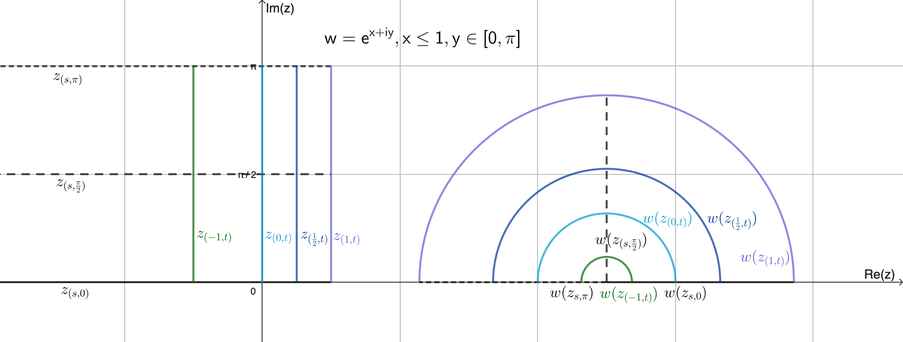

<link rel="stylesheet" href="../../../Styles.css">
<title>Solutions of Selected Exercises from Lang, S "Complex Analysis 3rd Ed. Chapter 1"</title>

$
\newcommand{\a}{\alpha}
\newcommand{\d}{\delta}
\newcommand{\e}{\epsilon}
\newcommand{\t}{\theta}
\newcommand{\snc}{\because}
\newcommand{\part}{\partial}
\newcommand{\rarrow}{\rightarrow}
\newcommand{\box}{\boxed}
\newcommand{\chec}{\checkmark}
\newcommand{\blksq}{\blacksquare}
\newcommand{\ds}{\displaystyle}
\newcommand{\Frac}{\displaystyle \frac}
\newcommand{\Lim}{\displaystyle \lim}
\newcommand{\Sum}{\displaystyle \sum}
$

## 
Selected Exercise Solutions

from

### 
Lang, S., 1995. <i>Complex Analysis, Third Edition (Corrected).</i> Springer-Verlag GTM, New York
### 
Chapter 1: Complex Numbers and Functions
### 
&copy; 2016, 2026 by
### 
[David Lawrence Goldsmith](https://www.linkedin.com/in/olydlg)

for

## 
[SelectedSolutionsDotNet](https://olydlg.github.io/selectedsolutionsdotnet/)

<i>Notes:  These solutions are provided &quot;as-is,&quot; for informational purposes only, with no warranty of any kind, expressed or implied, including that of correctness, adequacy, and/or suitability for any purpose, whatsoever.</i> Corrections are welcome and should be emailed to selectedsolutionsdotnet@gmail.com.

Acknowledgement and sincerest thanks to [Greg Kuperberg, Ph.D., Professor, UC Davis Dept. of Mathematics](https://www.math.ucdavis.edu/~greg/), for a hint and discussion of 1.4.7, and for a review, input, and discussion of my initial solution to 1.6.1.

Re: notation: although Lang, somewhat mysteriously, doesn't appear to use it in this text, on occasion, e.g., Problem 1.6.1, we will use &quot;[little-o notation](https://en.wikipedia.org/wiki/Big_O_notation#Little-o_notation),&quot; which is analogous to the &quot;big oh&quot; notation presented in the text's &quot;Prerequisites,&quot; except that instead of the relation $\lvert f(z)\rvert  \le C\lvert g(z)\rvert $ holding for some $C \in \mathbb{R}^+$ as $\lvert z\rvert $ goes to $a \in \mathbb{R} \cup \infty$, we have $f = o(g) \iff \Lim_{z \rarrow z_0 \in \mathbb{C} \cup \infty} \lvert f(z)/g(z)\rvert  = 0.~$ More formally, (see, for example, Keener, J. P., 1988. <i>Principles of Applied Mathematics: Transformation and Approximation</i>, Addison-Wesley, Redwood City, CA, Chapter 10, Section 1) given $f(z), g(z)$ defined on $R \subset \mathbb{C} \cup \infty,~f = o(g)$ (in $R$) $\iff \forall$ (real) $\epsilon > 0~\exists$ a neighborhood $U$ of $z_0 : \lvert f(z)\rvert  \le \epsilon \lvert g(z)\rvert  \forall z \in U \cap R.$  

Purple font indicates clicking on the text will return you to your prior place.
 

### Contents

<table>
  <tr>
    <th>Section</th><th colspan=7>Exercise #</th>
  </tr>
  <tr>
    <th>&nbsp;&nbsp;&nbsp;&nbsp;&nbsp;&nbsp;1</th>
    <td><a href="#E1.5">5</a></td>
    <td><a href="#E1.7">7</a></td>
    <td><a href="#E1.8">8</a></td>
    <td><a href="#E1.9">9</a></td>
  </tr>
  <tr>
    <th>&nbsp;&nbsp;&nbsp;&nbsp;&nbsp;&nbsp;2</th>
    <td><a href="#E2.3">3</a></td>
    <td><a href="#E2.4">4</a></td>
    <td><a href="#E2.5">5</a></td>
    <td><a href="#E2.6">6</a></td>
    <td><a href="#E2.8-9">8-9</a></td>
    <td><a href="#E2.12">12</a></td>
    <td><a href="#E2.13">13</a></td>
  </tr>
  <tr>
    <th>&nbsp;&nbsp;&nbsp;&nbsp;&nbsp;&nbsp;3</th>
    <td><a href="#E3.1">1</a></td>
    <td><a href="#E3.2">2</a></td>
    <td><a href="#E3.3">3</a></td>
    <td><a href="#E3.4">4</a></td>
  </tr>
  <tr>
    <th>&nbsp;&nbsp;&nbsp;&nbsp;&nbsp;&nbsp;4</th>
    <td><a href="#E4.0">&quot;0&quot;</a></td>
    <td><a href="#E4.1">1</a></td>
    <td><a href="#E4.2">2</a></td>
    <td><a href="#E4.3">3</a></td>
    <td><a href="#E4.4">4</a></td>
    <td><a href="#E4.5">5</a></td>
    <td><a href="#E4.7">7</a></td>
  </tr>
  <tr>
    <th>&nbsp;&nbsp;&nbsp;&nbsp;&nbsp;&nbsp;6</th>
    <td><a href="#E6.1">1</a></td>
  </tr>
</table>

### _Section 1_

<a name="E1.5" class="goback" onclick="winhisback()">__1.5__)</a>
Show: Re$(z) \le \lvert z\rvert$

__Pf__: $\lvert z\rvert^2 = a^2 + b^2 \ge a^2$ (since $b$ is real) $ = [ \text{Re}(z)]^2$ 
and the desired result follows from an elementary fact about the reals.$~~~\blksq$
  

<a name="E1.7" class="goback" onclick="winhisback()">__1.7__)</a>
Compute $(1 + i)^{100}$

__Sln__: $(1 + i)^{100} = [(1 + i)^2]^{50} = (1 + 2i + i^2)^{50} = (2i)^{50} = -(2^{50}) = \text{Re}[(1 + i)^{100}$], and so $\text{Im}[(1 + i)^{100}$] $= 0.~$ (Note: try to compute it by direct application of the binomial theorem to $(1 + i)^{100}$ and you'll see why I did it this way; indeed, the above approach can be used to prove some otherwise-very-difficult combinatorial identities.) 
  

<a name="E1.8" class="goback" onclick="winhisback()">__1.8__)</a>
Show that:

a) $\lvert z\rvert \le \lvert z - w\rvert + \lvert w\rvert$ 
 
__Pf__: $\lvert z\rvert = \lvert z - w + w\rvert \le \lvert z - w\rvert + \lvert w\rvert$ (by the triangle inequality).$~~~\blksq$

b) $\lvert z\rvert - \lvert w\rvert \le \lvert z - w\rvert$
 
__Pf__: follows immediately from a).$~~~\blksq$

c) $\lvert z\rvert - \lvert w\rvert \le \lvert z + w\rvert$ 
 
__Pf__: $\lvert z + w\rvert = \lvert z - (-w)\rvert \ge \lvert z\rvert - \lvert -w\rvert = \lvert z\rvert - \lvert w\rvert.~~~\blksq$
  

<a name="E1.9" class="goback" onclick="winhisback()">__1.9__)</a>
Describe the locus of $\{z : \lvert z - \a\rvert = c\}.$ 

__Sln__: $\lvert z - \a\rvert = c \iff (x - a)^2 + (y - b)^2 = c^2$,  ($\a = a+ib$), i.e., $\lvert z - \a\rvert = c$ represents the circle of radius $c$ centered at $\a.$
  

### _Section 2_

<a name="E2.3" class="goback" onclick="winhisback()">__2.3__)</a>
Show $\a \in \mathbb{C}\setminus\{0\}$ has two distinct square-roots.

__Pf__: $\a^{1/2} = \pm\lvert\a\rvert^{1/2}\exp(i\arg(\a)/2) = \lvert\a\rvert^{1/2}\exp[i(\arg(\alpha)/2 + k\pi)], k\in\mathbb{Z}$; but for any given $k$, only $\exp[i(\arg(\alpha)/2+k\pi)]$ and $\exp[i(\arg(\alpha)/2 + (k+1)\pi)]$ are distinct.&nbsp; (Note that the only reason to exclude $0$ is because it is its own square-root and it is known to be unique.)$~~~\blksq$ 
  

<a name="E2.4" class="goback" onclick="winhisback()">__2.4__)</a>
Find ${(x(a, b), y(a, b)): (x + iy)^2 = a + ib}$

$a + ib = (a^2 + b^2)^{1/2}\exp[i(\arg(a+ib)+2k\pi)] = (x + iy)^2 \implies$
$x + iy = (a^2 + b^2)^{1/4}\exp[i(\arg(a+ib)/2+k\pi)] =$
$(a^2+b^2)^{1/4}[\cos(\arg(a+ib)/2+k\pi) + i\sin(\arg(a+ib)/2+k\pi)], k \in \mathbb{Z},$ thus:
$x(a, b) = (a^2 + b^2)^{1/4}\cos(\arg(a+ib)/2+kπ),~~y(a, b) = (a^2 + b^2)^{1/4}\sin(\arg(a+ib)/2+kπ),~k\in\mathbb{Z}$
  

<a name="E2.5" class="goback" onclick="winhisback()">__2.5__)</a>
Plot $\{ z: z^n = 1\} \text{ for } n = 2, 3, 4, 5$

The general case: for $n \in\mathbb{Z} \gt 1, \{z: z^n = 1\}$ are $n$ points on the unit circle, equi-angularly distant from one another, such that one of them is always the point $(1, 0).$
  

<a name="E2.6" class="goback" onclick="winhisback()">__2.6__)</a>
For $\a \in\mathbb{C}\setminus\{0\}$, $n \in \mathbb{N}, \exists n$ distinct $z_{j=0,1,…,n-1}: z_j^n = \a.$

**Existence**: $\forall j \in \mathbb{Z}, z_j = \lvert \a \rvert^{1/n}\exp[i(\arg(\a)+2j\pi)/n]$ is such that $z_j^n = \a$; 
indeed, $z_j^n = \lvert \a\rvert^{(1/n)\cdot(n)}\exp[i(\arg(\a)+2j\pi)/n \cdot n] = \lvert \a\rvert\exp[i(\arg(\a)+2j\pi)] = \a.$

**Uniqueness**: However, except for $z = 0$ (which is unique), if $z_j = \lvert \a\rvert^{1/n}\exp[i(\arg(\a)+2j\pi)/n]$ such that $j \equiv k\pmod n, k \in\{0, 1, ..., n-1\}$, i.e., $\exists m \in \mathbb{Z} : j = m\cdot n + k$, then 
$z_j = \lvert \a\rvert^{1/n}\exp[i(\arg(\a)+2(m\cdot n+k)\pi)/n]$
$= \lvert \a\rvert^{1/n}\exp[i(\arg(\a)+2k\pi)/n]\exp(2im\pi)$
$=\lvert \a\rvert^{1/n}\exp[i(\arg(\a)+2k\pi)/n], k \in\{0, 1, ..., n -1\}$, i.e., 
 there are precisely $n$ distinct such $z_j.~~~\blksq$
  

<a name="E2.8-9" class="goback" onclick="winhisback()">__2.8-9__)</a>
Describe: a) $\{z: e^z = 1\}$; 
b) $\{z(\a): e^z = w$ given $\a: e^\a = w\}$; 
c) (1.2.9) Show that $e^z = e^w \implies \exists k \in \mathbb{Z} : z + 2ik\pi = w.$

a) $e^z = e^{x+iy} = e^xe^{iy} = e^x\cos(y) + ie^x\sin(y) = 1 \implies e^x\cos(y)=1$ and $e^x\sin(y) = 0.~$ Now $e^x\sin(y)=0 \implies \sin(y) = 0$ (since $e^x \ne 0$ $\forall x \in \mathbb{R}$) $\implies y = k\pi, k \in \mathbb{Z}$; furthermore, $y = k\pi \implies \cos(y) = \pm1, \therefore$ the result that $e^x\cos(y) = 1 \implies e^x = 1$ (since $e^x \gt 0$, i.e., $e^x \ne -1$ $\forall x \in \mathbb{R}$) $\implies x = 0$ and $\implies \cos(k\pi) = 1 \implies k = 2m, m \in \mathbb{Z}$, i.e., $z  = 2ik\pi, k \in \mathbb{Z}.$
  

b) $e^z = e^{\a} \implies e^{z - \a} = 1 =$ (by a) $e^{2ik\pi}$ $(k \in \mathbb{Z}) \implies z = \a + 2ik\pi$, i.e., $e^z$ is periodic with period $2\pi i.$

c) $e^z = e^w \implies e^{w-z} = 1 \implies \exists k \in \mathbb{Z} : e^{w-z} = e^{2ik\pi} \implies w-z = 2ik\pi.~~~\blksq$
  

<a name="E2.12" class="goback" onclick="winhisback()">__2.12__)</a>
Using the result of 2.11&mdash;that $\ds \sum_{n=0}^N z^n = \Frac{z^{N+1}-1}{z-1}, z \ne 1$&mdash;and taking real parts, show that $$\sum_{n=0}^N\cos(n\theta) = \frac{1}{2} + \frac{\sin[(N+1/2)\theta]}{2\sin(\theta/2)}$$

__Pf__: Since the identity $\sum_{n=0}^N z^n = (z^{N+1}-1)/(z-1)$ is true $\forall z \in \mathbb{C}\setminus\{1\}$, it is true $\forall z=e^{i\theta}, 0\lt\theta\lt2\pi.~$ For such $z$, it is &quot;straightforward&quot; (i.e., left to the reader) to show that the real part of $\sum_{n=0}^N \left(e^{i\theta}\right)^n = \sum_{n=0}^N\cos(n\theta)$; the &quot;challenging&quot; part is to show the right-hand-side (RHS).&nbsp; Substituting $e^{i\theta}$ in for $z$ in the RHS of the given identity, we have: $$\frac{e^{i(N+1)\theta}-1}{e^{i\theta}-1} = \frac{e^{i(N+1)\theta/2}}{e^{i\theta/2}}\frac{e^{i(N+1)\t/2}-e^{-i(N+1)\t/2}}{e^{i\t/2}-e^{-i\t/2}}=e^{iN\t/2}\frac{\sin[(N+1)\t/2]}{\sin(\t/2)}.$$ 
Since $\ds\frac{\sin[(N+1)\t/2]}{\sin(\t/2)}$ is real, the real part of the RHS is this times the real part of $e^{iN\t/2}$ is $\cos(N\t/2)$, and thus, using various trigonometric identities, we have Re(RHS) $$=\frac{\cos(N\t/2)\sin(N\t/2)\cos(\t/2) + \cos^2(N\t/2)\sin(\t/2)}{\sin(\t/2)} = \frac{[\sin N\t\cos(\t/2)]/2 + \sin(\t/2)(1+\cos N\t)/2}{\sin(\t/2)} = \\
\frac{\sin(\t/2) + \sin N\t\cos(\t/2) + \cos N\t\sin(\t/2)}{2\sin(\t/2)} = \frac{1}{2}+\frac{\sin[(N+1/2)\t]}{2\sin(\t/2)}.~~~\blksq$$
 

<a name="E2.13" class="goback" onclick="winhisback()">__2.13__)</a>
Given $\bar{z}w \ne 1$, show that $\ds\left\vert\frac{z-w}{1-\bar{z}w}\right\vert \lt 1$ if $\lvert z\rvert$ and $\lvert w\rvert \lt 1$, $= 1$ if $\lvert z\rvert$ or $\lvert w\rvert = 1.$

__Pf__: I shall give a different proof than the one suggested in the text.&nbsp; If $\lvert z\rvert \lt 1$ and $\lvert w\rvert \lt 1$ (respectively, $\lvert z\rvert = 1$ or $\lvert w\rvert = 1$), then $1-\lvert z\rvert^2 \gt 0$, $1-\lvert w\rvert^2 \gt 0$ (resp. $1-\lvert z\rvert^2 = 0$ or $1-\lvert w\rvert^2 = 0$) $\implies (1-\lvert z\rvert^2)(1-\lvert w\rvert^2) \gt 0$ (resp. $= 0$) $\implies 1-\lvert z\rvert^2-\lvert w\rvert^2+\lvert z\rvert^2\lvert w\rvert^2 \gt 0$ (resp. $= 0$) $\implies 1-z\bar{w}-\bar{z}w+\lvert z\rvert^2\lvert w\rvert^2-\lvert z\rvert^2+z\bar{w}+\bar{z}w-\lvert w\rvert^2 \gt 0$ (resp. $= 0$)  
$\implies 1 - z\bar{w} - \bar{z}w + \lvert z\rvert^2\lvert w\rvert^2 = \lvert 1-\bar{z}w\rvert^2 \gt (\text{resp. }= )~\lvert z\rvert^2 - z\bar{w} - \bar{z}w + \lvert w\rvert^2 = \lvert z-w\rvert^2.~$ Now, given that $\bar{z}w \ne 1$, divide through by $\lvert 1-\bar{z}w\rvert^2$, yielding $\ds\frac{\lvert z-w\rvert^2}{\lvert 1-\bar{z}w\rvert^2} \lt 1$ (resp. $= 1$) $\implies \left\vert\Frac{z-w}{1-\bar{z}w}\right\vert<1 \text{ (resp. = 1).}~~~\blksq$
  

### _Section 3_
<a name="E3.1" class="goback" onclick="winhisback()">__3.1__)</a>
Describe the images under $f(z)=\Frac1z$ of the sets $\lvert z\rvert \lt, =, \gt 1.$ 

__Sln__: $0$ is mapped to $\infty$ and vice-versa.&nbsp; For $z = re^{i\t}, r \gt 0$ (by convention), $\Frac1{re^{i\t}} = \Frac1{r^2}re^{-i\t} = \Frac1{r^2}\bar{z}.~$ $\bar z$ reflects $z$ across the real axis, and multiplication by $1/r^2$ scales it by a factor of $1/r$ to the other side of the unit circle.&nbsp; Thus: 

Points inside the unit circle except 0 ($0 \lt \lvert z \rvert \lt 1$) are conjugated and mapped to a point ___outside___ the unit circle a distance $\Frac1{\lvert z\rvert} \gt 1$ units away from the origin; 

Points outside the unit circle ($1 \lt \lvert z \rvert \lt \infty$) are conjugated and mapped to a point ___inside___ the unit circle a distance $\Frac1{\lvert z \rvert} \lt 1$ units away from the origin; 

Points on the unit circle ($\lvert z \rvert = 1$) are simply conjugated.&nbsp; (Note that this a bijective map of the unit circle to itself, but one distinct from the identity map $f(z) = z$: it reflects the semi-circle $\lvert z\rvert = 1$, Im$(z)\gt 0$ through the $x$-axis to the semi-circle $\lvert z\rvert = 1$, Im$(z) \lt 0$ and vice-versa, and, of course, $1$ and $-1$ are fixed points.)
  

<a name="E3.2" class="goback" onclick="winhisback()">__3.2__)</a>
Describe the images under $f(z) = 1/\bar{z}$ of the sets $\lvert z\rvert \lt, =, \gt 1.$ 

__Sln__: This&mdash;reflection through the unit circle&mdash;is as described above in the solution to [__3.1__](#E3.1), except without that mapping’s conjugation (the conjugation in this mapping &quot;undoes&quot; the conjugation in that mapping).&nbsp; Remember though: this isn’t a distance&#8209;preserving reflection, like reflection through a line where the original distance of the point from the line is preserved, but a &quot;scaled&quot; reflection, whereby points starting out $|z|=r$ units away from the origin are mapped (without rotation or reflection) to points $\Frac1r$ units from the origin.
  

<a name="E3.3" class="goback" onclick="winhisback()">__3.3__)</a>
Describe the image under $f(z)=e^{2\pi iz}$ of $S=\{z: z(s,t;B)=s + i(B+t), s, t, B \in \mathbb{R}: -\Frac12 \le s \le \Frac12, t \ge 0, B \gt 0\}$

__Sln__: Substituting, we have: $f(z(s,t;B))=\exp[2\pi i(s + i(B+t))] = e^{-2\pi(B+t)}e^{2\pi is}.~$ For fixed $s_0 \in \left[-\Frac12,\Frac12\right]$, i.e., the vertical ray $z(t) = s_0 + i(B + t), t \in [0,\infty), B \gt 0$, this is the &quot;half-open&quot; radial segment, $w(t) = e^{-2\pi(B+t)}e^{2\pi i s_0}$, from $e^{-2\pi B}e^{2\pi i s_0}$ (inclusive) to $w=0$ (the origin, exclusive).&nbsp; For fixed $t_0 \in [0, \infty)$, i.e., the horizontal closed segment $z(s) = s + i(B + t_0), s \in \left[-\Frac12,\Frac12\right]$, this is the circle, $w(s) = e^{-2\pi(B+t_0)}e^{2\pi is}$, of radius $e^{-2\pi(B+t_0)}$, with the (real-axis) point $w = -e^{-2\pi(B+t_0)}$ being &quot;hit&quot; twice.&nbsp; Thus $S$ is mapped onto (but not precisely 1-1) the origin-centered-but-excluding disc of radius $e^{-2\pi B}.~$ Note that the larger $B$ is, the smaller is the radius; and conversely, in the limit as $B \rarrow 0$, the radius approaches $1$ so in this limit the boundary of $f(S)$ is the unit circle.&nbsp; (As we learn in Section 7, the fact that orthogonal curves in $S$&mdash;e.g., horizontal and vertical (subsets of) lines&mdash;are mapped to orthogonal curves in $f(S)$&mdash;e.g., concentric circles and their radii&mdash;is not a coincidence: it is a signature consequence of $f(z)=e^{2\pi iz}$ being __holomorphic__.) 

Here is a plot of the &quot;action&quot; of $f$ described above:

 

<a name="E3.4" class="goback" onclick="winhisback()">__3.4__)</a>
Describe the image under $f(z)=e^z$ of: 
__a__) $\{z: z=x+iy, x \le 1, 0 \le y \le \pi\}$ 
__b__) $\{z: z=x+iy, 0 \le y \le \pi\}$

__Sln__: In my opinion, it is actually easier to treat the more general case required by b) first, and then deduce the description required by a) as a subset thereof.&nbsp; Accordingly:

__b__) $w = f(z) = e^{x+iy} = e^xe^{iy} = re^{i\t}$, where $r=e^x=\lvert w\rvert, \t=y=\arg w.$ Now $0 \le \arg w \le \pi \Rightarrow w$ must lie in the upper-half-plane, $x$-axis included, and since $e^x$ maps $\mathbb{R}$ to the open interval $(0,\infty)$, &quot;no condition on $x$&quot; $\Rightarrow 0 \lt \lvert w\rvert \lt \infty \Rightarrow$ the range excludes the origin, but otherwise &quot;covers&quot; the whole upper-half-plane, $x$-axis included.&nbsp; The image is thus the upper-half-plane, including the $x$-axis but excluding the origin, with horizontal (&quot;constant-$y$&quot;) lines in the domain mapped to open, radial rays emanating from (but not including) the origin, and vertical (&quot;constant-$x$&quot;) closed segments mapped to origin-centered upper-semi-circles, endpoints on the $x$-axis included.

__a__) This is simply the &quot;almost&#8209;closed&quot; origin&#8209;centered (but excluding) upper&#8209;half&#8209;disc of radius $e.\,$ Here’s a graph of how some straight lines get mapped:

 

### _Section 4_ 

<a name="E4.0" class="goback" onclick="winhisback()">__4.0__)</a> **From the Text**: On page 20, the following important assertion is made without proof, i.e., proof is, implicitly, &quot;left to the reader&quot;: 
Let $S=\left\{1, \Frac12, \Frac13, \Frac14,...\right\},~f(1/n)=z_n$; then
$\ds \lim_{n\rarrow\infty}z_n=w \iff \lim_{\substack{z\rarrow 0 \\ z \in S}} f(z) = w.~$ We shall provide a proof. 

__Pf__: The crucial facts are the properties of $\mathbb{R}$ that, with its standard ordering, $\forall N \in \mathbb{N}~\exists n \in \mathbb{N}:$ (1) $ n \gt N$ and (2) $(0 \lt )\Frac1n \lt \Frac1N$, which we state and use without proof. 

$\implies$: To show that $\ds \lim_{\substack{z\rarrow 0 \\ z \in S}} f(z) = w$, we must show: 
a) $f$ is well&#8209;defined on $S$: given. 
b) $0$ is adherent to $S$: we need to show that every disc $D(0, r\gt 0)$ contains some point of $S.~$ $D(0, r \ge 1)$ contains $1 \in S$ so we confine our attention to $0 \lt r \lt 1.~$ For any such $r$, take $N \gt \Frac1r$; then $\Frac1N \in S \lt \Frac1r \implies \Frac1N \in D(0,r).$ 
c) $(\ds \lim_{n\rarrow\infty}z_n=w \equiv \forall \e \gt 0~\exists N \in \mathbb{N} : n \in \mathbb{N} \ge N \rarrow \lvert z_n - w\rvert  \lt \e) \implies (\lim_{\substack{z\rarrow 0 \\ z \in S}} f(z) = w \equiv \forall \e \gt 0~\exists \d \gt 0 : z \in S, \lvert z\rvert  \lt \d \rarrow \lvert f(z) - w\rvert  \lt \e)$ 
Confession: I find $\d$&#8209;$\e$ proofs hard to follow, which probably explains why I had a hard time writing this part of the proof in such a way that I found &quot;convincing&quot;; what finally worked for me was composing the proof using the organizing tool of a &quot;proof table,&quot; the kind taught in high school geometry.&nbsp; I’m tempted to present the proof in that format, but that’s frowned upon after high school geometry, so I’m going to &quot;compromise&quot; and present it as a &quot;narrative,&quot; with explicit justification for each step in brackets $[~].$ 

$(\forall \e \gt 0~\exists N \in \mathbb{N} : n \in \mathbb{N} \ge N \rarrow \lvert z_n - w\rvert  \lt \e) \implies 
\forall \e \gt 0~\exists N : n \ge N \rarrow \lvert f(1/n) - w\rvert  \lt \e~[z_n = f(1/n) \text{ given}] \implies$ 
$\forall \e \gt 0~n \gt N \rarrow \lvert f(1/n) - w\rvert  \lt \e~[\text{true for } n \ge N \rarrow \text{ true for } n \gt N] \implies 
\forall \e \gt 0,~0 \lt \Frac1n \lt \Frac1N \rarrow \lvert f(1/n) - w\rvert  \lt \e$ $[0 \lt \Frac1n \lt \Frac1N \rarrow n \gt N \gt 0].~$ 
Now choose $\d = \Frac1N \gt 0~[\text{axiom of choice, } \Frac1N \gt 0]$ 
and let $z = \Frac1n \implies z \in S, \lvert z\rvert  \lt \d~[$definition of $S$, $\Frac1n \lt \Frac1N] \implies 
\forall \e \gt 0~\exists \d \gt 0 : z \in S, \lvert z\rvert  \lt \d \rarrow \lvert f(z) - w\rvert  \lt \e,$ 
which is what we were required to show.

$\Longleftarrow$: $(\forall \e \gt 0~\exists \d \gt 0 : z \in S, \lvert  z\rvert  \lt \d \rarrow \lvert f(z) - w\rvert  \lt \e) \implies$ $\forall \e \gt 0~\exists \d \gt 0 : \Frac1n \lt \d \rarrow \lvert f(1/n) - w\rvert  \lt \e$ $[z \in S \rarrow \exists n \in \mathbb{N} : z = \Frac1n = \left\lvert\Frac1n\right\rvert  = \lvert z\rvert  \lt \d; z = \Frac1n \rarrow f(z) = f(1/n)].~$ Now choose $N = \left\lceil \Frac1{\d}\right\rceil \ge 1$ where $\lceil x \rceil$ is the least natural number ___strictly exceeding___ $x~[$axiom of choice; $\d \gt 0 \rarrow \Frac1{\d}$ well&#8209;defined and $\left\lceil \Frac1{\d}\right\rceil \ge 1];$ $\left\lceil \Frac1{\d}\right\rceil \gt \Frac1{\d}~[$given our definition of $\lceil x \rceil] \implies 0 \lt \Frac1{\lceil1/\d\rceil} \lt \d \implies n \ge N \rarrow 0 \lt \Frac1n \le \Frac1N = \Frac1{\lceil1/\d\rceil} \lt \d$ and we established above that $\forall \e \gt 0~\exists \d \gt 0 : \Frac1n \lt \d \rarrow \lvert f(1/n) - w\rvert  \lt \e$, so now we have that $\forall \e \gt 0~\exists N = \left\lceil\Frac1{\d}\right\rceil : n \ge N \rarrow \lvert f(1/n) - w\rvert  \lt \e;$ setting $z_n = \Frac1n$ yields $\forall \e \gt 0~\exists N : n \ge N \rarrow \lvert f(z_n) - w\rvert  \lt \e$ as required.$~~~\blksq$
  

<a name="E4.1" class="goback" onclick="winhisback()">__4.1__)</a>
Given $\a \in \mathbb{C} : \lvert \a \rvert \lt 1$, what is $\ds \lim_{n\rarrow \infty} \a ^n$?

__Sln__: Write $\a$ in polar form: $\a = \lvert \a \rvert \exp[i\arg(\a)]$; then $\a ^n = \lvert \a \rvert ^n \exp[in\arg(\a)]$ and $\Lim_{n \rarrow \infty} \a^n = \Lim_{n \rarrow \infty} \lvert \a \rvert ^n \exp[in\arg(\a)] =$ $(\Lim_{n \rarrow \infty} \lvert \a \rvert ^n)(\Lim_{n \rarrow \infty} \exp[in\arg(\a)]) = (0)(\text{bounded sequence})~(\snc \lvert \exp[in\arg(\alpha)] \rvert = 1~\forall n \in \mathbb{N}, \alpha \in \mathbb{C}) = 0.$  

Geometrically what is going on is that for any $\alpha$ inside the unit circle, each multiplication by itself moves it closer to the origin; it also rotates it further around the origin&mdash;by its own angle&mdash;but this doesn't matter, regardless of what that angle is, i.e., for any such starting $\a,$ because of the &quot;contraction&quot; effected by each multiplication: eventually, any such $\alpha$ is brought &quot;arbitrarily close&quot; to the origin; the &quot;orbit&quot; of any such $\a$ under this iterated action is a spiral into the origin, $z = 0.$

 
<a name="E4.2" class="goback" onclick="winhisback()">__4.2__)</a>
What about the case $\lvert \alpha \rvert \gt 1$?

__Sln__: In this case, $\because \lvert \alpha ^n \rvert = \lvert \alpha \rvert ^n$, the sequence is unbounded and thus diverges; geometrically, we get a spiral of ever-increasing distance from the origin.

 
<a name="E4.3" class="goback" onclick="winhisback()">__4.3__)</a>
Show that $\ds \lvert z \rvert \lt 1 \implies \sum_{n=0}^{\infty} z^n = (1-z)^{-1}.$

__Pf__: The reader should have already shown that $\ds \sum_{n=0}^N z^n = \frac{z^{N+1} - 1}{z-1}$, if not previously, at least in Exercise 1.2.11. (Hint: let $\ds S = \sum_{n=0}^{N-1} z^n$, multiply by $z$, subtract $S$ from $zS$, and solve for $S.$)&nbsp; So $\ds \sum_{n=0}^{\infty} z^n = \lim_{N \rarrow \infty} \sum_{n=0}^N z^n = \lim_{N \rarrow \infty} \frac{z^{N+1} - 1}{z-1} = \frac{\lim_{N \rarrow \infty} (z^{N+1}) - 1}{z-1}.~$ Now, by the result of 1.4.1, if $\ds \lvert z \rvert \lt 1$, $\ds \lim_{N \rarrow \infty} z^{N+1} = 0 \therefore \frac{\lim_{N \rarrow \infty} (z^{N+1}) - 1}{z-1} = \frac{-1}{z-1} = \frac1{1-z}.~~~\blacksquare$ 
  

<a name="E4.4" class="goback" onclick="winhisback()">__4.4__)</a>
Given: $\ds f(z) = \lim_{n \rarrow \infty} \frac1{1 + n^2 z}$, show: $f(0) = 1,~f(z \ne 0) = 0.$

__Pf__: $\ds f(0) = \lim_{n \rarrow \infty} \frac1{1+n^2(0)} = \lim_{n \rarrow \infty} \frac1{1+0} = 1$; 
$\ds f(z \ne 0) = \lim_{n \rarrow \infty} \frac1{1+n^2z} = \lim_{n \rarrow \infty} \frac{1/n^2}{(1/n^2+z)} = \frac{\lim_{n \rarrow \infty}1/n^2}{\lim_{n \rarrow \infty}(1/n^2 + z)} = \frac{0}{0 + z} = 0.~~~\blacksquare$ 
  

<a name="E4.5" class="goback" onclick="winhisback()">__4.5__)</a>
Show that $\lvert z\rvert  \ne 1 \implies \Lim_{n \rarrow \infty} \Frac{z^n -1}{z^n + 1}$ exists.

__Pf__: For the case $\lvert z\rvert  = 1$, the limit exists for some $z$, e.g., $z = 1: f(1) = \Lim_{n \rarrow \infty} \Frac{1^n -1}{1^n + 1} = 0$, but not for others, e.g., $z = -1: \Frac{(-1)^n -1}{(-1)^n + 1}$ which jumps back and forth between $0$ and $\infty$, so convergence for $\lvert z\rvert  = 1$ is at best conditional. (In fact, for &quot;almost all&quot; $z : \lvert z\rvert  = 1$, the ___orbit___ of $z$ under the map $f(n) = z^n$ is [___dense___ in the unit circle](https://en.wikipedia.org/wiki/Irrational_rotation) $\implies$ the limit does not exist for all such points; but the proofs of both claims are beyond our present scope.)

Now if $\lvert z\rvert  = r \in [0,1)$, $\Lim_{n \rarrow \infty} z^n = \Lim_{n \rarrow \infty}r^ne^{i n\t} = 0$ (since $\forall \e \gt 0, \exists N \in \mathbb{N} : n \ge N \implies \lvert r^ne^{i n\t}\rvert  = r^n \lt \e$ by a fundamental property of the reals) so $\Lim_{n \rarrow \infty}\Frac{z^n -1}{z^n + 1} = \Frac{0-1}{0+1} = -1.$

Finally, if $\lvert z\rvert  = r \in (1,\infty)$, consider that $\Lim_{n \rarrow \infty} \Frac{z^n -1}{z^n + 1} = \Lim_{n \rarrow \infty} \Frac{(1/z)^{-n} - 1}{(1/z)^{-n} + 1} = \Lim_{n \rarrow \infty} \Frac{w^{-n} - 1}{w^{-n} + 1}, 0 \lt \lvert w\rvert  \lt 1$; multiply the numerator and denominator by $w^n \ne 0$ to see that this equals $\Lim_{n \rarrow \infty} \Frac{1 - w^n}{1 + w^n} = -\Lim_{n \rarrow \infty} \Frac{w^n - 1}{w^n + 1} = -(-1) = 1$ (since $\lvert w\rvert  \lt 1).~~~\blacksquare$ 

(Thus $f(z) = \left\{
\begin{array}{ll}
-1, & \lvert z\rvert  \lt 1 \\ 
\text{undef}, & \lvert z\rvert  = 1 \\
1, & \lvert z\rvert  \gt 1 
\end{array}
\right.$, so if we __define__ $f(z, \lvert z\rvert =1) \equiv 0$ so that $f(z)$ becomes $f(z) = \left\{
\begin{array}{rr}
-1, & \lvert z\rvert  \lt 1 \\ 
0, & \lvert z\rvert  = 1 \\
1, & \lvert z\rvert  \gt 1 
\end{array}
\right.$  
then, except for $z=0, f(z) = \text{sign}(\log\lvert z\rvert )$, i.e., we have an &quot;algebraic formula&quot; for this important piecewise&#8209;continuous function.)
  

<a name="E4.7" class="goback" onclick="winhisback()">__4.7__)</a>
Show that $\ds \sum \frac{z^{n-1}}{(1-z^n)(1-z^{n+1})}$ converges (uniformly) to $\Bigg\{\!
  \begin{array}{c}
    1/(1-z)^{2},~~~~~\lvert z\rvert \lt 1 \\
    1/[z(1-z)^2],~\lvert z\rvert \gt 1
  \end{array}
  \!$  
__Pf__: First note that the summand is undefined (or infinite) $\forall z$ if $n=0$, so we assume that the sum starts from $n=1.~$ Let $\ds A_n(z) = \frac{z^{n-1}}{(1-z^n)(1-z^{n+1})}$ and consider the partial sum $\ds \sum_{n=1}^{N} A_n(z).~$ Computing&mdash;and simplifying&mdash;this for a few small values of $N$ leads to the following conjecture:
$$\sum_{n=1}^N A_n(z) = \frac{\sum_{m=0}^{N-1} z^m}{(1-z)(1-z^{N+1})},~~~~~~~~~~(*)$$which we will now prove by induction.
First note that it is true for $N=1$: $\ds \sum_{n=1}^1 A_n(z) = A_1(z) = \frac{1}{(1-z)(1-z^2)} = \frac{\sum_{m=0}^{1-1}z^m}{(1-z)(1-z^{1+1})}.~$ Now we will show that &quot;true for $N$ implies true for $N+1$&quot;:
$\ds \sum_{n=1}^{N+1} A_n(z) = \sum_{n=1}^{N} A_n(z) + \frac{z^N}{(1-z^{N+1})(1-z^{N+2})} = \frac{z^N}{(1-z^{N+1})(1-z^{N+2})} + \frac{\sum_{m=0}^{N-1}z^m}{(1-z)(1-z^{N+1})}$ (this is where we've used &quot;assumed true for $N$&quot;)
 $\ds ~~~= \frac{z^N}{(1-z^{N+1})(1-z^{N+2})} + \frac{1-z^N}{(1-z)(1-z)(1-z^{N+1})} = \frac{z^N(1-z)^2 + (1-z^{N+2})(1-z^N)}{(1-z)^2(1-z^{N+1})(1-z^{N+2})}$ $\ds = \frac{1+z^N-z^N-2z^{N+1}+z^{N+2}-z^{N+2}+z^{2N+2}}{(1-z)^2(1-z^{N+1})(1-z^{N+2})} = \frac{(1-z^{N+1})^2}{(1-z)^2(1-z^{N+1})(1-z^{N+2})} = \frac{1-z^{N+1}}{(1-z)^2(1-z^{N+2})}$
$$=\frac{\sum_{m=0}^N z^m}{(1-z)(1-z^{N+2})}$$ which is our formula evaluated for $N+1.~$ Consequently, $\ds \lim_{N\rarrow \infty} \sum_{n=1}^N A_n(z) = \lim_{N\rarrow \infty}\frac{\sum_{m=0}^{N-1} z^m}{(1-z)(1-z^{N+1})} = \lim_{N\rarrow \infty} \frac{1-z^N}{(1-z)^2(1-z^{N+1})} =$ $$\frac{1}{(1-z)^2}$$ when $\lvert z\rvert  \lt 1.$ 

For $|z| \gt 1$, begin by multiplying the numerator and denominator of $(*)$ by $z^{-N + 1} \ne 0$: 
$\ds \sum_{n=1}^N A_n(z) = \frac{\left(\sum_{m=0}^{N-1} z^m\right)z^{-N+1}}{(1-z)(1-z^{N+1})z^{-N+1}} = \frac{\sum_{m=0}^{N-1} z^{m-N+1}}{(1-z)(z^{-N+1}-z^2)} = \frac{z^{-N+1} + z^{-N+2} + \dots + z^{-1} + 1}{z^2(1-z)(z^{-N-1}-1)} = \frac{\sum_{m=0}^{N-1}(1/z)^m}{z^2(1-z)[(1/z)^{N+1}-1]}.~$ Now $\ds \lvert z\rvert  \gt 1 \implies \lvert \frac1z\rvert  \lt 1 \implies \lim_{N\rarrow\infty}\sum_{m=0}^{N-1}z^{-m} = \frac{1-z^{-N}}{1-z^{-1}} \implies \lim_{N\rarrow\infty}\frac{\sum_{m=0}^{N-1}z^{-m}}{z^2(1-z)(z^{-(N+1)}-1)} = \lim_{N\rarrow\infty}\frac{1-z^{-N}}{(1-z^{-1})z^2(1-z)(z^{-(N+1)}-1)} =$ $\Frac{1}{z^2(2 - z - z^{-1})(-1)} = \Frac1{z(z^2 - 2z + 1)} = \Frac{1}{z(1-z)^2}.~~~\blksq$ (Proof that the convergence is uniform is left to the reader.)
  

### _Section 6_

<a name="E6.1" class="goback" onclick="winhisback()">__6.1__)</a>
Given $f(z) = f(x+iy) = u(x,y) + iv(x,y) : u, v \in C^1, u_x = v_y, u_y = -v_x$, show that $f$ is holomorphic.

__Pf__: Although there are many ways to prove this, we suspect that what Lang was &quot;fishing&quot; for&mdash;given his approach to complex differentiability in the text&mdash;was that one show: 
$\exists a$ such that, given $\ds \sigma(w) \equiv \frac{f(z+w) - f(z)}{w} - a, \lim_{w \rarrow 0} \sigma(w) = 0$, or, in little-oh notation, $\sigma(w) = o(w)$ (as $w \rarrow 0$; see this document's prefatory note for the definition of $o(\cdot)$).&nbsp; We procede as follows: $f(z + w) - f(z) = f((x+h) + i(y+k)) - f(x+iy) = u(x+h, y+k) - u(x,y) + i[v(x+h, y+k) - v(x,y)]$, where $w = h + ik, h, k \in \mathbb{R}.$ 
Dropping the $(x,y)$ for brevity and using the notation $(\cdot)_t \equiv \partial(\cdot)/\partial t$, from $u,v \in C^1$, we can expand this last as: 
$[u + hu_x + ku_y + o(h,k) - u] + i[v + hv_x + kv_y + o(h,k) - v].~$ The $u$ & $v$ cancel and, using the given that $u~\&~v$ satisfy the C-R equations, we are left with: 
$hu_x + ku_y + ihv_x + ikv_y + o(h,k) = hu_x - kv_x + ihv_x + iku_x + o(h,k) = (h+ik)(u_x +iv_x) + o(h,k).~$ Again utilizing the given that $u, v \in C^1, u_x, v_x$ are well-defined, i.e., $u_x + iv_x$ is a well-defined complex number, $a$; dividing by $w$ and subtracting $a$ yields:  $\ds \sigma(w) = \frac{f(z+w) -f(z)}{w} - a = o(w).~~~\blacksquare$

### Please Donate:

<table>
  <tr>
    <td>
      <b>Venmo: @David-Goldsmith-13</b>
    </td>
    <td>
      <form action="https://www.paypal.com/cgi-bin/webscr"
            method="post"><input name="cmd"
            value="_xclick" type="hidden"> <input name="business"
            value="dgoldsmith_89@alumni.brown.edu" type="hidden"> <input
            name="item_name" value="SelectedSolutions Donation"
            type="hidden"> <input name="cn" value="Special Instructions
            (optional" type="hidden"> <input
            src="https://www.paypal.com/images/x-click-but04.gif"
            name="submit" alt="Make payments with PayPal - it's fast,
            free and secure!" align="middle" border="0" type="image"></form>
    </td>
  </tr>
</table>

