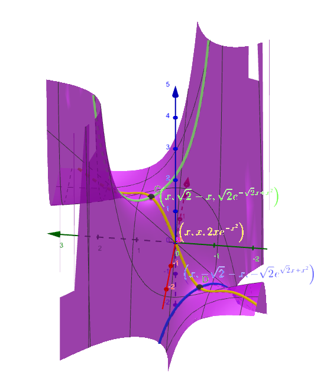
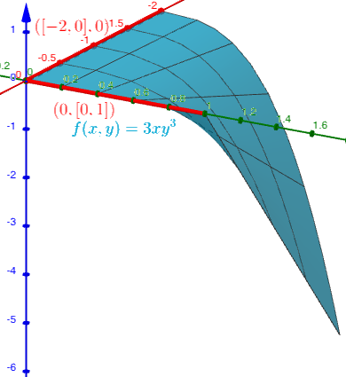

## 
Selected Exercise Solutions

from

### 
Lang, S., 1987. <i>Calculus of Several Variables, 3rd Edition.</i> Springer-Verlag UTM, New York
### 
Chapter 5: Maximum and Minimum
### 
&copy; 2019, 2025 by
### 
David Lawrence Goldsmith

for

## 
[SelectedSolutionsDotNet](https://olydlg.github.io/selectedsolutionsdotnet/)

<i>Note 1:  These solutions are provided "as-is," for informational purposes only, with no warranty of any kind, expressed or implied, including that of correctness, adequacy, and/or suitability for any purpose, whatsoever.</i> Corrections are welcome and should be emailed to selectedsolutionsdotnet@gmail.com.

### Symbols used:
$\begin{eqnarray}
\forall & = & \text{for all/each} \\
\exists & = & \text{there is/exists} \\
\nexists & = & \text{there is no/there does not exist} \\
\parallel & = & \text{(is) parallel (to)} \\
\perp & = & \text{(is) perpendicular (to)} \\
: & = & \text{such that} \\
\therefore & = & \text{therefore} \\
\because & = & \text{because} \\
\implies & = & \text{implies} \\
\iff & = & \text{if and only if} \\
\end{eqnarray}$ 

(We assume symbols from set theory, e.g., $\in, \subset, \cap, \cup,$ etc., are known to the reader from prior math courses.)

### _Section 1: Critical Points_

Find the critical points (c.p.) (and, per Exercise <b>14</b>, the extrema) of the following functions.

<b>4)</b> $f(x,y)=(x+y)e^{-xy}$

<b>Sln</b>: $\partial_xf = e^{-xy} -y(x+y)e^{-xy} = 0 \implies 1=y(x+y)\\ \partial_yf = e^{-xy}-x(x+y)e^{-xy}=0 \implies 1=x(x+y)$

$\implies x^2 = y^2 \therefore c.p. \subset \{(x,y): |x|=|y|\}$; but which? Using $y = x$ in the $\partial_xf$ equation, we obtain:

$1=2x^2 \implies x = (\pm\sqrt2)^{-1}=y$ (Check: $(\pm\sqrt2)^{-1}(\frac2{\pm\sqrt2}) = 1$ &check;) Using $y = -x$ in either equation, we obtain:

$1=0 \therefore$ the solution does not include ordered pairs of this form. Therefore, the c.p. are $\boxed{\left(\frac1{\sqrt2},\frac1{\sqrt2}\right)~\&~\left(-\frac1{\sqrt2},-\frac1{\sqrt2}\right)}$

Here’s a plot (made with William Jockusch’s EduCalc Pro on an iPhoneX) exhibiting the situation (the unit circle is added to affirm the magnitude of the c.p.):

__Extrema__: 
At this point in the text, we are instructed to assess "by inspection" whether or not c.p. are local extrema. Fortunately, I am doing this in 2019, when (good, free) 3-D graphing calculators are available&mdash;I made these with [GeoGebra](http://www.geogebra.org/). Here’s a graph of $f$ (purple) with the critical points indicated (in black), and tell-tale surface-curves (in yellow, blue, and green):

"By inspection," we can clearly see that the c.p. are "saddle" points, i.e., $\boxed{\text{neither maxima nor minima.}}$ (The c.p. which is the intersection of the green and yellow curves is a minimum on the green curve, but a maximum on the yellow curve, and thus it is neither with respect to the <i>surface</i>; and similarly-but-"opposite" for the other c.p.)
  

__6__) $f(x,y,z) = \cos(x^2+y^2+z^2)$

__Sln__: $\partial_xf = -2x\sin(x^2+y^2+z^2), \partial_yf = -2y\sin(x^2+y^2+z^2), \partial_zf = -2z\sin(x^2+y^2+z^2) \therefore$ the c.p. are $\boxed{\{(x,y,z): x^2+y^2+z^2=k\pi, k\text{ a (non-negative) integer}\}}$ (note that this includes the origin for $k=0$).

__Extrema__: We can’t really inspect a graph of $f$&mdash;that would require four dimensions&mdash;but we can "inspect" the function analytically. We know that the cosine function is inherently bounded ($-1 \le \cos t \le 1~\forall t \in \mathbb{R}$) so if $f$ attains either of those bounds on its domain (which in this case is all of $\mathbb{R}^3$) those must be local (and non-unique global) extrema. And indeed, at the c.p. $(x,y,z):x^2+y^2+z^2=2k\pi,~f = 1$, while at the c.p. $(x,y,z):x^2+y^2+z^2=(2k+1)\pi,~f = -1$, so $\boxed{\text{the former c.p. are local (and non-unique global) maxima,}}$ while $\boxed{\text{the latter are local (and non-unique global) minima.}}$
  

__10__) $f(x,y) = x\sin y$

__Sln__: $\partial_xf = \sin y, \partial_yf = x\cos y$. While $x\cos y$ can equal zero for $x=0$ or $y=(k+\frac12)\pi~ (k\in\mathbb{Z})$, at the latter $\partial_xf \ne 0 \therefore \boxed{(0,k\pi),~k\text{ an integer,}}$ are the (only) critical points of $f$.

__Extrema__: The following graph:

makes it evident that these c.p. are all saddle points, and thus $\boxed{\text{neither maxima nor minima.}}$
  

__12__) $f(x,y,z) = e^{-(x^2+y^2+z^2)}$

__Sln__: $\partial_xf = -2xf$ and similarly for $y, z$. $f \ne 0$ (ever) $\therefore (\partial_xf,\partial_yf,\partial_zf) = (0,0,0)$ only at $\boxed{(x,y,z) = (0,0,0).}$

__Extrema__: $f(0,0,0) = 1,$ and since $e^{-t}$ is strictly monotone decreasing, whereas $x^2+y^2+z^2 \ge 0~\forall (x,y,z) \in \mathbb{R}^3$ and $= 0$ only at $(0,0,0), \boxed{(0,0,0,1)\text{ is a unique global maximum}}$ of $f.$
  

### _Section 2: Boundary Points_

Find the extremal points of the following functions in the indicated regions.

__2__) __a__) $f(x,y,z) = x+y+z, \{(x,y,z): x^2+y^2+z^2 \lt 1\}$ and __b__) $g(x,y) = x+y, \{(x,y):x^2+y^2 \lt 1\}$

__Sln__: In both of these cases, the regions are open sets, so any extrema must occur within the interior of the region; however, at such, we must have all partial derivatives equal to zero, which never happens for these functions (the reader should be able to calculate the required partial derivatives of $f$ and $g$ in his/her head to confirm this). Therefore, these functions have $\boxed{\text{no extremal points}}$ in the given regions.
  

__3__) $f(x,y) = xy - (1-x^2-y^2)^{1/2}$ on $x^2+y^2 \le 1.$

__Sln__: Note that the domain, $D$, is a closed, bounded set, and that $f$ is continuous on $D$ (why?); therefore, by "Theorem 2" of this Section, $f$ must have both a maximum and a minimum (not necessarily unique) on $D$.

Switch to polar co-ordinates: $x=r\cos t, y = r\sin t, r \in [0,1], t \in [0,2\pi)$; then $f(x,y) = xy - (1-x^2-y^2)^{1/2}\rightarrow f(r,t) = r^2\cos t \sin t - \sqrt{1-r^2} = \frac12 r^2 \sin(2t) - \sqrt{1-r^2}$.

As discussed in this Section, let us first analyze the interior, $r \lt 1$. Therein, $\partial_r f = r\sin(2t) + r(1-r^2)^{-1/2}$, which is 0 for $r=0$ or $\sin(2t) = -(1-r^2)^{-1/2}$, but the latter condition is impossible for $0 \lt r\lt 1$ (why?); while $\partial_t f = r^2\cos(2t) = 0$ at $r=0$ or $t=\frac{\pi}4, \frac{3\pi}4, \frac{5\pi}4,~\&~\frac{7\pi}4$. Thus $r=0$ is the only point at which ___both___ partials equal zero, and this is the only interior critical point; at this point, $f=-1$, and no other interior point can be an extremum, for such would have to be a c.p., but there are no others.  

On the boundary, $r=1$ and we have $f(1,t) = g(t) = \frac12\sin(2t)$, which, in $[0,2\pi)$, twice attains a maximum value of $\frac12$&mdash;at $t=\frac{\pi}4~\&~t=\frac{5\pi}4$&mdash;and twice attains a minimum of $-\frac12$&mdash;at $t=\frac{3\pi}4~\&~t=\frac{7\pi}4$&mdash;so these are "candidates" for extrema. But we have already seen that the function attains the lower value of $-1$ on the interior, so the places where the boundary assumes the value of $-1/2$ can’t be minima. Since the interior has just the one c.p., where $f = -1 \lt 1/2$, it must be the minimum, and the boundary points where $f = 1/2$ must be the maxima.

In summary: $\boxed{(0,0,-1)\text{ is the (unique) absolute minimum}}$ while $\left(\cos \frac{\pi}4, \sin \frac{\pi}4, \frac12\right) = \boxed{\left(\frac1{\sqrt2},\frac1{\sqrt2},\frac12\right)~\&}~\left(\cos \frac{5\pi}4, \sin \frac{5\pi}4, \frac12\right) = \boxed{\left(-\frac1{\sqrt2},-\frac1{\sqrt2},\frac12\right)\text{ are the (non-unique) absolute maxima.}}$

Here’s a graph outlining $f$, highlighting its boundary, and exhibiting the extrema: 

  

__4__) $f(x,y) = x^3y^2(1-x-y), x \ge 0, y\ge0$

__Sln__: This one is interesting because if you start off by graphing it:

you ___may___ be deceived into thinking that the maximum is the zero value which occurs all along both axes; but that appearance is due to the fact that the default axes scales of most graphing calculators are such that, using said defaults, it is hard to distinguish this function’s positive values from zero! Thus this Exercise is an object lesson in precisely why analytic methods to approaching these kinds of problems are necessary.

Analyzing the interior first, we have: $\partial_xf = 3x^2y^2(1-x-y)-x^3y^2,~\partial_yf = 2x^3y(1-x-y)-x^3y^2$; setting these equal to zero and excluding $x=0, y=0$ we obtain the simultaneous linear equations:
$$4x+3y=3\\2x+3y=2$$ whose solution is $\boxed{x=\frac12, y=\frac13}$, at which $f = (\frac18)(\frac19)(\frac16) = \boxed{\frac1{432}} \doteq 0.00231$; and we thus see why, when a graphing calculator’s default scale is in units of 1, we might mistake this for zero!

Note that this is the only c.p. (excluding the $x$ and $y$ axes), first quadrant or not; this is significant because it means that, if this is an extremum, it is the only interior extremum. Further note that it is in the interior of the closed, bounded region defined by the inequalities $x \ge 0, y \ge 0, x+y \le 1$. Since $f$ is continuous in this region, it must attain both a maximum and a minimum therein. Since $f = 0$ on the boundary of this region, $\boxed{\text{this point must be the maximum.}}~$ Lastly, since $f \lt 0$ inside $x \ge 0, y \ge 0, x+y \gt 1$ but there are no critical points in this region, $f~\boxed{\text{cannot have a minimum}}$ in the closed-but-unbounded first quadrant. (Zero is the minimum value on the boundary of $x \ge 0, y \ge 0, x+y \le 1$, and it is the maximum value on $x \ge 0, y \ge 0, x+y \ge 1$, but it is neither a maximum nor a minimum with respect to the entire, closed first quadrant, which is what was asked for.)

Here is the same function, except vertically scaled such that the maximum value is mapped to 1:

  

__7__) Which of the following functions have a maximum and which have a minimum in the whole plane?

a) $f(x,y) = (x+2y)e^{-x^2-y^4}$

__Sln__: Buckle in, this one’s a doozie (I use the complex exponential in this one, so if you haven’t learned that yet, just skip that part; I also use the formula for the exact solutions of a cubic equation, which hopefully the reader knows exists, though I don’t expect s/he knows the formula by heart&mdash;I don’t; indeed, I used [Wolfram Alpha](https://www.wolframalpha.com/) to obtain the solution&mdash;so you can "take that on faith" as well; though at this stage in your math education, you should know how to approximate the solutions using a graphing calculator, e.g., [EduCalc](https://apps.apple.com/us/app/educalc-classic/id378009553) by William Jockusch, or [GeoGebra](https://www.geogebra.org/)).

We have: $\partial_x f = (1-2x^2-4xy)e^{-x^2-y^4} = 0 \implies 2x(x+2y) = 1; \partial_y f = (2-4xy^3-8y^4)e^{-x^2-y^4} = 0\implies 2y^3(x+2y) = 1$. Excluding $x+2y = 0$ (which would make both equations false anyway) we have that $x=y^3$; substituting this into $2x(x+2y) = 1$ yields the sixth order polynomial equation $2y^6 + 4y^4 - 1 = 0$, which, by means of the substitution $z=y^2$, we convert into the cubic $2z^3 + 4z^2 -1 = 0$. Graphing this (left to the reader; use technology) reveals three real zeros, only one of which is positive, which is the one we want since these actually equal $y^2$. Wolfram Alpha provides the positive exact solution as $z = \frac13\left[-2 + 2^{8/3}(-5+3i\sqrt{111})^{-1/3} + 2^{-2/3}(-5+3i\sqrt{111})^{1/3}\right]$ (it is certainly not immediately obvious that this is the positive one of the three exact solutions provided by Wolfram Alpha, but it’s the one that is noticeably different from the other two, and it is straightforward to show that it is positive using a calculator capable of performing complex number calculations, e.g., both calculators referenced above). Technically, this is all we need, but aesthetically, it would be nice if we could express this such that it is clearly real; this is accomplished by writing $-5+3i\sqrt{111}$ in polar form: $-5+3i\sqrt{111} = [(-5)^2 + (3\sqrt{111})^2]^{1/2}\exp[i\arg(-5,3\sqrt{111})] = 2^5\exp[i\arg(-5,3\sqrt{111})]$, where $\exp$ is the "natural" exponential function, $\arg$ is the (real-valued) complex argument function, and, for convenience, I’ve written the complex number $-5+3i\sqrt{111}$ in ordered pair form, $(-5,3\sqrt{111})$. Substituting this into the expression above for $z$, we obtain $z = \frac13 \left\{-2 + 2^{8/3}2^{-5/3}\exp\left[-\frac{\arg(-5,3\sqrt{111})}3 i\right] + 2^{-2/3}2^{5/3}\exp\left[\frac{\arg(-5,3\sqrt{111})}3 i\right]\right\} = \\  \frac13 \left\{-2 + 2\left[\exp\left(-\frac{\arg(-5,3\sqrt{111})}3 i\right) + \exp\left(\frac{\arg(-5,3\sqrt{111})}3 i\right)\right]\right\} = \text{ (using the identity }\cos x = \frac12[e^{ix} + e^{-ix}] \text{)}\\
\frac13 \left[-2 +4 \cos \left(\frac{\arg(-5,3\sqrt{111})}3\right)\right]$

which is "clearly" real (since $\arg$, as noted, is real-valued) and is $\doteq 0.451605963$.  Thus $y = \pm\sqrt z \doteq \pm 0.672016341$ and $\boxed{(y^3, y), (-y^3, -y)}$ are the two critical points of $f$.

The  following graph of $f$:

clearly shows that $\boxed{(y^3,y, (y^3+2y)e^{-y^6-y^4})\text{ is a (unique global) maximum}}$ and $\boxed{(-y^3,-y, (-y^3-2y)e^{-y^6-y^4})\text{ is a (unique global) minimum.}}$
  

c) $f(x,y) = \exp(x^2-y^2)$

__Sln__: $\partial_xf = 2x\exp(x^2-y^2) = 0 \implies x_{cp}=0,~\partial_yf = -2y\exp(x^2-y^2) = 0 \implies y_{cp} = 0$. Since $f$ is well-defined over the whole plane, and thus has no boundary, the critical point $(0,0)$ is the only possible extremum; the following graph of $f$ makes it clear that this point is a saddle point, i.e., neither a maximum nor a minimum:

  

e) $f(x,y) = (3x^2+2y^2)\exp(-4x^2-y^2)$

__Sln__: $\partial_xf = 6x\exp(-4x^2-y^2)-8x(3x^2+2y^2)\exp(-4x^2-y^2) = 0 \implies x=0 \text{ or } 4x^2+\frac83y^2=1$; $\partial_yf = 4y\exp(-4x^2-y^2)-2y(3x^2+2y^2)\exp(-4x^2-y^2) = 0 \implies y = 0 \text{ or } \frac32x^2+y^2 = 1$. Therefore the critical points are $(0,0), (0,\pm1),~\&~(\pm\frac12, 0)$. The following graph shows that $\boxed{(0,0,0)\text{ is a minimum;}}$ $\boxed{(0, \pm1, \frac2e)\text{ are (non-unique) maxima;}}$ and $\boxed{(\pm\frac12, 0, \frac3{4e})\text{ are saddle points}.}$ 

  

g) $f(x,y) = \left\{
    \begin{array} {1 1}
      \displaystyle \frac{x^2 + y^2}{|x|+|y|}&,   (x,y)\ne (0,0) \\
      0&,  (x,y) = (0,0)
    \end{array} \right.$
    
<b>Sln</b>: Ha-ha! Prof. Lang has given us one we can’t use Calculus on! Is it "cheating" to use a graph to help us figure it out? Certainly not: it’s the opposite, i.e., it’s being a good mathematician! So here’s such a graph:

which makes it pretty clear at a glance that the function is strictly non-negative, so its minimum is where it equals zero, which is at the origin and only at the origin (why?), and it has no maximum, i.e., is unbounded from above (we leave it to the reader to supply an "algebraic" argument justifying this second conclusion).
  

__8__) Find the point(s) on $\gamma(t) = (\cos t, \sin t, \sin(t/2))$ farthest from the origin.

__Sln__: Since distance from the origin&mdash;$\sqrt{x^2 + y^2 + z^2}$&mdash; is maximized when $x^2 + y^2 + z^2$ is, this problem is equivalent to maximizing $f(t) = \cos^2t + \sin^2t + \sin^2(t/2) = 1 + \sin^2(t/2)$ as a function of $t$, and thus we can use the methods of single-variable Calculus, including the second derivative test, to confirm that our candidate maximum is indeed a maximum. We have:

$f’(t) = 2\sin(t/2)(\cos(t/2))/2 = \frac12\sin t = 0 \implies t = k\pi, k \in \mathbb{Z}$ are the critical points of $f$; of these critical points, maxima occur when $f’’(t) = \frac12\cos(t) \lt 0$, i.e., for $t = (2k+1)\pi, k \in \mathbb{Z}$; however, since $\sin((2k+1)\pi/2) = \pm1$ depending on whether $(2k+1) \equiv 1 $ or $\equiv 3$(mod $4$), these values of $t$ result in two different points on the curve: $\boxed{(-1,0,1)~\&~(-1,0,-1)}$ (corresponding to $t = (4k + 1)\pi~\&~(4k-1)\pi, k \in \mathbb{Z}$, respectively). 

Here’s a graph of $\gamma(t)$ with the extremal points indicated in red:

  

__11__) Find the maximum of $f(x,y) = 3xy^3$ on $I = [-2,0] \times [0,1]$.

__Sln__: $\partial_xf = 3y^3 = 0$ when $y=0$, $\partial_yf = 9xy^2 = 0$ when $x=0$ or $y = 0$, so $f$ has no critical points in the interior of $I$, and thus no possible extrema therein; on the boundary of $I$, $f = 0$ on $\{(x,y): (-2 \le x \le 0, y = 0) \text{ or } (x = 0, 0 \le y \le 1)\}$, i.e., on the union of the $x$-axis between $-2$ and $0$, inclusive and the $y$-axis between $0$ and $1$, inclusive; but $f \lt 0$ on the rest of the boundary (why?); so on $I = [-2,0] \times [0,1],~f$ attains a maximum value of $\boxed{0}$ on $\boxed{\{(x,y): (-2 \le x \le 0, y = 0) \text{ or } (x = 0, 0 \le y \le 1)\}.}$ Here’s a picture:

  

### _Section 3: Lagrange multipliers_

4) Find the location $X_{min}$ and the value $f(X_{min})$ of the minimum of 
$$f(X) = (X-A)^2 + (X-B)^2 + (X-C)^2$$ where $A = (a_x, a_y, a_z), B = (b_x, b_y, b_z), C = (c_x, c_y, c_z)$ are (constant) $\in \mathbb{R}^3$ and $X = (x,y,z)$ is a (variable) $\in \mathbb{R}^3$.

<b>Sln</b>: I’m not sure why this problem is in this Section&mdash;it doesn’t appear to me to require explicit use of Lagrange multipliers&mdash;but I like to provide solutions to the ones that are more "theoretical," i.e., don’t involve actual numbers, so:

$f(X) = X^2 - 2A \cdot X + A^2 + X^2 - 2B \cdot X + B^2 + X^2 - 2C \cdot X + C^2 =$ $3X^2 - 2(A + B + C) \cdot X + A^2 + B^2 + C^2 \implies$ (hereafter the scalar product of vectors will be noted by simple juxtaposition, e.g., $AB = A \cdot B$) 
$\partial_xf = 6x - 2(a_x + b_x + c_x),~\partial_yf =  6y - 2(a_y + b_y + c_y),~\partial_zf =  6z - 2(a_z + b_z + c_z)$; setting these $= 0$ and solving for $(x, y, z) \implies \boxed{X_{cp} = \displaystyle\frac13(a_x + b_x + c_x, a_y + b_y + c_y, a_z + b_z + c_z) = \frac{(A+B+C)}3.}~\therefore\\f(X_{cp}) = \displaystyle\left(\frac{A+B+C}3-A\right)^2+\left(\frac{A+B+C}3-B\right)^2+\left(\frac{A+B+C}3-C\right)^2 \\= \displaystyle\left(\frac{B+C-2A}3\right)^2 + \left(\frac{A+C-2B}3\right)^2 + \left(\frac{A+B-2C}3\right)^2\\=
\displaystyle\frac{(4A^2+B^2+C^2-4AB-4AC+2BC) + (A^2+4B^2+C^2-4AB+2AC-4BC) + (A^2+B^2+4C^2+2AB-4AC-4BC)}9\\=
\displaystyle\frac{6A^2+6B^2+6C^2-6AB-6AC-6BC}{9}\\=
\boxed{\frac23(A^2+B^2+C^2-AB-AC-BC)}$ 

To see that this is a (global) minimum, consider $f(X) = f(X_{cp} + \epsilon),~\epsilon \in \mathbb{R}^3, \ne 0$. We have:

$\begin{eqnarray}
f(X_{cp}+\epsilon) & = & (X_{cp}-A +\epsilon)^2 & + & (X_{cp}-B +\epsilon)^2 & + & (X_{cp}-C +\epsilon)^2 \\
& = & (X_{cp}-A)^2 + 2\epsilon(X_{cp}-A) + \epsilon^2 & + & (X_{cp}-B)^2 + 2\epsilon(X_{cp}-B) + \epsilon^2 & + & (X_{cp}-C)^2 + 2\epsilon(X_{cp}-C) + \epsilon^2 \\
& = & f(X_{cp}) & + & 2\epsilon(3X_{cp}-(A+B+C)) & + & 3\epsilon^2 \\
& = & f(X_{cp}) & + & 2\epsilon(3\left(\frac{A+B+C}3\right)-(A+B+C)) & + & 3\epsilon^2 \\
& = & f(X_{cp}) & + & 0 & + & 3\epsilon^2 \implies \\
\end{eqnarray}$
$\because 3\epsilon^2 \gt 0 ~\forall \epsilon \in \mathbb{R}^3 \ne 0 \\
\boxed{f(X_{cp} + \epsilon) \gt f(X_{cp})~\forall \epsilon \in \mathbb{R}^3 \ne 0.}~~~\blacksquare$
  

__6__) Find the maximum of $f(x,y,z) = xyz$ subject to the constraints $xy + yz + xz = 2, x,y,z \ge 0$.

__Sln__: The $x,y,z \ge 0$ constraint implies that $f \ge 0$, and equals 0 only when any one of the three variables is zero (no two of the variables can simultaneously equal zero, for then the other constraint is violated). Recasting the other constraint as $g(x,y,z) = xy + yz + xz - 2 = 0$ and computing its gradient: $\nabla g = (y+z, x+z, x+y)$, we see that the restriction that no two of the variables can simultaneously be zero ensures that $\nabla g \ne O$ on $g=0$, as required to use the Lagrange multiplier method.

Thus an extremum, $P=(x_0,y_0,z_0)$, for $f$ satisfying $g$ must satisfy $\nabla f(P) = \lambda \nabla g(P)$ for some number $\lambda$. This gives us four simultaneous equations (we drop the subscript-zero for convenience):

$\begin{array} {}
yz = \lambda(y+z) \\
xz = \lambda(x+z) \\
xy = \lambda(x+y) \\
2 = xy + yz + xz \\
\end{array}$ 

to solve for $(x,y,z)$.  Adding the first three equations together and substituting the resulting right hand side in for the right hand side of the fourth equation yields: $x+y+z = \displaystyle\frac1{\lambda}$. Dividing the first equation through by $\lambda$ and $yz$ (the cases of $y=0$ or $z=0$ having already been disposed of above, we may assume that neither is zero) yields: $\displaystyle\frac1{\lambda} = \frac1y + \frac1z$; similarly, the second and third equations yield, respectively: $\displaystyle\frac1{\lambda} = \frac1x + \frac1z$ and $\displaystyle\frac1{\lambda} = \frac1x + \frac1y$. In this way we see that $\displaystyle\frac1x + \frac1y = \frac1y + \frac1z \implies x=z$, and we similarly find that $x=y$. Thus $\displaystyle\frac1{\lambda} = \frac2x = 3x \implies x = y = z = \sqrt\frac23$, i.e., $\boxed{P = \sqrt\frac23(1,1,1)}$, at which $\boxed{f = \left(\frac23\right)^{\frac32}.}$ 
  

__9__) Find the points on $z^2-xy=1$ nearest to the origin.

__Sln__: In other words, minimize $f(x,y,z) = x^2 + y^2 + z^2$, subject to $g(x,y,z) = z^2 - xy - 1 = 0$. First, we must find where $\nabla g = O$ to eliminate such points from consideration: $\nabla g = (-y, -x,2z) = (0,0,0) \implies (0,0,0)$ would be the only place where $\nabla g = O$, but this point does not lie on $g$, therefore we have no limitation on use of the method of Lagrange multipliers.

We seek $P=(x,y,z)$ and $\lambda : \nabla f(P) = \lambda \nabla g(P) \implies$

$\begin{array} {c c}
 2x = \lambda(-y) & (1) \\
 2y = \lambda(-x) & (2) \\
 2z = \lambda(2z) & (3) \\
 z^2-xy=1 & (4) \\
\end{array}$

Eq. (3) implies $\lambda = 1$ or $z = 0$.

Case $\lambda=1$: combining this with Eq.s (1) & (2) we obtain $2x = \frac{x}2 \implies x = 0$ and $2y = \frac{y}2 \implies y = 0$; Eq. (4) then implies $z=\pm 1$, and the minimum distance in this case is  $\sqrt{0^2 + 0^2 + (\pm 1)^2} = 1$, which occurs at $(0,0,\pm1)$.

Case $z=0$: in this case, from Eq.s (1) & (2) we obtain $x^2 = y^2 \implies x = \pm y$, while Eq. (4) tells us that $xy = -1$, so $x$ & $y$ must have opposite sign, i.e., $y = -x$; thus from Eq. (4) we get $-(x^2) = -1 \implies x = \pm 1 \implies y = \mp 1$; either way, the (square) distance from the origin is $(\pm1)^2 + (\mp1)^2 + 0 = 2$, so these points are farther from the origin than the points found for the $\lambda=1$ case.

Final result: $\boxed{P = (0,0,\pm1)}$ both of whose (minimal) distance from the origin is $\boxed{1}.$
  

__12__) Find the maximum and minimum points of $f(x,y,z) = x + y + z$ in $x^2 + y^2 + z^2 \le 1$.

__Sln__: Why do it for $1$ when we can just as easily do it for $a^2, a \in \mathbb{R}^+$? First, note that since $f$ has no critical points (why?), by Section 2, it must attain its extreme values on the boundary, $x^2 + y^2 + z^2 = a^2$, i.e., we are to find the extremal points of $f, P_{\pm}$, subject to the constraint $g(x,y,z) = x^2 + y^2 + z^2 - a^2 = 0$. $\nabla g = (2x,2y,2z) = (0,0,0)$ only at $(x,y,z) = (0,0,0)$, which isn’t on $g$, so our use of Lagrange multipliers is unrestricted.

We seek $(x,y,z) : \nabla f = \lambda \nabla g$ for some $\lambda$; this gives the system: $1 = 2\lambda x = 2\lambda y = 2\lambda z, x^2 + y^2 + z^2 = a^2$. The first three equations imply $x=y=z$; substituting this result into the fourth equation yields $3x^2 = a^2 \implies x = \pm \displaystyle \frac{a}{\sqrt3} = y = z$. Thus the __maximum__ of $\boxed{\sqrt3 a}$ occurs at $\boxed{\displaystyle\frac{a}{\sqrt3}(1,1,1)}$ and the __minimum__ of $\boxed{-\sqrt3 a}$ occurs at $\boxed{\displaystyle\frac{a}{\sqrt3}(-1,-1,-1)}$.
  

__15__) a) Find the extreme values of $f(x,y,z) = xyz$ subject to the constraint $x + y + z = 1$; b) Let $x,y,z$ be the respective amounts to be purchased of three products, each costing an equal amount per unit, with $xyz$ the utility function to be maximized, and a budget of \$1 million: how much should be spent on each product?

__Sln__: a) Lagrange multipliers aren’t necessary for this one (though it can be done using Lagrange multipliers, which is left to the reader); also, anticipating its usefulness for Part b) we will solve this for the constraint $x+y+z=a$, where we assume $a\gt0$. Subject to that constraint, $f(x,y,z) = f(x,y,a-x-y) = f_c(x,y) = xy(a-x-y);~$ so, $\partial_xf_c = y(a-x-y)-xy = y(a-2x-y) = 0 \implies y = 0$ or $y=a-2x$, $\partial_yf_c = x(a-x-y)-xy = x(a-x-2y) = 0 \implies x = 0$ or $x=a-2y$. Therefore, $f_c$ has four critical points: $(0,0), (0,a), (a,0)$, and $\displaystyle \left(\frac{a}3,\frac{a}3\right)$. Now, $f_c(0,0) = f_c(a,0) = f_c(0,a) = 0$, and $\displaystyle f_c\left(\frac{a}3,\frac{a}3\right) = \left(\frac{a}3\right)^3$; however, $f_c(a,a) = (a)^2(a-a-a) = -a^3 \lt 0$ (since we have assumed $a \gt 0$), so $0$ isn’t a minimum of $f_c$; likewise, $f_c(-a,-a) = (-a)^2(a-(-a)-(-a)) = 3a^3 \gt \displaystyle\left(\frac{a}3\right)^3$, so $\displaystyle \left(\frac{a}3\right)^3$ isn’t a maximum of $f_c$. Since $f_c$ is unbounded, its c.p. are the only places the "constrained" $f$ could have extrema, and since it doesn’t have extrema at any of those c.p., it has no extrema, maxima or minima, on its entire domain.$~~~\blacksquare$

b) Here, the situation is quite different, however, assuming the quantities to be purchased can’t be negative, i.e., the nature of the problem imposes the additional constraints $x,y,z \ge 0$. Let $c$ be the common unit cost of the three products; then the "cost constraint" is $x+y+z = \displaystyle\frac{1\text{E}6}c$ ($\displaystyle \le \frac{1\text{E}6}c$, actually, but we’ll assume&mdash;only for the sake of simplicity: one obtains the same answer either way, but the analysis is a little more "involved" without this assumption&mdash;that utility is maximized by spending all that we have to spend). Now the problem is exactly like Part a), with $\displaystyle a = \frac{1\text{E}6}c$, but the additional constraint limits consideration to just the first quadrant.

The key observation is that if $x+y \gt a,~x+y+z = a$ and $x, y \gt 0$, then $xyz = xy(a-x-y) = xy(a-(x+y)) \lt 0$, and we already know that there are "allowed" triples, e.g., $(0,0,a)$ which give a greater utility, namely, $(0)(0)(a) = 0$. Accordingly, we may further limit consideration to the triangle $x \ge 0, y \ge 0, x + y \le a$; and inside this triangle, all three factors in the constrained utility function, $x, y, (a - x - y)$, are greater than zero, thus the utility function is greater than zero, and thus we may further exclude the triangle’s boundary $x=0, y=0, a=x+y$ from consideration. (Why, exactly?)

Now recall that in Part a) we did find a critical point of our general constrained utility function, namely $\displaystyle\left(\frac{a}3,\frac{a}3\right)$, and note that it satisfies all of our current constraints and that $f \gt 0$ there, so this must be the location of our maximum. With $\displaystyle a = \frac{1\text{E}6}c$, the utility maximizing quantity of each product is thus $\displaystyle \frac{1\text{E}6}{3c}$ and the amount spent on each such product should be $\displaystyle c\frac{1\text{E}6}{3c} = \boxed{\frac{1\text{E}6}3}$. (If it seems like, perhaps in retrospect, we did a lot of work to arrive at a conclusion which we might have figured out "from symmetry," good instincts, but we would still have needed to ___prove___ that $\displaystyle \left(\frac{1\text{E}6}3, \frac{1\text{E}6}3\right)$ was the location of the maximum.) 
  

__18__) Maximize $f(x,y,z) = x-y^2-z^2/2$ subject to $g(x,y,z) = 2x^2 + 3y^2 - z = 0$.

__Sln__: $\nabla g(x,y,z) = (4x, 6y, -1) \ne O~\forall (x,y,z) \in \mathbb{R}^3$, so we seek $(x,y,z; \lambda) : \nabla f = (1,-2y,-z) = \lambda \nabla g = \lambda(4x,6y,-1) \implies$

$\begin{array} {c c c}
1 & = & 4\lambda x & (1) \\
-2y & = & 6\lambda y & (2) \\
-z & = & -\lambda & (3) \\
0 & = & 2x^2 + 3y^2 - z & (4)\\
\end{array}$

Eq. 2 $\implies y=0$ or $\lambda = \displaystyle -\frac13$; in the latter case, Eq. 1 $\implies x = \displaystyle -\frac34$ and Eq. 3 $\implies z = \displaystyle -\frac13$ and thence Eq. 4 gives $0=2(-3/4)^2 + 3y^2 + 1/3 \implies y \notin \mathbb{R}$, so we conclude that $y=0$. In that case Eq. 4 $\implies$ $2x^2 = z = \lambda = 1/(4x) \implies 8x^3 = 1 \implies \displaystyle x = \frac12 \implies z = \frac12$. Thus the maximum of $\displaystyle\frac12 - 0 - \frac18 = \boxed{\frac38}$ occurs at $\boxed{\left(\frac12,0,\frac12\right)}$.

Since we can solve the constraint for $z$, we can substitute that in to $f$ and obtain a constrained $f_c$ which we can graph to confirm:

  

__19__) Maximize $f(x,y,z) = -x^2+y-2z^2$ subject to the constraint $g(x,y,z)=x^4+y^4-z^2=0$.

__Sln__: With this one we do have to be a little careful because the point where $\nabla g = (4x^3,4y^3,-2z) = O$, i.e., $O$, is on the constraint, so the method of Lagrange multipliers is inconclusive if it yields that point as the location of an extremum. That noted, we proceed as usual: we seek $(x,y,z;\lambda): \nabla f = (-2x,1,-4z) = \lambda \nabla g \implies -2x=4\lambda x^3; 1=4\lambda y^3; -4z=-2\lambda z$ and the constraint. $-4z=-2\lambda z \implies \lambda = 2$ or $z=0$; if $z=0$, the constraint yields $x=y=0$ (why?), at which $f=0$, so we make a note of that and proceed to consider the case $\lambda=2$. In that case, $1=4\lambda y^3 \implies \displaystyle y=\frac12$ and $-2x=4\lambda x^3 \implies x=0$ (why?); substituting these into the constraint yields $\displaystyle z^2 = 0+\left(\frac12\right)^4$ and substituting all this into $f$
 yields $\displaystyle 0+\frac12-2\left(\frac1{16}\right) = \boxed{\frac38}$. Thus $f(0,0,0)=0$ can’t be a maximum; additionally, we can confirm our result by eliminating $z^2$ in $f$ and graphing:

 
  
 
__22__) Find the extrema of $f(x,y,z) = 2x^2+y^2+z^2$ on $g(x,y,z) = x^2+y^2+2z^2-2=0$.

__Sln__: $\nabla g \ne O$ on $g$ (why?) so we seek $(x,y,z;\lambda): \nabla f = (4x,2y,2z) = \lambda \nabla g = \lambda(2x,2y,4z) \implies$ $2x=\lambda x, y=\lambda y, z=2\lambda z$ along with the constraint $x^2+y^2+2z^2=2$. Now observe that the first three equations imply precisely one of: $\lambda = 2, y=z=0$; OR $\lambda = 1, x=z=0$; OR $\lambda = \frac12, x=y=0$. In the first case, the constraint yields $x^2=2 \implies f=4$; in the second case we get $y^2=2 \implies f=2$; in the last case $z^2=1 \implies f=1$. Thus the maximum of $f$ on $g$ is $\boxed{4}$ (which occurs at $(\pm\sqrt2,0,0)$) and the minimum of $f$ on $g$ is $\boxed{1}$ (which occurs at $(0,0,\pm1)$).
  

__23__) Find the minimum of $f(x,y,z) = x^2 + y^2 + z^2$ subject to the constraint $g(x,y,z) = ax+by+cz-d=0$, where at least one of $a,b,c \ne 0$.  

__Sln__: $\nabla g$ is never $O$, so we seek $(x,y,z;\lambda) : 2x = \lambda a, 2y = \lambda b, 2z = \lambda c,$ and $ax+by+cz=d$. Substituting the first three equations into the fourth yields: $\lambda(a^2+b^2+c^2)/2 = d \implies \lambda = 2d(a^2+b^2+c^2)^{-1}$, given that at least one of $a,b,c \ne 0$. Substituting this back into each of the first three equations gives the location of the minimum as $\displaystyle \frac{d}{a^2+b^2+c^2}(a,b,c)$ and substituting this result into $f$ yields the minimum value: $\displaystyle \frac{d^2(a^2+b^2+c^2)}{(a^2+b^2+c^2)^2} = \boxed{\frac{d^2}{a^2+b^2+c^2}}$. (Demonstration that this is indeed a minimum may be done as above for Exercise 4 of this Section and is left to the reader.) 
  

__27__) Minimize $f(x,y) = 11x+3y$ subject to the constraint $g(x,y)=-3x^2 +10xy -3y^2 - 80 = 0$.

__Sln__: The method of Lagrange multipliers yields, in addition to the constraint equation, the equations $11 = \lambda(-6x+10y)$ and $3 = \lambda(10x-6y) \implies\displaystyle \frac1{\lambda} = -\frac6{11}x+\frac{10}{11}y = \frac{10}3x-2y \implies -18x + 30y = 110x - 66y$ $\implies 3y=4x$. Substituting $y=\frac43x$ into the constraint equation gives $\displaystyle -3x^2+\frac{40}3x^2-3\left(\frac{16}{9}\right)x^2=80 \implies$ $15x^2 = 240 \implies$ $x^2 = 16 \implies x = 4$, since $x$ must be positive (why?) and $y=\frac43x$ immediately gives us $y=\frac{16}3$, for a final answer of $\boxed{4}$ units of A and $\boxed{\frac{16}3}$ units of B (and a minimal cost of $11(4)+3\left(\frac{16}3\right) = 60$).
 

### Credits

3D graphs generated with [GeoGebra](http://www.geogebra.org/).

### Please Donate:
<form action="https://www.paypal.com/cgi-bin/webscr"
          method="post"><input name="cmd"
            value="_xclick" type="hidden"> <input name="business"
            value="dgoldsmith_89@alumni.brown.edu" type="hidden"> <input
            name="item_name" value="SelectedSolutions Donation"
            type="hidden"> <input name="cn" value="Special Instructions
            (optional" type="hidden"> <input
            src="https://www.paypal.com/images/x-click-but04.gif"
            name="submit" alt="Make payments with PayPal - it's fast,
            free and secure!" align="middle" border="0" type="image"></form>

