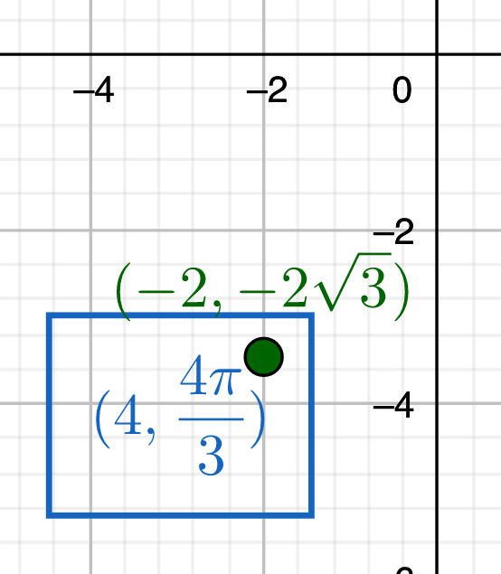
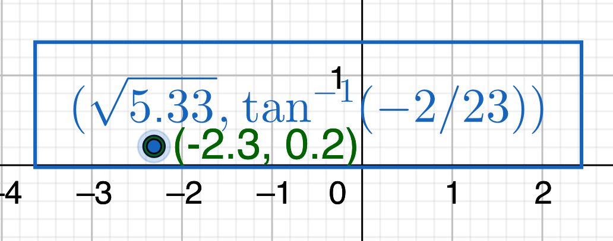
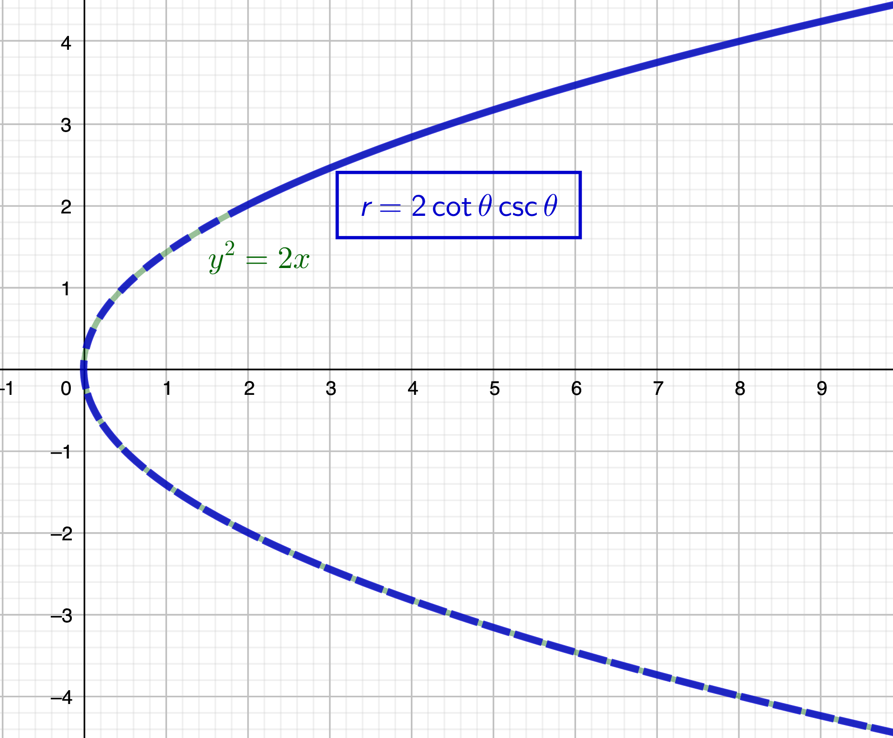
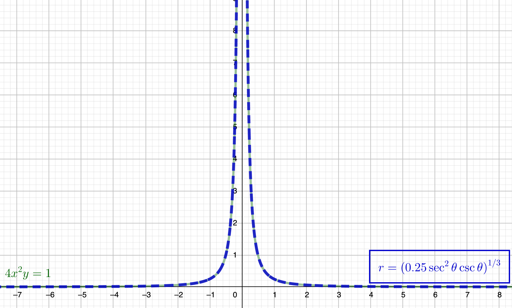
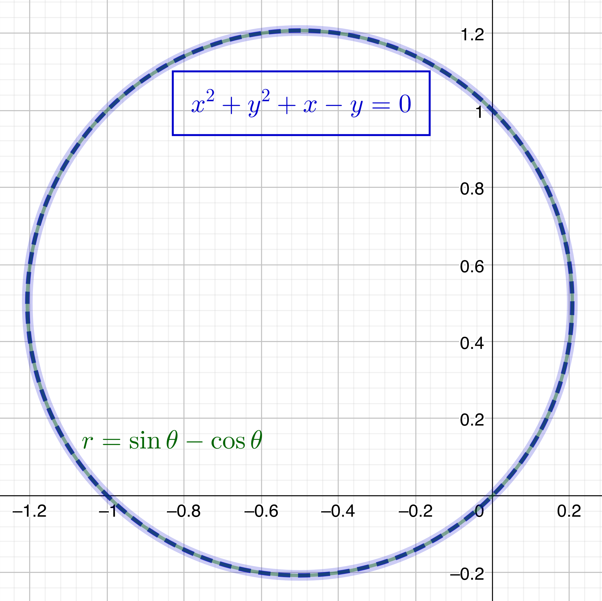
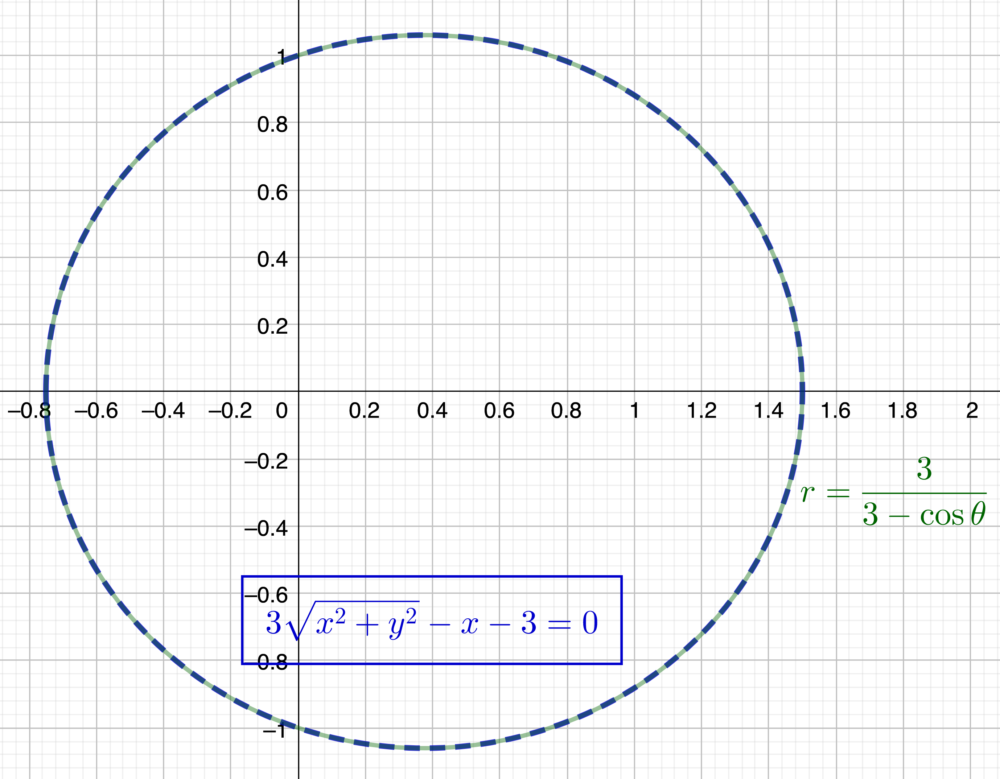

$\definecolor{red}{RGB}{255,0,0}
\definecolor{orange}{RGB}{245, 165, 0}
\definecolor{yellow}{RGB}{255,215,0}
\definecolor{green}{RGB}{0,255,0}
\definecolor{indigo}{RGB}{0,0,255}
\definecolor{violet}{RGB}{138,43,226}
\definecolor{black}{RGB}{0,0,0}$
$\require{cancel}$

#### 
Sullivan, M., 2012. <i>Algebra & Trigonometry, Ninth Edition.</i> Prentice Hall, Boston
#### 
Chapter 10, Section 1: Polar Coordinates
#### 
to be included in the main Chapter write up

__44__, __48__ \& __54__) Convert the given polar coordinates to rectangular coordinates.

__44__) $(5, 300^{\circ})_{\text{polar}}$

__Sln__: $x=5\cos(300^{\circ}) = \displaystyle 5\left(\frac12\right) = \frac52$, $y=5\sin(300^{\circ}) = \displaystyle 5\left(-\frac{\sqrt{3}}2\right) = -\frac{5\sqrt3}2$, so $(5, 300^{\circ})_{\text{polar}} = \boxed{\left(\frac52,-\frac{5\sqrt3}2\right)_{\text{rect}}}$
  

__48__) $(-3, -\frac{3\pi}4)_{\text{polar}}$

__Sln__: $x=-3\cos(-\frac{3\pi}4) = \displaystyle -3\left(-\frac{\sqrt{2}}2\right) = \frac{3\sqrt2}2$, $y=-3\sin(-\frac{3\pi}4) = \displaystyle -3\left(-\frac{\sqrt{2}}2\right) = \frac{3\sqrt2}2$ so $(-3, -\frac{3\pi}4)_{\text{polar}} = \boxed{\left(\frac{3\sqrt2}2,\frac{3\sqrt2}2\right)_{\text{rect}}}$
  

__54__) $(8.1, 5.2)_{\text{polar}}$

__Sln__: $x= 8.1\cos(5.2) \doteq 8.1(0.469) \doteq 3.795$, $y=8.1\sin(5.2) \doteq 8.1(-0.883) \doteq -7.156$ so $(8.1, 5.2)_{\text{polar}} = \boxed{(8.1\cos(5.2), 8.1\sin(5.2))_{\text{rect}} \doteq (3.795,-7.156)_{\text{rect}}}$
  

__62__ \& __66__) Convert the given rectangular coordinates to polar coordinates.

__62__) $(-2,-2\sqrt3)$

__Sln__: $r = \sqrt{(-2)^2 + (-2\sqrt3)^2} = \sqrt{4+12} = \sqrt{16} = 4$, $\theta = \tan^{-1}\frac{-2\sqrt3}{-2} + \pi$ ($+\pi$ because $(-2,-2\sqrt3)$ is in the third quadrant, but, by convention, the inverse tangent function gives a result between $-\frac{\pi}2$ and $\frac{\pi}2$) $=\tan^{-1}\sqrt3 + \pi = \frac{\pi}3 + \pi = \frac{4\pi}3$ so the polar coordinates are $$\boxed{(4,\frac{4\pi}3)}$$

  

__66__) $(-2.3, 0.2)$

__Sln__: $r=\sqrt{(-2.3)^2+(0.2)^2} = \sqrt{5.29+0.04} = \sqrt{5.33} \doteq 2.31$, $\theta = \tan^{-1}\frac{0.2}{-2.3} + \pi$  ($+\pi$ because $(-2.3,0.2)$ is in the second quadrant, etc.) $\doteq 3.05$ rad.; so the exact polar coordinates are $$\boxed{(\sqrt{5.33}, \tan^{-1}\left(-\frac2{23}\right)+\pi) \doteq (2.31,3.05\text{ rad.})}$$

  

__70__ \& __72__) Convert the rectangular coordinate equations to polar coordinates.

__70__) $y^2 = 2x$

__Sln__: $y^2 = 2x \implies (r\sin\theta)^2 = r^2\sin^2\theta = 2r\cos\theta \implies r(r\sin^2\theta-2\cos\theta) = 0 \implies r =0$ or $\displaystyle r=\frac{2\cos\theta}{\sin^2\theta} = 2\cot\theta\csc\theta.~$ Now, the solution $r=0$ is just one point, and that point is in the solution set of the other equation (for what value(s) of $\theta$?), so the equation $$\boxed{r=2\cot\theta\csc\theta}$$
includes every point included in $y^2=2x$, and is thus the polar form of that equation.

  

__72__) $4x^2y = 1$

__Sln__: $4x^2y = 1 \implies 4r^3\cos^2\theta\sin\theta=1 \implies \boxed{r = \left(\frac14\sec^2\theta\csc\theta\right)^{1/3}}$

  

__78__ \& __82__) Convert the polar coordinate equations to rectangular coordinates.

__78__) $r=\sin\theta-\cos\theta$

__Sln__: $r=\sin\theta-\cos\theta=\displaystyle \frac{y}r-\frac{x}r$; now note that $r\ne0~\forall \theta$ (why?), so we can multiply both sides by $r$ to give $r^2=x^2+y^2=y-x$ or $$\boxed{x^2+y^2+x-y = 0}$$

  

__82__) $\displaystyle r = \frac3{3 - \cos \theta}$

__Sln__: The denominator $\ne0~\forall\theta$ (why?) so we multiply through by it to obtain $3r-r\cos\theta = 3\sqrt{x^2+y^2} - x = 3$ or $$\boxed{3\sqrt{x^2+y^2} - x - 3 = 0}$$

  

__84__) Show that the distance between $P_1=(r_1,\theta_1)$ and $P_2 = (r_2,\theta_2)$ is: $$\sqrt{r_1^2 +r_2^2 - 2r_1r_2\cos(\theta_2-\theta_1)}.$$

__Pf__: In Cartesian coordinates, $P_{1,2}=(r_{1,2}\cos\theta_{1,2}, r_{1,2}\sin\theta_{1,2})$ so the distance between them is $\sqrt{(r_1\cos\theta_1-r_2\cos\theta_2)^2+ (r_1\sin\theta_1-r_2\sin\theta_2)^2} = $ 
$\sqrt{\color{red}r_1^2\cos^2\theta_1 \color{blue} -2r_1r_2\cos\theta_1\cos\theta_2 \color{purple}+r_2^2\cos^2\theta_2 \color{red}+r_1^2\sin^2\theta_1 \color{blue}-2r_1r_2\sin\theta_1\sin\theta_2 \color{purple}+r_2^2\sin^2\theta_2} = $ 
$\sqrt{\color{red}r_1^2(\cos^2\theta_1+\sin^2\theta_1)\color{purple}+r_2^2(\cos^2\theta_2+\sin^2\theta_2)\color{blue}-2r_1r_2(\cos\theta_1\cos\theta_2-\sin\theta_1\sin\theta_2)} =$
$$\sqrt{r_1^2+r_2^2-2r_1r_2\cos(\theta_2-\theta_1)}$$
$\blacksquare$
  

