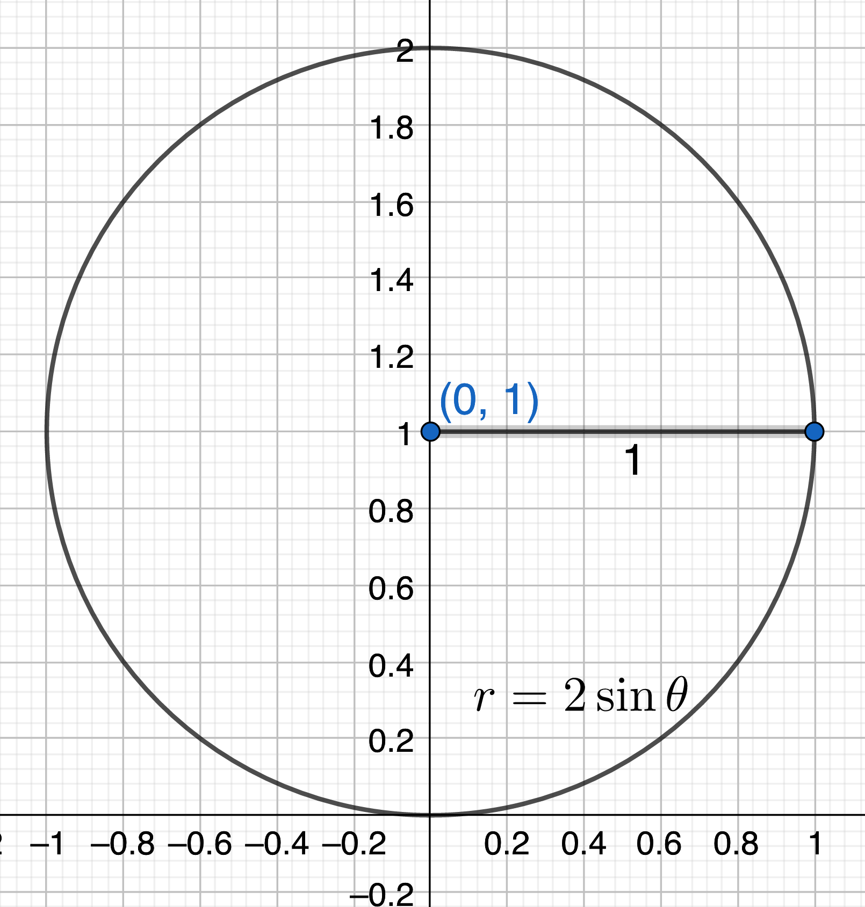
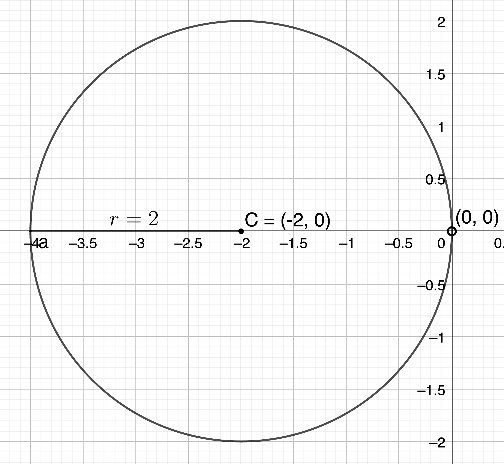
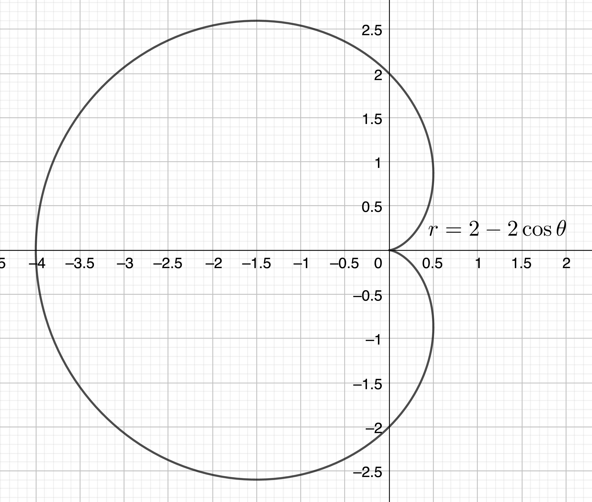
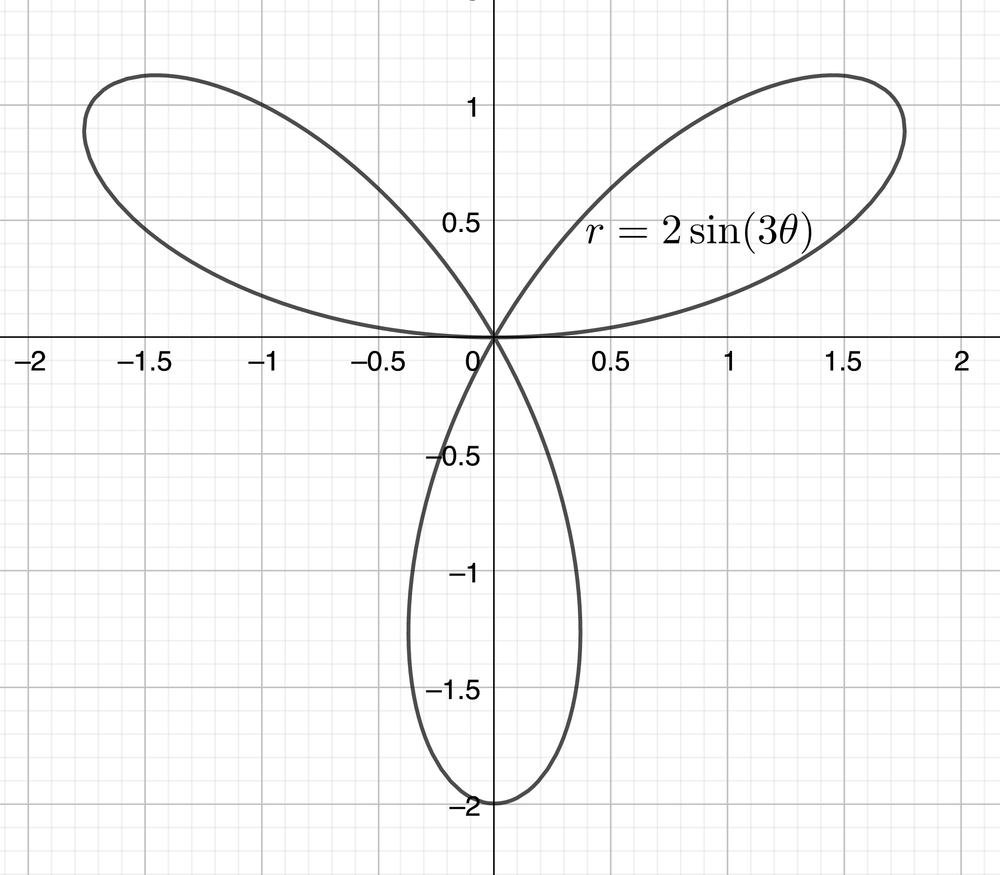
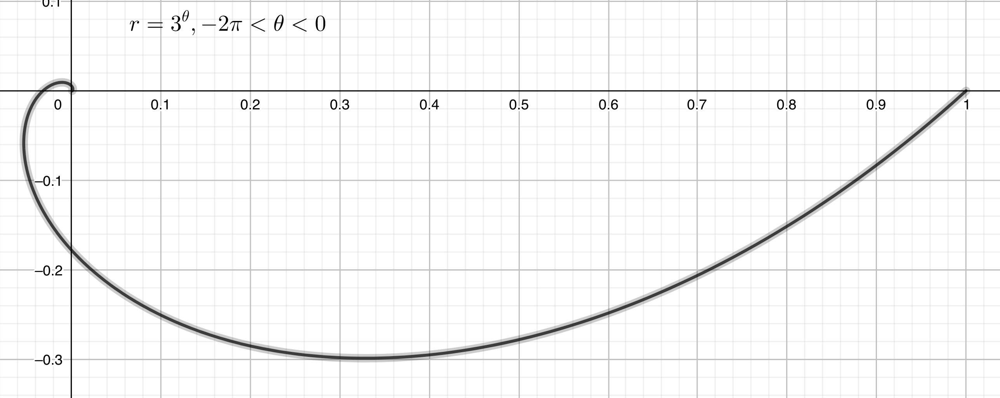
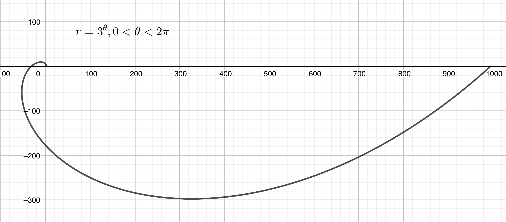

$\definecolor{red}{RGB}{255,0,0}
\definecolor{orange}{RGB}{245, 165, 0}
\definecolor{yellow}{RGB}{255,215,0}
\definecolor{green}{RGB}{0,255,0}
\definecolor{indigo}{RGB}{0,0,255}
\definecolor{violet}{RGB}{138,43,226}
\definecolor{black}{RGB}{0,0,0}$
$\require{cancel}$

#### 
Sullivan, M., 2012. <i>Algebra & Trigonometry, Ninth Edition.</i> Prentice Hall, Boston
#### 
Chapter 10, Section 2: Polar Equations and Graphs
#### 
to be included in the main Chapter write up

__22__ \& __28__) Transform each polar equation to an equation in rectangular coordinates, then identify and graph the equation.

__22__) $r = 2\sin \theta$

__Sln__: $r = 2\sin \theta \implies r=0, \theta=k\pi, k \in \mathbb{Z}$ or $r \ne 0, \sqrt{x^2+y^2}=\frac{2y}{\sqrt{x^2+y^2}} \implies x^2+y^2-2y+1=x^2+(y-1)^2=1$ which is a circle  of radius 1 and center $(0,1)$, which includes the point $r=0$:

  

__28__) $r \sec \theta= -4$

__Sln__: Note that: $r$ can’t equal zero (why, exactly?); $\theta$ can’t equal $\left(k+\frac12\right)\pi~\forall k \in \mathbb{Z}$ (ditto?); and for all other $\theta, \sec \theta \ne 0$.&nbsp; Consequently, our equation is equivalent to $r=-4\cos \theta, \theta \ne \left(k+\frac12\right)\pi~\forall k \in \mathbb{Z}$, which is equivalent to, in rectangular coordinates: $\sqrt{x^2+y^2} = \frac{-4x}{\sqrt{x^2+y^2}}, x \ne 0 \implies x^2+4x+y^2=0, x \ne 0$; completing the square in $x$: $x^2+4x+4+y^2=4=\boxed{(x+2)^2+y^2=2^2, x \ne 0}$, makes it clear that this is the circle of radius 2 centered at (-2,0), but excluding the point (0,0):

  

__40__, __50__, \& __56__) Identify and graph the given polar equation.

__Sln__: Identifying the graph (prior to simply graphing it with a graphing calculator) is basically a "matching game," i.e., we look for a match in the "catalog" of standard forms presented in this Section of the Chapter.&nbsp; To wit:

__40__) $r = 2 - 2 \cos \theta$

__Sln__: matches $r = a - a\cos \theta, a \gt 0$ for $a=2$ and thus is a cardoid:

  

__50__) $r = 2\sin(3\theta)$

__Sln__: matches $r = a\sin(3\theta), a \gt 0$ for $a=2$ and thus is a three-petal rose:

  

__56__) $r = 3^{\theta}$

__Sln__: matches $r = a^{\theta}, a \gt 0$ for $a=3$ and thus is a logarithmic spiral:

  
