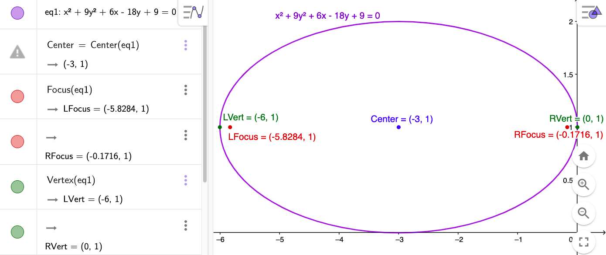

$\definecolor{red}{RGB}{255,0,0}
\definecolor{orange}{RGB}{245, 165, 0}
\definecolor{yellow}{RGB}{255,215,0}
\definecolor{green}{RGB}{0,255,0}
\definecolor{indigo}{RGB}{0,0,255}
\definecolor{violet}{RGB}{138,43,226}
\definecolor{black}{RGB}{0,0,0}$
$\require{cancel}$

#### 
Sullivan, M., 2012. <i>Algebra & Trigonometry, Ninth Edition.</i> Prentice Hall, Boston
#### 
Chapter 11, Section 3: The Ellipse
#### 
to be included in the main Chapter write up

Find the center, foci, vertices, and graphs of the following ellipses. 

__52__) $x^2 + 9y^2 + 6x - 18y + 9 = 0$

__Sln__: $x^2 + 9y^2 + 6x - 18y + 9 = 0 \implies x^2 + 6x \color{red}+ (6/2)^2$ $+~9(y^2-2y\color{blue}+(-2/2)^2$$)~= -9\color{red}+(6/2)^2\color{blue}+9(-2/2)^2$
$\implies (x+3)^2 + 9(y-1)^2 = 9$, which is equivalent to $\displaystyle \frac{(x-h)^2}{a^2} + \frac{(y-k)^2}{b^2} = 1$, with $\boxed{h= -3, k = 1, a=3, b=1}\implies$
$\boxed{\text{center} = (-3,1)}$; since $a\gt b, \boxed{\text{the major axis is parallel to the }x\text{-axis,}}$ so the $\boxed{\text{vertices} =(h\pm a,k) = (-6,1), (0,1)}$; $c^2 = a^2-b^2 = 9-1 = 8 \implies c = 2\sqrt2 \implies$ $\boxed{\text{foci} = (h\pm c, k) = (-3\pm2\sqrt2,1) \doteq(-5.828,1), (-0.172, 1)}$.  For the graph (and to check our results), we use GeoGebra:

  

