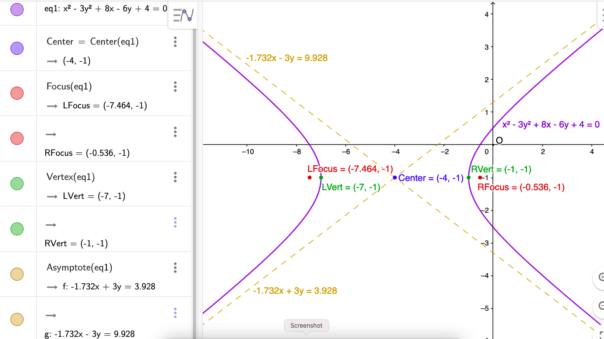

$\definecolor{red}{RGB}{255,0,0}
\definecolor{orange}{RGB}{245, 165, 0}
\definecolor{yellow}{RGB}{255,215,0}
\definecolor{green}{RGB}{0,255,0}
\definecolor{indigo}{RGB}{0,0,255}
\definecolor{violet}{RGB}{138,43,226}
\definecolor{black}{RGB}{0,0,0}$
$\require{cancel}$

#### 
Sullivan, M., 2012. <i>Algebra & Trigonometry, Ninth Edition.</i> Prentice Hall, Boston
#### 
Chapter 11, Section 4: The Hyperbola
#### 
to be included in the main Chapter write up

Find the center, transverse axis, vertices, foci, asymptotes, and graph each equation.

__62__) $x^2 - 3y^2 + 8x - 6y + 4 = 0$

__Sln__: $\implies x^2 + 8x \color{red}+ (8/2)^2$ $- 3(y^2 + 2y \color{blue}+ (2/2)^2$ $)~= -4 \color{red}+ (8/2)^2 \color{blue}- 3(2/2)^2$ $\implies (x+4)^2 - 3(y+1)^2 = 9 \implies$ $\displaystyle \frac{(x+4)^2}{3^2} - \frac{(y+1)^2}{(\sqrt3)^2} = 1$ which is equivalent to $\displaystyle \frac{(x-h)^2}{a^2} - \frac{(y-k)^2}{b^2} = 1$ with $\boxed{h=-4, k=-1, a=3, b=\sqrt3}\implies$ $\boxed{\text{center}=(-4,-1)}.~$ Since the negative sign is in front of the $y$ "term," the branches of the hyperbola open to the left and right, so the transverse axis is parallel to the $x$-axis, and since it must pass through the center, it must be the line $\boxed{y=-1}.~$ The vertices are the points where the graph intersects the transverse axis, i.e., the points on the graph with $y=-1$; substituting into the equation, we obtain: $(x+4)^2 = 9 \implies x+4 = \pm3\implies$ the $\boxed{\text{vertices are }(-7,-1)\text{ and }(-1,-1)}.~$ From the formula in Text Table 4, the foci are $(h\pm c,k),$ where $c = \sqrt{a^2+b^2} = \sqrt{12} = 2\sqrt3$ so the $\boxed{\text{foci are }(-4-2\sqrt3,-1) \doteq (-7.464,-1)\text{ and } (-4+2\sqrt3,-1) \doteq (-0.536, -1).}~$ Text Table 4 also gives the asymptotes as $\displaystyle y = \pm \frac ba
(x - h) + k = \boxed{\pm\frac{\sqrt3}3(x+4) -1}$, or, in standard form:$$\boxed{\sqrt3x \pm 3y = -4\sqrt3 \mp 3\doteq1.732x \pm 3y = -6.928 \mp 3}$$ As usual, we use GeoGebra for the graph/check:

  
