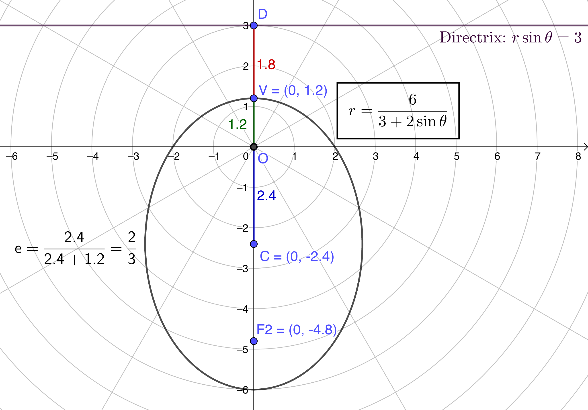
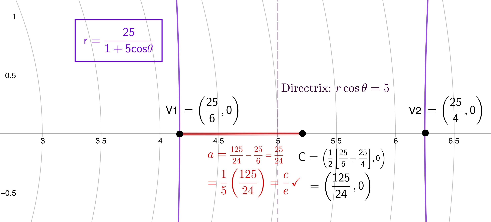

$\definecolor{red}{RGB}{255,0,0}
\definecolor{orange}{RGB}{245, 165, 0}
\definecolor{yellow}{RGB}{255,215,0}
\definecolor{green}{RGB}{0,255,0}
\definecolor{indigo}{RGB}{0,0,255}
\definecolor{violet}{RGB}{138,43,226}
\definecolor{black}{RGB}{0,0,0}$
$\require{cancel}$

#### 
Sullivan, M., 2012. <i>Algebra & Trigonometry, Ninth Edition.</i> Prentice Hall, Boston
#### 
Chapter 11, Section 7: Plane Curves and Parametric Equations
#### 
to be included in the main Chapter write up

## Section 7: Plane Curves and Parametric Equations

__38__, __40__, & __42__) In each these, find a polar equation for the specified conic, given that a pole is at the origin. 

__Sln__: In each of these--since it is given that a pole is the origin--the solution consists of a "matching game": one references text Table 5 (Chapter 11) to determine the kind of conic (based on the value of $e$), the precise form of the conic equation (based on the direction of the directrix), and the value of $p$ (based on the distance from the pole to the directrix.

__38__) $e=1$, directrix is parallel to the polar axis, two units below the pole.

__Sln__: $e=1$ implies parabola, directrix two units away from the pole implies $p=2$, and directrix parallel to the polar axis and below the pole implies the form is $\displaystyle r=\frac{ep}{1-e\sin\theta} =\frac{(1)(2)}{1-(1)\sin\theta} = \boxed{\frac2{1-\sin\theta}}$

 

__40__) $\displaystyle e=\frac23$, directrix parallel to the polar axis 3 units above the pole.

__Sln__: $\displaystyle e=\frac23$ implies ellipse with major axis perpendicular to the directrix, directrix 3 units away from the pole implies $p=3$, parallel to the polar axis and above the pole implies $\displaystyle r = \frac{ep}{1+e\sin\theta} = \frac{\frac23 (3)}{1-\frac23\sin\theta} = \frac33\frac{2}{1+\frac23\sin\theta} =$ $$\boxed{\frac6{3+2\sin\theta}}$$

 

__42__) $e=5$, directrix 5 units to the right of the pole, perpendicular to the polar axis.

__Sln__: $e=5$ implies hyperbola, with transverse axis perpendicular to the directrix, directrix 5 units away from the pole implies $p=5$, perpendicular to the polar axis and to the right of the pole implies $r=\frac{ep}{1+e\cos\theta} = \frac{(5)(5)}{1+5\cos\theta} =$ $$\boxed{\frac{25}{1+5\cos\theta}}$$

 
