

<link rel="stylesheet" href="../../Styles.css">
<title>Solutions of Selected Exercises from Sullivan, M. "Algebra & Trigonometry, 9th Ed. Chapter 3"</title>

$
\definecolor{red}{RGB}{255,0,0}
\definecolor{orange}{RGB}{245, 165, 0}
\definecolor{yellow}{RGB}{255,215,0}
\definecolor{green}{RGB}{0,255,0}
\definecolor{indigo}{RGB}{0,0,255}
\definecolor{violet}{RGB}{138,43,226}
\definecolor{black}{RGB}{0,0,0}
\newcommand{\ds}{\displaystyle}
\newcommand{\Frac}{\displaystyle \frac}
\newcommand{\box}{\boxed}
\newcommand{\chec}{\checkmark}
\newcommand{\blksq}{\blacksquare}
\require{cancel}
$

## 
 Selected Exercise Solutions

from

### 
Sullivan, M., 2012. <i>Algebra & Trigonometry, Ninth Edition.</i> Prentice Hall, Boston
### 
Chapter 3: Functions and Their Graphs 
### 
&copy; 2026 by
### 
[David Lawrence Goldsmith](https://www.linkedin.com/in/olydlg)

for

## 
[SelectedSolutionsDotNet](https://olydlg.github.io/selectedsolutionsdotnet/)

<i>Notes:  These solutions are provided &quot;as-is,&quot; for informational purposes only, with no warranty of any kind, expressed or implied, including that of correctness, adequacy, and/or suitability for any purpose, whatsoever.</i> Corrections are welcome and should be emailed to selectedsolutionsdotnet@gmail.com.

Purple font indicates clicking on the text will return you to your prior place; a $\blksq$ marks the end of a proof.
 

### Contents

<table>
  <tr>
   <th colspan=11>Section 1: Functions</th>
  </tr>
  <tr>
    <td><a href="#1.16">1.16</a></td>
    <td><a href="#1.20">1.20</a></td>
    <td><a href="#1.24">1.24</a></td>
    <td><a href="#1.30">1.30</a></td>
    <td><a href="#1.38">1.38</a></td>
    <td><a href="#1.42">1.42</a></td>
    <td><a href="#1.46">1.46</a></td>
    <td><a href="#1.50">1.50</a></td>
    <td><a href="#1.54">1.54</a></td>
    <td><a href="#1.58">1.58</a></td>
    <td><a href="#1.62">1.62</a></td>
  </tr>
  <tr>
    <td><a href="#1.66">1.66</a></td>
    <td><a href="#1.70">1.70</a></td>
    <td><a href="#1.74">1.74</a></td>
    <td><a href="#1.78">1.78</a></td>
    <td><a href="#1.82">1.82</a></td>
    <td><a href="#1.86">1.86</a></td>
    <td><a href="#1.90">1.90</a></td>
    <td><a href="#1.94">1.94</a></td>
    <td><a href="#1.98">1.98</a></td>
    <td><a href="#1.102">1.102</a></td>
    <td><a href="#1.105">1.105</a></td>
  </tr>
  <tr>
   <th colspan=10>Section 2: The Graph of a Function</th>
  </tr>
  <tr>
    <td><a href="#2.12">2.12</a></td>
    <td><a href="#2.16">2.16</a></td>
    <td><a href="#2.20">2.20</a></td>
    <td><a href="#2.24">2.24</a></td>
    <td><a href="#2.28">2.28</a></td>
    <td><a href="#2.30">2.30</a></td>
  </tr>
  <tr>
   <th colspan=10>Section 3: Properties of Functions</th>
  </tr>
  <tr>
    <td><a href="#3.24">3.24</a></td>
    <td><a href="#3.26">3.26</a></td>
    <td><a href="#3.30">3.30</a></td>
    <td><a href="#3.36">3.36</a></td>
    <td><a href="#3.40">3.40</a></td>
    <td><a href="#3.44">3.44</a></td>
    <td><a href="#3.46">3.46</a></td>
    <td><a href="#3.56">3.56</a></td>
    <td><a href="#3.60">3.60</a></td>
    <td><a href="#3.66">3.66</a></td>
  </tr>
  <tr>
    <td><a href="#3.70">3.70</a></td>
    <td><a href="#3.74">3.74</a></td>
    <td><a href="#3.76">3.76</a></td>
    <td><a href="#3.80">3.80</a></td>
    <td><a href="#3.88">3.88</a></td>
  </tr>
  <tr>
   <th colspan=10>Section 4: Library of Functions; Piecewise-defined Functions</th>
  </tr>
  <tr>
    <td><a href="#4.6">4.6</a></td>
  </tr>
  <tr>
   <th colspan=10>Section 5: Graphing Techniques: Transformations</th>
  </tr>
  <tr>
    <td><a href="#5.8">5.8</a></td>
  </tr>
  <tr>
   <th colspan=10>Section 6: Mathematical Models: Building Functions</th>
  </tr>
  <tr>
    <td><a href="#6.6">6.6</a></td>
  </tr>
</table>

## Section 1: Functions

__16__, __20__, and __24__) State whether the given relation is a function and if it is, state the domain and the range.

<a name="1.16" class="goback" onclick="winhisback()">__1.16__</a>)
$\{$(Bob, Beth), (Bob, Diane), (John, Linda), (Chuck, Marcia)$\}$

__Sln__: 
  

<a name="1.20" class="goback" onclick="winhisback()">__1.20__</a>)
$\{(-2,5), (-1,3), (3, 7), (4, 12)\}$

__Sln__: 
  

<a name="1.24" class="goback" onclick="winhisback()">__1.24__</a>)
$\{(-4, 4), (-3, 3), (-2, 2), (-1, 1), (-4, 0)\}$

__Sln__: 
  

__30__ and __38__) State whether the given equation defines $y$ as a function of $x.$

<a name="1.30" class="goback" onclick="winhisback()">__1.30__</a>)
$y = \lvert x \rvert$

__Sln__: 
  

<a name="1.38" class="goback" onclick="winhisback()">__1.38__</a>)
$x^2 - 4y^2 = 1$

__Sln__: 
  

__42__ and __46__, d-h) For the given function, evaluate $f(-x), -f(x), f(x+1), f(2x), f(x+h).$ 

<a name="1.42" class="goback" onclick="winhisback()">__1.42__</a>)
$f(x) = \Frac{x^2 - 1}{x + 4}$

__Sln__: 
  

<a name="1.46" class="goback" onclick="winhisback()">__1.46__</a>)
$f(x) = 1 - \Frac1{(x + 2)^2}$

__Sln__: 
  

__50__, __54__, __58__, and __62__) State the (&quot;natural&quot;) domain of the given function.

<a name="1.50" class="goback" onclick="winhisback()">__1.50__</a>)
$f(x) = \Frac{x^2}{x^2 + 1}$

__Sln__: 
  

<a name="1.54" class="goback" onclick="winhisback()">__1.54__</a>)
$G(x) = \Frac{x + 4}{x^3 - 4x}$

__Sln__: 
  

<a name="1.58" class="goback" onclick="winhisback()">__1.58__</a>)
$f(x) = \Frac{x}{\sqrt{x - 4}}$

__Sln__: 
  

<a name="1.62" class="goback" onclick="winhisback()">__1.62__</a>)
$h(z) = \Frac{\sqrt{z + 3}}{z - 2}$

__Sln__: 
  

<a name="1.66" class="goback" onclick="winhisback()">__1.66__</a>)
For $f(x) = 2x^2 + 3;~~~g(x) = 4x^3 + 1$ evaluate __a__) $(f + g)(x)$, __c__) $(f \cdot g)(x)$, __e__) $(f + g)(3)$, __g__) $(f \cdot g)(2)$, and state the natural domain for __a__ and __c__.

__Sln__:
  

<a name="1.70" class="goback" onclick="winhisback()">__1.70__</a>)
For $f(x) = \sqrt{x - 1};~~~g(x) = \sqrt{4 - x}$ evaluate __b__) $(f - g)(x)$, __d__) $\left(\Frac fg \right)(x)$, __f__) $(f - g)(4)$, __h__) $\left(\Frac fg \right)(1)$, and state the natural domain for __b__ and __d__.

__Sln__:
  

<a name="1.74" class="goback" onclick="winhisback()">__1.74__</a>)
Given $f(x) = \Frac1x$ and $\left(\Frac fg\right)(x) = \Frac{x + 1}{x^2 - x},$ what is $g(x)$?

__Sln__: 
  

__78__ and __82__) For $f(x)$ as given, evaluate and simplify $\Frac{f(x + h) - f(x)}h$ (assuming $h\ne 0$).

<a name="1.78" class="goback" onclick="winhisback()">__1.78__</a>)
$f(x) = 3x^2 - 2x + 6$

__Sln__: 
  

<a name="1.82" class="goback" onclick="winhisback()">__1.82__</a>)
$f(x) = \sqrt{x + 1}$

__Sln__: 
  

<a name="1.86" class="goback" onclick="winhisback()">__1.86__</a>)
If $f(x) = \Frac{2x - B}{3x + 4}$ and $f(2) = \Frac12$, what is the value of $B$?

__Sln__:
  

<a name="1.90" class="goback" onclick="winhisback()">__1.90__</a>)
Express the area $A$ of an isosceles right triangle as a function of the length $x$ of one of the two equal sides.

__Sln__:
  

<a name="1.94" class="goback" onclick="winhisback()">__1.94__</a>)
The function $N(r) = -1.44r^2 + 14.52r - 14.96$ represents the number $N$ of housing units (in millions) that have $r$ rooms, $r$ an integer between 2 and 9, inclusive.&nbsp; __a__) Identify the dependent and independent variables; __b__) Evaluate $N(3)$ and provide a verbal explanation of the meaning of $N(3).$

__Sln__: 
  

<a name="1.98" class="goback" onclick="winhisback()">__1.98__</a>)
The cross-sectional area of a beam cut from a log with a radius of 1 foot is given by the function $A(x) = 4x\sqrt{1-x^2},$ where $x$ represents the length, in feet, of half the base of the beam; see the figure.&nbsp; Determine the cross-sectional area of the beam if the length of half the base of the beam is: __a__) one-third of a foot; __b__) one-half of a foot; __c__) two-thirds of a foot.

__Sln__: 
  

<a name="1.102" class="goback" onclick="winhisback()">__1.102__</a>)
Suppose that $I(x)$ represents the income of an individual in year $x$ before taxes and $T(x)$ represents that individual’s tax bill in year $x$: determine a function $N$ that
represents that individual’s net income (income after taxes) in year $x.$

__Sln__: 
  

<a name="1.105" class="goback" onclick="winhisback()">__1.105__</a>)
Some functions $f$ have the property that $f(a + b) = f(a) + f(b)$ for all real numbers $a$ and $b$: which of the following functions have this property?
__a__) $h(x) = 2x$;$~~~~$ __b__) $g(x) = x^2$;$~~~~$ __c__) $F(x) = 5x - 2$;$~~~~$ __d__) $G(x) = \Frac1x$

__Sln__: 
  

## Section 2: The Graph of a Function

__12__, __16__, and __20__) Determine whether the given graph is that of a function by using the vertical-line test; if it is, use the graph to find: __a__) the domain and range; __b__) the intercepts, if any; and __c__) any symmetry with respect to the x-axis, the y-axis, or the origin.

<a name="2.12" class="goback" onclick="winhisback()">__2.12__</a>)

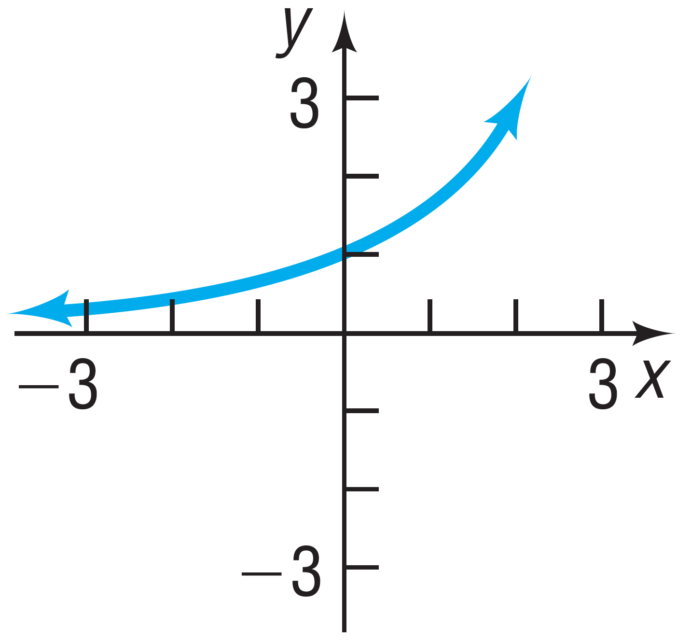

__Sln__: 
  

<a name="2.16" class="goback" onclick="winhisback()">__2.16__</a>)

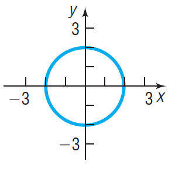

__Sln__: 
  

<a name="2.20" class="goback" onclick="winhisback()">__2.20__</a>)

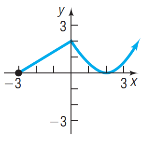

__Sln__: 
  

__24__ and __28__) Answer the questions about the given function.

<a name="2.24" class="goback" onclick="winhisback()">__2.24__</a>)
$f(x) = -3x^2 + 5x$ __a__) Is the point $(-1,2)$ on the graph of $f$? __b__) If $x=-2$ what is $f(x)$, and what point is on the graph of $f$? __c__) If $f(x) = -2$, what is $x$, and what point(s) are on the graph of $f$? __d__) What is the domain of $f$? __e__) What are the $x$&#8209;intercepts, if any, of the graph of $f$? __f__) What are the $y$&#8209;intercepts, if any, of the graph?

__Sln__: 
  

<a name="2.28" class="goback" onclick="winhisback()">__2.28__</a>)
$f(x) = \Frac{2x}{x-2}$ __a__) Is the point $\left(\Frac12,-\Frac23\right)$ on the graph of $f$? __b__) If $x=4$ what is $f(x)$, and what point is on the graph of $f$? __c__) If $f(x) = 1$, what is $x$, and what point(s) are on the graph of $f$? __d__) What is the domain of $f$? __e__) What are the $x$&#8209;intercepts, if any, of the graph of $f$? __f__) What are the $y$&#8209;intercepts, if any, of the graph?

__Sln__: 
  

## Section 3: Properties of Functions

__24__ and __26__) Use the pictured graph to __a__) identify the intercepts (if any); __b__) the domain and range; __c__) the intervals on which the function is increasing, decreasing, or constant; and __d__) whether is even, odd, or neither.

<a name="3.24" class="goback" onclick="winhisback()">__24__</a>) 

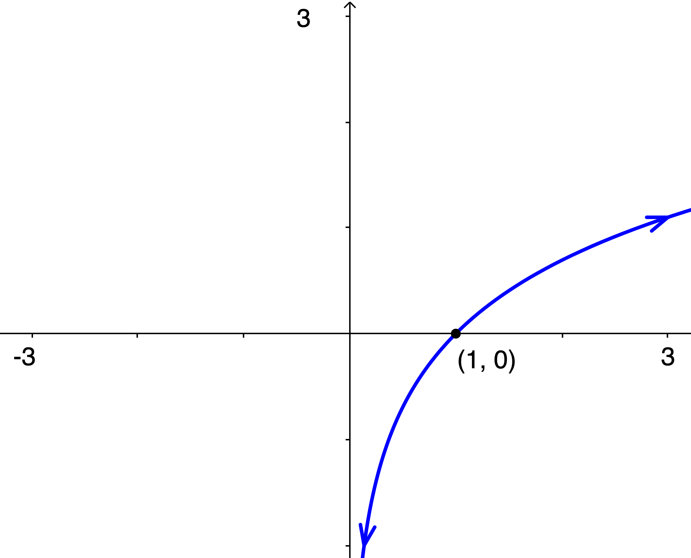

__Sln__: The arrows are "almost everything" in this problem: by convention, they imply that the function "goes down forever" to the left and "goes up forever" to the right, i.e., the range is all real numbers.&nbsp; Also by convention, if this function had a $y$&#8209;intercept, it would be shown, thus the fact that a $y$&#8209;intercept isn’t shown is understood to mean that it doesn’t have one; additionally, the fact that the left arrow indicates that the curve continues to the left as it goes down, together with the fact that it never intersects the $y$&#8209;axis, imply that the function is well-defined for ___positive___ $x$, no matter how small in absolute value, i.e., "arbitrarily close" to zero (just not zero itself, and definitely not for any negative $x$).&nbsp; Combining this with our  observation above about the right arrow, we conclude that the domain is all (strictly) positive real numbers, and that __a__) the only $x$&#8209;intercept is $\box{(1,0)}$ and there are no $y$&#8209;intercepts; __b__) $\box{\text{the domain is }\{x: x \gt 0\} = (0,\infty) \text{ in interval notation,}}$ and $\box{\text{the range is }\mathbb{R} = (-\infty,\infty)\text{ in interval notation.}}~$ __c__) As we go from left to right, the graph is always increasing, so the function is $\box{\text{increasing on its entire domain, i.e., on } (0,\infty).}~$ __d__) Since the function isn’t even defined for negative $x$, it is (trivially) $\box{\text{neither even nor odd}.}$  
  

<a name="3.26" class="goback" onclick="winhisback()">__26__</a>) 

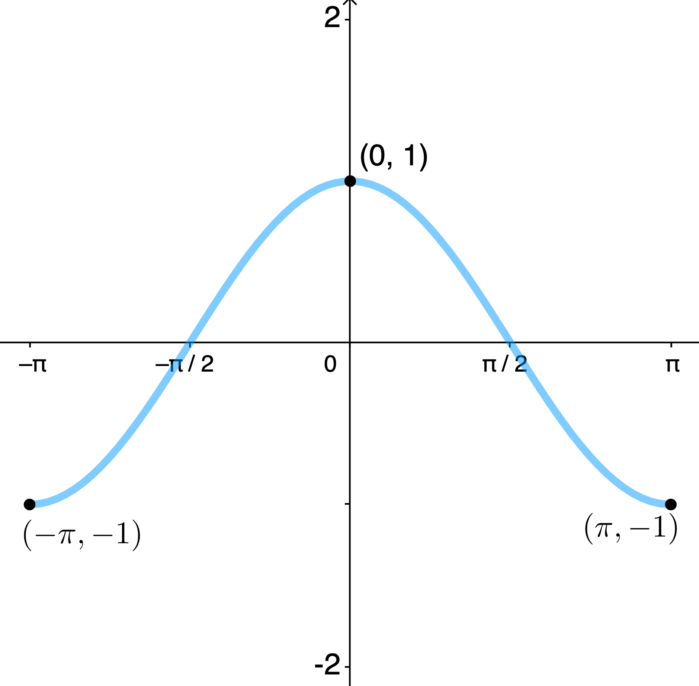

__Sln__: __a__) The graph has a clearly-indicated $\boxed{y\text{-intercept of }(0,1)}$ and implied $\boxed{x\text{-intercepts at }\left(-\frac{\pi}2,0\right)\text{ and }\left(\frac{\pi}2,0\right).}~$ __b__) Its domain is $\boxed{[-\pi,\pi]}$ (i.e., all real numbers between $-\pi$ and $\pi$, inclusive) and its range is $\boxed{[-1,1]}$ (all real numbers between $-1$ and $1$, inclusive).&nbsp; __c__) It is increasing on the open interval $\boxed{(-\pi,0)}$ and decreasing on the open interval $\boxed{(0,\pi)}.~$ __d__) It is symmetric with respect to the $y$-axis, so it is an $\boxed{\text{even}}$ function. 
  

<a name="3.30" class="goback" onclick="winhisback()">__30__</a>) Use the graph of $f(x)$ below to find: __a__) the values, if any, at which $f$ has a local maximum value and state what those local maximum values are; and __b__) same for local minimum values.

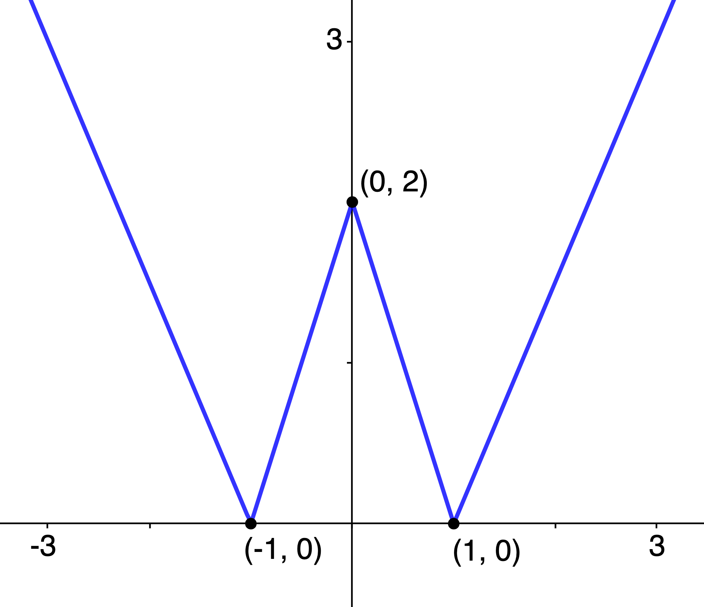

__Sln__: __a__) At $\boxed{x=0}$, $f$ has a local $\boxed{\text{maximum of }2}$; and __b__) at both $\boxed{x=-1\text{ and }x=1}$, $f$ has the same local $\boxed{\text{minimum of }0.}$
  

In Problems __36__, __40__, and __44__, determine algebraically whether the given function is even, odd, or neither.

<a name="3.36" class="goback" onclick="winhisback()">__36__</a>) $h(x) = 3x^3 + 5$

__Sln__: $h(-x) = 3(-x)^3 + 5 = -3x^3+5 \ne 3x^3+5$ (in general), so $h$ is not even; nor does it equal $-h(x) = -3x^3-5$ (in general), so it is not odd, so it is $\boxed{\text{neither.}}$
  

<a name="3.40" class="goback" onclick="winhisback()">__40__</a>) $f(x) = \sqrt[\large3]{2x^2 + 1}$

__Sln__: $f(-x) = \sqrt[\large3]{2(-x)^2 + 1} = \sqrt[\large3]{2x^2 + 1} = f(x)$ for all $x$, so $f$ is $\boxed{\text{even.}}~$ (Note: we don’t need to check for odd-ness because a function can’t be both even and odd; proof?) 
  

<a name="3.44" class="goback" onclick="winhisback()">__44__</a>) $\ds F(x) = \frac{2x}{|x|}$

__Sln__: $\ds F(-x) = \frac{2(-x)}{|-x|} = \frac{-2x}{|x|} = -\frac{2x}{|x|} = -F(x)$ for all $x$ so $F$ is $\boxed{\text{odd.}}$
  

<a name="3.46" class="goback" onclick="winhisback()">__46__</a>) Use the graph of $f(x)$ below to find its absolute maximum and absolute minimum, if they exist.

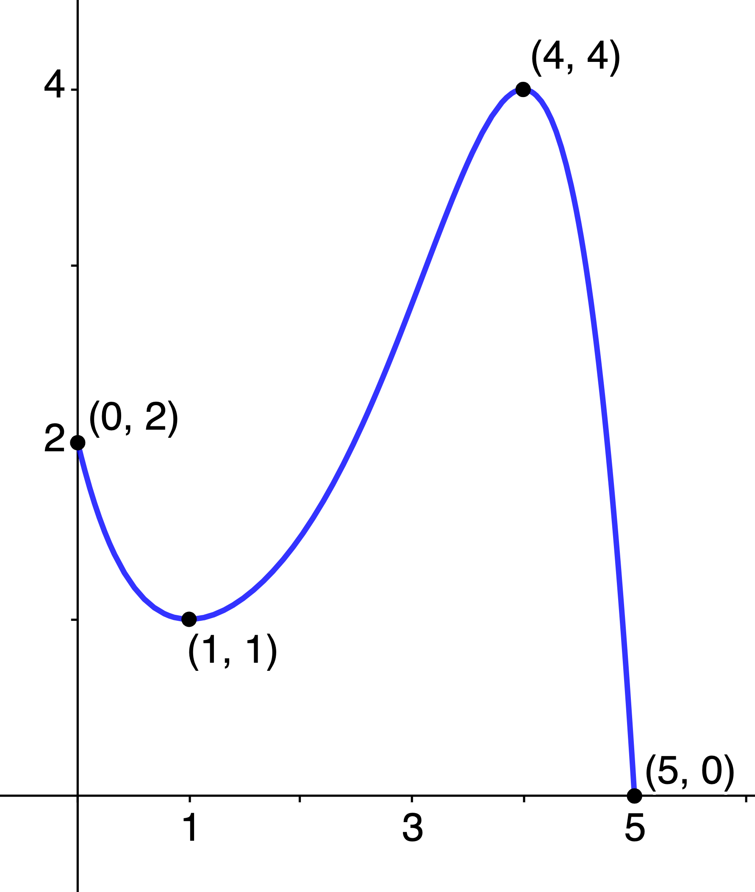

__Sln__: The absolute maximum of a function, if there is one, is the function value, not necessarily unique, closest to &quot;positive infinity&quot; of all its relative maxima.&nbsp; From the graph we see that $f$ has relative maxima of $2$ at $x=0$ and $4$ at $x=4$; since $4 \gt 2,$ the absolute maximum of of $f$ is $\box{4},$ which occurs at $\box{x=4}$ (it is just a coincidence that the maximum value equals the $x$&#8209;coordinate of where it occurs: generally, this will not be the case).&nbsp; Similarly, the absolute minimum, if there is one, is the function value, not necessarily unique, closest to &quot;negative infinity&quot; of all the function’s relative minima.&nbsp; Again, the graph tells us this $f$ has relative minima of $1$ at $x=1$ (again, just a coincidence) and $0$ at $x=5$; since $0 \lt 1$, $\box 0$ is the absolute minimum, occurring at $\box{x= 5.}$
  

In Problems __56__ and __60__, use a graphing utility to graph each function over the indicated interval and approximate any local maximum values and local minimum values.&nbsp; Determine where the function is increasing and where it is decreasing.&nbsp; Round answers to two decimal places.

<a name="3.56" class="goback" onclick="winhisback()">__56__</a>) $f(x) = x^4 - x^2,~(-2, 2)$

__Sln__: The figure below, created using [GeoGebra](https://www.geogebra.org/calculator), includes in the left panel the inputs required to generate the graph and labeling shown in the right panel.

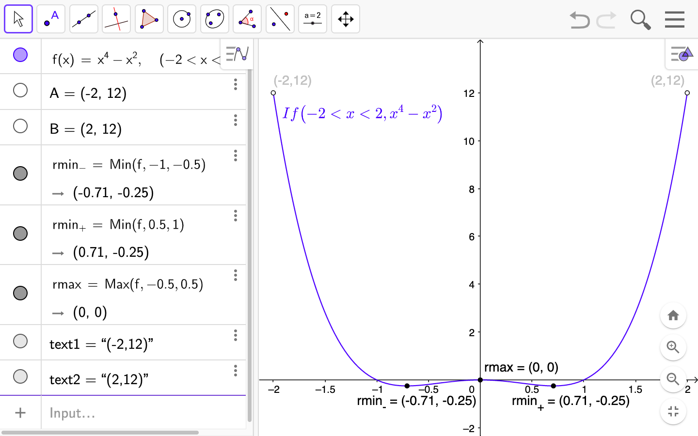

The function has $\box{\text{a local minimum of }-0.25\text{ at }x \doteq \pm0.71}$ and $\box{\text{a local maximum of }0\text{ at }x=0}$ (i.e., at the origin).&nbsp; By inspection, the function is $\box{\text{decreasing on the open intervals }-2 \lt x \lt -0.71 \text{ and } 0 \lt x \lt 0.71}$ and $\box{\text{increasing on the open intervals }-0.71 \lt x \lt 0 \text{ and } 0.71 \lt x \lt 2}.$ 
  

<a name="3.60" class="goback" onclick="winhisback()">__60__</a>) $f(x) = -0.4x^4 - 0.5x^3 + 0.8x^2 - 2,~(-3, 2)$

__Sln__:

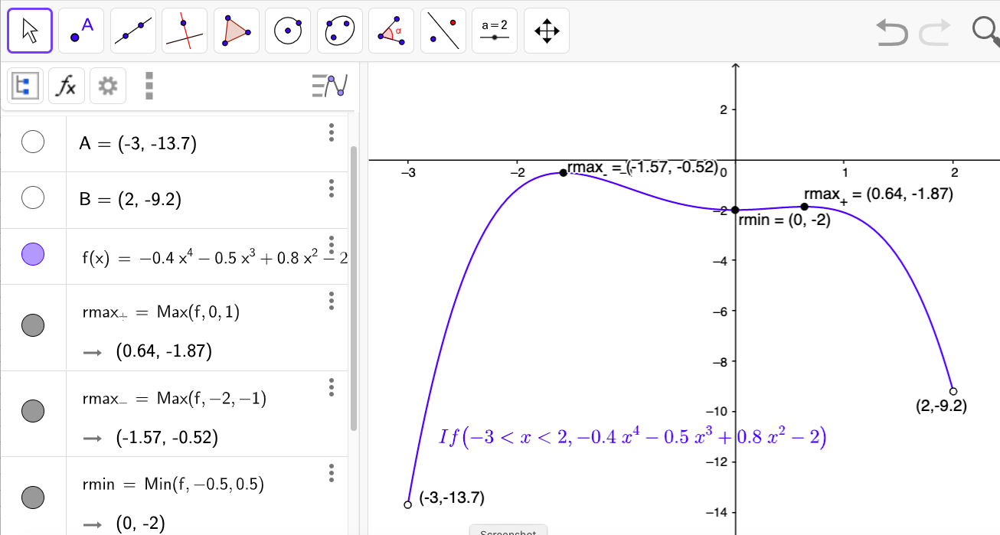

The function has two local maxima&mdash;one $\box{\doteq -0.52\text{ at }x \doteq -1.57}$ and one $\box{\doteq -1.87\text{ at }x \doteq 0.64}$ (note that maxima don’t need to be positive)&mdash;and one local minimum of $\box{-2 \text{ at } x=0}$.&nbsp; By inspection, the function is $\box{\text{increasing on the open intervals }-3 \lt x \lt -1.57 \text{ and } 0 \lt x \lt 0.64}$ and $\boxed{\text{decreasing on the open intervals }-1.57 \lt x \lt 0 \text{ and } 0.64 \lt x \lt 2}.$ 
  

<a name="3.66" class="goback" onclick="winhisback()">__66__</a>) For $f(x) = -4x + 1$, find: __a__) the average rate of change from $x=2$ to $x=5$; and __b__) an equation of the secant line containing $(2,f(2))$ and $(5,f(5))$.

__Sln__: __a__) By definition, the average rate of change of $f$ from $x=2$ to $x=5$ is: $\Frac{f(5)-f(2)}{5-2} = \Frac{-4(5)+1-(-4(2)+1)}3 = \Frac{-19-(-7)}3 =$ $\Frac{-12}3 = \box{-4}$.

__b__) The secant line between two points of a line is simply the line itself (proof?), thus the required equation is simply $\box{y=-4x+1}.$
  

<a name="3.70" class="goback" onclick="winhisback()">__70__</a>) For $h(x) = -2x^2 + x$, find: __a__) the average rate of change from $x=0$ to $x=3$; and __b__) an equation of the secant line containing $(0,h(0))$ and $(3,h(3))$.

__Sln__: For both parts, we need the values of $h(0) = -2(0^2) + 0 = 0$ and $h(3) = -2(3^2) + 3 = -15.~$ Therefore, the average rate of change (__a__) is $\Frac{h(3)-h(0)}{3-0} = \Frac{-15}3 = \box{-5}$ and the equation of the secant line (__b__) is the equation of the line containing the points $(0,0)$ and $(3,-15).~$ Now, the equation of any (oblique) line containing the origin is of the form $y=mx$ (why?), so we simply need to find $m$ from the fact that $-15=m(3)$ must be a true statement; this implies $m=-5$, so the equation of the secant line is: $$\box{y = -5x}$$

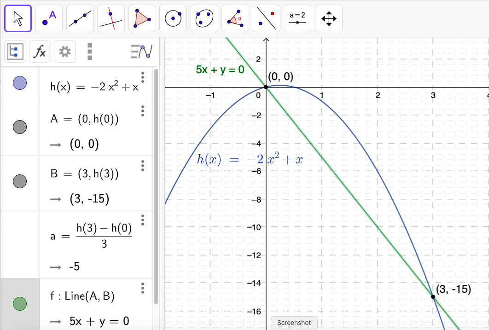

 

<a name="3.74" class="goback" onclick="winhisback()">__74__</a>) Given $G(x) = -x^4 + 32x^2 + 144$

__a__) Determine whether $G$ is even, odd, or neither. 

__Sln__: $G(-x) = -[(-x)^4] + 32[(-x)^2] + 144 = -(-1)^4x^4 + 32(-1)^2x^2 + 144 = -x^4 + 32x^2 + 144 = G(x)$ for all $x$, therefore $G(x)$ is $\box{\text{even.}}$
 

__b__) There is a local maximum value of 400 at $x = 4$; determine a second local maximum value.
__Sln__: Since $G(x)$ is even, it is symmetric about the $y$-axis; therefore, if $G(4)$ is a local maximum, so must be $G(-4) = G(4) = 400$, i.e., $\box{(-4,400)}$ is a second local maximum.
 

__c__) Suppose the area under the graph of $G$ between $x = 0$ and $x = 6$ that is bounded below by the $x$-axis is 1612.8 square units; using the result from part __a__), determine the area under the graph of $G$ between $x = -6$ and $x = 0$ bounded below by the $x$-axis.

__Sln__: Again, since $G$ is even, and therefore symmetric about the $y$-axis, the area described between $x = -6$ and $x = 0$ must equal the same area between $x = 0$ and $x = 6$, i.e., $\box{1612.8\text{ square units}}.~$ Here’s a picture:

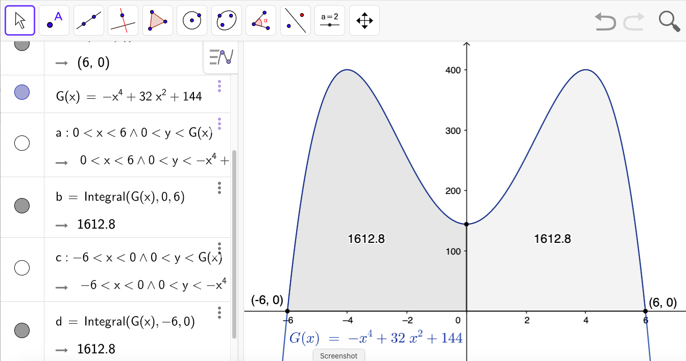

(Note: the use of GeoGebra’s Integral function to compute the areas of the described regions is beyond the scope of this course, though, perhaps arguably, the method by which the described regions are defined and graphed, is not.)
  

<a name="3.76" class="goback" onclick="winhisback()">__76__</a>) __Medicine Concentration__ The concentration, $C$, of a medication in the bloodstream $t$ hours after being administered is modeled by the function:

$$C(t) = -0.002t^4 + 0.039t^3 - 0.285t^2 + 0.766t + 0.085$$

__a__) After how many hours will the concentration be highest?

__Sln__: In other words, at what time will $C$ attain a maximum?&nbsp; Until Calculus, we need to use a graphing utility to answer this question:

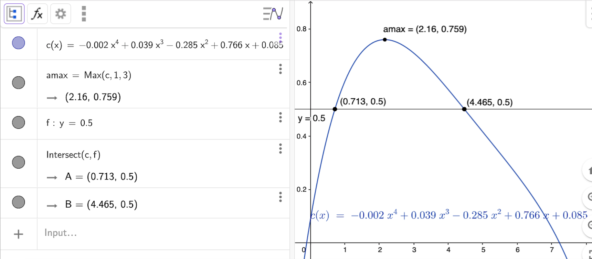

(for now, ignore the added line $y=0.5$: it is there for the solution to part __b__).&nbsp; Using GeoGebra’s Max command, we find the concentration will be highest approximately $\box{2.16\text{ hours} = 2\text{ hrs, }9.6\text{ min.}}$ after the medicine has been administered.
 

__b__) A woman nursing a child must wait until the concentration is below 0.5 before she can nurse him.&nbsp; After taking the medication, how long must she wait before nursing her child?

__Sln__: We need the time(s) after administration at which the concentration is less than 0.5, i.e., $t$ such that $C(t)\lt 0.5$; we don’t have the &quot;algebraic machinery&quot; to figure this out algebraically, so we need to solve it graphically using technology.&nbsp; One way to do this is illustrated in the graph above: we superimpose the graph of $y=0.5$ on the graph of $C(t)$ and the times for which the graph of $C(t)$ is below the graph of $y=0.5$ are the time ranges in which it is OK to nurse.&nbsp; But note that the graph of $C(t)$ starts out below $y=0.5$: $C(0)=0.085 \lt 0.5$, so if it is really true that she can nurse anytime the concentration is below $0.5$, she can nurse from immediately after medicine administration until the time at which the concentration first equals $0.5$, which we see using GeoGebra’s Intersect command is $\box{\doteq 0.713\text{ hr }= 42.8\text{ min}}.$&nbsp; Then the graph of $C$ is above the graph of $y=0.5$&mdash;C \gt 0.5$&mdash;until $\box{t \doteq 4.46\text{ hrs.} = 4 hr, 27.6 min.},$ so this is how long the woman must wait until after administration to nurse, if she is not allowed to nurse right away.
  

<a name="3.80" class="goback" onclick="winhisback()">__80__</a>) For the function $f(x) = x^2$ compute each average rate of
change: __a__) from $x=1$ to $x=2$; __c__) from $x=1$ to $x=1.1$; __e__) from $x=1$ to $x=1.001$; __h__) what is happening to the slopes of the secant lines? Is there some number that they are getting closer to?
What is that number?

__Sln__: 

__a__) $\ds\frac{f(2)-f(1)}{2-1} = \frac{2^2-1^2}1 = \box3$

__c__) $\ds\frac{(1.1)^2-1^2}{1.1-1} = \frac{1.21-1}{0.1} = \frac{0.21}{0.1} = \box{2.1}$

__e__) $\ds\frac{(1.001)^2-1^2}{1.001-1} = \frac{1.002001-1}{0.001} = \frac{0.002001}{0.001} = \box{2.001}$

__h__) As the upper $x$ value, $x_{upper}$, &quot;approaches&quot; the (fixed) lower value, $x_{lower}$ ($ = 1$ in this example), the slope of the secant line between the points $(x_{lower},f(x_{lower}))$ and $(x_{upper},f(x_{upper}))$, i.e., the average rate of change of $f$ from $x_{lower}$ to $x_{upper}$, appears to be approaching the (fixed) value $\box{2}.~$ (In Calculus one learns how to derive this result using a more general, and yet also more rigorous, analysis.&nbsp; In the meantime, the student is encouraged to contemplate why a more rigorous analysis might be desirable&mdash;hint: does a collection of examples prove a general statement? what if someone comes along some day and finds an example which contradicts the general statement?&mdash;and what that more rigorous analysis might &quot;look like&quot;&mdash;hint: what is needed is an analysis that is independent of any specific examples.)
  

<a name="3.88" class="goback" onclick="winhisback()">__88__</a>) Given the following definition for the slope, $m_{\large\text{sec}}$, of the secant line for $f(x)$ through the points $(x,f(x))$ and $(x+h,f(x+h))$: $$m_{\large\text{sec}} = \frac{f(x+h)-f(x)}h,~ h\ne0,$$
for $f(x)=x^{-2}$: 

__a__) Express the (simplified) slope of the secant line in terms of $x$ and $h$.

__Sln__: $\ds m_{\large{\text{sec}}} = \frac{f(x+h)-f(x)}h = \frac{(x+h)^{-2}-x^{-2}}{h} = \frac1h\left[\frac1{(x+h)^2}-\frac1{x^2}\right] = \frac1h\left[\frac{x^2-(x+h)^2}{x^2(x+h)^2}\right] = \frac1h\left[\frac{x^2-x^2-2hx-h^2}{x^2(x+h)^2}\right] = $ $\ds \frac1h\left[\frac{-2hx-h^2}{x^2(x+h)^2}\right] = \box{\frac{-2x-h}{x^2(x+h)^2}}$
 

__b__) Find $m_{\large\text{sec}}$ for $h = 0.5, 0.1,$ and $0.01$ at $x=1.~$ What value does $m_{\large\text{sec}}$ approach as $h$ approaches $0$?

__Sln__: $m_{\large\text{sec}}(x=1;h=0.5) = \ds \frac{-2(1)-0.5}{1^2(1+0.5)^2} = \frac{-2.5}{(1)(1.5)^2} = \frac{-2.5}{2.25} = \box{-\frac{10}9 = -1.\bar1}$

$m_{\large\text{sec}}(x=1;h=0.1) = \ds \frac{-2.1}{(1.1)^2} = \frac{-2.1}{1.21} = \box{-\frac{210}{121} \doteq -1.73553719}$

$m_{\large\text{sec}}(x=1;h=0.01) = \ds \frac{-2.01}{(1.01)^2} = \frac{-2.01}{1.0201} = \box{-\frac{20100}{10201} \doteq -1.97039506}$

$m_{\large\text{sec}}(x=1)$ appears to be approaching $\box{-2}$ as $h$ approaches $0$.
 

__c__) Find the equation for the secant line at $x = 1$ with $h = 0.01$.

__Sln__: We just computed the required slope in the previous exercise, so we use the point-slope form for the equation of a line: $y-y_0=m(x-x_0)$ where $x_0 = 1, y_0 = f(1) = 1^{-2} = 1, m = \ds -\frac{20100}{10201} \implies 10201(y-1)=-20100(x-1) \implies$ $$\box{20100x+10201y=30301}\text{ or } \box{y = -\frac{20100}{10201}x+\frac{30301}{10201} \doteq -1.970x + 2.970}$$
 

__d__) Use a graphing utility to graph $f$ and the secant line found in part __c__) in the same viewing window

__Sln__: 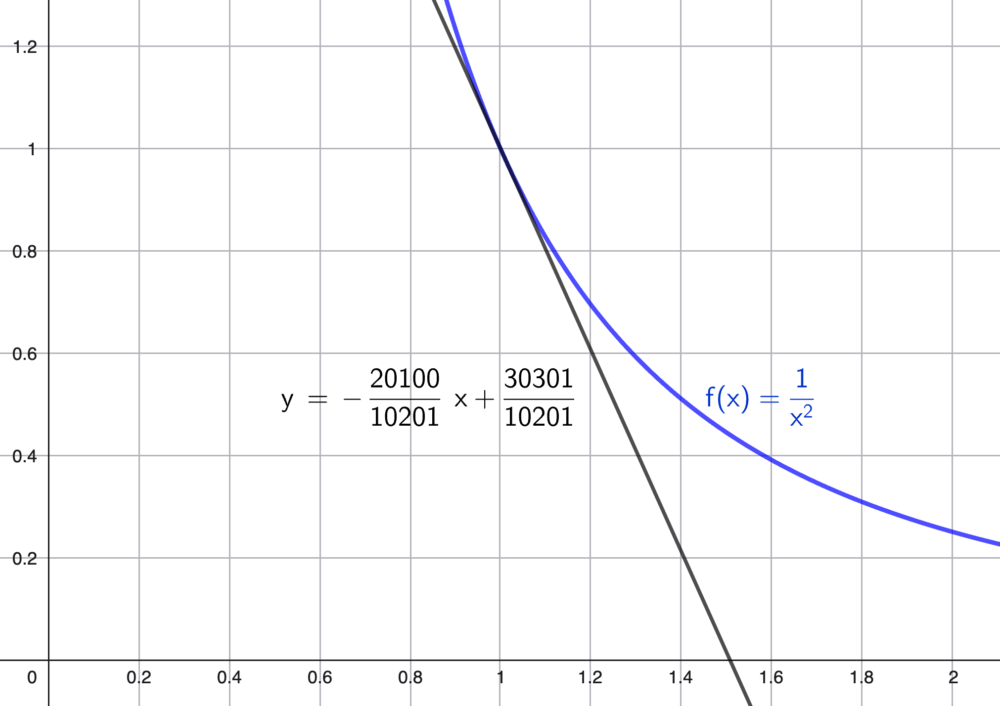

## Section 4: Library of Functions; Piecewise-defined Functions

  

## Section 5: Graphing Techniques: Transformations

  

## Section 6: Mathematical Models: Building Functions

  

### Credits

Graphs generated using [GeoGebra](http://www.geogebra.org/).

### Please Donate:

<table>
  <tr>
    <td>
      <b>Venmo: @David-Goldsmith-13</b>
    </td>
    <td>
      <form action="https://www.paypal.com/cgi-bin/webscr"
            method="post"><input name="cmd"
            value="_xclick" type="hidden"> <input name="business"
            value="dgoldsmith_89@alumni.brown.edu" type="hidden"> <input
            name="item_name" value="SelectedSolutions Donation"
            type="hidden"> <input name="cn" value="Special Instructions
            (optional" type="hidden"> <input
            src="https://www.paypal.com/images/x-click-but04.gif"
            name="submit" alt="Make payments with PayPal - it's fast,
            free and secure!" align="middle" border="0" type="image"></form>
    </td>
  </tr>
</table>

