
$\definecolor{red}{RGB}{255,0,0}
\definecolor{orange}{RGB}{245, 165, 0}
\definecolor{yellow}{RGB}{255,215,0}
\definecolor{green}{RGB}{0,255,0}
\definecolor{indigo}{RGB}{0,0,255}
\definecolor{violet}{RGB}{138,43,226}
\definecolor{black}{RGB}{0,0,0}$
$\require{cancel}$

#### 
Sullivan, M., 2012. <i>Algebra & Trigonometry, Ninth Edition.</i> Prentice Hall, Boston
#### 
Chapter 3, Section 1: "Functions"
#### 
to be included in the main Chapter write up

__14__) ___True or False___: The domain of the function $\displaystyle f(x) = \frac{x^2 - 4}x$ is $\{x | x \ne \pm 2\}$.

__Sln__: The domain is all real numbers, <i>except</i> those which make $f$ undefined, which is $x=0$ (not $x = \pm 2$, for which $f=\displaystyle \frac{(\pm2)^2-4}{\pm2} = \frac0{\pm2}=0$, which is a perfectly well-defined real number), so the domain is:

$$\boxed{\{x|x\ne0\}}$$
 

In Problems __16__ and __26__, determine whether each relation represents a function; for each that is a function, state the domain and range.

__16__) 

| Father | Daughter |
| --- | --- |
| Bob &mdash;>| Beth  |
|  &nbsp;&nbsp;&nbsp;"&nbsp;&nbsp;&nbsp;&mdash;>| Diane |
| John &mdash;> | Linda  |
| Chuck &mdash;> | Marcia |

__Sln__: Since "Bob" gets mapped to both "Beth" and "Diane," it is not "1-to-1," so this relation is $\boxed{\text{not a function.}}$
  

__26__) $\{(-2, 16), (-1, 4), (0, 3), (1, 4)\}$

__Sln__: The $\boxed{\text{domain is }\{-2, -1, 0, 1\}}$ and since each domain element gets mapped to only one value, this relation $\boxed{\text{is a function.}}$, whose $\boxed{\text{range is }\{16,4,3\}.}~$ (Note: it doesn’t matter that two different domain elements&mdash;$1$ and $-1$&mdash;are mapped to the same range element&mdash;4: that is perfectly fine for functions; indeed, when we get to the trigonometric functions, we’ll be learning about functions that map an "infinite number" of domain values to each range value!)
  

In Problems __32__ and __38__ determine whether the equation defines $y$ as a function of $x$.

__32__) $y = \pm\sqrt{1 - 2x}$

__Sln__: This notation&mdash;in this context&mdash;means that for each value of $x$ for which $\sqrt{1 - 2x}$ is well-defined, there are two$^*$ corresponding values of $y$, namely, $\sqrt{1 - 2x}$ <i>and</i> $-\sqrt{1 - 2x}$; therefore, this equation $\boxed{\text{does not}}$ define $y$ as a function of $x$ (it does define a relation between $y$ and $x$, but that relation is not a function.)&nbsp; Here is a graph of this relation:

Note how it "fails the vertical line test" at most points of its definition.

$^*$There is one exception to this relation being "multi-valued," i.e., one value of $x$ that gets mapped to only one value of $y$; we leave it to the reader to figure out that value of $x$ and the value of $y$ to which it is mapped.
  

__38__) $x^2 - 4y^2 = 1$

__Sln__: In order for a relation to be a function, <i>every</i> value of $x$ (for which the relation is well-defined) must be mapped to only one value of $y$; thus showing that even just one value of $x$ is mapped to more than one value of $y$, i.e., there is more than one ordered pair, containing that $x$, that makes the equation a true statement, is sufficient to establish that the relation is not a function.&nbsp; Since it’s usually the easiest value to compute with, let’s try $x=0$ and see if we "get lucky": $0^2-4y^2=1 \implies -4y^2=1 \implies y^2 = \displaystyle -\frac14$ which has no real solution, so $x=0$ isn’t even in the domain of this relation!&nbsp; So let’s be a little bit smarter about our next choice; since $4$ is the square of $2$, let’s give $x=2$ a try: $2^2-4y^2=1 \implies 4-4y^2=1 \implies 4y^2 = 3 \implies y^2 = \displaystyle \frac34 \implies y = \pm\frac{\sqrt3}2$, i.e., both $\displaystyle \left(2,\frac{\sqrt3}2\right) \text{ and } \left(2,-\frac{\sqrt3}2\right)$ make $x^2-4y^2=1$ a true statement.&nbsp; (Check: $(2)^2 - 4\left(\pm\frac{\sqrt3}2\right)^2 = 4-4(\frac34) = 4-3=1~\checkmark.$)&nbsp; Therefore this relation $\boxed{\text{ is not a function.}}$&nbsp; Here’s its graph:

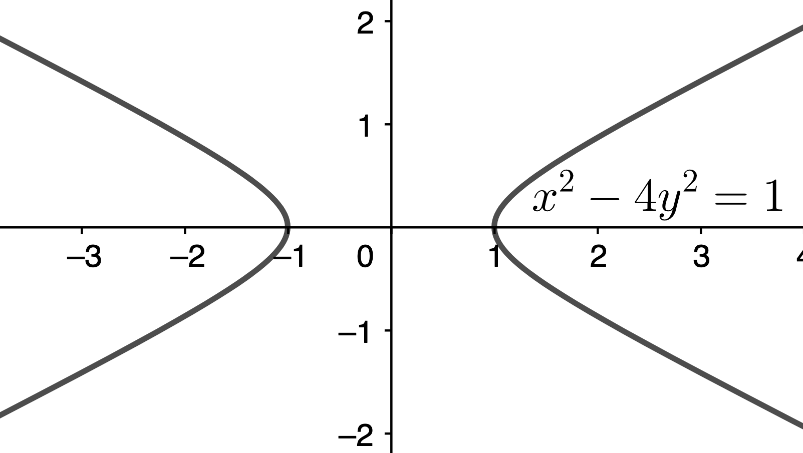

Again note how it fails the vertical line test at most points of its domain.
  

In Problems __42__ and __46__ find the following for each function: __d__) $f(-x)$ and __h__) $f(x+h).$

__42__) $f(x) = \displaystyle \frac{x^2 - 1}{x + 4}$

__Sln__: __d__) $f(-x) = \displaystyle \frac{(-x)^2 - 1}{-x + 4} = \boxed{\frac{x^2-1}{-x+4}}~$ Here’s the graph of $f(x)$ and $f(-x)$ on the same set of axes:

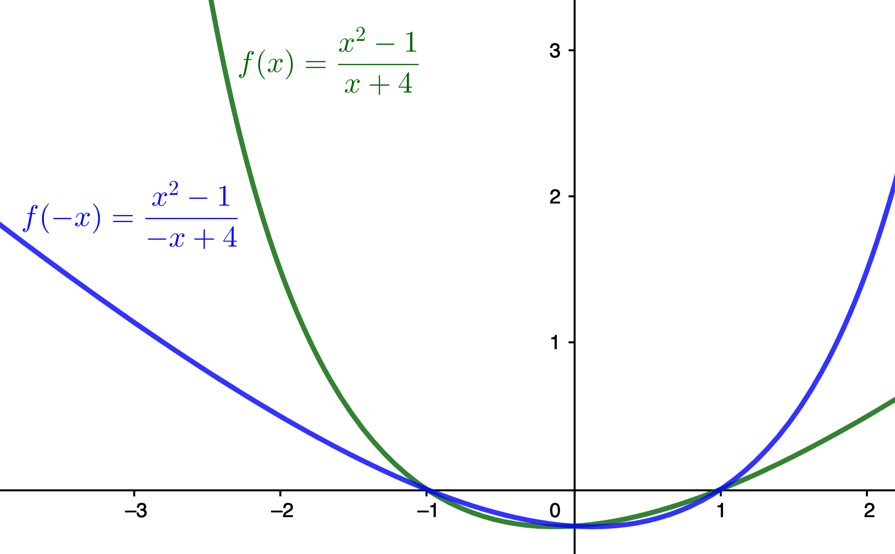

__h__) $f(x+h) = \displaystyle \frac{(x+h)^2 - 1}{(x+h) + 4} = \boxed{\frac{x^2+2hx+h^2-1}{x+h+4}}$
  

__46__) $f(x) = 1 - \displaystyle \frac1{(x + 2)^2}$

__Sln__: __d__) $f(-x) = 1 - \displaystyle \frac1{(-x + 2)^2} = 1-\frac1{x^2-4x+4} = \frac{x^2-4x+4-1}{(x-2)^2} = \boxed{\frac{x^2-4x+3}{(x-2)^2} = \frac{(x-3)(x-1)}{(x-2)^2}}~$ Here’s the graph of $f(x)$ and $f(-x)$ on the same set of axes:

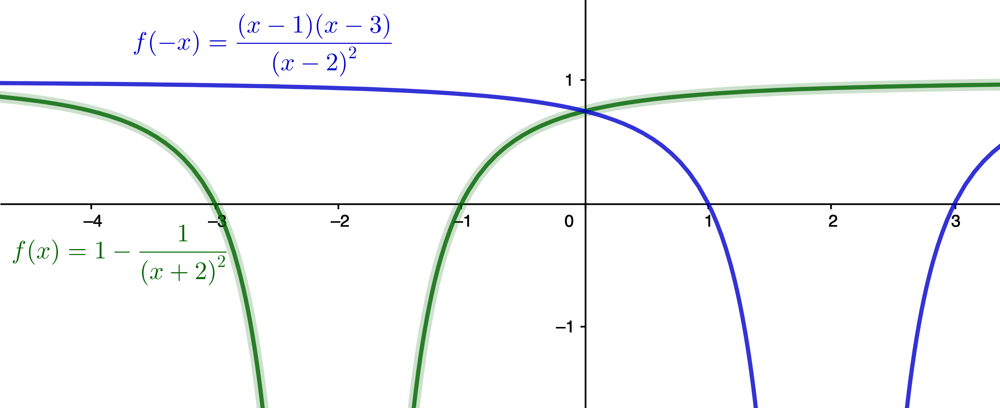

__h__) $f(x+h) = 1 - \displaystyle \frac1{(x+h + 2)^2} = \frac{(x+h + 2)^2-1}{(x+h + 2)^2} = \frac{(x+h + 2+1)(x+h + 2-1)}{(x+h + 2)^2} = \boxed{\frac{(x+h + 3)(x+h + 1)}{(x+h + 2)^2}}$
  

In Problems __50__, __54__, __58__, and __62__ find the domain of each function.

The "natural" domain is always "all real numbers" (denoted $\mathbb{R}$ in typeset mathematics) <i>except</i> those values which make the function’s "rule" (e.g., its mathematical formula) undefined.&nbsp; In general, there are four primary things that can "go wrong" (for so-called "elementary" functions) but only two until we get to logarithms in Chapter 6 and the inverse trigonometric functions in Chapter 8, so we will delay considering those cases until then. 

1) __Division by zero__ (which compels us to exclude from the domain <i>all</i> values which make <i>any</i> denominator in the rule equal to zero; so, procedurally, what one does is set each denominator equal to zero and solve the resulting equations: the solutions found are the values we must <i>exclude</i> from the domain; in summary, we "solve for what we don’t want," not what we do want).

2) __Taking an even root of a negative number__ (which compels us to exclude from the domain all values which make the argument of the even root strictly less than zero; procedurally, we can either set the argument of the even root to be greater than or equal to zero ($\ge 0$) and solve that inequality to "solve positively" for the domain; or we can set the argument to be less than zero ($\lt 0$) and solve that inequality to "solve negatively" for the domain, i.e., solve for what we must exclude; since one solution set is the complement of the other&mdash;and the solution methods are identical&mdash;it is really "six one way, half-a-dozen the other," so essentially a matter of personal preference.&nbsp; Note that odd roots are well- and uniquely-defined for negative argument, and so compel no domain restriction.)

__50__) $f(x) = \displaystyle \frac{x^2}{x^2 + 1}$

__Sln__: Here, the only thing that might "go wrong" is division by zero; thus we set the denominator of the sole fraction equal to zero, $x^2+1=0$, and (attempt to) solve for what we must exclude from the domain: $x^2+1=0 \implies x^2=-1$ which has no real solution, meaning that $x^2+1 \ne 0$ for all real $x$, and thus we don’t have to exclude anything from the domain.&nbsp; Thus the domain is $\boxed{\text{all real numbers} = \mathbb{R}.}$&nbsp; Here’s the graph of $f(x)$:

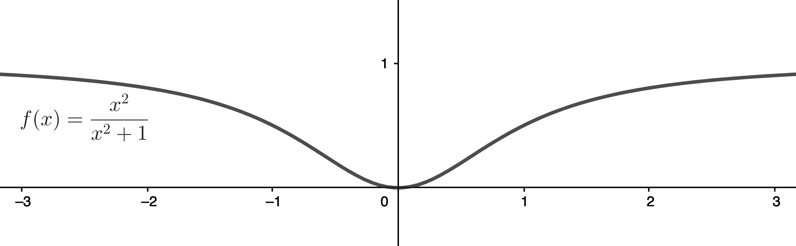
 

__54__) $G(x) = \displaystyle \frac{x + 4}{x^3 - 4x}$

__Sln__: Again, the only thing that might "go wrong" is division by zero, so we set the denominator equal to zero and "solve for what we don’t want": $0 = x^3 - 4x = x(x^2-4) = x(x+2)(x-2) \implies x = 0, \pm2$ as the values we <i>don’t</i> want.&nbsp; Thus the domain is: $$\boxed{\{x\in \mathbb{R}|x \ne 0, 2, -2\}}$$ ("$x$ in $\mathbb{R}$ such that $x$ is not equal to 0, 2, or $-2$").&nbsp; Here’s the graph of $G(x)$:

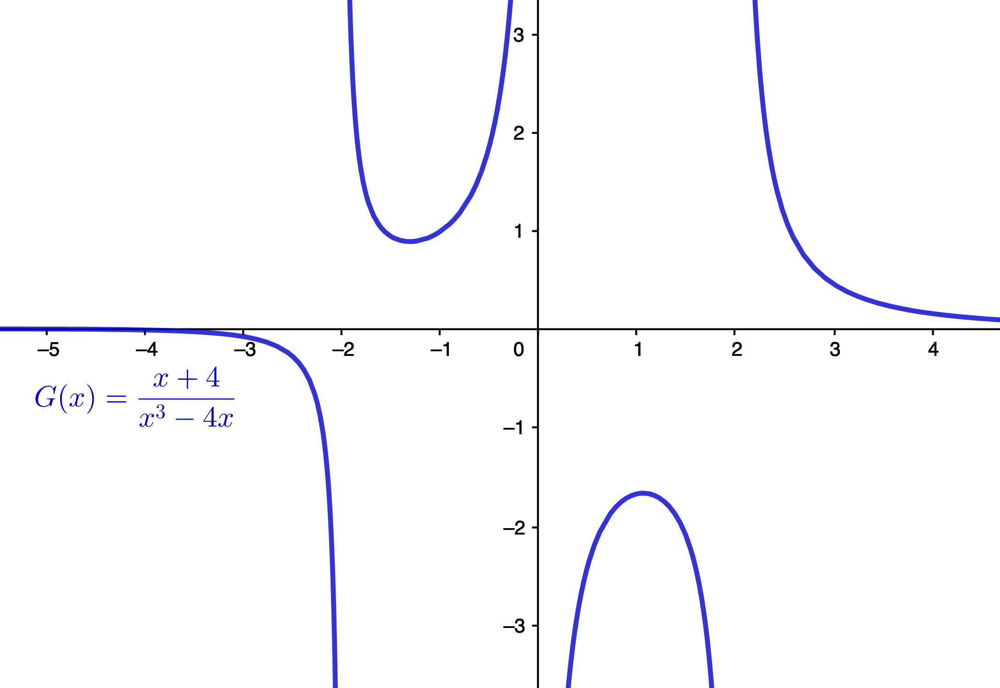

For future reference, note how the graph is behaving near the values we were compelled to exclude from the domain.
  

__58__) $f(x) = \displaystyle \frac{x}{\sqrt{x - 4}}$

__Sln__: Here, two things can go wrong: $x-4$ might be negative, and $\sqrt{x-4}$ might be zero; the former has us solving the inequality $x-4 \ge 0$, while the latter tells us that $x-4$ can’t equal 0 (because zero is the only number that gives a square-root of zero).&nbsp; Thus we can "consolidate" these restrictions into the single inequality $x-4 \gt 0 \implies x \gt 4$, which gives us the domain explicitly: $$\boxed{\{x\in\mathbb{R}|x \gt 4\}}$$
Here’s the graph:

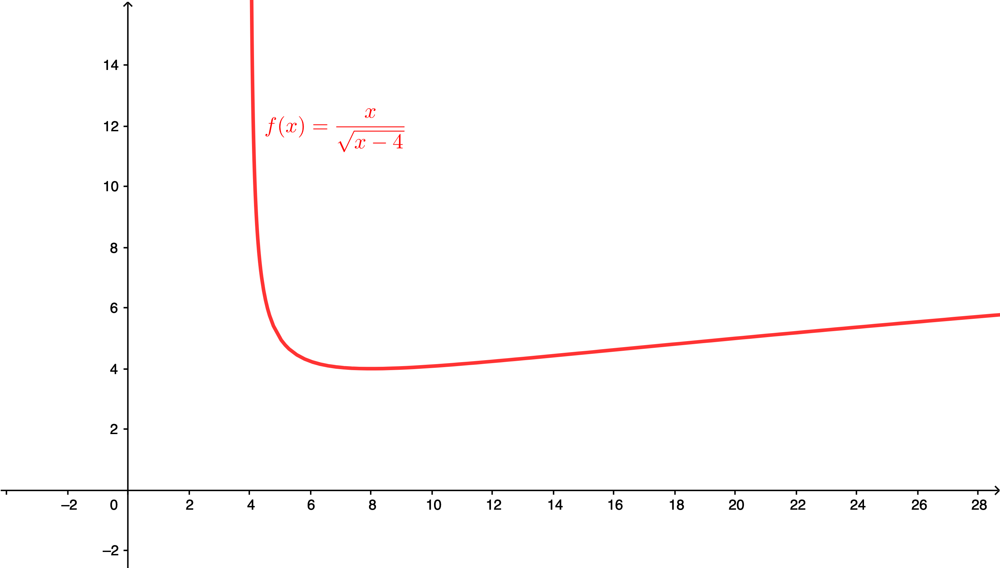

Again note how the function behaves near the boundary of the domain, i.e., near $x=4$; also note the scale we must use to see "action" on the right side of the graph.
  

__62__) $h(z) = \displaystyle \frac{\sqrt{z + 3}}{z - 2}$

__Sln__: Here, two things can go wrong&mdash;$z+3 \lt 0$ and $z-2=0$&mdash;and it is not immediately obvious whether or not the domain restrictions they compel can be consolidated, i.e., "overlap," so we must solve for each restriction separately: $z+3 \lt 0 \implies z  \lt -3 = \left(-\infty,-3\right)$ as the (infinite) interval we must exclude due to the square-root; $z-2=0 \implies z=2$ as the point we must exclude due to the division; since 2 is not in the interval $\left(-\infty,-3\right)$, we must explicitly exclude it from the domain separately.&nbsp; The domain is thus: $$\boxed{\{x\in\mathbb{R}|x\ge-3, x\ne2\}}$$
("All real numbers greater than or equal to $-3$, excluding $2$").&nbsp; Here’s the graph:

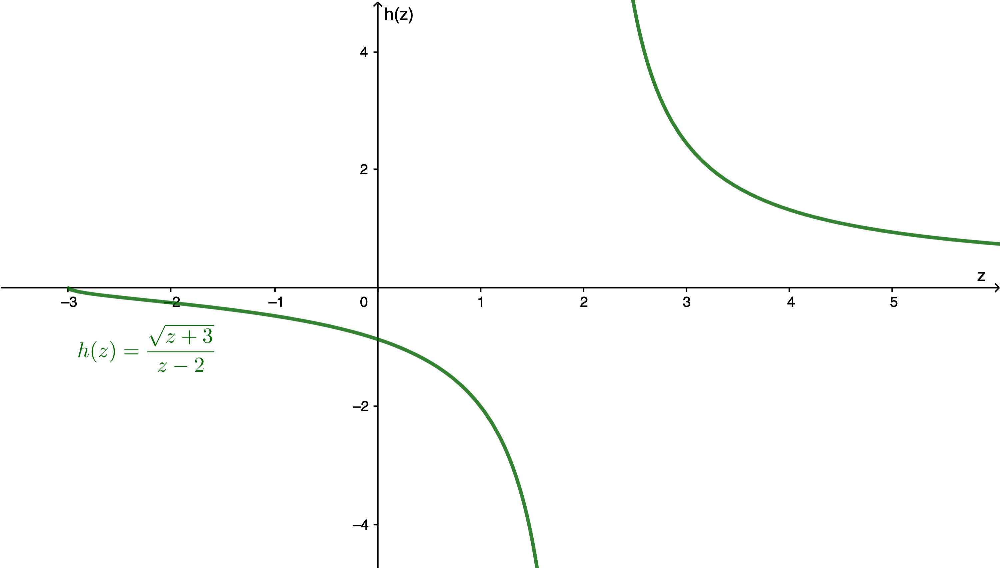

Once again note how the function behaves near the domain boundaries: at $z=-3$&mdash;the boundary due to the presence of the square-root in the numerator&mdash;it just "stops short," while near $z=2$&mdash;the boundary due to a would-be division by zero&mdash;it "blows up").
  

In Problems __66__ and __70__, for the given functions $f$ and $g$, find: __b__) $(f-g)(x)$, __d__) $\displaystyle \left(\frac fg\right)(x)$, and __h__) $\displaystyle \left(\frac fg\right)(1)$; for  __b__ and __d__, also find the domain.

__66__) $f(x) = 2x^2 + 3; g(x) = 4x^3 + 1$

__Sln__: __b__) $(f-g)(x) = f(x)-g(x) = (2x^2 + 3) - (4x^3 + 1) = -4x^3+2x^2+3-1 = \boxed{-4x^3+2x^2+2}$ Domain: all the operations involved are well-defined for all real numbers, therefore the domain is $\boxed{\mathbb{R}}.~$ Here’s $f, g,$ and $f-g$ on the same axes:

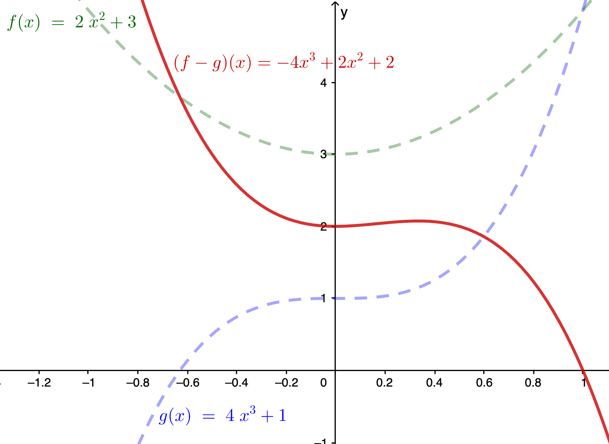

__d__) $\displaystyle \left(\frac fg\right)(x) = \frac{f(x)}{g(x)} = \boxed{\frac{2x^2 + 3}{4x^3 + 1}}$ Domain: We must exclude $x$ such that $4x^3+1=0 \implies x^3=-\displaystyle\frac14 \implies x = -\sqrt[\large3]\frac14$, so the domain is $\boxed{\{x\in\mathbb{R}|x\ne-\sqrt[\large3]{\frac14}\}}.~$ Here’s the graph of $f,g,$ and $f/g$:

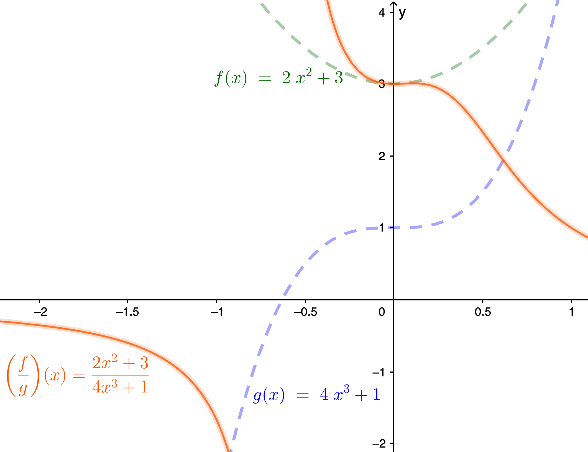

__h__) $\displaystyle \left(\frac fg\right)(1) = \frac{2(1)^2 + 3}{4(1)^3 + 1} = \frac{f(1)}{g(1)} = \frac{2+3}{4+1} = \frac55=\boxed{1}$
  

__70__) $f(x) = \sqrt{x - 1}; g(x) = \sqrt{4 - x}$

__Sln__: __b__) $(f-g)(x) = f(x)-g(x) = \boxed{\sqrt{x - 1} - \sqrt{4 - x}}$ (this expression can’t be simplified any further).&nbsp; Domain: the domain is the <i>intersection</i> (in the sense of sets; see the text’s Review Chapter if you need a "refresher" on what this means) of the domains of the two separate functions $f$ and $g$ (because they both need to be well-defined for $f-g$ to be well-defined); the domain of $f$ is the solution of $x-1 \ge 0 \implies x \ge 1$, while the domain of $g$ is the solution of $4-x \ge 0 \implies 4 \ge x$, and the intersection of these two is the compound inequality $1\le x \le 4$, i.e., the closed interval $\boxed{\left[1,4\right]}.~$ Here’s the graph of $f, g,$ and $f-g$:

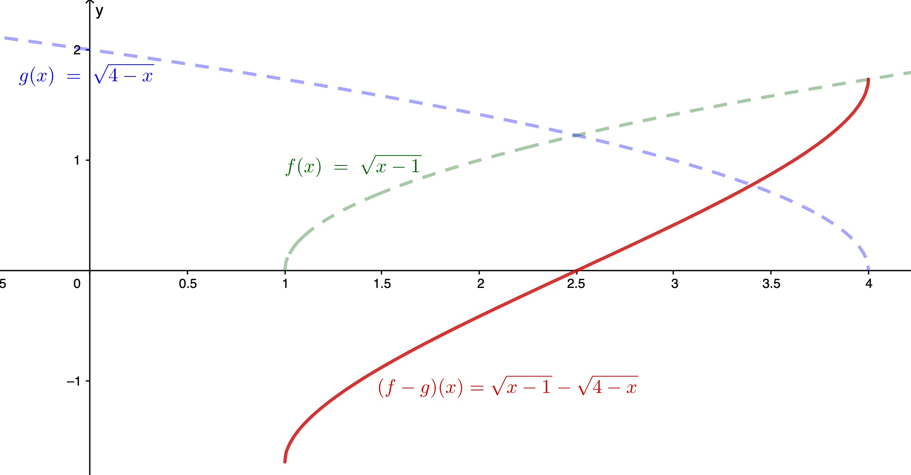

__d__) $\displaystyle \left(\frac fg\right)(x) = \frac{f(x)}{g(x)} = \boxed{\frac{\sqrt{x-1}}{\sqrt{4-x}}}$ Domain: the domain is the intersection of the domains of the separate functions $f$ and $g$&mdash;already determined in part b) to be $[1,4]$&mdash;but now $x=4$ must be excluded because it makes $f/g$ undefined, so the domain is the "half-open" interval $\boxed{[1,4)}.~$ Here’s the graph:

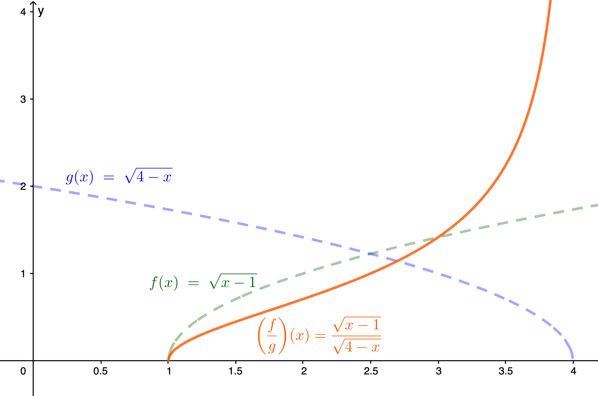

__h__) $\displaystyle \left(\frac fg\right)(1) = \frac{\sqrt{1-1}}{\sqrt{4-1}} = \frac{\sqrt0}{\sqrt3} = \frac03 = \boxed{0}$
  

__74__) Given $f(x) = \displaystyle \frac1x$ and $\displaystyle \left(\frac fg\right)(x) = \frac{x + 1}{x^2 - x}$, find the function $g$.

__Sln__: We have that $\displaystyle \left(\frac fg\right)(x) = \frac{f(x)}{g(x)} = \frac{(1/x)}{g(x)} = \frac1{xg(x)} = \frac{x + 1}{x^2 - x}$; multiplying through by $g(x)$ and the reciprocal of $\displaystyle \frac{x + 1}{x^2 - x}$ (and noting that doing so requires us to exclude $x=0,1$ from the domain) $\implies \displaystyle g(x) = \frac{x^2 - x}{x(x+1)} = \frac{\cancel{x~}(x-1)}{\cancel{x~}(x+1)}$ (where the cancellation is "OK" because we’ve already excluded the possibility of $x=0$), i.e., $$\boxed{g(x) = \frac{x-1}{x+1}}$$

Check: $\displaystyle \frac{1/x}{(x-1)/(x+1)} = \frac{x+1}{x(x-1)} = \frac{x+1}{x^2-x}~\checkmark$
  

In Problems __78__ and __82__ find $\displaystyle \frac{f(x+h)-f(x)}h, h\ne 0$; be sure to simplify.

__78__) $f(x) = 3x^2 - 2x + 6$

__Sln__: Given $f(x) = 3x^2 - 2x + 6, \displaystyle \frac{f(x+h)-f(x)}h = \frac{3(x+h)^2 - 2(x+h) + 6 - (3x^2 - 2x + 6)}h = $ $\displaystyle \frac{3(x^2+2hx+h^2)\cancel{-2x}-2h\cancel{+6}-3x^2\cancel{+2x}\cancel{-6}}h = \frac{\cancel{3x^2}+6\cancel{h}x+3h^{\cancel{2}1}-2\cancel{h}\cancel{-3x^2}}{\cancel h} = \boxed{6x-2+3h}$ (given that $h\ne 0$).
  

__82__) $f(x) = \sqrt{x + 1}$

__Sln__: $\displaystyle \frac{f(x+h)-f(x)}h = \frac{\sqrt{x+h+1}-\sqrt{x+1}}h$ and ordinarily we’d be done, i.e., this would be as far as we’d go with this expression...but I know where this is supposed to go, i.e., in Calculus, and I know a "tricky" way to get there&mdash;we can "rationalize the numerator": $\displaystyle \frac{\sqrt{x+h+1}-\sqrt{x+1}}h = \frac{\sqrt{x+h+1}-\sqrt{x+1}}h \cdot \frac{\sqrt{x+h+1}+\sqrt{x+1}}{\sqrt{x+h+1}+\sqrt{x+1}} =$ $\displaystyle \frac{(x+h+1)-(x+1)}{h(\sqrt{x+h+1}+\sqrt{x+1})} = \frac{\cancel h}{\cancel h (\sqrt{x+h+1}+\sqrt{x+1})} = $ $$\boxed{\frac1{\sqrt{x+h+1}+\sqrt{x+1}}}$$
(In Calculus, we then "take the limit" of this expression "as $h$ goes to zero," which, since we can show that the expression, as a function of $h$, is <i>continuous</i> at $h=0$, we can do simply by setting $h=0$&mdash;yes, we do this even though the original expression is undefined at $h=0$&mdash;to show that the <i>derivative</i> of this $f(x)$ is $\displaystyle \frac1{2\sqrt{x+1}}$.)
  

__86__) If $f(x) = \displaystyle \frac{2x - B}{3x + 4}$, find $B$ such that $f(2) = \displaystyle \frac12$.

__Sln__: We must solve: $\displaystyle \frac12 = \frac{2(2)-B}{3(2)+4} = \frac{4-B}{10} \implies 4-B=\frac{10}2 = 5 \implies B=4-5=\boxed{-1}$

Check: $\displaystyle \frac{2(2) - (-1)}{3(2) + 4} = \frac{4+1}{6+4} = \frac5{10} = \frac12~\checkmark$
  

__106__) Are the functions $f(x) = x - 1$ and $g(x) = \displaystyle \frac{x^2 - 1}{x + 1}$ the
same? Explain.

__Sln__: Why might they be?&nbsp; Well, because $\displaystyle \frac{x^2 - 1}{x + 1} = \frac{\cancel{(x+1)}(x-1)}{\cancel{(x+1)}}$; but wait a sec: that cancellation is only valid as long as $x+1 \ne 0$; if $x+1 = 0$, then the original expression isn’t even well-defined!&nbsp; So they are "almost, but not quite" the same: they are the same for all real $x$ <i>except</i> $x=-1$, where $f=-1-1=-2$, but $g$ is undefined.&nbsp; (A graph of $g$ looks exactly like the graph of $f$, except that at the point $(-1,-2)$, we put a little open circle to indicate that there’s a one-point "break" in the line there: that one point, and only that one point, is missing from the graph of $g$&mdash;everywhere else it is identical to the graph of $f$.)