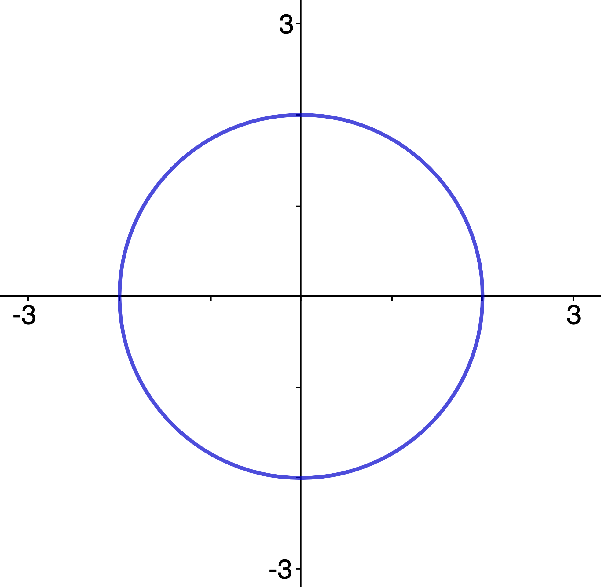
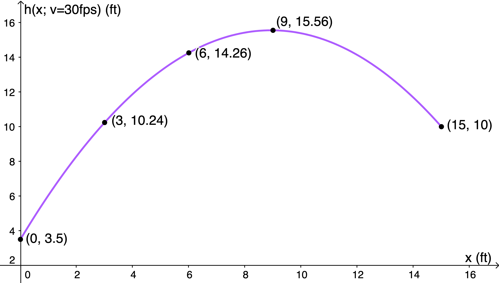
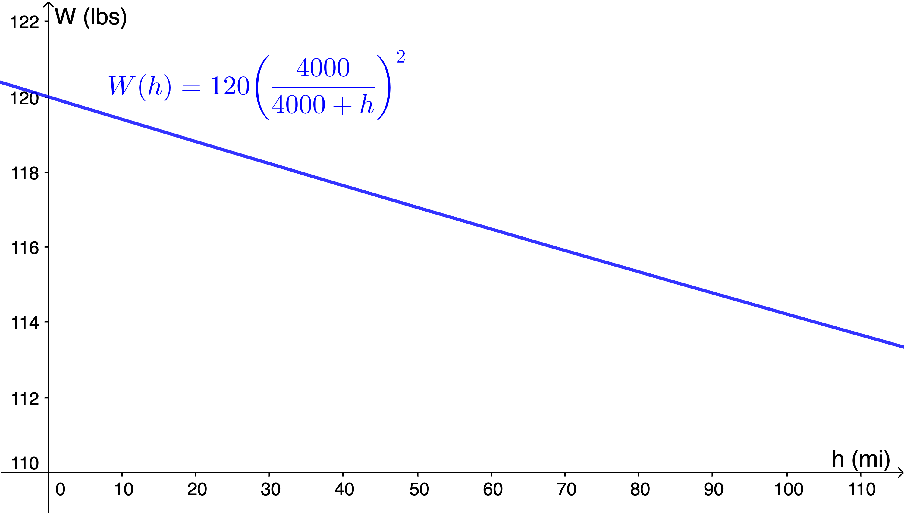

$\definecolor{red}{RGB}{255,0,0}
\definecolor{orange}{RGB}{245, 165, 0}
\definecolor{yellow}{RGB}{255,215,0}
\definecolor{green}{RGB}{0,255,0}
\definecolor{indigo}{RGB}{0,0,255}
\definecolor{violet}{RGB}{138,43,226}
\definecolor{black}{RGB}{0,0,0}$
$\require{cancel}$

#### 
Sullivan, M., 2012. <i>Algebra & Trigonometry, Ninth Edition.</i> Prentice Hall, Boston
#### 
Chapter 3, Section 2: "The Graph of a Function"
#### 
to be included in the main Chapter write up

__6__) <i>True or False</i>&nbsp; A function can have more than one
$y$-intercept.

__Sln__: $\boxed{\text{False}}$: if it has more than one $y$-intercept, then it intersects the $y$-axis&mdash;a vertical line&mdash;more than once, and thus it fails the vertical line test.&nbsp; (More formally, if it has more than one than $y$-intercept, then $0$ is being mapped to more than one value, which makes it not a function.)
  

In Problems __16__ and __22__, determine whether the graph is that of a function by using the vertical-line test.&nbsp; If it is, use the graph to find:
__a__) the domain and range; __b__) the intercepts, if any; and
__c__) any symmetry with respect to the $x$-axis, the $y$-axis, or the origin.

__16__) 

__Sln__: Any vertical line with equation $x=a, -2 \lt a \lt 2$ intersects the graph in more than one point&mdash;one below the $x$-axis, one above, so $\boxed{\text{not a function}.}~$ (Note that even though this is not a function, the intercepts and symmetries are still well-defined: the $x$-intercepts are $(\pm2,0)$, the $y$-intercepts are $(0,\pm2)$, and it is symmetric with respect to the origin and both axes.)
  

__22__) 

__Sln__: It is a function: __a__) the domain is all real numbers, the range is $(-\infty,5]$ (all real numbers less than or equal to 5); __b__) it appears to have $x$-intercepts of $(-1,0)$ and $(2,0)$, and a $y$-intercept at or a little above $(0,4)$ (that’s the inherent difficulty in determining and citing values from graphs: they can never be precise); __c__) it is not symmetric with respect to the origin or either axis (it is symmetric with respect to the line $x=0.5$, however).
  

__26__) Given $f(x) = \displaystyle \frac{x^2 + 2}{x + 4}$: __a__) Is $\displaystyle \left(1,\frac35\right)$ on the graph of $f$? __b__) What is $f(0)$ and what is this point on the graph? __c__) Find $x$ such that $f(x) = \displaystyle \frac12$ and state which point(s) this is (or these are) on the graph of $f$. __d__) What is the domain of $f$? __e__ & __f__) List the $x$ and $y$-intercepts (if any).

__Sln__: __a__) A point $(x,y)$ is on the graph of $y=f(x)$ if $(x,y)$
 makes the equation $y=f(x)$ a true statement; since $f(1) = \displaystyle \frac{1^2 + 2}{1 + 4} = \frac35, \left(1,\frac35\right)~\boxed{\text{is}}$ on the graph of this $f$; 
 
 
__b__) $\displaystyle f(0) = \frac{0^2 + 2}{0 + 4} = \frac24 = \boxed{\frac12}$, and thus the corresponding point on the graph is $\boxed{\left(0,\frac12\right)}$; 
 

__c__) we need $x$ such that $\displaystyle \frac{x^2 + 2}{x + 4} = \frac12$ and we’ve already found one such, $\boxed{x=0}$; to find the other, multiply through by $2(x+4)$ to yield $2x^2+4=x+4 \implies 2x^2-x = 0 = x(2x-1) = 0 \implies 2x-1=0 \implies \displaystyle \boxed{x=\frac12}$ (check: $\displaystyle \frac{(1/2)^2+2}{1/2 + 4} = \frac{9/4}{9/2}=\frac12~\checkmark$), which mean the points $\boxed{\left(0,\frac12\right)\text{ and }\left(\frac12,\frac12\right)}$ are on the graph of $f$; 
 

__d__) The domain is all real numbers except what makes $f$ undefined; in this case, the only thing that can "go wrong" is division by zero, if $x+4 = 0 \implies x=-4$, so this is the point we must exclude from the domain, which is thus: $\boxed{\left\{x\in\mathbb{R}|x\ne -4\right\}}$;
 

__e__ & __f__) The $y$-intercept happens when $x=0$, and we’ve already found that $y$-value, so the $y$-intercept is $\boxed{\left(0,\frac12\right)}$; the $x$-intercepts happen where $y=0$, so we must solve $\displaystyle \frac{x^2 + 2}{x + 4} = 0 \implies x^2+2=0$ which has no real solution, so the graph of this $f$ has $\boxed{\text{no }x\text{-intercepts.}}$
   

__30__) <b>Granny Shots</b> The path of the ball in an underhand [basketball] foul shot, releasing the ball at a 70-degree angle from a position 3.5 feet above the floor, can be modeled by the function:
$$h(x) = \displaystyle -\frac{136x^2}{v^2} + 2.7x + 3.5$$
where $h$ is the height of the ball above the floor, $x$ is the
forward distance of the ball in front of the foul line, and $v$
is the initial velocity with which the ball is shot in feet per
second.

__a__) The center of the hoop is 10 feet above the floor and
15 feet in front of the foul line.&nbsp; Determine the initial
velocity with which the ball must be shot in order for
the ball to go through the hoop.

__Sln__: $x=15, h(15) = 10$, so we must solve $\displaystyle -\frac{136(15)^2}{v^2} + 2.7(15) + 3.5 = 10$ for $v$: $\implies \displaystyle  2.7(15) + 3.5 - 10 = 34 = \frac{136(15^2)}{v^2} \implies v = 15\sqrt{\frac{136}{34}} = 15\sqrt4 = \boxed{30\text{ fps}}$ (check: $\displaystyle -\frac{136\cancel{(15)^2}}{\cancel{30}2^2} + 2.7(15) + 3.5 = -\frac{136}4 + 40.5 + 3.5 = -34 + 44 = 10~\checkmark$)
 

__b__) Write the function for the path of the ball using the
velocity found in part __a__.

__Sln__: $h(x; v=30) = \displaystyle -\frac{136x^2}{30^2} + 2.7x + 3.5 = -\frac{\cancel4(34)}{\cancel{2^2}(15^2)}x^2 + 2.7x + 3.5 = \boxed{-\frac{34}{225}x^2+2.7x+ 3.5}$
 

__c__) Determine the height of the ball after it has traveled
9 feet in front of the foul line.

__Sln__: $h(9; v=30) = \displaystyle -\frac{34}{225}(9^2)+2.7(9)+ 3.5 = -\frac{34}{\cancel{3^2}(5^2)}(9^{\cancel2 1}) + 24.3 + 3.5 = \boxed{15.56\text{ ft}}$
 

__d__) Find additional points and graph the path of the
basketball.

__Sln__: At $x=3$ ft, $h(3; v=30) = \displaystyle -\frac{34}{\cancel{3^2}(5^2)}(\cancel{3^2})+2.7(3)+ 3.5 = \boxed{10.24\text{ ft}}$; $h(6; v=30) = \displaystyle -\frac{34}{\cancel{3^2}(5^2)}(\cancel{3^2}2^2)+2.7(6)+ 3.5 = \boxed{14.26\text{ ft}}$

 

__34__) <b>Effect of Elevation on Weight</b> If an object weighs $m$ pounds at sea level, then its weight $W$ (in pounds) at a height of
$h$ miles above sea level is given approximately by: 
$$W(h) = m\left(\frac{4000}{4000 + h}\right)^2$$

__a__) If Amy weighs 120 pounds at sea level, how much will
she weigh on Pike’s Peak, which is 14,110 feet above sea
level?

__Sln__: Amy’s altitude is given in feet, whereas in $W(h), h$ must be in miles, so we must first convert $14110\cancel{\text{ ft}} \times \displaystyle \frac{1\text{ mile}}{5280 \cancel{\text{ ft}}} = \frac{1411}{528} \doteq 2.672\text{ mi}$; now we simply evaluate $\displaystyle W\left(\frac{1411}{528}\right) = 120\left(\frac{4000}{4000+\frac{1411}{528}}\right)^2 \doteq 120\left(\frac{4000}{4000+2.672}\right)^2 \doteq 120(0.999332359)^2 \doteq 120(0.998665164) = \boxed{119.84\text{ lbs}}$
 

__b__) Use a graphing utility to graph the function $W = W(h)$; use $m = 120$ pounds.

__Sln__: 
 

__c__) Left to the reader.
 

__d__ & __e__) At what height will Amy weigh 119.95 pounds?&nbsp; Does your answer seem reasonable? Explain.

__Sln__: We need to solve: $\displaystyle 119.95 = 120\left(\frac{4000}{4000+h}\right)^2$ for $h$; begin by dividing through by $120$ to obtain $\displaystyle \frac{119.95}{120} = \frac{23.99}{24} = \left(\frac{4000}{4000+h}\right)^2$; next, take the square-root of both sides: $\displaystyle \sqrt{\frac{23.99}{24}} = \frac{4000}{4000+h}$, and then reciprocate both sides: $\displaystyle \sqrt{\frac{24}{23.99}} = \frac{4000+h}{4000} = 1 + \frac h{4000}$; finally, subtract $1$ from both sides: $\displaystyle \sqrt{\frac{24}{23.99}} - 1 = \frac h{4000}$, and multiply by 4000: $$\boxed{h = 4000\left(\sqrt{\frac{24}{23.99}}-1\right) \doteq 0.834\text{ mi}}$$
The graph in Part __b__ tells us that weight goes down with increasing altitude; since 2.672 mi is greater than 0.834 mi, we should expect her decrease in weight to be not as great at the lower altitude, so $\boxed{\text{yes}}$, this answer seems reasonable.
  

__38__) Is a graph that consists of a single point the graph of a function? Can you write the equation of such a function?

__Sln__: Yes: if the point has coordinates $(x,y)$, then $f$ is the function whose domain is the <i>singleton</i> set $\{x\}$; whose range is the singleton set $\{y\}$; and whose formula is $y=f(x).$
  

__46__) Is there a function whose graph is symmetric with respect to
the $x$-axis? Explain.

__Sln__: No: in order for a graph to be symmetric wrt the $x$-axis, for each $x$ value mapped to a given $y$ value, that same $x$ value must also be mapped to $-y$, which means one $x$ value is getting mapped to more than one $y$ value, violating our "1-to-1" requirement for a relation to be a function. 
  