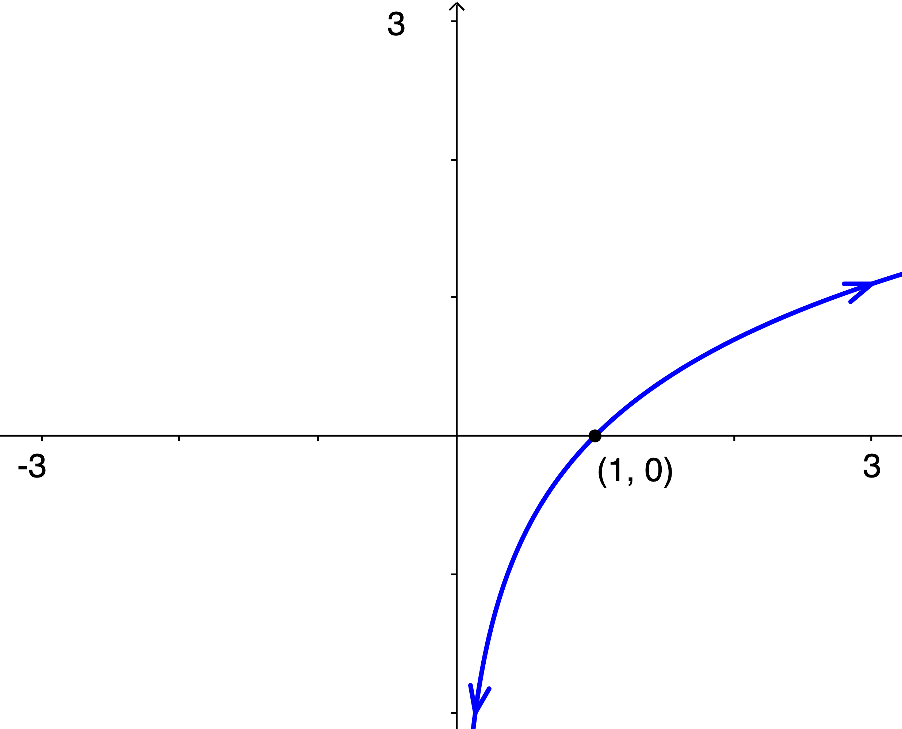
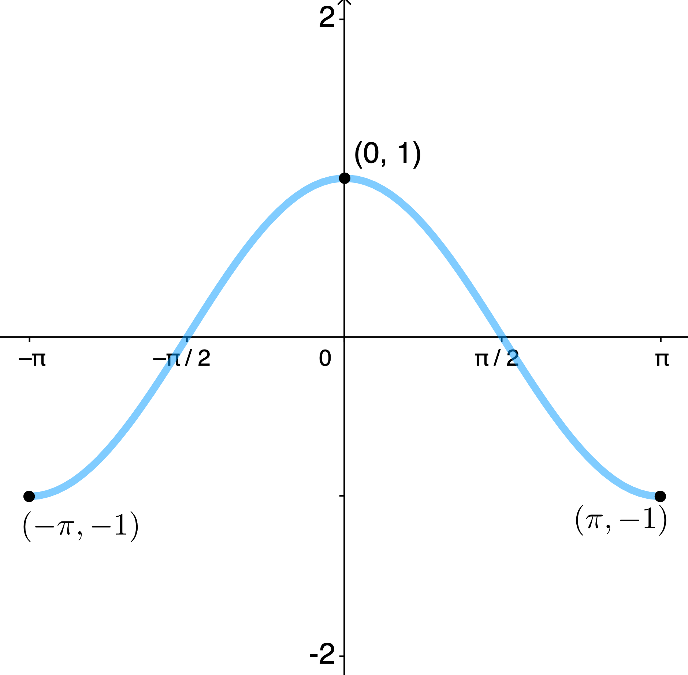
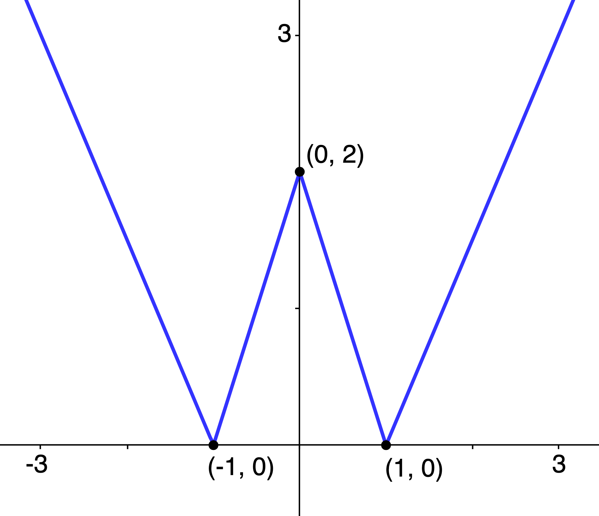
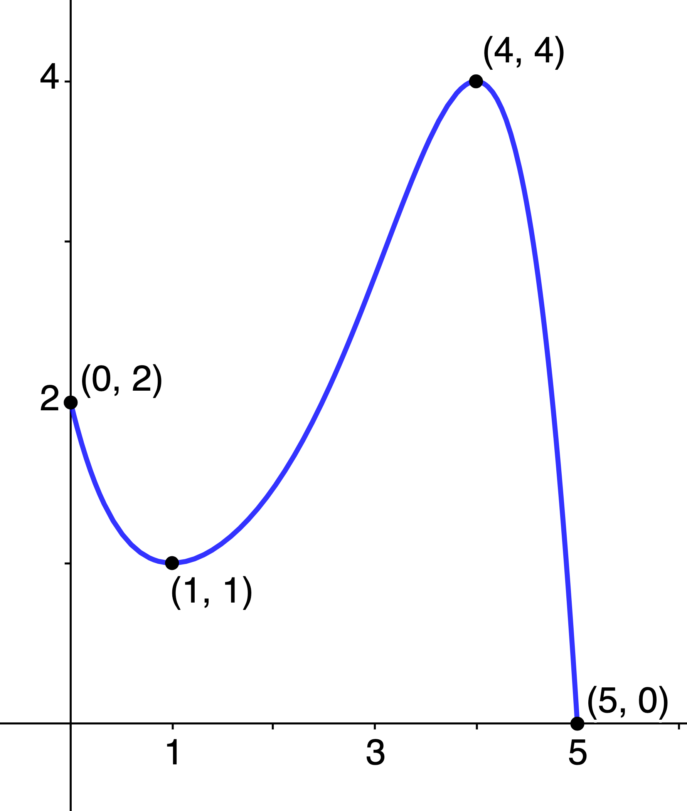
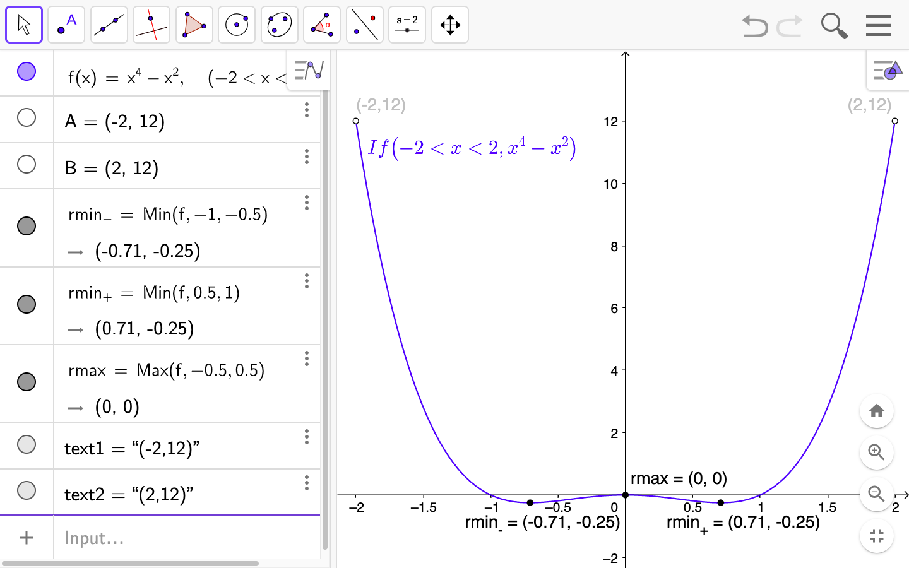
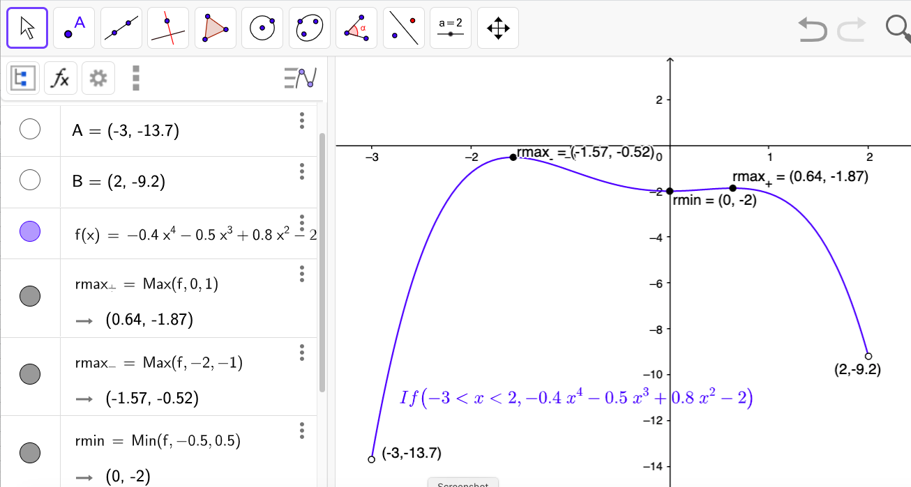
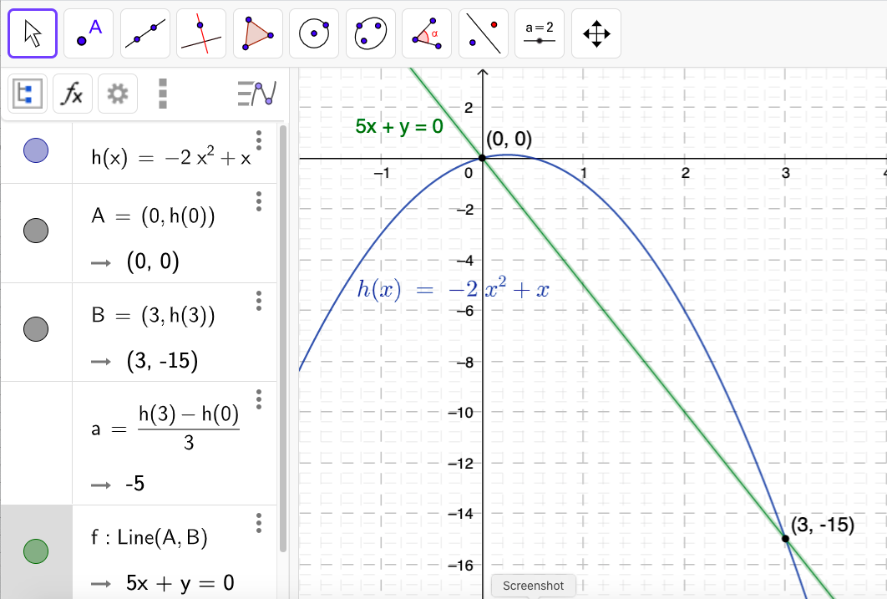
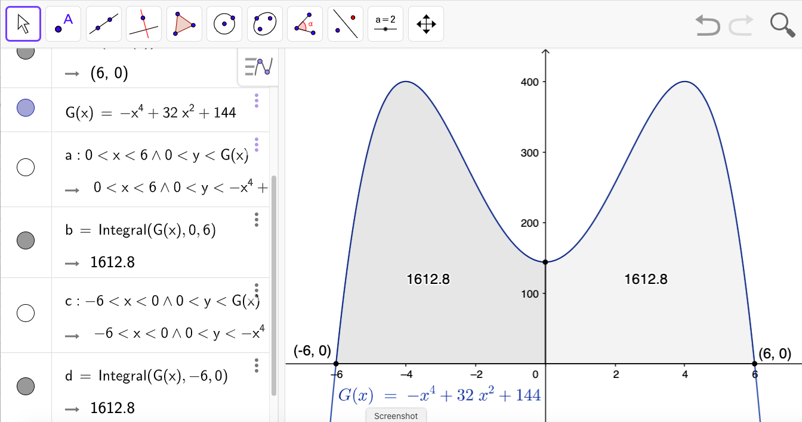
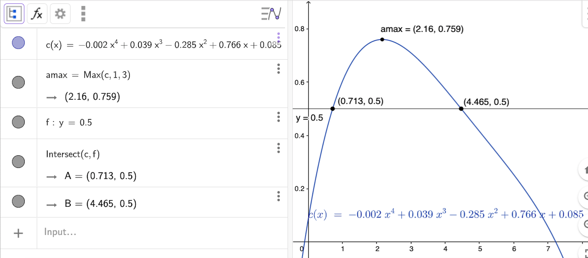

$\definecolor{red}{RGB}{255,0,0}
\definecolor{orange}{RGB}{245, 165, 0}
\definecolor{yellow}{RGB}{255,215,0}
\definecolor{green}{RGB}{0,255,0}
\definecolor{indigo}{RGB}{0,0,255}
\definecolor{violet}{RGB}{138,43,226}
\definecolor{black}{RGB}{0,0,0}$
$\require{cancel}$

#### 
Sullivan, M., 2012. <i>Algebra & Trigonometry, Ninth Edition.</i> Prentice Hall, Boston
#### 
Chapter 3, Section 3: "Properties of Functions"
#### 
to be included in the main Chapter write up

In Problems __24__ and __26__, the graph of a function is given; use the graph to find: __a__) the intercepts, if any; __b__) the domain and range; __c__) the intervals on which it is increasing, decreasing, or constant; and __d__) whether it is even, odd, or neither.

__24__) 

__Sln__: The arrows are "almost everything" in this problem: by convention, they are understood to imply that the function "goes down forever" to the left and "goes up forever" to the right, i.e., the range is all real numbers.&nbsp; Also by convention, if this function had a $y$-intercept, it would be shown, thus the fact that a $y$-intercept isn’t indicated is understood to mean that it doesn’t have one; additionally, the fact that the left arrow does indicate that the curve continues to the left as it goes down, together with the fact that it never intersects the $y$-axis, imply that the function is well-defined for positive $x$, no matter how small in absolute value, i.e., "arbitrarily close" to zero (just not zero itself, and definitely not for any negative $x$).&nbsp; Combining this with our  observation above about the right arrow, we conclude that the domain is all (strictly) positive real numbers, and that __a__) $\boxed{\text{the }x\text{-intercept }(1,0)\text{ is the only intercept}}$, and that __b__) $\boxed{\text{the domain is }\{x|x \gt 0\}\text{ or }(0,\infty)\text{ and the range is }\mathbb{R}\text{ or }(-\infty,\infty).}~$ __c__) As we go from left to right, it is always increasing, so it is $\boxed{\text{increasing on its entire domain, i.e., on } (0,\infty).}~$ __d__) And since it isn’t even defined for negative $x$, it is (trivially) $\boxed{\text{neither}}$ even nor odd.  
  

__26__) 

__Sln__: __a__) It has a clearly-indicated $\boxed{y\text{-intercept of }(0,1)}$ and implied $\boxed{x\text{-intercepts at }\left(-\frac{\pi}2,0\right)\text{ and }\left(\frac{\pi}2,0\right).}~$ __b__) Its domain is $\boxed{[-\pi,\pi]}$ (i.e., all real numbers between $-\pi$ and $\pi$, inclusive) and its range is $\boxed{[-1,1]}$ (all real numbers between $-1$ and $1$, inclusive).&nbsp; __c__) It is increasing on the (open) interval $\boxed{(-\pi,0)}$ and decreasing on the (open) interval $\boxed{(0,\pi)}$ (it is neither increasing nor decreasing at $x=0,\pm1$).&nbsp; __d__) It is symmetric with respect to the $y$-axis, so it is an $\boxed{\text{even}}$ function. 
  

__30__) Use the graph of $f(x)$ below to find: __a__) the numbers, if any, at which $f$ has a local maximum value and state what those local maximum values are; and __b__) same for local minimum values of $f(x)$?

__Sln__: __a__) At $\boxed{x=0}$, $f$ has a local $\boxed{\text{maximum of }2}$; and __b__) at both $\boxed{x=-1\text{ and }x=1}$, $f$ has the same local $\boxed{\text{minimum of }0.}$
  

In Problems __36__, __40__, and __44__, determine algebraically whether the given function is even, odd, or neither.

__36__) $h(x) = 3x^3 + 5$

__Sln__: $h(-x) = 3(-x)^3 + 5 = -3x^3+5 \ne 3x^3+5$ (in general), so $h$ is not even; nor does it equal $-h(x) = -3x^3-5$ (in general), so it is not odd, so it is $\boxed{\text{neither.}}$
  

__40__) $f(x) = \sqrt[\large3]{2x^2 + 1}$

__Sln__: $f(-x) = \sqrt[\large3]{2(-x)^2 + 1} = \sqrt[\large3]{2x^2 + 1} = f(x)$ for all $x$, so $f$ is $\boxed{\text{even.}}~$ (Note: we don’t need to check for odd-ness because a function can’t be both even and odd; proof?) 
  

__44__) $\displaystyle F(x) = \frac{2x}{|x|}$

__Sln__: $\displaystyle F(-x) = \frac{2(-x)}{|-x|} = \frac{-2x}{|x|} = -\frac{2x}{|x|} = -F(x)$ for all $x$ so $F$ is $\boxed{\text{odd.}}$
  

__46__) Use the graph of $f(x)$ below to find its absolute maximum and absolute minimum, if they exist.

__Sln__: $f$ has an $\boxed{\text{absolute maximum value of }4\text{ at }x = 4}$ and an $\boxed{\text{absolute minimum value of }0\text{ at }x = 5}$
  

In Problems __56__ and __60__, use a graphing utility to graph each function over the indicated interval and approximate any local maximum values and local minimum values.&nbsp; Determine where the function is increasing and where it is decreasing.&nbsp; Round answers to two decimal places.

__56__) $f(x) = x^4 - x^2,~(-2, 2)$

__Sln__: 

The function has $\boxed{\text{local minima of }-0.25\text{ at }x \doteq \pm0.71}$ and $\boxed{\text{a local maximum of }0\text{ at }x=0}$ (i.e., at the origin).&nbsp; By inspection, the function is $\boxed{\text{decreasing on the open intervals }-2 \lt x \lt -0.71 \text{ and } 0 \lt x \lt 0.71}$ and $\boxed{\text{increasing on the open intervals }-0.71 \lt x \lt 0 \text{ and } 0.71 \lt x \lt 2}$. 
  

__60__) $f(x) = -0.4x^4 - 0.5x^3 + 0.8x^2 - 2,~(-3, 2)$

__Sln__:

The function has two local maxima&mdash;one $\boxed{\doteq -0.52\text{ at }x \doteq -1.57}$ and one $\boxed{\doteq -1.87\text{ at }x \doteq 0.64}$&mdash;and a local minimum of $\boxed{-2 \text{ at } x=0}$.&nbsp; By inspection, the function is $\boxed{\text{increasing on the open intervals }-3 \lt x \lt -1.57 \text{ and } 0 \lt x \lt 0.64}$ and $\boxed{\text{decreasing on the open intervals }-1.57 \lt x \lt 0 \text{ and } 0.64 \lt x \lt 2}$. 
  

__66__) For $f(x) = -4x + 1$, find: __a__) the average rate of change from $x=2$ to $x=5$; and __b__) an equation of the secant line containing $(2,f(2))$ and $(5,f(5))$.

__Sln__: __a__) The average rate of change of $f$ from $x=2$ to $x=5$ is: $\displaystyle \frac{f(5)-f(2)}{5-2} = \frac{-4(5)+1-(-4(2)+1)}3 = \frac{-19-(-7)}3 =$ $\frac{-12}3 = \boxed{-4}$.

__b__) The secant line between two points of a line is simply the line itself (proof?), thus the required equation is simply $\boxed{y=-4x+1}$
  

__70__) For $h(x) = -2x^2 + x$, find: __a__) the average rate of change from $x=0$ to $x=3$; and __b__) an equation of the secant line containing $(0,h(0))$ and $(3,h(3))$.

__Sln__: For both parts, we need the values of $h(0) = -2(0^2) + 0 = 0$ and $h(3) = -2(3^2) + 3 = -15.~$ Therefore, the average rate of change (__a__) is $\frac{h(3)-h(0)}{3-0} = \frac{-15}3 = \boxed{-5}$ and the equation of the secant line (__b__) is the equation of the line containing the points $(0,0)$ and $(3,-15)$; now the equation of any (oblique) line containing the origin is of the form $y=mx$ (why?), so we simply need to find $m$ from the fact that $-15=m(3)$ must be a true statement; this implies $m=-5$, so the equation of the secant line is: $$\boxed{y = -5x}$$

 

__74__) Given $G(x) = -x^4 + 32x^2 + 144$

__a__) Determine whether $G$ is even, odd, or neither. 

__Sln__: $G(-x) = -[(-x)^4] + 32[(-x)^2] + 144 = -(-1)^4x^4 + 32(-1)^2x^2 + 144 = -x^4 + 32x^2 + 144 = G(x)$ for all $x$, therefore $G(x)$ is $\boxed{\text{even.}}$
 

__b__) There is a local maximum value of 400 at $x = 4$; determine a second local maximum value.
__Sln__: Since $G(x)$ is even, it is symmetric about the $y$-axis; therefore, if $G(4)$ is a local maximum, so must be $G(-4) = G(4) = 400$, i.e., $\boxed{(-4,400)}$ is a second local maximum.
 

__c__) Suppose the area under the graph of $G$ between $x = 0$ and $x = 6$ that is bounded below by the $x$-axis is 1612.8 square units; using the result from part __a__), determine the area under the graph of $G$ between $x = -6$ and $x = 0$ bounded below by the $x$-axis.

__Sln__: Again, since $G$ is even, and therefore symmetric about the $y$-axis, the area described between $x = -6$ and $x = 0$ must equal the same area between $x = 0$ and $x = 6$, i.e., $\boxed{1612.8\text{ square units}}.~$ Here’s a picture:

(Note: the use of GeoGebra’s Integral function to compute the areas of the described regions is beyond the scope of this course, though, perhaps arguably, the method by which the described regions are defined and graphed, is not.)
  

__76__) __Medicine Concentration__ The concentration, $C$, of a medication in the bloodstream $t$ hours after being administered is modeled by the function:

$$C(t) = -0.002t^4 + 0.039t^3 - 0.285t^2 + 0.766t + 0.085$$

__a__) After how many hours will the concentration be highest?

__Sln__: I.e., at what time, $t_{max}$, will $C$ attain a maximum.&nbsp; Until Calculus, (and even after Calculus, actually) to answer this question, we need to use a graphing utility:

 

__b__) A woman nursing a child must wait until the concentration is below 0.5 before she can feed him.&nbsp; After taking the medication, how long must she wait before feeding
her child?

__Sln__: We need the time(s) after which the concentration is less than 0.5, i.e., $t$ such that $C(t)\lt 0.5$; we don’t have the "algebraic machinery" (and won’t in this course) to figure this out algebraically, so we need to solve it graphically using technology.&nbsp; One way to do this is illustrated in the above graph: we superimpose the graph of $y=0.5$ on the graph of $C(t)$ and the times for which the graph of the latter is below the graph of the former are the time ranges in which it is OK to nurse.&nbsp; But note that the graph of $C(t)$ starts out below $y=0.5$: $C(0)=0.085 \lt 0.5$, so if it is really true that she can nurse anytime the concentration is below $0.5$, she can nursing from  immediately after medicine administration (and before, of course) till the time at which the concentration first equals $0.5$, which we see from the graph is $\boxed{\doteq 0.713\text{ hr }= 42.78\text{ min}}$  

__80__) For the function $f(x) = x^2$ compute each average rate of
change: __a__) from $x=1$ to $x=2$; __c__) from $x=1$ to $x=1.1$; __e__) from $x=1$ to $x=1.001$; __h__) what is happening to the slopes of the secant lines? Is there some number that they are getting closer to?
What is that number?

__Sln__: 

__a__) $\displaystyle\frac{f(2)-f(1)}{2-1} = \frac{2^2-1^2}1 = \boxed3$

__c__) $\displaystyle\frac{(1.1)^2-1^2}{1.1-1} = \frac{1.21-1}{0.1} = \frac{0.21}{0.1} = \boxed{2.1}$

__e__) $\displaystyle\frac{(1.001)^2-1^2}{1.001-1} = \frac{1.002001-1}{0.001} = \frac{0.002001}{0.001} = \boxed{2.001}$

__h__) As the upper $x$ value, $x_{upper}$, "approaches" the (fixed) lower value, $x_{lower}$ ($ = 1$ in this example), the slope of the secant line between the points $(x_{lower},f(x_{lower}))$ and $(x_{upper},f(x_{upper}))$, i.e., the average rate of change of $f$ from $x_{lower}$ to $x_{upper}$, appears to be approaching the (fixed) value $\boxed{2}.~$ (In Calculus one learns how to derive this result using a more general, and yet also more rigorous, analysis.&nbsp; In the meantime, the student is encouraged to contemplate why a more rigorous analysis might be desirable&mdash;hint: does a collection of examples prove a general statement? what if someone comes along some day and finds an example which contradicts the general statement?&mdash;and what that more rigorous analysis might "look like"&mdash;hint: what is needed is an analysis that is independent of any specific examples.)
  

__88__) Given the following definition for the slope, $m_{\large\text{sec}}$, of the secant line for $f(x)$ through the points $(x,f(x))$ and $(x+h,f(x+h))$: $$m_{\large\text{sec}} = \frac{f(x+h)-f(x)}h,~ h\ne0,$$
for $f(x)=x^{-2}$: 

__a__) Express the (simplified) slope of the secant line in terms of $x$ and $h$.

__Sln__: $\displaystyle m_{\large{\text{sec}}} = \frac{f(x+h)-f(x)}h = \frac{(x+h)^{-2}-x^{-2}}{h} = \frac1h\left[\frac1{(x+h)^2}-\frac1{x^2}\right] = \frac1h\left[\frac{x^2-(x+h)^2}{x^2(x+h)^2}\right] = \frac1h\left[\frac{x^2-x^2-2hx-h^2}{x^2(x+h)^2}\right] = $ $\displaystyle \frac1h\left[\frac{-2hx-h^2}{x^2(x+h)^2}\right] = \boxed{\frac{-2x-h}{x^2(x+h)^2}}$
 

__b__) Find $m_{\large\text{sec}}$ for $h = 0.5, 0.1,$ and $0.01$ at $x=1.~$ What value does $m_{\large\text{sec}}$ approach as $h$ approaches $0$?

__Sln__: $m_{\large\text{sec}}(x=1;h=0.5) = \displaystyle \frac{-2(1)-0.5}{1^2(1+0.5)^2} = \frac{-2.5}{(1)(1.5)^2} = \frac{-2.5}{2.25} = \boxed{-\frac{10}9 = -1.\bar1}$

$m_{\large\text{sec}}(x=1;h=0.1) = \displaystyle \frac{-2.1}{(1.1)^2} = \frac{-2.1}{1.21} = \boxed{-\frac{210}{121} \doteq -1.73553719}$

$m_{\large\text{sec}}(x=1;h=0.01) = \displaystyle \frac{-2.01}{(1.01)^2} = \frac{-2.01}{1.0201} = \boxed{-\frac{20100}{10201} \doteq -1.97039506}$

$m_{\large\text{sec}}(x=1)$ appears to be approaching $\boxed{-2}$ as $h$ approaches $0$.
 

__c__) Find the equation for the secant line at $x = 1$ with $h = 0.01$.

__Sln__: We just computed the required slope in the previous exercise, so we use the point-slope form for the equation of a line: $y-y_0=m(x-x_0)$ where $x_0 = 1, y_0 = f(1) = 1^{-2} = 1, m = \displaystyle -\frac{20100}{10201} \implies 10201(y-1)=-20100(x-1) \implies$ $$\boxed{20100x+10201y=30301}\text{ or } \boxed{y = -\frac{20100}{10201}x+\frac{30301}{10201} \doteq -1.970x + 2.970}$$
 

__d__) Use a graphing utility to graph $f$ and the secant line found in part __c__) in the same viewing window

__Sln__: 
