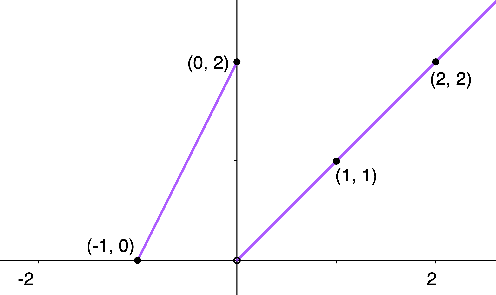

$\definecolor{red}{RGB}{255,0,0}
\definecolor{orange}{RGB}{245, 165, 0}
\definecolor{yellow}{RGB}{255,215,0}
\definecolor{green}{RGB}{0,255,0}
\definecolor{indigo}{RGB}{0,0,255}
\definecolor{violet}{RGB}{138,43,226}
\definecolor{black}{RGB}{0,0,0}$
$\require{cancel}$

#### 
Sullivan, M., 2012. <i>Algebra & Trigonometry, Ninth Edition.</i> Prentice Hall, Boston
#### 
Chapter 3, Section 4: Library of Functions; Piecewise-defined Functions
#### 
to be included in the main Chapter write up

In Problems __32__, __36__, and __40__: __a__) Find the domain of the given function; __b__) locate any intercepts; __c__) graph the function;
__d__) based on the graph, find the range; __e__) is f continuous on its domain?

__32__) $f(x) = \left\{\begin{array} \\ x + 3 & \text{if } x \lt -2 \\
-2x - 3 & \text{if } x \ge -2\end{array}\right.$

__Sln__:
  

__36__) $f(x) = \left\{\begin{array} \\ x^{-1} & \text{if } x \lt 0 \\
\sqrt[\large3]x & \text{if } x \ge 0\end{array}\right.$ 

__Sln__:
  

__40__) $f(x) = \text{int}(2x)$

__Sln__:
  

__44__) Write a definition for the piecewise-defined function whose graph is:

__Sln__:
  

__46__) If $f(x) = \text{int}\displaystyle\left(\frac x2\right)$ find
__a__) $f(1.2)$; __b__) $f(1.6)$; and __c__) $f(-1.8)$

__Sln__:
  

__52__) __Federal Income Tax__ Given the following revised "Y-1" 2009 tax rate schedule:

| Taxable Income Is Between | Tax Is This Plus | This % | Of The Excess Over |
| --- | --- | --- | --- |
| 0 - 16,700 | 0 | 10% | 0  |
| 16,700 - 67,900 | 1,670.00 | 15% | 16,700 |
| 67,900 - 137,050 | 9,350.00 | 25% | 67,900 |
| 137,050 - 208,850 | 26,637.50 | 28% | 137,050 |
| 208,850 - 372,950 | 46,741.50 | 33% | 208,850 |
| 372,950 - $\infty$ | 100,894.50 | 35% | 372,950 |

Construct a function $y = f(x)$ for Schedule Y-1.

__Sln__:
  

__56__) __Interest Payments for Credit Cards__ A credit card company charges the card holder interest of 1.5% per month for
the first \$1000 owed, and 1% per month on any unpaid
balance over \$1000.&nbsp; Find and graph the function $g$ that gives the amount of interest charged per month on a balance of $x$ dollars.

__Sln__:
  

__68__) Consider the equation:
$$y=\left\{
\begin{array} \\
1&\text{   if }x\text{ is rational} \\
0&\text{   if }x\text{ is irrational}
\end{array} 
\right.$$
Is this a function?&nbsp; What is its domain?&nbsp; What is its range?&nbsp; What is its y-intercept, if any?&nbsp; What are its x-intercepts, if
any?&nbsp; Is it even, odd, or neither?&nbsp; How would you describe its
graph?

__Sln__:
  