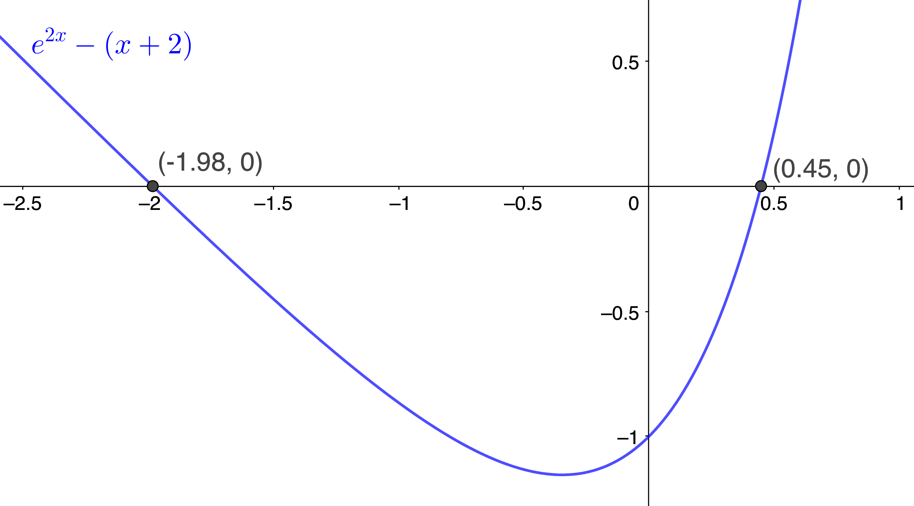
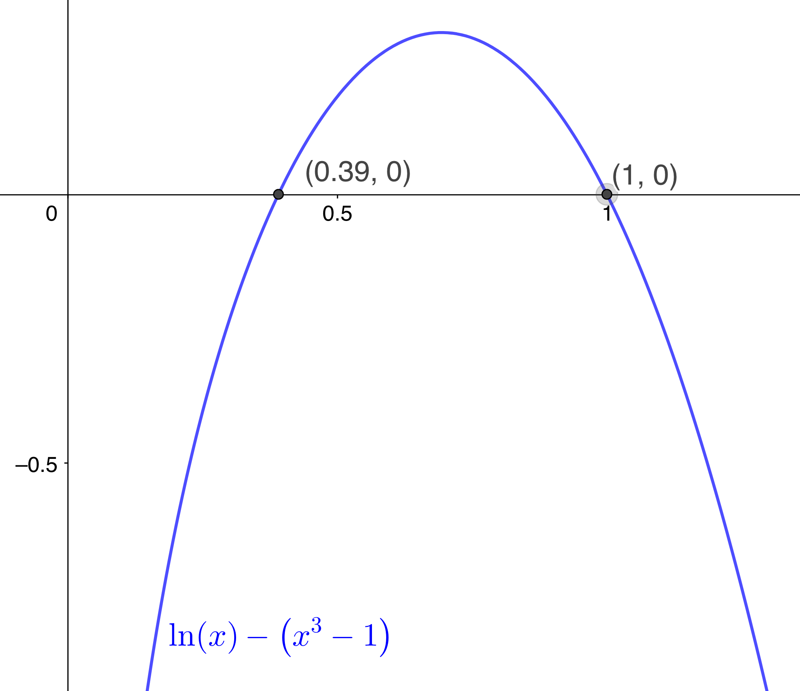
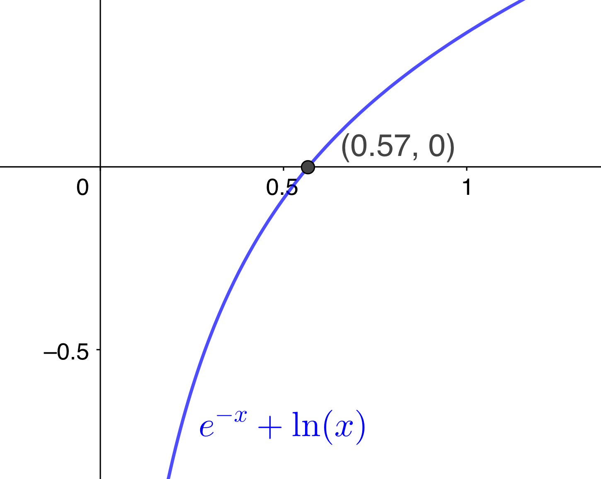
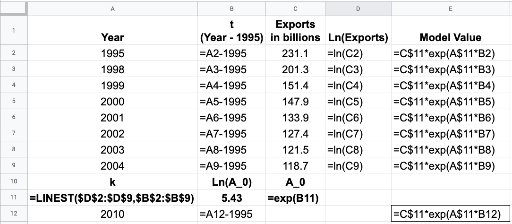
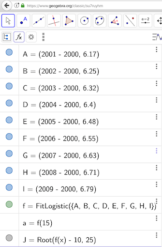
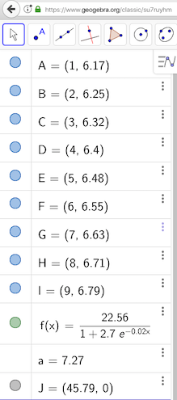
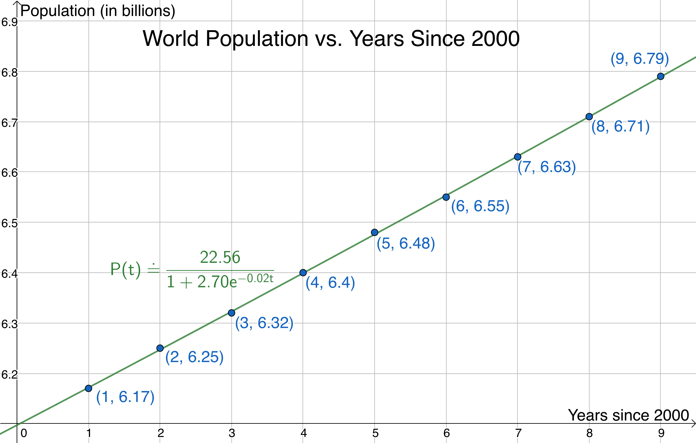

$\definecolor{red}{RGB}{255,0,0}
\definecolor{orange}{RGB}{245, 165, 0}
\definecolor{yellow}{RGB}{255,215,0}
\definecolor{green}{RGB}{0,255,0}
\definecolor{indigo}{RGB}{0,0,255}
\definecolor{violet}{RGB}{138,43,226}
\definecolor{black}{RGB}{0,0,0}$
$\require{cancel}$

#### 
Sullivan, M., 2012. <i>Algebra & Trigonometry, Ninth Edition.</i> Prentice Hall, Boston
#### 
Chapter 6: Exponential and Logarithmic Functions 
#### 
 Selected Exercise Solutions
#### 
&copy; 2020 by
#### 
David Lawrence Goldsmith
#### 
for
#### 
www.selectedsolutions.net

<i>Note:  These solutions are provided "as-is," for informational purposes only, with no warranty of any kind, expressed or implied, including that of correctness, adequacy, and/or suitability for any purpose, whatsoever.</i>&nbsp; Corrections are welcome and should be emailed to d.l.goldsmith@gmail.com.

## Section 1: Composite Functions

__8__) Given the following tabularly defined functions $f, g$:

<table>
  <tr>
<td>x<td>&ndash;3<td>&ndash;2<td>&ndash;1<td>0<td>1<td>2<td>3</td>
  </tr>
  <tr>
    <td>f(x)<td>11<td>9<td>7<td>5<td>3<td>1<td>&ndash;1</td>
  </tr>
  <tr>
<td>g(x)<td>&ndash;8<td>&ndash;3<td>0<td>1<td>0<td>&ndash;3<td>&ndash;8</td>
  </tr>
</table>

evaluate the specified function compositions.

__a__) $(f \circ g)(1)$ __Sln__: $(f \circ g)(1) = f(g(1)) = f(0) = \boxed{5}$

__d__) $(g \circ f)(3)$ __Sln__: $(g \circ f)(3) = g(f(3)) = g(-1) = \boxed{0}$

__f__) $(f \circ f)(3)$ __Sln__: $(f \circ f)(3) = f(f(3)) = f(-1) = \boxed{7}$
  

__10__) Evaluate the specified function compositions given the graphically defined functions $f,g$ as given in the text.

__Sln__: Converting the graphically given data in the text into a table here for convenience
<table>
  <tr>
<td>x<td>&ndash;1<td>1<td>2<td>3<td>4<td>5<td>6<td>7<td>8</td>
  </tr>
  <tr>    <td>f(x)<td>1<td>&ndash;1<td>&ndash;2<td>NS<td>NS<td>1<td>2<td>3<td>4</td>
  </tr>
  <tr>  <td>g(x)<td>3<td>4<td>2<td>1<td>2<td>4<td>5<td>5<td>ND</td>
  </tr>
</table>
(NS = not specified, ND = not defined) we have:

__a__) $(g \circ f)(1)$ __Sln__: $(g \circ f)(1) = g(f(1)) = g(-1) = \boxed{3}$

__d__) $(f \circ g)(2)$ __Sln__: $(f \circ g)(2) = f(g(2)) = f(2) = \boxed{-2}$
  

__14__, __17__, __20__) For the given functions $f,g$, evaluate __a__) $(f \circ g)(4)$ and __d__) $(g \circ g)(0)$.

__14__) $f(x) = 2x^2$, $g(x) = 1-3x^2$

__Sln__:
 

__17__ $f(x) = |x|$, $g(x) = \displaystyle\frac1{x^2+1}$

__Sln__:
 

__20__) $f(x) = x^{3/2}$, $g(x) = \displaystyle\frac2{x+1}$

__Sln__:
  

__22__, __25__, __28__)

__22__)

__Sln__:
 

__25__)

__Sln__:
 

__28__)

__Sln__:
  

__38__, __41__, __44__)

__38__)

__Sln__:
 

__41__)

__Sln__:
 

__44__)

__Sln__:
  

__46__, __49__, __52__)

__46__)

__Sln__:
 

__49__)

__Sln__:
 

__52__)

__Sln__:
  

__54__, __56__, __58__)

__54__)

__Sln__:
 

__56__)

__Sln__:
 

__58__)

__Sln__:
  

__62__)

__Sln__:
  

__64__)

__Sln__:
  

__67__)

__Sln__:
  

__70__)

__Sln__:
  

__73__) Given the following currency conversion rates

__Sln__:
  

__76__) If $f$ and $g$ are odd functions, show that the composite
function $f \circ g$ is also odd.

__Sln__:
  

## Section 2: One-to-One Functions; Inverse Functions

  

## Section 3: Exponential Functions

  

## Section 4: Logarithmic Functions

  

## Section 5: Properties of Logarithms

  

## Section 6: Logarithmic and Exponential Equations

__7__, __12__, __17__, __22__, __27__, __32__) Solve the logarithmic equation, giving both the exact answer and, when the solution is irrational, rounded to the nearest thousandth.

__7__) $\log_2(5x) = 4$ 

__Sln__: $\log_2(5x) = 4 \implies 2^4 = 5x \implies \boxed{x=\frac{16}5}$

__Check__: With logarithmic and exponential equations, the check step is an absolutely essential step in the solution procedure, because, with such equations, our solution-finding procedures are capable of giving us spurious solutions.

$\log_2[5(\frac{16}5)] = \log_2 16 = 4~~\checkmark$
  

__12__) $-2\log_4 x = \log_4 9$ 

__Sln__: $-2\log_4 x = \log_4 9 \implies \log_4 \left(x^{-2}\right) = \log_4 9 \implies x^{-2} = 9 \implies x^2 = \frac19 \implies x = \pm\frac13$.

__Check__: $-2\log_4(\frac13) = \log_4\left[\left(\frac13\right)^{-2}\right] = \log_4 9~~\checkmark$

$-2\log_4(-\frac13)$...a-ha!&nbsp; Here we run into a subtlety, and it gives us our first instance where our solution-finding procedure, though 100% valid, gives us an extraneous solution: order-of-operations tells us that, in the expression $-2\log_4 x$, there are, effectively, "understood" parentheses: $-2\log_4 x = -2 \cdot (\log_4 x).~$ Why is that a big deal here?&nbsp; Because it means that, even though formally $-2\log_4(-\frac13) = \log_4 (-\frac13)^{-2}$, and thus we might think that this should be equal to $\log_4\left[\left(-\frac13\right)^{-2}\right] = \log_4 9$, it doesn’t, because the expression $\log_4(-\frac13)$ ___is undefined___: we can’t apply an identity to an expression that isn’t well-defined to begin with!&nbsp; This is very important to remember: all the logarithmic identities are valid ___when all the expressions in the identity are well-defined___!

Thus the only solution of this equation is $\boxed{x=\frac13}$
  

__17__) $\log x + \log(x + 15) = 2$ 

__Sln__: $\log x + \log(x + 15) = 2 \implies \log\left[x(x+15)\right] = 2 \implies x(x+15) = 10^2 \implies x^2 + 15x - 100 = 0 \implies$ $(x+20)(x-5)=0 \implies x = 5$ or $x = -20.~$ But $x=-20$ makes both $\log x~\&~\log(x+15)$ undefined, so $\boxed{x=5}$ is the only solution.&nbsp; (Note that we’re under no obligation to wait till the check step to reject extraneous solutions; however, if we miss some, ___correctly___ doing the check step should reveal them.)

__Check__: $\log 5 + \log(5+15) = \log [5(20)] = \log 100 = 2~~\checkmark$
  

__22__) $\log_6(x + 4) + \log_6(x + 3) = 1$ 

__Sln__: $\log_6(x + 4) + \log_6(x + 3) = 1 \implies (x+4)(x+3) = 6 \implies x^2 + 7x + 6 = (x+6)(x+1) = 0 \implies x = -6$ or $x = -1.~$ Note: don’t be fooled by having gotten two negative solutions&mdash;that doesn’t necessarily mean either of them are wrong, because, in this case, we "do things" to these solutions before taking any logarithms in the original expressions, and that may make the arguments of the logarithms positive.&nbsp; In this case, we’ll determine that in the check step.

__Check__: $\log_6(-6 + 4) + \log_6(-6 + 3) = \log_6(-2) + \log_6(-3)$, both terms of which are undefined, so we reject $x=-6$.

$\log_6(-1 + 4) + \log_6(-1 + 3) = \log_6(3) + \log_6(2) = \log_6[3(2)] = \log_6 6 = 1~~\checkmark$

So the final solution is $\boxed{x=-1}$
  

__27__) $\log_3(x + 1) + \log_3(x + 4) = 2$ 

__Sln__: $\log_3(x + 1) + \log_3(x + 4) = 2 \implies (x+1)(x+4) = 3^2 = 9 \implies x^2 + 5x - 5 = 0 \implies$ $x = \displaystyle \frac{-5 \pm \sqrt{25-4(1)(-5)}}2 = \frac{-5 \pm 3\sqrt{5}}2 \doteq 0.854$ or $\doteq -5.854.~$ Clearly only the first solution keeps both $(x+1)$ and $(x+4)$ positive, so we reject $\frac{-5 - 3\sqrt{5}}2$ as a solution.

__Check__: This illustrates another benefit of doing the check step: practice doing arithmetic with complicated-but-exact expressions: 
$\log_3\left(\frac{-5 + 3\sqrt{5}}2 + 1\right) + \log_3\left(\frac{-5 + 3\sqrt{5}}2 + 4\right) = \displaystyle\log_3\left[\left(\frac{-5+3\sqrt5 + 2}2\right)\left(\frac{-5+3\sqrt5 + 8}2\right)\right] = $ $\displaystyle \log_3\left[\left(\frac{-3+3\sqrt5}2\right)\left(\frac{3+3\sqrt5}2\right)\right] = \log_3\frac{(3\sqrt5)^2-3^2}4 = \log_3 \left(\frac{45-9}4\right) = \log_3\frac{36}4 = \log_3 9 = 2~~\checkmark$

Final solution: $\boxed{x=\frac{3\sqrt5-5}2 \doteq 0.854}$

(As an additional exercise, and, perhaps, to further convince yourself that this is indeed the one and only solution, solve this equation using a graphing utility.)
  

__32__) $\log_a x + \log_a(x - 2) = \log_a(x + 4)$ 

__Sln__: The keys here are to not confuse the unknown base $a$ with a variable for which one needs to solve; and to not let it otherwise "intimidate" you: it’s just a number&mdash;presumably a positive real number $\ne 1$ so that the logarithm is well-defined&mdash;and we treat it just as if it were $10, e, 2,$ or any other such number.&nbsp; Thus: 

$\log_a x + \log_a(x - 2) = \log_a(x + 4) \implies \log_a\left[x(x-2)\right] = \log_a(x+4) \implies x(x-2)=x+4 \implies x^2 - 3x - 4 = 0 \implies$ $(x-4)(x+1)=0 \implies x=4$ or $x=-1.~$ However, $x=-1$ makes both $\log_a x$ and $\log_a(x-2)$ undefined, so we reject $x=-1$. 

__Check__: $\log_a4 + \log_a(4 - 2) = \log_a[4(2)] = \log_a 8 = \log_a (4 + 4)~~\checkmark$

Final solution: $\boxed{x=4}$
  

__35__, __40__, __45__, __50__, __55__, __60__) Solve the exponential equation, giving both the exact answer and, when the solution is irrational, rounded to the nearest thousandth.

__35__) $2^x=10$ 

__Sln__: $2^x=10 \implies \log_2(2^x) = \log_2 10 \implies \boxed{x = \log_2 10 \doteq 3.322}$

__Check__: $2^{\log_2 10} = 10~~\checkmark$
  

__40__) $0.3(4^{0.2x}) = 0.2$ 

__Sln__: $0.3(4^{0.2x}) = 0.2 \implies 4^{0.2x} = \frac{0.2}{0.3}=\frac23 \implies 0.2x = \log_4 2 - \log_4 3 = \frac12-\log_43 \implies$ $\boxed{x = \frac52-5\log_4 3 \doteq -1.462}$

__Check__: $0.3\left[4^{\displaystyle 0.2(\frac52-5\log_4 3)}\right] = 0.3\left[4^{\displaystyle (\frac12-\log_4 3)}\right] = 0.3\left(\displaystyle \frac{4^{1/2}}{4^{\log_4 3}}\right) = 0.3\displaystyle\left(\frac23\right) = 0.2~~\checkmark$
  

__45__) $1.2^x = (0.5)^{-x}$ 

__Sln__: $1.2^x = (0.5)^{-x} = \left(\frac12\right)^{-x} = 2^x$ and the only way that $a^x$ can equal $b^x$ if $a \ne b$ is if $\boxed{x=0}.~$ (One can continue solving this algebraically&mdash;in at least two different ways; the Reader is encouraged to do so&mdash;but if you’re in a timed situation, such as a timed test, it’s best if you understand and can use that basic fact.)

__Check__: $(1.2)^0 = 1 = (0.5)^{-0}~~\checkmark$
  

__50__) $3^{2x} + 3^x - 2 = 0$ 

__Sln__: $3^{2x} + 3^x - 2 = (3^x)^2 + 3^x - 2 = y^2 + y - 2 = 0$, where $y=3^x$; this gives $(y+2)(y-1)=0 \implies y = -2$ or $y = 1.~$ However, there is no value of $x$ such that $3^x = -2$, so $3^x = 1 \implies \boxed{x=0}$ is the only solution.

__Check__: $3^{2(0)} + 3^0 - 2 = 1 + 1 - 2 = 0~~\checkmark$
  

__55__) $25^x - 8\cdot 5^x = -16$ 

__Sln__: $25^x - 8\cdot 5^x = (5^2)^x - 8 \cdot 5^x = (5^x)^2 - 8 \cdot 5^x = -16 \implies y^2 - 8y + 16 = 0, y = 5^x \implies (y-4)^2 = 0 \implies$ $y = 4 = 5^x \implies \boxed{x = \log_5 4 \doteq 0.861}$

__Check__: $25^{\displaystyle \log_5 4} - 8\cdot 5^{\displaystyle \log_5 4} = 5^{\displaystyle 2\log_5 4} - 8(4) = 5^{\displaystyle \log_5 4^2} - 32 = 16 - 32 = -16~~\checkmark$
  

__60__) $3^x - 14 \cdot 3^{-x} = 5$ 

__Sln__: There are (at least) a couple ways to go about this: I’m going to "skip a step" and "jump" straight to multiplying through by $3^x$ (Reader: why is it "safe" to do this?&nbsp; Hint: why might it not be "safe" to do, and why can’t that happen for $3^x$?)&nbsp; We have:

$3^x(3^x - 14 \cdot 3^{-x}) = 5(3^x) \implies (3^x)^2 - 14 \cdot 3^{x-x} = 5(3^x) \implies (3^x)^2 - 5(3^x) - 14 = 0 = y^2 - 5y - 14, y = 3^x \implies$ $(y-7)(y+2)=0 \implies y=7=3^x$ or $y=-2=3^x$, the latter of which is impossible, so we get $\boxed{x=\log_3 7 \doteq 1.771}$

__Check__: $3^{\displaystyle \log_3 7} - 14 \cdot 3^{\displaystyle -\log_3 7} = 7 - 14(3^{\displaystyle \log_3 \frac17}) = 7 - 14(\frac17) = 7 - 2 = 5~~\checkmark$
  

__64__, __69__, __74__) Solve using a graphing utility, giving the answer rounded to the nearest hundredth.

__64__) $e^{2x} = x + 2$ 

__Sln__: There are two ways to solve equations like this graphically: one can either plot, on the same set of axes, the function on the left and the function on the right and use these graphs to identify where they intersect; or one can subtract one side from the other (it doesn’t matter which), thereby obtaining an equivalent equation (with one side a new function and the other side equal to zero), plot that single function and use the graph to identify where that new function intersects the the $x$-axis, i.e., equals zero; personally, I prefer the second approach.  

So, below is a plot of $f(x) = e^{2x} - (x+2)$, in which both the graph of $f$ and its zeros (of which there are two) were constructed/found using GeoGebra (see [Credits](#Credits) below) and its Root command.

__Check__: $e^{2(-1.98)} \doteq 0.019, (-1.98) + 2 = 0.02~~\checkmark$ (that’s the best we can hope for when retaining only two decimal places of precision);

$e^{2(0.45)} \doteq 2.46, (0.45) + 2 = 2.45~~\checkmark$ (ditto.)

Thus, to two decimal places, $e^{2x} = x + 2$ at $\boxed{x=-1.98}$ and at $\boxed{x = 0.45}$
  

__69__) $\ln x = x^3 - 1$ 

__Sln__: Plotting $f(x) = \ln x - (x^3 - 1)$ using GeoGebra and using its Root command:

  
 
 we see there are zeros at $x \doteq 0.39$ and at $x = 1$, the latter of which turns out to be exact.

__Check__: $\ln (0.39) \doteq -0.94, (0.39)^3 - 1 \doteq -0.94~~\checkmark$

The check for $x = 1$ is left to the Reader.

Thus $\ln x = x^3-1$ approximately at $\boxed{x = 0.39}$ and exactly at $\boxed{x = 1}$. 
  

__74__) $e^{-x} = -\ln x$ 

__Sln__: Graphing $f(x) = e^{-x} - (-\ln x) = e^{-x} + \ln x$:

and using GeoGebra’s Root command, we see that there is one zero at $x \doteq 0.57$.

__Check__: $e^{-0.57} \doteq 0.57, -\ln(0.57) \doteq 0.56~~\checkmark$

Therefore $e^{-x} = -\ln x$ at approximately $\boxed{x = 0.57}$
  

Henceforth, express solutions exactly and, if irrational, rounded to the nearest thousandth.

__78__) $\log_9 x + 3\log_3 x = 14$ 

__Sln__: Start by using the change-of-base formula: $\log_9 x + 3\log_3 x = \displaystyle \frac{\log_3 x}{\log_3 9} + 3\log_3 x = \frac{\log_3 x}2 + 3\log_3 x = \left(\frac12+3\right)\log_3 x = \frac72\log_3 x =14 \implies \log_3 x = 14\left(\frac27\right)$ $\implies \log_3 x = 4 \implies \boxed{x=3^4=81}$

__Check__: Left to the Reader.
  

__83__) $\displaystyle \frac{e^x - e^{-x}}2 = 2$

__Sln__: This Problem is "special" because this combination of $e^x$ and $e^{-x}$ (and the one in Problem 82) is important enough in later math, physics, and engineering, that it has received its own special name: $\sinh x \equiv \displaystyle \frac{e^x-e^{-x}}2$ (and $\cosh x \equiv \displaystyle \frac{e^x+e^{-x}}2$).

Start by multiplying through by $2e^x$: $2e^x\left(\displaystyle \frac{e^x - e^{-x}}2\right) = 2e^x(2) \implies (e^x)^2 - 1 = 4e^x \implies (e^x)^2 - 4e^x - 1 = 0$ $\implies y^2 - 4y -1 = 0, y = e^x \implies y = \displaystyle \frac{4 \pm \sqrt{16 - 4(1)(-1)}}2 = \frac{4\pm\sqrt{20}}2 = 2 \pm \sqrt5 = e^x.~$ But $\sqrt5 \doteq 2.236 \gt 2 \implies 2 - \sqrt5 \lt 0 \implies e^x = 2-\sqrt5$ has no solution; therefore, $\boxed{x = \ln(2+\sqrt5) \doteq 1.444}$ is the one and only solution.

__Check__: $\displaystyle \frac{e^{\ln(2+\sqrt5)} - e^{-\ln(2+\sqrt5)}}2 = \frac12\left[(2+\sqrt5)-\frac1{2+\sqrt5}\right] = \frac12\left[(2+\sqrt5)-\frac{2-\sqrt5}{(2+\sqrt5)(2-\sqrt5)}\right]=\frac12\left[(2+\sqrt5)-\frac{2-\sqrt5}{4-5}\right]$ $=\frac12\left[(2+\sqrt5)-\frac{2-\sqrt5}{-1}\right]=\frac12(2+\sqrt5+2-\sqrt5) = \frac12(4) = 2~~\checkmark$
  

__88__) Given $f(x) = \log_3(x + 5), g(x) = \log_3(x - 1)$

__a__) Solve $f(x) = 2.~$ What is that point on the graph of $f$?

__Sln__:

__Check__:
 

__c__) Solve $f(x)=g(x).~$ Do the their graphs intersect, and if so, where?

__Sln__:

__Check__:
 

__e__) Solve $(f-g)(x)=2$

__Sln__:

__Check__:
  

__93__) __a__) Graph $f(x) = 2^{x+1}$ and $g(x) = 2^{-x+2}$ on the same Cartesian plane; __b__) shade the region bounded by $f,g,$ and the $y$-axis (i.e., the line $x=0$); and __c__) solve $f(x) = g(x)$ and label that point on the graph.

__Sln__:

  

__98__) Given the 2009 world population model $P(t) = 6.78(1.0114)^{t-2009}, P = $ world population in billions of people, $t =$ year

__a__) When will the world population be 8.7 billion people?

__Sln__: $\displaystyle P(t) = 6.78(1.0114)^{t-2009} = 8.7 \implies (1.0114)^{t-2009} = \frac{8.7}{6.78} \implies (t-2009)(\ln 1.0114) = \ln(8.7/6.78) \implies$ $\displaystyle t = 2009 + \frac1{\ln 1.0114}[\ln(8.7/6.78)] \doteq 2009 + 21.997 \doteq \boxed{2031}$

__Check__: $\displaystyle P(2031) = 6.78(1.0114)^{2031-2009} = 6.78(1.0114)^{22} \doteq 6.78(1.28323112) \doteq 8.70~~\checkmark$
 

__b__) When will it be 14 billion?

__Sln__: Skipping all the preliminaries: $\displaystyle t = 2009 + \frac1{\ln 1.0114}[\ln(14/6.78)] \doteq 2009 + 63.97 \doteq \boxed{2073}$

__Check__: $\displaystyle P(2073) = 6.78(1.0114)^{2073-2009} = 6.78(1.0114)^{64} \doteq 6.78(2.06570716) \doteq 14.0~~\checkmark$
  

## Section 7: Financial Models

  

## Section 8: Exponential Growth and Decay Models; etc.

__8b__) The population of a city follows an exponential law such that in 2008 the population was 900,000 and in 2010 the population was 800,000.&nbsp; Assuming the same model continues to hold, what will be the population in 2012?

__Sln__: Given that the population follows an exponential law, we may immediately write: $$P(t) = P_0 e^{r(t-t_0)} = 900 e^{r(t-2008)}$$
where: $P$ is the population (in thousands); $t$ is the (calendar) year; and $r$, the "intrinsic growth rate" (which we expect to be negative, since the population is declining) is to be determined.&nbsp; This we do using the the additional knowledge that $P(2010) =800 \text{ (thousand)} = 900e^{r(2010-2008)} = 900e^{2r} \implies r = \displaystyle \frac12\ln \frac89 \doteq -0.0589.~$ Therefore, $\displaystyle P(2012) = 900e^{0.5\ln(8/9)(2012-2008)} = 900e^{2\ln(8/9)} = 900(e^{\ln(8/9)})^2 = 900\left(\frac89\right)^2 = \boxed{\frac{6400}9 \doteq 711 \text{ (thousand)}}$. 

__Check__: How do we "check" this result?&nbsp; Well, this is supposed to be the result assuming that the same exponential law continues to hold, so one way to check it is to use it&mdash;that is, the "data point" $(2012, \frac{6400}9)$&mdash;instead of, say, $(2010, 800)$, to determine $r$ and make sure that one gets the same value as before; doing this is left to the Reader.

__Comment__: This exercise should drive home the difference between exponential change and linear change: given the same data&mdash;(2008, 900,000), (2010, 800,000)&mdash;if the population decline were assumed to follow a linear model, the population in 2012 would be trivial to calculate, because 2012 is the same "distance away from" 2010 as 2010 is from 2008; by the fundamental nature of linear change, therefore, if a linear model were governing, the change in population from 2010 to 2012 would be the same as the change from 2008 to 2010, namely, $-100$,$000$; thus, if a linear change model were governing, the population in 2012 would be simply $800$,$000 - 100$,$000 = 700$,$000.~$ <i>If a linear model is governing, then a fixed change in the independent variable results in a fixed change in the dependent variable; whereas, if an exponential model is governing, then a fixed change in the independent variable results is a fixed ratio of change in the dependent variable.</i>
  

__12__) A fossil leaf contains 70% of the carbon-14 of a present-day leaf; if the half-life of carbon-14 is 5600 years, estimate the age of the fossil.

__Sln__: In a doubling-time (or half-life) problem, I find it convenient to write the exponential model using 2 (or 1/2) as the base instead of $e$: $$P(t) = P_0\left(\frac12\right)^{\frac t{5600}}$$
This is because: $\displaystyle P(0) = P_0\left(\frac12\right)^{\frac 0{5600}} = P_0\left(\frac12\right)^0 = P_0(1) = P_0$; $\displaystyle P(5600) = P_0\left(\frac12\right)^{\frac{5600}{5600}} = P_0\left(\frac12\right)^1 = \frac12P_0$; and it’s trivially easy to write down this way when the doubling-time/half-life is given.&nbsp; "70% of" means "0.7 times," so we need to solve $\displaystyle 0.7(P_0) = P_0\left(\frac12\right)^{(t/5600)} \implies  0.7 = \left(\frac12\right)^{(t/5600)}$for $t.~$ Taking the $\log_2$ of both sides and using the identity $\log \frac1a = -\log a$ yields  $\log_2 0.7 = -\frac t{5600} \implies t = -5600\log_2 0.7 \doteq 2880$: the fossil is approximately $\boxed{2880\text{ years old.}}$

__Check__: Left to the Reader.
  

__16__) In a room of constant temperature 70&deg;F, a beer stein (mug) warms from an initial temperature of 28&deg;F to 35&deg;F in 10 minutes.

__a__) What temperature will the stein be after 30 minutes?

__Sln__: Assuming Newton’s Law of Heating (the same as Newton’s Law of Cooling) holds, the temperature $u(t)$ is related to the given data by the formula $$u(t) = 70 + (28-70)e^{kt} = 70 - 42e^{kt}$$

To find $k$, we use the given that $u(10) = 35 = 70 - 42e^{10k} \implies 42e^{10k} = 35 \implies e^{10k} = \displaystyle \frac{35}{42} = \frac56 \implies \displaystyle k= \frac1{10}\ln\left(\frac56\right) \implies$ $$u(t) = 70 - 42e^{\ln(5/6)(0.1t)} = 70 - 42\left(\frac56\right)^{0.1t}$$

Thus $\displaystyle u(30) = 70 - 42\left(\frac56\right)^{0.1(30)} = 70 - 42\left(\frac56\right)^3 = 70 - 7\frac{125}{36} = \frac{2520-875}{36} = \boxed{\frac{1645}{36} \doteq 45.7^{\circ}\text{F}}$

__Check__: Left to the Reader (see the Check for Problem 8b for how).
   

__b__) How long will it take for the stein to reach a temperature of 45&deg;F?

__Sln__: Based on the result in Part a, we are expecting an answer just a little less than 30 minutes.&nbsp; We need to solve $\displaystyle 45 = 70 - 42\left(\frac56\right)^{0.1t}$ for $t.~$ This gives: $\displaystyle 25 = 42\left(\frac56\right)^{0.1t} \implies \frac{25}{42} = \left(\frac56\right)^{0.1t} \implies \ln\left(\frac{25}{42}\right) = \ln\left(\frac56\right)\frac t{10}$ $\displaystyle \implies$ $$\boxed{t = 10\frac{\ln(25/42)}{\ln(5/6)} \doteq 28.5\text{ minutes}}$$

__Check__: $\displaystyle u(10\ln\left(\frac{25}{42}\right)/\ln\left(\frac56\right)) = 70 - 42\left(\frac56\right)^{(0.1)10\ln\left(\frac{25}{42}\right)/\ln\left(\frac56\right)} = 70 - 42\left(\frac56\right)^{\log_{\frac56}\frac{25}{42}} = 70 - 42\left(\frac{25}{42}\right) = 70 - 25 = 45^{\circ}\text{F}~~\checkmark$
  

__21__) How long must one wait before iodine-131 (half-life 8 days) decays to 10% of its initial value?

__Sln__: The required model may be written: $$\displaystyle P(t) = P_0\left(\frac12\right)^{t/8}$$
where $t$ is time elapsed (in days).&nbsp; We need to find $t$ such that $P(t)$ is 10% $= \frac1{10}$-th of $P_0$, i.e., we need to solve $\displaystyle 0.1P_0 = P_0\left(\frac12\right)^{t/8} \implies 0.1 = \left(\frac12\right)^{t/8}$ for $t.~$ Taking $\log_2$ of both sides and using the identity $\log \frac1a = -\log a$ gives: $\displaystyle -\log_2 10 = -\frac t8 \implies \boxed{t = 8\log_2 10 \doteq 26.6\text{ days}}$

__Check__: $\displaystyle (0.5)^{(26.6/8)} \doteq 0.10~~\checkmark$
  

__24__) Given the logistic population model $$P(t) = \frac{500}{1+83.33e^{-0.162t}}$$

__a__) Determine the carrying capacity of the environment.

__Sln__: When a logistic population model is in the form $\displaystyle \frac{A}{1+Be^{-rt}}$, the carrying capacity is simply $A$, so the carrying capacity according to this model is simply $\boxed{500 \text{ bald eagles}}$
  

__e__) When will the population be half the carrying capacity?

__Sln__: We need to solve $\displaystyle \frac{500}{1+83.33e^{-0.162t}}=250 \implies 1+83.33e^{-0.162t} = \frac{500}{250} = 2 \implies 83.33e^{-0.162t} = 1 \implies e^{0.162t} = 83.33 \implies$ 

$0.162t = \ln 83.33 \implies \boxed{t = \frac{\ln 83.33}{0.162} \doteq 27.3\text{ years}}$

__Check__: $\displaystyle P(27.3) = \frac{500}{1+83.33e^{-0.162(27.3)}} = \frac{500}{1+83.33e^{-4.4226}} \doteq \frac{500}{1+83.33(0.012)} \doteq \frac{500}{1+1.000} = 250~~\checkmark$
  

## Section 9: Building ELL Models from Data 

__4__) Using technology, build an exponential model from data on U. S. exports of cigarettes vs. years since 1995: __a__) provide a scatter plot of the raw data; __b__) calculate the parameters of the exponential model; __c__) write the model in the form $A(t) = A_0e^{kt}$; __d__) plot $A(t)$ with the scatter plot; __e__) use the model to predict the number of cigarettes the U. S. will export in 2010.

__Sln__: Although GeoGebra is capable of doing this (when I write this in 2020, pretty much any calculator technology is), I’m accustomed to using a spreadsheet application&mdash;specifically, Google Sheets (see [Credits](#Credits))&mdash;for regression, and the Reader is probably well-advised to learn how to use this technology as well.&nbsp; One "problem," however: Google Sheets doesn’t have a "built-in" exponential regression function*, so we have to do some of the work otherwise done by the calculator, as is shown in the text; but that’s a good thing, because to understand that little extra work, we’ll learn what the calculator is doing "behind the scenes."

It’s stipulated that the model for this data is of the form $A(t)=A_0e^{kt}$ (in "real life," this wouldn’t necessarily/typically won’t be given to you: that’s the importance of making the scatter plot, to see which underlying theoretical model is most likely).&nbsp; Observe what happens if we take the natural logarithm of both sides:

$\ln[A(t)] = \ln \left(A_0e^{kt}\right) = \ln(A_0) + \ln(e^{kt}) = \ln(A_0) + kt = a + bt = y(t)$, where $a = \ln(A_0), b = k$, and $y(t) = \ln \left[A(t)\right]$.&nbsp; In other words, by taking the logarithm of both sides of the model (in this case, the natural logarithm, but any base logarithm will do), we see that the exponential model is equivalent to a linear model between the independent variable (in this case, $t$) and <i> the logarithm of</i> the dependent variable, $\ln \left[A(t)\right].~$ What this means in practice is that, in order to find the "parameters" of the exponential model (in this case $A_0$ and $k$), we perform linear regression <i>not</i> on the given values of $A$, but on the "log-transformed" values $\ln A$ ($t$ we leave "untransformed," because the log-transformed version of the model is $\ln(A) = a+bt$, i.e, $\ln(A)$ is a linear function of $t$, not of $\ln t$; I emphasize this because there <i>is</i> a regression situation in which one <i>does</i> log-transform <i>both</i> the dependent <i>and</i> the independent variable data before performing the linear regression, namely, fitting to a "power law" model, $y(t) = a (t^b) \iff \log y = \log a + b \log t$.)

The above is why, in the spreadsheet table below, you see a column containing the natural logarithm of the numbers of (billions of) cigarettes exported: the Google Sheets linear regression function LINEST (short for LINear ESTimator, because that’s what regression is: "fancy estimation") must be applied <i>not</i> to the actual numbers of cigarettes exported, but to the (natural) logarithm of those numbers.&nbsp; Then the results of the regression may be used in the original exponential model, except we must remember to "inverse-log-transform," i.e., "take the exponential function of" the "constant" or "$y$-intercept" term resulting from the regression (the "slope" result we don’t modify, but we must remember that it is the coefficient in the exponent portion of our model).

So, with that explanation, here is the Google Sheets table showing the  formulae used, followed by the same table showing the actual results and required scatter plot with superimposed model curve:

Note the answer to Part __e__)&mdash;(an estimated) $\boxed{68.7}$ (billion cigarettes exported from the U.S. in 2010)&mdash;boxed in spreadsheet "cell" E12. 

\* After I wrote this solution, in searching Google Sheets for a logistic regression function, I found that GS does indeed have an exponential regression function, LOGEST (not EXPEST as I expected and thus was looking for), and thus this problem can be done in Google Sheets without having to "manually" log-transform the dependent variable.&nbsp; However, I have elected to leave the solution as written, because I believe it is useful for the student to know what is going on with "transformable-to-linear" regression, and because the mathematics involved is well within the present scope.
  

__8__) Using technology, build a logistic model from world population data from 2001 through 2009: __a__) provide a scatter plot of the raw data with years since <i>2000</i> as the independent variable and population (in billions) as the dependent variable; __b__) build a logistic model from the data; __c__) plot the model curve superimposed on the scatter plot; __d__) based on the resulting model, what is the (estimated, human) carrying capacity of the world; __e__) use the resulting model to estimate world population in 2015; __f__) when does the model predict the world population will be 10 billion people?

__Sln__: As of March 1, 2020, Google Sheets doesn’t appear to have logistic regression "built-in," and the logistic model is inherently nonlinear, meaning, unlike the above situations, there is no straightforward transformation of the data which turns the logistic regression problem into a linear regression problem.&nbsp; Thus, short of using an advanced numerics library, such as NumPy/SciPy, and learning the advanced mathematics underlying nonlinear regression, e.g., the multivariable Newton’s method of multivariable Calculus, in order to "do" logistic regression, one essentially <i>must</i> find an app (or calculator) that has logistic regression "built-in."

Fortunately (since I no longer own a TI, or any other, "hardware" calculator; nowadays there’s no need, as we shall see presently) GeoGebra does have logistic regression "built-in," via its FitLogistic command.&nbsp; Moreover, this command has an exceptionally simple "user interface": one simply enters in the data points as ordered pairs; GeoGebra automatically assigns them "names" as you do this; and then you enter the command FitLogistic({\<list of points\>}) (curly braces {} required to make GeoGebra recognize that the collection of points is a list).&nbsp; GeoGebra plots the points as you enter them, and FitLogistic returns both the best fit model in $\displaystyle x(t) = \frac{A_{\infty}}{1+Be^{kt}}$ form and graphs it superimposed on the data scatter plot; it even defines a function you can then use to evaluate the model at any input you may desire (what we need for Part __e__) of this Problem), and you can use its Root command (see Section 6 above) to find inputs that produce given outputs (what we need for Part __f__).

Here are the GeoGebra definitions required for this Problem:

(The 25 furnished as the second argument to the Root command is a guess for the lower bound on the answer, which guess the Root command needs to work; it is chosen rather arbitrarily, except that we know from the answer to Part __e__) (see below) that it has to be greater than 15 (why?), and we know from the fact that 10 billion is still quite a bit lower than the carrying capacity estimate of 22.6 billion (again, see below) that it shouldn’t be too much greater than 15 (again, why?).)

Here are the resulting values:

Note the answers to Parts __d__) carrying capacity is approximately $\boxed{22.6}$ billion people; __e__) estimated population in 2015 is $\boxed{7.27}$ billion people; and __f__) Earth’s human population is estimated to reach 10 billion people late in the year $\boxed{2045}$ (the 0 second coordinate of the Root command result is simply a built-in "check" that it has successfully found a zero of the function).

And here are the required plots:

(Note how close to linear this plot is: this is characteristic of the logistic model&mdash;that over certain relatively wide portions of it, it is almost indistinguishable from linear&mdash;and the Reader is invited to perform linear regression on the same data to see how big of a difference it makes.&nbsp; The Reader might also notice how small&mdash;almost imperceptible&mdash;the differences are between the data and the model curve: this is rather exceptional for real data.)
  

__12__) Given the crime rate vs. income data below, use technology to: __a__) produce a scatter plot; __b__) pick and justify a model for the data; __c__)  find the best fit parameters for the chosen model; __d__) plot the best fit model with the scatter plot; and __e__) use the model to predict the crime rate for a household with an income of \$55,000.

__Sln__: We start out with just the scatter plot:

Comparing this to the indicative "scatter patterns" of various types of models given in text Figure 44 (and earlier), we conclude that, of the options linear, quadratic, cubic, exponential, logarithmic, or logistic, our data looks most like the logarithmic pattern $y = a + b\ln(x), a \gt 0, b\lt 0$, so we choose that model.&nbsp;

Here’s where this Problem gets "interesting": Google Sheets (which I still prefer to use for transformable-to-linear models) has LOGEST to fit data to an exponential model, and LINEST to fit data to a linear model, but it doesn’t have a (separate, user-callable; but, see below) function to fit data to a logarithmic model...except, a logarithmic model for $y$ in terms of $x$ is equivalent to an exponential model for $x$ in terms of $y$: $$y = a + b\ln(x) \iff e^y = e^ax^b \implies x = e^{-a/b}e^{y/b} = Ae^{By}$$ where $A = e^{-a/b}, B = 1/b.~$ And of course, the logarithmic model $y = a + b\ln(x)$ is in fact linear in the transformed variable $ln(x).~$ So we have a choice as to how to proceed: we can log-transform the independent variable (household income) and use LINEST on that with the crime rate data as the dependent variable; or we can use LOGEST with the crime rate data as the independent variable and the (untransformed) income data as the dependent variable (but then have to "reverse transform" the returned model parameters, $A,B$, to our desired model parameters, $a,b$).

In principle, I wouldn’t expect it to matter, i.e., the final answers obtained should be equal, or at least very, very close...but along the way, I discovered, in Google Sheets’ Charts features, a "hidden," built-in capability to do logarithmic regression, without having to log-transform any data!  I did this 
  

  
  
  
  
  
  

### Credits
Text layout and MathJax (LaTeX) composed using [LightPaper for Mac by 42Squares](http://lightpaper.42squares.in)</a>.

Spreadsheets and regression plots created using [Google Sheets](https://docs.google.com/spreadsheets) (free account required).

Other graphs generated using [GeoGebra](http://www.geogebra.org/).

### Please Donate:
<form action="https://www.paypal.com/cgi-bin/webscr"
          method="post"><input name="cmd"
            value="_xclick" type="hidden"> <input name="business"
            value="dgoldsmith_89@alumni.brown.edu" type="hidden"> <input
            name="item_name" value="SelectedSolutions Donation"
            type="hidden"> <input name="cn" value="Special Instructions
            (optional" type="hidden"> <input
            src="https://www.paypal.com/images/x-click-but04.gif"
            name="submit" alt="Make payments with PayPal - it's fast,
            free and secure!" align="middle" border="0" type="image"></form>

