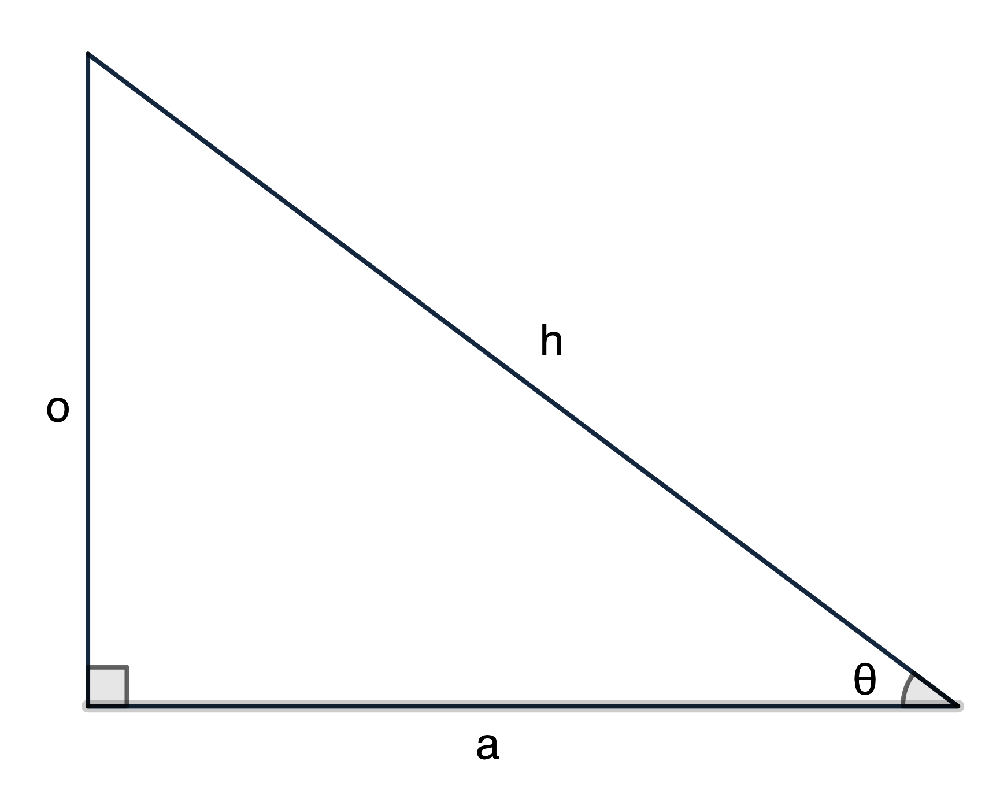
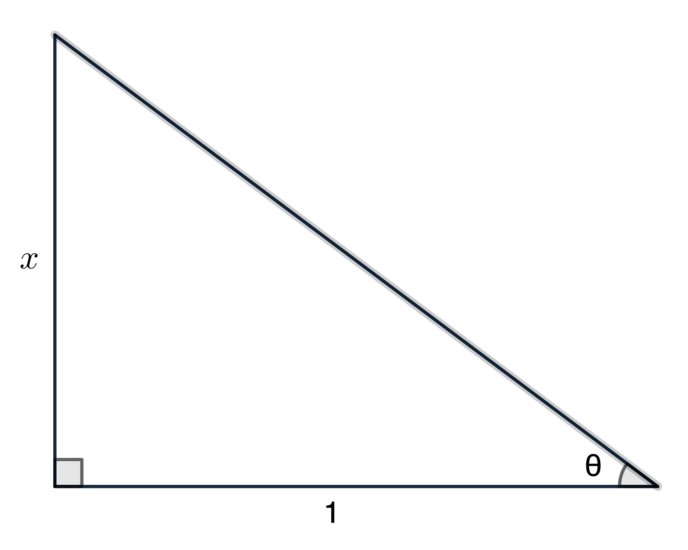
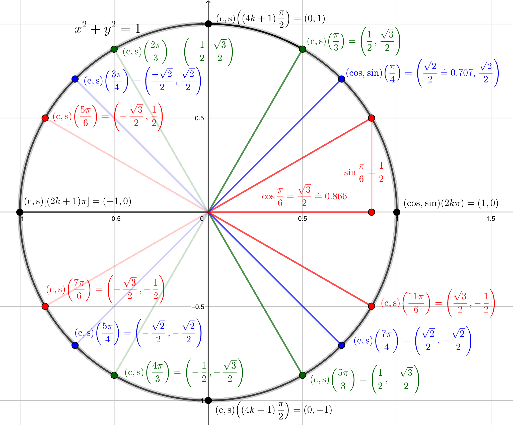
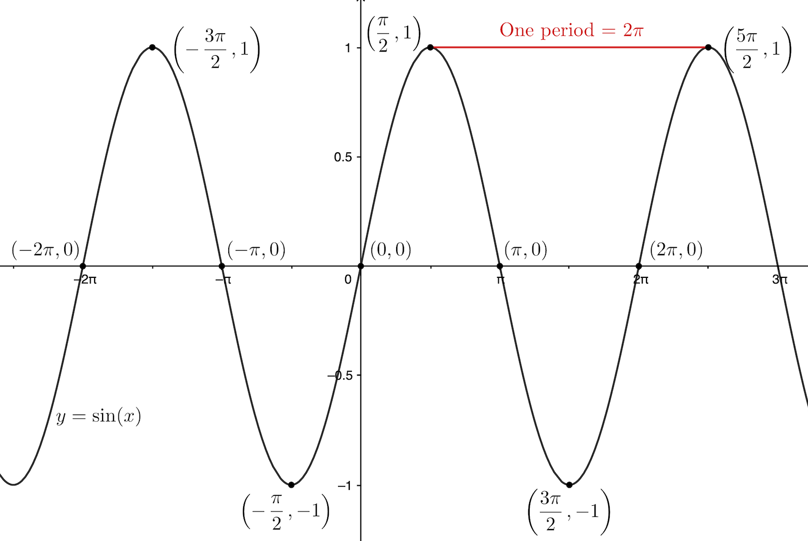
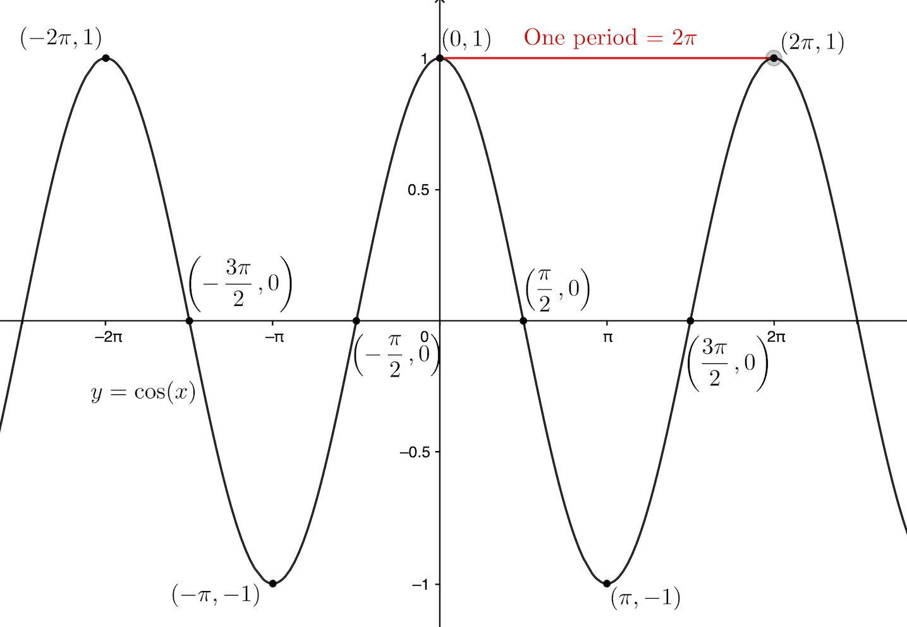
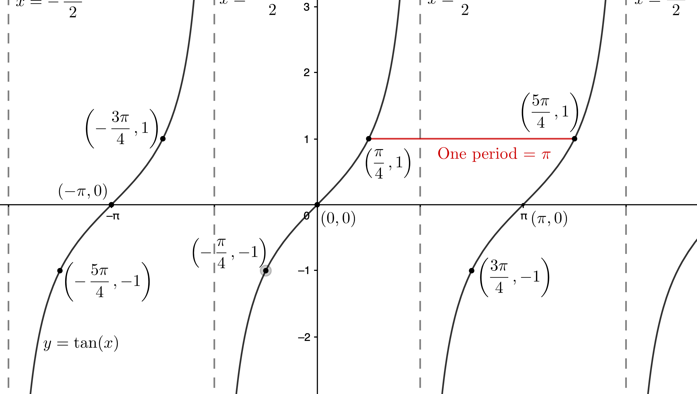
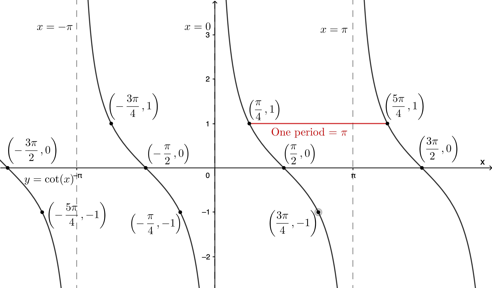
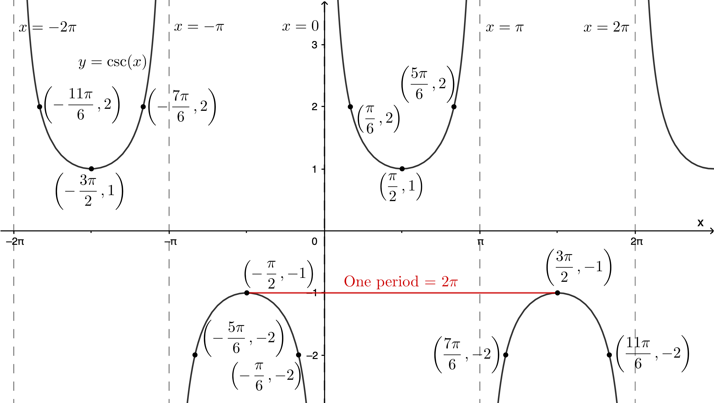
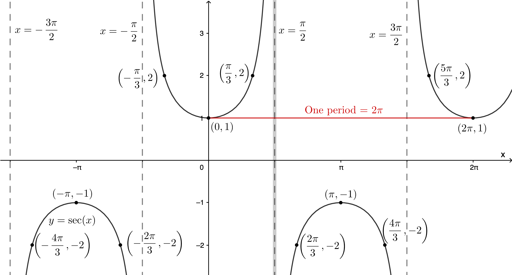

$\definecolor{red}{RGB}{255,0,0}
\definecolor{orange}{RGB}{245, 165, 0}
\definecolor{yellow}{RGB}{255,215,0}
\definecolor{green}{RGB}{0,255,0}
\definecolor{indigo}{RGB}{0,0,255}
\definecolor{violet}{RGB}{138,43,226}
\definecolor{black}{RGB}{0,0,0}$
$\require{cancel}$

#### 
Sullivan, M., 2012. <i>Algebra & Trigonometry, Ninth Edition.</i> Prentice Hall, Boston
#### 
Chapter 7: Trigonometric Functions 
#### 
 Selected Exercise Solutions
#### 
&copy; 2020 by
#### 
David Lawrence Goldsmith
#### 
for
#### 
www.selectedsolutions.net

<i>Note:  These solutions are provided "as-is," for informational purposes only, with no warranty of any kind, expressed or implied, including that of correctness, adequacy, and/or suitability for any purpose, whatsoever.</i>&nbsp; Corrections are welcome and should be emailed to selectedsolutionsdotnet@gmail.com.

## Preface

In tutoring trigonometry (all math really, but especially trigonometry) I am often asked something like "How do you remember all these formulas/identities?"&nbsp; I always answer, in all honesty: "I don’t, I remember where to look them up" (which, in 2020, is ridiculously easy to do on the internet: just type "trig identities" into any browser and the default search engine will, in a matter of microseconds&mdash;indeed, before you even finish typing it in!&mdash;return umpteen different PDF’s).&nbsp; However, remembering them, especially when you’re just learning them, isn’t really the issue; the issue is proper use of them: the whole point of the trig identities, etc., is to "reduce" seemingly-complicated problems to simpler problems, in a, quite literally, formulaic way&mdash;the issue is how to use the formulas to "plug-and-chug."&nbsp; And a big stumbling block toward that goal, at least in my experience with students having difficulty with it, is recognizing which formula(s)/identity(ies) is (are) applicable in a particular situation, especially given that there are, admittedly, so many new, and "new-looking," formulas being "thrown at" you in such rapid succession!

The strategy I recommend for dealing with this problem, (as tedious as it may sound), is that, at the top of each page of work, you begin by re-copying out all the formulas/identities you are responsible for learning in that lesson (at the very least: the more you write out, the more you will retain what you’ve taken the time to write out, so by all means, write out identities from earlier lessons as well, especially if you find that you’re still struggling with recognizing them in problems you’re working on; for what it’s worth here, I also emphasize this strategy when learning the properties of exponents and logarithmic identities&mdash;basically, any situation in which you’re being required to learn a lot of new synoptic information&mdash;for that’s what formulas/identities really are: synoptic information&mdash;in a short period of time).&nbsp; To set a good example and make abundantly clear what I mean, I will begin each section in each of my "Sullivan Trig Chapters" with a re-statement of the formulas/identities being "drilled" in that section (that, in addition to the frequent restatement of the specific formulas/identities being used in a particular exercise at the moment of use).&nbsp; By doing so, I hope to drive home to the student that the way to "learn" this material is by, sometimes seemingly-excessive, repetition.

## Section 1: Angles and Their Measure

__To convert the decimal portion of degrees to minutes and seconds__: Multiply the decimal (fractional) part by 60, the integer (non-fractional) part of the result is the number of minutes; then multiply the fractional part of that result by 60, the result, ___including any remaining decimal fractional part___, is the number of seconds; __Example__: $0.0853^{\circ}\times \displaystyle \frac{60’}{1^\circ} = 5.118’, 0.118’ \times \frac{60’’}{1’} = 7.08’’$, so $0.0853^{\circ} = 0^{\circ}~5’~7.08’’$. 

__To convert from degrees minutes seconds to decimal degrees__: divide the number of minutes by 60, add the number of seconds divided by 3600, then add that to the number of degrees; __Example__: $23^{\circ}~34’~23.45’’ = 23^{\circ} + \displaystyle \frac{34’}{(60’/1^{\circ})} + \frac{23.45’’}{(3600’’/1^{\circ})} \doteq 23^{\circ} + 0.5666667^{\circ} + 0.00651389^{\circ} \doteq 23.573181^{\circ}$.

__Also__: 1 circle = 360&deg;, so 1&deg; = $\displaystyle \frac1{360}$-th of a circle, 1 "straight" angle = half a circle = 180&deg;, 1 "right" angle = one-fourth of a circle = 90&deg;.
 
__Radians__: measure angles as "fractions of a circle," using the number of radii (plural of radius) required to measure, i.e., "use as a ruler," the circular arc "spanned" by the angle: __arc length__ $\boxed{s= r\theta}$, where $r$ is the radius of the circle, and $\theta$ (the Greek letter ___theta___, pronounced ___thay-ta___) is the "subtended" angle, ___measured in radians___; in particular, if $r=1$, then arc length and radian angle measure are one and the same (the consequences of this are why radians are the preferred angle measure in mathematics, most of physics, and theoretical engineering).&nbsp; __To convert from decimal degrees to radians__: multiply by $\displaystyle \frac{\pi\text{ rad}}{180^{\circ}}$; __Example__: $74.248^{\circ} \times \displaystyle \frac{\pi\text{ rad}}{180^{\circ}} \doteq 1.295872$ rad (to convert from &deg; ' '' to rad, it’s easiest to first convert to decimal degrees); __To convert from radians to degrees__: multiply by $\displaystyle \frac{180^{\circ}}{\pi\text{ rad}}$; __Example__: $1.57079633\text{ rad} \times \displaystyle \frac{180^{\circ}}{\pi\text{ rad}} \doteq 90.00000018^{\circ}$ (However, we will typically express radian angle measure as a multiple of $\pi$, e.g., $2\pi$ rad = a whole circle, $\pi$ rad = a straight angle, $\frac{\pi}2$ rad = a right angle, etc., providing a decimal approximation only when necessary/requested.) 

__Area of "sector" of circle of radius $r$ spanned by angle $\theta$__: $$A = \frac12r^2\theta$$
where $\theta$ __must__ be in radians.

__Special Angles__: For triangle trigonometry, the most important special angles are:

<table>
  <tr>
    <th>Degrees<td>0<td>30<td>45<td>60<td>90<td>120<td>135
      <td>150<td>180
  <tr>
    <th>Radians<td>0<td>&pi;6<td>&pi;4<td>&pi;3<td>&pi;&nbsp;2<td>2&pi;&nbsp;3<td>3&pi;&nbsp;4<td>5&pi;&nbsp;6<td>&pi;
</table>
We will defer the rest till Section 4.

__Revolutions (revs; also called cycles)__: especially used in physics, __one rev equals one one full circle__, giving the conversion factors __$\displaystyle \frac{360^{\circ}}{1\text{ rev}} = \frac{2\pi\text{ rad}}{1\text{ rev}}$__; __Conversion examples__: 0.25 rev $\times \displaystyle \frac{360^{\circ}}{1\text{ rev}} = 90^{\circ}; \frac{2\pi}3\text{ rad}~\times \frac{1\text{ cycle}}{2\pi\text{ rad}} = \frac13\text{ cycle}$.

__Constant (or average) speed around a circle__: for a circle of radius $r$, "linear" speed $v = \displaystyle \frac s t$, where $s = r\theta$ is the length-of-arc traveled in time $t$ ($\theta$ __must__ be in radians); "angular" speed $\omega$ (the Greek letter "omega," pronounced ___oh-may-guh___) $=\displaystyle \frac{\theta}{t}$, where $\theta$ __need not__ be in radians (it is common to use revs, e.g., revolutions per minute (rpm) or cycles, e.g., cycles per second (Hz) in physics, for example); note that $\omega$ ___doesn’t depend on___ $r$; combining $\displaystyle v = \frac{r\theta}t$ and $\displaystyle \omega = \frac{\theta}t$ we get $$\boxed{v = r\omega \iff \omega = \displaystyle \frac{v}{r}}$$ but in this form, $\omega$ does need to be/will end up in units of radians (per unit time); __Example__: an object experiencing "uniform" (i.e., constant speed) circular motion around a circle of radius 12,900 kilometers with a linear speed of 1075$\pi \doteq$ 3377 kilometers per hour, has an angular speed $\omega = \displaystyle \frac{1075\pi\text{ kph}}{12,900\text{ km}} = \frac{\pi}{12}\frac{\text{radians}}{\text{hour}} \times \frac{1\text{ rev}}{2\pi\text{ rads}} = \frac{1\text{ rev}}{24\text{ hrs}} = 1$ revolution per (Earth) day.
  

__Solved Problems__

__116__) Determine: __a__) the (circular) outfield fence length; and __b__) the area of a 10 ft wide warning track; for a baseball field such that: the fence is everywhere 200 ft distant from home plate; and its extreme ends subtend an angle with home plate of 96&deg; (see illustration in text).

__Sln__: __a__: The length of the outfield fence is the arc-length of that portion of a circle of radius 200 ft subtended by an angle of 96&deg;.&nbsp; There are two ways to proceed: we can use the formula $s=r\theta$, which requires that we convert the angle of 96&deg; to radian measure&mdash;that way is left to the Reader.&nbsp; I wish to emphasize the way that takes advantage of recognition that the arc is simply a fraction of the whole circle; what fraction?&nbsp; Well, the angle is 96&deg;, a whole circle is 360&deg;, so the arc is $\displaystyle \frac{96^{\circ}}{360^{\circ}} = \frac4{15}\text{-ths}$ of a whole circle of radius 200 ft; the circumference of such a circle is $(2\pi)200 = 400\pi \doteq 1,257$ ft, so the length of the fence is $\displaystyle \frac4{15}(400\pi) = \boxed{\frac{1600\pi}{15} \doteq 335\text{ ft}}$

__b__) Determining the area of the warning track is just slightly more complicated: to get it, we must, in principle, calculate two circular sector areas&mdash;that bounded by the fence $= \displaystyle \frac12(r_{\text{to fence}})^2\theta$ and that bounded by the infield-side of the warning track $= \displaystyle \frac12(r_{\text{to track}})^2\theta$ (with $\theta$: in radians; and, in this situation&mdash;this is key&mdash;___the same for both sectors___)&mdash;and subtract the latter from the former.&nbsp; Now, if we write that out:$$A_{\text{track}} = A_{\text{to fence}} - A_{\text{to track}} = \frac12(r_{\text{to fence}})^2\theta - \frac12(r_{\text{to track}})^2\theta$$since, as we noted, $\theta$ is the same in both terms, we can factor out $\frac12\theta$, so that the area we need can be calculated simply as:$\displaystyle\frac12\theta(r_{\text{to fence}}^2 - r_{\text{to track}}^2) = \frac12(96^{\circ}\frac{\pi\text{ rad}}{180^{\circ}})(200^2-190^2) = \frac4{15}\pi(200-190)(200+190) = 4\pi\frac{10}{15}(390) = 8\pi(130) =$ $$\boxed{1040\pi \doteq 3267\text{ sq ft}}$$
  

## Section 2: Right Triangle Trigonometry

__Restatement of basic facts__

For a right triangle labeled as shown:

$\text{sine}(\theta) = \sin \theta = \displaystyle \frac{\text{"opposite"}}{\text{"hypotenuse"}} = \frac{o}{h};~\text{cosine}(\theta) = \cos\theta = \frac{\text{"adjacent"}}{\text{hypotenuse}} = \frac{a}{h};~\text{tangent}(\theta) = \tan\theta = \frac{\text{opposite}}{\text{adjacent}} = \frac{o}{a};\\ \text{cotangent}(\theta) = \cot\theta = \displaystyle\frac{\text{adjacent}}{\text{opposite}} = \frac{a}{o};~\text{secant}(\theta) = \sec\theta = \frac{\text{hypotenuse}}{\text{adjacent}} = \frac{h}{a};~\text{cosecant}(\theta) = \csc\theta = \frac{\text{hypotenuse}}{\text{opposite}} = \frac{h}{o}$

__The Fundamental Identities__

__Quotient Identities__:
$~~~~~~~~~~~~~~~~~~~~~\displaystyle \tan\theta = \frac{\sin\theta}{\cos\theta},~\cot\theta = \frac{\cos\theta}{\sin\theta}$

__Reciprocal Identities__:
$~~~~~~~~~~~~~~~~~~\displaystyle \csc\theta = \frac1{\sin\theta},~\sec\theta = \frac1{\cos\theta},~\cot\theta=\frac1{\tan\theta}$

__Pythagorean Identities__:
$~~~~~~~~~~~~~~~\sin^2\theta + \cos^2\theta = 1,~\tan^2\theta + 1 = \sec^2\theta,~\cot^2\theta + 1 = \csc^2\theta$

__Cofunction Identities__: ___if___ $x+y = 90^{\circ} = \frac{\pi}2$ rad, i.e., if $x,y$ are "complementary," ___then___: $$\sin x = \cos y,~\tan x = \cot y,~\sec x = \csc y$$
Equivalently: $\displaystyle \sin\left(\frac{\pi}2-\theta\right) = \cos \theta,~\tan\left(\frac{\pi}2-\theta\right) = \cot \theta,~\sec\left(\frac{\pi}2-\theta\right) = \csc \theta,\\ \displaystyle \cos\left(\frac{\pi}2-\theta\right) = \sin\theta,~\cot\left(\frac{\pi}2-\theta\right) = \tan\theta,~\csc\left(\frac{\pi}2-\theta\right) = \sec\theta$
  

__78__) Given: $\theta$ acute, $x = \tan\theta$; provide: the values of the other 5 trigonometric functions in terms of $x$.

__Sln__: We use the "trick" that "anything is equal to itself over 1," so $x = \displaystyle \frac{x}1 = \tan \theta = \frac{o}{a}$ and use this result to draw a right triangle (this is the Section on right triangles, after all) satisfying the given conditions:

Now we use the Pythagorean Theorem to calculate that, in terms of $x$, $h^2 = 1^2 + x^2 \implies h = \sqrt{1+x^2}$:

Now we can immediately answer the question:

$\displaystyle \sin \theta = \frac{o}{h} = \frac{x}{\sqrt{1+x^2}};~\cos \theta = \frac{a}{h} = \frac1{\sqrt{1+x^2}};~\sec \theta = \frac1{\cos \theta} = \sqrt{1+x^2};~\csc \theta = \frac1{\sin \theta} = \frac{\sqrt{1+x^2}}{x};~\cot \theta = \frac1{\tan \theta} = \frac1x$
(Note that we didn’t really need the triangle to do this last one; indeed, we didn’t really need the triangle at all: this exercise could also have been done using the Pythagorean Identities&mdash;which should be no surprise, given that we used the Pythagorean Theorem to "complete" the triangle&mdash;which method the Reader is ___urged___ to try.)
  

## Section 3: Trigonometric Functions of Acute Angles

__Trigonometric function values to memorize__ (through repeated use):

| rad | deg | sin | cos | tan | cot | sec | csc |
|---|---|---|---|---|---|---|---|
| 0 | 0 | 0 | 1 | 0 | NaN | 1 | NaN |
|$\displaystyle\frac{\pi}6$| 30 |$\displaystyle\frac12$|$\displaystyle\frac{\sqrt3}2$|$\displaystyle\frac1{\sqrt{3}}=\frac{\sqrt3}3$|$\sqrt3$|$\displaystyle\frac2{\sqrt3}=\frac{2\sqrt3}3$| 2 |
|$\displaystyle\frac{\pi}4$| 45 |$\displaystyle\frac1{\sqrt2}=\frac{\sqrt2}2$|$\displaystyle\frac{\sqrt2}2$| 1 | 1 |$\sqrt2$|$\sqrt2$|
|$\displaystyle\frac{\pi}3$| 60 |$\displaystyle\frac{\sqrt3}2$|$\displaystyle\frac12$|$\sqrt{3}$|$\displaystyle\frac{\sqrt3}3$| 2 |$\displaystyle\frac{2\sqrt3}3$|
  

__92__) Find the exact value of sin 1&deg;&centerdot;sin 2&deg;&centerdot;sin 3&deg;&centerdot;...&centerdot;sin 45&deg;&centerdot;sec 46&deg;&centerdot;sec 47&deg;&centerdot;...&centerdot;sec 89&deg;.

__Sln__: (At first glance this Problem doesn’t look like its answer will end up being one of the special trigonometric values this Section is supposed to be emphasizing, but it does end up so.)

The key here is to recognize that, ___with one exception___&mdash;sin 45&deg;&mdash;the argument of each of the secant functions is the complementary angle to precisely one of the sine function arguments, e.g., 89&deg; is complementary to 1&deg;, 88&deg; is complementary to 2&deg;, 46&deg; is complementary to 44&deg;, etc.; in each such instance, the cofunction identity sec (90&deg;$-\theta$) $=$ csc $\theta$ enables us to replace a sec factor with a csc factor whose argument is identical to that of precisely one of the sin factors, e.g., sec 89&deg; $=$ csc 1&deg;, sec 46&deg; $=$ csc 44&deg;, etc.&nbsp; But each of these is well-defined (we do have to be a little careful because there are angles for which sec and csc are undefined, but those are not acute angles, which all of these are) and the reciprocal of the sin factor whose argument is shares: csc 1&deg; = $\displaystyle \frac1{\sin 1^{\circ}}$, etc.&nbsp; Thus:

sin 1&deg;&centerdot;sin 2&deg;&centerdot;sin 3&deg;&centerdot;...&centerdot;sin 45&deg;&centerdot;sec 46&deg;&centerdot;sec 47&deg;&centerdot;...&centerdot;sec 89&deg; $=$  sin 1&deg;&centerdot;csc 1&deg;&centerdot;sin 2&deg;&centerdot;csc 2&deg;&centerdot;...&centerdot;sin 44&deg;&centerdot;csc 44&deg;&centerdot;sin 45&deg; $=$ 
1&centerdot;1&centerdot;...&centerdot;1&centerdot;sin 45&deg; $=$ sin 45&deg; $=\boxed{\frac{\sqrt2}2}$.&nbsp; (Told ya!)
  

## Section 4: Trigonometric Functions of Any Angle

In my opinion, everything presented as "new" in this Section is rendered redundant&mdash;and is better understood through&mdash;the material of the next Section, "The Unit Circle": nothing in this Section should be "memorized" (independently); rather, the unit circle should be memorized (as always, through repeated copying and use) and the general task taught in this Section, i.e., finding the trigonometric function values of non-acute angles, should be achieved through understanding and use of the unit circle.&nbsp; Accordingly, though I don’t discourage the Reader from reading this section of the text (it will be necessary to learn the vocabulary taught therein to understand the wording of the Problems), I ___do encourage___ the Reader to read the next Section of the text before attempting the Problems of this Section, and I will freely use the unit circle definitions and methods in presenting solutions to Problems from this Section.
  

__114__) Find the exact value of cos 1&deg; + cos 2&deg; + ... + cos 358&deg; + cos 359&deg;.

__Sln__: Like Problem __92__) of the previous Section, the key here is to look for cancellations.&nbsp; Appealing to the unit circle, we note that the $x$-coordinate of its point at 181&deg;, i.e., cos 181&deg;&mdash;whatever value that may have&mdash;is the negative of the $x$-coordinate of the unit circle’s point at 1&deg;, i.e., cos 1&deg;, i.e., cos 1&deg; + cos 181&deg; = 0; and similarly for every pair of angles $\theta, \theta$ + 180&deg;.&nbsp; That accounts for all the angles in the expression, except 180&deg;, whose cosine is $-1$.&nbsp; Written out algebraically, we have:

cos 1&deg; + cos 2&deg; + ... + cos 358&deg; + cos 359&deg; $=$cos 1&deg; + cos 181&deg; + cos 2&deg; + cos 182&deg; + ... + cos 179&deg; + cos 359&deg; + cos 180&deg; $=$ 0 + 0 + ... + 0 + cos 180&deg; (take a moment&mdash;or several&mdash;to make sure you understand why cos 180&deg; ___doesn’t___ have a term which cancels it out; hint: based on the pattern, what would that term be?&nbsp; Is that term in our sum, explicitly or implicitly?) $= \boxed{-1}$
  

## Section 5: The Unit Circle; Properties of the Trig Functions

__The Unit Circle__:

__Domain and range of the trig functions__:

| __Function__ | Domain | Range |
|---|---|---|
| sin | $\mathbb{R}$ (all real numbers*) | $[-1,1]$ (the closed interval from $-1$ to $1$, inclusive) |
| cos | $\mathbb{R}$ | $[-1,1]$ | | |
| tan | $\mathbb{R}$ ___except___ odd multiples of $\displaystyle\frac{\pi}2$, expressed $\mathbb{R}\backslash \displaystyle \{(2k+1)\frac{\pi}2, k\in \mathbb{Z}\text{, i.e., } k \text{ any integer}\}$  __Way to remember__: 'cause $\cos = 0$ at these domain values |  $\mathbb{R}$ |
| cot | $\mathbb{R}$ ___except___ integer multiples of $\pi$, expressed $\mathbb{R}\backslash \{k\pi, k\in \mathbb{Z}\}$  __Way to remember__: 'cause $\sin = 0$ at these domain values | $\mathbb{R}$ | 
| sec | $\mathbb{R}\backslash \displaystyle \{(2k+1)\frac{\pi}2, k\in \mathbb{Z}\}$, i.e., same as $\tan$, for the same reason | $(-\infty,-1] \cup[1,\infty) = \mathbb{R}\backslash (-1,1)$, i.e., all real numbers ___except___ the open interval $(-1,1)$ __Way to remember__: as the range of "1 over the range of $\cos$"|
| csc | $\mathbb{R}\backslash \{k\pi, k\in \mathbb{Z}\}$, i.e., same as $\cot$, for the same reason | $\mathbb{R}\backslash (-1,1)$, i.e., same as $\sec$, for the same reason |

__Periodicity__: The unit circle definitions of the trig functions should make it clear why sin, cos, sec, and csc take on their same values every change of $\pm2\pi$ in their argument, and tan and cot do so every change of $\pm\pi$; we say that sin, cos, sec, and csc are all __periodic with period__ (or ___have periodicity of___) $2\pi$, tan and cot have periodicity $\pi$; __as identities__: for any integer $k$ and any real* number $x$, $\sin(x+2k\pi) = \sin x;$ $\cos(x+2k\pi) = \cos x;$ $\sec(x+2k\pi) = \sec x;$ $\csc(x+2k\pi) = \csc x;$ $\tan(x+k\pi) = \tan x;$ and $\cot(x+k\pi) = \cot x.~$ (Note: these are not the only places where trig functions repeat their values&mdash;for example, $\sin 0 = \sin\pi = 0$&mdash;but they are "guaranteed" to repeat their values at these increments: $|x-y| = 2k\pi, k \in \mathbb{Z}$ is a ___sufficient___ condition for $\sin x = \sin y$, for example, but not a ___necessary___ condition.)&nbsp; In general, $f(x)$ is said to be __periodic with (fundamental) period__ $p$ (or __have periodicity__ $p$) if $p$ is the smallest number such that $f(x+p) = f(x)$ for all $x$ (for which $f$ is well-defined; it is a provable theorem that if $f(x+p) = f(x)$ for all $x$ (in the domain of $f$), then for any integer $k, f(x+kp) = f(x)$, again as long as $x+kp$ is in the domain of $f$).

__Even/odd-ness__: cos and sec are even functions, i.e., for all $x$ (in their domians), $\cos(-x) = \cos x; \sec(-x) = \sec x$, while sin, tan, csc, and cot are odd functions: $\sin(-x) = -\sin x; \tan(-x) = -\tan x; \csc(-x) = -\csc x;$ and $\cot(-x) = -\cot x$ for all $x$ (in their respective domains).  

\* Actually, the sine and cosine functions are well-defined and periodic with period $2\pi$ for all ___complex___ numbers, but this is "beyond the scope of this course."
  

__98__) Show that the period of $f(\theta) = \cot \theta$ is $\pi$.

__Pf__: We must show that $\pi$ is the smallest positive real number such that $\cot(\theta + \pi) = \cot \theta~\forall\theta$ ($\forall$ is the mathematical symbol for "for all" or "for any").&nbsp; The proof consists of two parts: we must show that $\cot$ has period $\pi$; and we must show that $\pi$ is the smallest positive number for which this is true.

Part 1: For all $\theta$ such that $\sin(\theta + \pi) \ne 0$, $\cot(\theta + \pi) = \displaystyle \frac{\cos(\theta + \pi)}{\sin(\theta + \pi)} = \frac{-\cos \theta}{-\sin \theta} = \frac{\cos \theta}{\sin \theta} = \cot \theta$ (because if $\sin(\theta + \pi) \ne 0$, then $\sin \theta \ne 0$; proof?).

Part 2: We use the method suggested in the text as a hint for Problem 93: Suppose there exists $p$ between 0 and $\pi$, exclusive, i.e., $0 \lt p \lt \pi$, such that $\cot(\theta + p) = \cot \theta~\forall \theta$; then $\cot p = \cot(0 + p) = \cot 0 = 0$, i.e., our assumption implies $\cot p = 0$, and there is (only) one value between 0 and $\pi$ for which this is true, namely $\frac{\pi}2.~$ But, for example, $\cot \frac{\pi}4 = 1$, whereas $\cot(\frac{\pi}4 + \frac{\pi}2) = \cot \frac{3\pi}4 = -1$, i.e., we’ve found a value of $\theta$ such that $\cot(\theta + \frac{\pi}2) \ne \cot \theta$, so $\pi$ must be the smallest (positive) value for which this is always true!$~~~\blacksquare$ (A $\blacksquare$ is the modern customary way to mark where one has concluded a proof, replacing the antiquated "Q.E.D.")
  

## Section 6: Graphs of Sine and Cosine

__Relationship between their (fundamental) graphs__: starting with the cofunction identity $\sin x = \cos\left(\displaystyle\frac{\pi}2-x\right)$, factoring $-1$ from the argument of the cos function and using the fact that cos is "even" $\displaystyle \implies \sin x = \cos\left[-1\left(x-\frac{\pi}2\right)\right] = \cos\left(x-\frac{\pi}2\right)$, so the (fundamental) graph of sin is the same as cos, horizontally shifted $\displaystyle\frac{\pi}2$ units to the right, or, equivalently, __the (fundamental) graph of cos is the same as sin, horizontally shifted $\displaystyle\frac{\pi}2$ units to the left__.

__Amplitude and period__: given $y = f(x) = A\sin(\omega x)\text{ or } = A\cos(\omega x)$, the __amplitude__ of $f$ is $|A|$, which gives the maximum and minimum values attained by $f$ and the factor by which the (fundamental) graph is vertically "stretched" ($|A| \gt 1$) or "compressed" ($|A| \lt 1$); and the (fundamental) __period__ (see Section 5 above for definition) of $f$ is $T = \displaystyle \frac{2\pi}{\omega}$, which thus gives how much the fundamental graph is horizontally "stretched" ($|\omega| \lt 1$) or "compressed" ($|\omega| \gt 1$).&nbsp; (Note that the effect of the amplitude is "intuitive"&mdash;$|A| \gt 1$ "stretches," $|A| \lt 1$ "compresses"; whereas the effect of $\omega$ is "counter-intuitive"&mdash;$|\omega| \lt 1$ "stretches," $|\omega| \gt 1$ "compresses.")
  

## Section 7: Graphs of Tangent, Cotangent, Cosecant, and Secant

  

## Section 8: Phase Shift; Sinusoidal Curve Fitting

In $\sin\text{ or }\cos(\omega x - \phi), \omega \gt 0$, period $T = \displaystyle \frac{2\pi}{\omega}$, phase shift $\displaystyle = \frac{\phi}{\omega}$, to the right if $\phi \gt 0$, to the left if $\phi \lt 0$.

  

### Credits
Text layout and MathJax (LaTeX) composed using [LightPaper for Mac by 42Squares](http://lightpaper.42squares.in)</a>.

Graphs generated using [GeoGebra](http://www.geogebra.org/).

### Please Donate:
<form action="https://www.paypal.com/cgi-bin/webscr"
          method="post"><input name="cmd"
            value="_xclick" type="hidden"> <input name="business"
            value="dgoldsmith_89@alumni.brown.edu" type="hidden"> <input
            name="item_name" value="SelectedSolutions Donation"
            type="hidden"> <input name="cn" value="Special Instructions
            (optional" type="hidden"> <input
            src="https://www.paypal.com/images/x-click-but04.gif"
            name="submit" alt="Make payments with PayPal - it's fast,
            free and secure!" align="middle" border="0" type="image"></form>

