

<link rel="stylesheet" href="../../Styles.css">
<title>Solutions of Selected Exercises from Sullivan, M. "Algebra & Trigonometry, 9th Ed. Chapter 7"</title>

$\definecolor{red}{RGB}{255,0,0}
\definecolor{orange}{RGB}{245, 165, 0}
\definecolor{yellow}{RGB}{255,215,0}
\definecolor{green}{RGB}{0,255,0}
\definecolor{indigo}{RGB}{0,0,255}
\definecolor{violet}{RGB}{138,43,226}
\definecolor{black}{RGB}{0,0,0}
\require{cancel}
\newcommand{\Frac}{\displaystyle \frac}
\newcommand{\t}{\theta}
$

## 
 Selected Exercise Solutions

from

### 
Sullivan, M., 2012. <i>Algebra & Trigonometry, Ninth Edition.</i> Prentice Hall, Boston
### 
Chapter 7: Trigonometric Functions 
### 
&copy; 2020, 2026 by
### 
[David Lawrence Goldsmith](https://www.linkedin.com/in/olydlg)

for

## 
[SelectedSolutionsDotNet](https://olydlg.github.io/selectedsolutionsdotnet/)

<i>Notes:  These solutions are provided &quot;as-is,&quot; for informational purposes only, with no warranty of any kind, expressed or implied, including that of correctness, adequacy, and/or suitability for any purpose, whatsoever.</i> Corrections are welcome and should be emailed to selectedsolutionsdotnet@gmail.com.

Purple font indicates clicking on the text will return you to your prior place; a $\blacksquare$ marks the end of a proof.
 

### Contents

<table>
  <tr>
   <th colspan=10>Section 1: Angles and Their Measure</th>
  </tr>
  <tr>
    <td><a href="#1.28">1.28</a></td>
    <td><a href="#1.32">1.32</a></td>
    <td><a href="#1.38">1.38</a></td>
    <td><a href="#1.44">1.44</a></td>
    <td><a href="#1.50">1.50</a></td>
    <td><a href="#1.54">1.54</a></td>
    <td><a href="#1.62">1.62</a></td>
    <td><a href="#1.70">1.70</a></td>
    <td><a href="#1.74">1.74</a></td>
    <td><a href="#1.78">1.78</a></td>
  </tr>
  <tr>
    <td><a href="#1.82">1.82</a></td>
    <td><a href="#1.86">1.86</a></td>
    <td><a href="#1.90">1.90</a></td>
    <td><a href="#1.96">1.96</a></td>
    <td><a href="#1.100">1.100</a></td>
    <td><a href="#1.104">1.104</a></td>
    <td><a href="#1.108">1.108</a></td>
    <td><a href="#1.112">1.112</a></td>
    <td><a href="#1.116">1.116</a></td>
  </tr>
  <tr>
   <th colspan=10>Section 2: Right Triangle Trigonometry</th>
  </tr>
  <tr>
    <td><a href="#2.20">2.20</a></td>
    <td><a href="#2.24">2.24</a></td>
    <td><a href="#2.28">2.28</a></td>
    <td><a href="#2.32">2.32</a></td>
    <td><a href="#2.36">2.36</a></td>
    <td><a href="#2.52">2.52</a></td>
    <td><a href="#2.58">2.58</a></td>
    <td><a href="#2.66">2.66</a></td>
    <td><a href="#2.73">2.73</a></td>
    <td><a href="#2.76">2.76</a></td>
  </tr>
  <tr>
    <td><a href="#2.78">2.78</a></td>
  </tr>
  <tr>
   <th colspan=10>Section 3: Trigonometric Functions of Acute Angles</th>
  </tr>
  <tr>
    <td><a href="#3.11">3.11</a></td>
    <td><a href="#3.16">3.16</a></td>
    <td><a href="#3.22">3.22</a></td>
    <td><a href="#3.28">3.28</a></td>
    <td><a href="#3.34">3.34</a></td>
    <td><a href="#3.38">3.38</a></td>
    <td><a href="#3.42">3.42</a></td>
    <td><a href="#3.48">3.48</a></td>
    <td><a href="#3.52">3.52</a></td>
    <td><a href="#3.56">3.56</a></td>
  </tr>
  <tr>
    <td><a href="#3.64">3.64</a></td>
    <td><a href="#3.68">3.68</a></td>
    <td><a href="#3.74">3.74</a></td>
    <td><a href="#3.78">3.78</a></td>
    <td><a href="#3.84">3.84</a></td>
    <td><a href="#3.92">3.92</a></td>
  </tr>
  <tr>
   <th colspan=10>Section 4: Trigonometric Functions of Any Angle</th>
  </tr>
  <tr>
    <td><a href="#4.16">4.16</a></td>
    <td><a href="#4.18">4.18</a></td>
    <td><a href="#4.20">4.20</a></td>
    <td><a href="#4.28">4.28</a></td>
    <td><a href="#4.30">4.30</a></td>
    <td><a href="#4.32">4.32</a></td>
    <td><a href="#4.36">4.36</a></td>
    <td><a href="#4.40">4.40</a></td>
    <td><a href="#4.46">4.46</a></td>
    <td><a href="#4.52">4.52</a></td>
  </tr>
  <tr>
    <td><a href="#4.58">4.58</a></td>
    <td><a href="#4.64">4.64</a></td>
    <td><a href="#4.70">4.70</a></td>
    <td><a href="#4.76">4.76</a></td>
    <td><a href="#4.82">4.82</a></td>
    <td><a href="#4.88">4.88</a></td>
    <td><a href="#4.94">4.94</a></td>
    <td><a href="#4.100">4.100</a></td>
    <td><a href="#4.112">4.112</a></td>
    <td><a href="#4.114">4.114</a></td>
  </tr>
  <tr>
   <th colspan=10>Section 5: The Unit Circle; Trig Function Properties</th>
  </tr>
  <tr>
    <td><a href="#5.10">5.10</a></td>
    <td><a href="#5.14">5.14</a></td>
    <td><a href="#5.16">5.16</a></td>
    <td><a href="#5.20">5.20</a></td>
    <td><a href="#5.24">5.24</a></td>
    <td><a href="#5.28">5.28</a></td>
    <td><a href="#5.32">5.32</a></td>
    <td><a href="#5.36">5.36</a></td>
    <td><a href="#5.42">5.42</a></td>
    <td><a href="#5.46">5.46</a></td>
  </tr>
  <tr>
    <td><a href="#5.50">5.50</a></td>
    <td><a href="#5.54">5.54</a></td>
    <td><a href="#5.56">5.56</a></td>
    <td><a href="#5.60">5.60</a></td>
    <td><a href="#5.64">5.64</a></td>
    <td><a href="#5.70">5.70</a></td>
    <td><a href="#5.76">5.76</a></td>
    <td><a href="#5.86">5.86</a></td>
    <td><a href="#5.92">5.92</a></td>
    <td><a href="#5.98">5.98</a></td>
  </tr>
  <tr>
   <th colspan=10>Section 6: Graphs of Sine and Cosine Functions</th>
  </tr>
  <tr>
    <td><a href="#6.12">6.12</a></td>
    <td><a href="#6.16">6.16</a></td>
    <td><a href="#6.20">6.20</a></td>
    <td><a href="#6.24">6.24</a></td>
    <td><a href="#6.30">6.30</a></td>
    <td><a href="#6.42">6.42</a></td>
    <td><a href="#6.50">6.50</a></td>
    <td><a href="#6.58">6.58</a></td>
    <td><a href="#6.62">6.62</a></td>
    <td><a href="#6.66">6.66</a></td>
  </tr>
  <tr>
    <td><a href="#6.72">6.72</a></td>
    <td><a href="#6.76">6.76</a></td>
    <td><a href="#6.80">6.80</a></td>
    <td><a href="#6.84">6.84</a></td>
    <td><a href="#6.86">6.86</a></td>
    <td><a href="#6.90">6.90</a></td>
    <td><a href="#6.92">6.92</a></td>
    <td><a href="#6.99">6.99</a></td>
  </tr>
  <tr>
   <th colspan=10>Section 7: Graphs of tan, cot, sec, and csc </th>
  </tr>
  <tr>
    <td><a href="#7.8">7.8</a></td>
    <td><a href="#7.14">7.14</a></td>
    <td><a href="#7.22">7.22</a></td>
    <td><a href="#7.28">7.28</a></td>
    <td><a href="#7.34">7.34</a></td>
    <td><a href="#7.40">7.40</a></td>
    <td><a href="#7.44">7.44</a></td>
    <td><a href="#7.48">7.48</a></td>
    <td><a href="#7.50">7.50</a></td>
    <td><a href="#7.51">7.51</a></td>
  </tr>
  <tr>
   <th colspan=10>Section 8: Phase Shift; Sinusoidal Curve Fitting</th>
  </tr>
  <tr>
    <td><a href="#8.6">8.6</a></td>
    <td><a href="#8.10">8.10</a></td>
    <td><a href="#8.14">8.14</a></td>
    <td><a href="#8.18">8.18</a></td>
    <td><a href="#8.22">8.22</a></td>
    <td><a href="#8.26">8.26</a></td>
    <td><a href="#8.34">8.34</a></td>
    <td><a href="#8.38">8.38</a></td>
  </tr>
</table>

### Preface

In tutoring trigonometry (all math really, but especially trigonometry) I am often asked something like &quot;How do you remember all these formulas/identities?&quot;&nbsp; I always answer: &quot;I don’t, I remember where to look them up&quot; (which, in 2026, is ridiculously easy to do on the internet: just type &quot;trig identities&quot; into any browser and the default search engine will, in a matter of microseconds&mdash;indeed, before you even finish typing it in!&mdash;return umpteen lists of trig identities).&nbsp; However, remembering them, especially when you’re just learning them, isn’t really the issue; the issue is proper use of them: the whole point of the trig identities, etc., is to reduce complicated&#8209;looking problems to simpler problems, in a&mdash;quite literally&mdash;formulaic way.&nbsp; The issue is how to <i>use</i> the formulas to &quot;plug-and-chug,&quot; and a big stumbling block toward that goal is recognizing which formulas/identities are applicable in a particular situation.&nbsp; This is exacerbated by the plethora of new formulas being thrown at you in rapid succession.

The strategy I recommend for dealing with this problem, as tedious as it sounds, is this: at the top of each page of work, begin by re&#8209;copying all the formulas/identities you are responsible for learning in that lesson (at the very least: the more you write out, the more you will retain what you’ve taken the time to write out, so by all means, write out identities from earlier lessons as well, especially if you find that you’re still struggling with recognizing them in problems you’re working on; for what it’s worth here, I also emphasize this strategy when learning the properties of exponents and logarithmic identities&mdash;basically, any situation in which you’re being required to learn a lot of new synoptic information in a short period of time).&nbsp; To set the example and make abundantly clear what I mean, I will begin each section below with a re&#8209;statement of the formulas/identities being &quot;drilled&quot; in that section (as well as re&#8209;statement of the specific formulas/identities being used in each particular exercise).&nbsp; By doing so, I hope to drive home to the student that the way to &quot;memorize&quot; this material is by written repetition (even if it sometimes seems excessive).

## Section 1: Angles and Their Measure
### Formulas Section

__To convert the decimal portion of degrees to minutes and seconds__: Multiply the decimal (fractional) part by 60: the integer (non-fractional) part of <i>the result</i> is the number of minutes; then multiply the fractional part of <i>that result</i> by 60: the result, ___including any remaining decimal fractional part___, is the number of seconds. 
__Example__: $\displaystyle 0.0853°\times \frac{60’}{1°} = 5.118’,~0.118’ \times \frac{60’’}{1’} = 7.08’’$, so $0.0853°= 0°~5’~7.08’’$. 

__To convert from degrees, minutes, seconds to decimal degrees__: divide the number of minutes by 60; add the number of seconds divided by 3600; then add that sum to the number of degrees. 
__Example__: $\displaystyle 23°~34’~23.45’’ = 23°+~34’ \times \frac{1°}{60’} + 23.45’’ \times  \frac{1°}{3600’’} \doteq 23° + 0.5666667° + 0.00651389° ~\doteq 23.573181°$. 
__Also__: 1 circle = 360°, so 1° = $\displaystyle \frac1{360}$&#8209;th of a circle, 1 straight angle = half a circle = 180°, 1 right angle = one&#8209;fourth of a circle = 90°.
 
__Radians__: radians measure angles using the number of radii (plural of radius) required to &quot;measure&quot; the circular arc &quot;spanned&quot; by the angle: __arc length__ $s= r\t$, where $r$ is the radius of the circle and $\t$ (the Greek letter ___theta___, pronounced ___thay-ta___) is the &quot;subtended&quot; angle, ___measured in radians___; in particular, if $r=1$, then arc length and radian angle measure are one and the same.&nbsp; (The consequences of this are why radians are the preferred angle measure in mathematics, most of physics, and theoretical engineering).&nbsp; __To convert from decimal degrees to radians__: multiply by $\displaystyle \frac{\pi\text{ rad}}{180°}$. 
__Example__: $\displaystyle 74.248° \times \frac{\pi\text{ rad}}{180°} \doteq 1.295872$ rad (to convert from $°~’~’’$ to rad, it’s easiest to first convert to decimal degrees). 
__To convert from radians to degrees__: multiply by $\displaystyle \frac{180°}{\pi\text{ rad}}$.  
__Example__: $\displaystyle 1.57079633 \text{ rad} \times \frac{180°}{\pi\text{ rad}} \doteq 90.00000018°$.&nbsp; (However, we will typically express radian angle measure as a multiple of $\pi$, e.g., $2\pi\text{ rad} =$ a whole circle, $\pi\text{ rad} = $ a straight angle, $\displaystyle \frac{\pi}2\text{ rad} =$ a right angle, etc., providing a decimal approximation only when necessary/requested.) 

__Area of a &quot;sector&quot; of a circle of radius $r$ spanned by angle $\t$__: $$A = \frac12r^2\t$$
where $\t$ __must__ be in radians.

__Special Angles__: For triangle trigonometry, the most important special angles are:

<table>
  <tr>
    <th>Degrees</th> <td>30</td> <td>45</td> <td>60</td> <td>90</td> <td>120</td> <td>135</td> <td>150</td>
  </tr>
  <tr>
    <th>Radians</th> <td>&pi;/6</td> <td>&pi;/4</td> <td>&pi;/3</td> <td>&pi;/2</td> <td>2&pi;/3</td> <td>3&pi;/4</td> <td>5&pi;/6</td>
  </tr>
</table>

We will learn the trigonometric function values of other special angles in Section 4.

__Revolutions (revs; also called cycles)__: especially used in physics and engineering, __one rev equals one one full circle__, giving the conversion factors $(360° / 1 \text{ rev}) = (2\pi\text{ rad}/1\text{ rev})$; __Conversion examples__: 0.25 rev $\times~(360°/1\text{ rev}) = 90$°; $\displaystyle\frac{2\pi}3\text{ rad}~\times \frac{1\text{ cycle}}{2\pi\text{ rad}} = \frac13\text{ cycle}$.

__Constant (or average) speed around a circle__: for a circle of radius $r$, &quot;linear&quot; speed $v = \displaystyle \frac s t$, where $s = r\t$ is the length-of-arc traveled in time $t$ ($\t$ __must__ be in radians); &quot;angular&quot; speed $\omega$ (the Greek letter &quot;omega,&quot; pronounced ___oh-may-guh___) $=\displaystyle \frac{\t}{t}$, where $\t$ __need not__ be in radians (it is common to use revs, e.g., revolutions per minute (rpm) or cycles, e.g., cycles per second (Hz) in physics, for example); note that $\omega$ ___doesn’t depend on___ $r$.&nbsp; Combining $\displaystyle v = \frac{r\t}t$ and $\displaystyle \omega = \frac{\t}t$ we get $$\boxed{v = r\omega \iff \omega = \displaystyle \frac{v}{r}}$$ but in this form, $\omega$ does need to be/will end up in units of radians (per unit time).&nbsp; __Example__: an object experiencing &quot;uniform&quot; (i.e., constant speed) motion around a circle of radius 12,900 kilometers with a linear speed of $1075\pi \doteq$ 3377 kilometers per hour, has an angular speed $\omega = \displaystyle \frac{1075\pi\text{ kph}}{12,900\text{ km}} = \frac{\pi}{12}\frac{\text{radians}}{\text{hour}} \times \frac{1\text{ rev}}{2\pi\text{ rads}} = \frac{1\text{ rev}}{24\text{ hrs}} = 1$ revolution per (Earth) day.
  

__Solved Problems__

<a name="1.28" class="goback" onclick="winhisback()">__1.28__)</a>
Convert $98°22’45’’$ to decimal degrees, rounded to two decimal places.

__Sln__: $\displaystyle 98°22’45’’ = 98° + \left(22’ \times \frac{1°}{60’}\right) + \left(45’’ \times \frac{1°}{3600’’}\right) = (98 + \frac{11}{30} + \frac1{80})° \doteq \boxed{98.38°}$.
   

<a name="1.32" class="goback" onclick="winhisback()">__1.32__)</a>
Convert $29.411$° to degree minute seconds, rounded to the nearest second.

__Sln__: $\displaystyle 0.411°\times \frac{60’}{1°} = 24.66’,~0.66’ \times \frac{60’’}{1’} = 39.6’’$ so, to the nearest second, $29.411° = \boxed{29°~24’~40’’}$.
   

<a name="1.38" class="goback" onclick="winhisback()">__1.38__)</a>
Convert $330$° to radians, expressing the result as a multiple of $\pi$.

__Sln__: $\displaystyle 330° \times \frac{\pi\text{ rad}}{180°} = \boxed{\frac{11\pi}6\text{ rad}}$.
   

<a name="1.44" class="goback" onclick="winhisback()">__1.44__)</a>
Convert $-225$° to radians, expressing the result as a multiple of $\pi$.

__Sln__: $\displaystyle \frac{225}{180} = \frac{5}{4}$, so $-225°= \boxed{-\frac{5\pi}4\text{ rad}}$. 
   

<a name="1.50" class="goback" onclick="winhisback()">__1.50__)</a>
Convert $\displaystyle -\frac{2\pi}{3}$ radians to degrees.

__Sln__: $\displaystyle -\frac{2\cancel{\pi}}{3}\cancel{\text{rad}} \times \frac{180°}{\cancel{\pi}\cancel{\text{rad}}} = \boxed{-120°}$.
   

<a name="1.54" class="goback" onclick="winhisback()">__1.54__)</a>
Convert $\displaystyle \frac{5\pi}{12}$ radians to degrees.

__Sln__: $\displaystyle \frac{5\cancel{\pi}}{12}\cancel{\text{rad}} \times \frac{180°}{\cancel{\pi}\cancel{\text{rad}}} = \boxed{75°}$. 
   

<a name="1.62" class="goback" onclick="winhisback()">__1.62__)</a>
Convert $-51$° to decimal radians, rounded to two decimal places.

__Sln__: $\displaystyle -51° \times \frac{\pi\text{ rad}}{180°} = -\frac{51\pi}{180}\text{ rad} \doteq \boxed{0.89\text{ rad}}$.
   

<a name="1.70" class="goback" onclick="winhisback()">__1.70__)</a>
Convert $\sqrt{2}$ radians to decimal degrees, rounded to two decimal places.

__Sln__: $\displaystyle \sqrt2\cancel{\text{rad}} \times \frac{180°}{\pi\cancel{\text{rad}}} = \left(180\sqrt2/\pi\right)\!° \doteq \boxed{81.03°}$.
   

<a name="1.74" class="goback" onclick="winhisback()">__1.74__)</a>
$\displaystyle \frac14$ radian corresponds to a circular arc length of 6 centimeters: what is the radius of the circle?

__Sln__: $s = r\t, \t$ in radians.&nbsp; We have $s = 6$ cm, $\t = 0.25$ rad, so $6 = 0.25r \implies r = \boxed{24\text{ cm}}$.
   

<a name="1.78" class="goback" onclick="winhisback()">__1.78__)</a>
What is the arc length corresponding to an angle of 120° in a circle of radius 3 meters?

__Sln__: Method 1: $s=r\t,\t$ in radians, so $s = \displaystyle \frac{3\text{ m}}{1\cancel{\text{rad}}} \times \left(120\cancel{\text{degrees}} \times \frac{\pi\cancel{\text{ rad}}}{180\cancel{\text{degrees}}}\right) = 2\pi\text{ m} \doteq \boxed{6.28\text{ m}}$.

Method 2: $120°= 1/3$&#8209;rd of a full circle, so $s = \frac13(2\pi)(3\text{ m}) =\boxed{2\pi\text{ m}}$.
   

<a name="1.82" class="goback" onclick="winhisback()">__1.82__)</a>
$\displaystyle \frac14$ radian corresponds to a circular sector area of 6 square centimeters: what is the radius of the circle?

__Sln__: $A = \frac12r^2\t, \t$ in radians.&nbsp; We have $A = 6$ cm$^2, \t = 0.25$ rad, so $6 = \frac18 r^2 \implies r = \boxed{\sqrt{48} \doteq 6.93\text{ cm}}$.
   

<a name="1.86" class="goback" onclick="winhisback()">__1.86__)</a>
What is the sector area corresponding to an angle of 120° in a circle of radius 3 meters?

__Sln__: As with Exercise 1.78, we can either first convert $\t$ to radians, or we can recognize that 120° is one&#8209;third of a full circle, and thus the area must be $\frac13 \pi (3\text{ m})^2 = \boxed{3\pi \doteq 9.42\text{ m}^2}$.
   

<a name="1.90" class="goback" onclick="winhisback()">__1.90__)</a>
To three decimal places, what is the arc length and sector area for an angle of 50° in a circle of radius 9 centimeters?

__Sln__: Whenever a portion of a circle is given in degrees and we need to find arc length and/or area, I prefer to figure it out as the fraction of the whole circle times the circle’s whole circumference and/or area: 50° = 50/360 = 5/36&#8209;ths of a whole circle, and for a whole circle of radius 9 cm, the circumference is 18&pi; cm and the area is 81&pi; cm2, so the required arc length is $(5/36)(18\pi) = \boxed{2.5\pi \doteq 7.854 \text{ cm}}$ and the required area is $(5/36)(81\pi) = \boxed{11.25\pi \doteq 35.343\text{ cm}^2}$.
   

<a name="1.96" class="goback" onclick="winhisback()">__1.96__)</a>
Through what angle should a sprinkler rotate to cover a circular sector of radius 15 yards and area 100 square yards?

__Sln__: $A = \frac12 r^2 \t, \t$ in radians, so: $100\text{ yd}^2 = \frac12 (15\text{ yd})^2 \t \implies \t = \displaystyle \frac{200}{225} = \boxed{\frac89 \text{ rad}} \times \frac{180°}{\pi \text{ rad}} = \boxed{\frac{160}{\pi} \doteq 50.9°}.$ 
   

<a name="1.100" class="goback" onclick="winhisback()">__1.100__)</a>
The wheels of a car have a radius of 15 inches and are turning at a rate of 3 revolutions per second: in inches per second and miles per hour, how fast is the car moving?

__Sln__: $\displaystyle 3 \frac{\cancel{\text{rev}}}{\text{sec}} \times 2\pi(15)\frac{\text{ in}}{\cancel{\text{rev}}} = \boxed{90\pi \doteq 282.7\text{ ips}}$.&nbsp; $\displaystyle 90\pi \frac{\cancel{\text{in}}}{\cancel{\text{sec}}} \times \frac{1 \text{ mi}}{(12)(5280)\cancel{\text{in}}} \times \frac{3600 \cancel{\text{sec}}}{1 \text{ hr}} = \boxed{\frac{225}{44}\pi \doteq 16.06\text{ mph}}$.
   

<a name="1.104" class="goback" onclick="winhisback()">__1.104__)</a>
At 40° latitude, the distance from a point on the surface of the Earth to its axis of rotation is approximately 3033.5 miles: what is the linear speed of such a point?

__Sln__: $v = \omega r, \omega$ in radians per unit time; $r = 3033.5\text{ mi}, \omega = \displaystyle \frac{1\cancel{\text{rev}}}{24\text{ hrs}} \times \frac{2\pi\text{ rad}}{1\cancel{\text{rev}}} \implies v = \frac{3033.5\pi\text{ mi}}{12\text{ hr}} \doteq \boxed{794.2\text{ mph}}$.
   

<a name="1.108" class="goback" onclick="winhisback()">__1.108__)</a>
A Ferris wheel has a radius of 30 feet and takes 70 seconds to complete one revolution: what is the linear speed, in feet per second, of a point on the circumference of the wheel, and what is its angular speed in radians per second?

__Sln__: $1$ rev per $70$ seconds <i>is</i> an angular speed, so the second part is simply a unit conversion: $\displaystyle\frac{1\cancel{\text{rev}}}{70\text{ sec}} \times \frac{2\pi\text{ rad}}{1\cancel{\text{rev}}} = \boxed{\frac{\pi}{35}\frac{\text{rad}}{\text{sec}} \doteq 0.090 \frac{\text{rad}}{\text{sec}}}$.&nbsp; With $\omega$ in rad/sec, the linear speed of a point on the circumference is simply $v = \omega r = \displaystyle \frac{\pi}{35}\frac{\cancel{\text{rad}}}{\text{sec}}\left(30 \frac{\text{ft}}{\cancel{\text{rad}}}\right) = \boxed{\frac{6\pi}{7}\frac{\text{ft}}{\text{sec}} \doteq 2.69 \frac{\text{ft}}{\text{sec}}}$.&nbsp; Check: One revolution $=2\pi(30\text{ ft}) = 60\pi\text{ ft}$, completed in $70$ seconds, so the linear speed must be $\displaystyle \frac{60\pi\text{ ft}}{70\text{ sec}} = \frac{6\pi}{7}\frac{\text{ft}}{\text{sec}}~\checkmark.$
   

<a name="1.112" class="goback" onclick="winhisback()">__1.112__)</a>
How much earlier does a person in Ft. Lauderdale, FL see the sun rise than a person in Naples, Fl?&nbsp; Relevant data: Naples is 90 miles due west of Ft. Lauderdale (measured along the surface of the Earth), both are 3559 miles from the Earth’s axis of rotation, and the Earth completes one revolution per 24 hours.

__Sln__: $\t = \omega t \implies t = \displaystyle \frac{\t}{\omega}$, where $\t$ and $\omega$ have to have the same unit of angle measure; $\t = 90\cancel{\text{mi}} \times \displaystyle \frac{1\text{ rad}}{3559\cancel{\text{mi}}}, \omega = \frac{2\pi\text{ rad}}{24\text{ hrs}} \implies t = \frac{(90)(12)}{3559\pi} \doteq \boxed{0.0966\text{ hrs} = 5.80\text{ min}}$ earlier. 
   

<a name="1.116" class="goback" onclick="winhisback()">__1.116__)</a>
Determine: __a__) the (circular) outfield fence length; and __b__) the area of a 10 ft wide warning track; for a baseball field such that: the fence is everywhere 200 ft distant from home plate; and its extreme ends subtend an angle with home plate of 96° (see illustration in text).

__Sln__: __a__: The length of the outfield fence is the arc-length of that portion of a circle of radius 200 ft subtended by an angle of 96°.&nbsp; There are two ways to proceed: we can use the formula $s=r\t$, which requires that we convert the angle of 96° to radian measure&mdash;that way is left to the reader.&nbsp; I wish to emphasize the way that takes advantage of recognition that the arc is simply a fraction of the whole circle; what fraction?&nbsp; Well, the angle is 96° and a whole circle is 360°, so the arc is $\displaystyle \frac{96°}{360°} = \frac4{15}$-ths of a whole circle of radius 200 ft.&nbsp; The circumference of such a circle is $(2\pi)200 = 400\pi \doteq 1,257$ ft, so the length of the fence is $\displaystyle \frac4{15}(400\pi) = \boxed{\frac{1600\pi}{15} \doteq 335\text{ ft}}$.

__b__) Determining the area of the warning track is just slightly more complicated.&nbsp; To get it, we must, in principle, calculate two circular sector areas&mdash;that bounded by the fence $= \displaystyle \frac12(r_{\text{to fence}})^2\t$; and that bounded by the infield&#8209;side of the warning track $= \displaystyle \frac12(r_{\text{to track}})^2\t$ (with $\t$ in radians and, in this situation, ___the same for both sectors___)&mdash;and subtract the latter from the former.&nbsp; Now, if we write that out:$$A_{\text{track}} = A_{\text{to fence}} - A_{\text{to track}} = \frac12(r_{\text{to fence}})^2\t - \frac12(r_{\text{to track}})^2\t,$$since $\t$ is the same in both terms, we can factor out $\frac12\t$, so that the area we need can be calculated simply as:$\displaystyle \frac12\t (r_{\text{to fence}}^2 - r_{\text{to track}}^2) = \frac12 \left[96° \times \frac{\pi\text{ rad}}{180°}\right](200^2 - 190^2) = \frac4{15}\pi(200-190)(200+190) = 4\pi\frac{10}{15}(390) = 8\pi(130) = \boxed{1040\pi \doteq 3267\text{ ft}^2}$.
  

## Section 2: Right Triangle Trigonometry
### Formulas Section

__Restatement of basic facts__

For a right triangle labeled as shown:

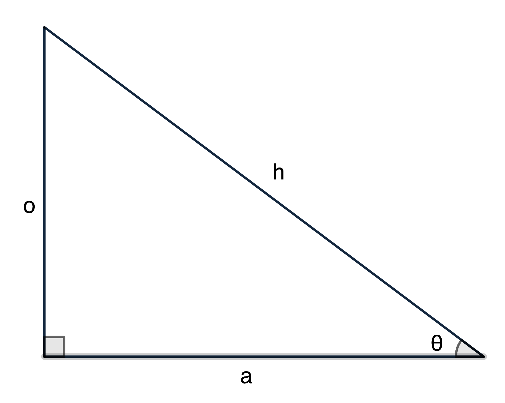

$\text{sine}(\t) = \sin \t = \displaystyle \frac{\text{"opposite"}}{\text{"hypotenuse"}} = \frac{o}{h};~\text{cosine}(\t) = \cos\t = \frac{\text{"adjacent"}}{\text{hypotenuse}} = \frac{a}{h};~\text{tangent}(\t) = \tan\t = \frac{\text{opposite}}{\text{adjacent}} = \frac{o}{a};\\ \text{cotangent}(\t) = \cot\t = \displaystyle\frac{\text{adjacent}}{\text{opposite}} = \frac{a}{o};~\text{secant}(\t) = \sec\t = \frac{\text{hypotenuse}}{\text{adjacent}} = \frac{h}{a};~\text{cosecant}(\t) = \csc\t = \frac{\text{hypotenuse}}{\text{opposite}} = \frac{h}{o}$

__Fundamental Identities__

__Quotient Identities__:
$~~~~~~~~~\displaystyle \tan\t = \frac{\sin\t}{\cos\t},~\cot\t = \frac{\cos\t}{\sin\t}$

__Reciprocal Identities__:
$~~~~~~\displaystyle \csc\t = \frac1{\sin\t},~\sec\t = \frac1{\cos\t},~\cot\t=\frac1{\tan\t}$

__Exponent Notation__: <b>Except for</b> $n=-1$, trig$^n x \equiv (\text{trig }x)^n$, e.g., $\sin^2 x \equiv (\sin x)^2$ (trig$^{-1} x$ means something different: if you want to write $\displaystyle \frac1{\text{trig }x}$ using a negative exponent, you have to write $(\text{trig }x)^{-1}$)

__Pythagorean Identities__:
$~~~\sin^2\t + \cos^2\t = 1,~\tan^2\t + 1 = \sec^2\t,~\cot^2\t + 1 = \csc^2\t$

__Cofunction Identities__: ___if___ $x+y = 90°= \displaystyle \frac{\pi}2$ rad, i.e., if $x,y$ are &quot;complementary,&quot; ___then___: $$\sin x = \cos y,~\tan x = \cot y,~\sec x = \csc y$$
Equivalently: $\displaystyle \sin\left(\frac{\pi}2-\t\right) = \cos \t,~\tan\left(\frac{\pi}2-\t\right) = \cot \t,~\sec\left(\frac{\pi}2-\t\right) = \csc \t,\\ \displaystyle \cos\left(\frac{\pi}2-\t\right) = \sin\t,~\cot\left(\frac{\pi}2-\t\right) = \tan\t,~\csc\left(\frac{\pi}2-\t\right) = \sec\t$
  

__Solved Problems__

<a name="2.20" class="goback" onclick="winhisback()">__2.20__)</a>
Given: A right triangle with one leg $= 2$ units, hypotenuse $= \sqrt5$ units, and angle between them $= \t$; Calculate: $\sin, \cos, \tan, \cot, \sec, \& \csc$ of $\t$.

__Sln__: $2$ is the length of the <i>adjacent</i> leg, and the Pythagorean Theorem tells us the length of the <i>opposite</i> leg must equal $\sqrt{(\sqrt5)^2 - 2^2} = \sqrt{5-4} = 1$, so: $$\boxed{\sin\t = \frac1{\sqrt5} = \frac{\sqrt5}{5}; \cos\t = \frac2{\sqrt5} = \frac{2\sqrt5}{5}; \tan\t = \frac12; \cot\t = 2; \sec\t = \frac{\sqrt5}2; \csc\t = \sqrt5}.$$
  

<a name="2.24" class="goback" onclick="winhisback()">__2.24__)</a>
Given: $\displaystyle \sin\t = \frac13, \cos\t = \frac{2\sqrt2}3$; Use trig identities to calculate $\tan, \cot, \sec, \& \csc$ of $\t$.

__Sln__: $\tan\t = \displaystyle \frac{\sin\t}{\cos\t} = \frac{(1/3)}{(2\sqrt2/3)} = \boxed{\frac{1}{2\sqrt2} = \frac{\sqrt2}{4}}$; $\cot\t = \displaystyle \frac1{\tan\t} = \boxed{2\sqrt2}$; $\sec\t = \displaystyle \frac1{\cos\t} = \boxed{\frac3{2\sqrt2} = \frac{3\sqrt2}4}$; $\csc\t = \displaystyle \frac1{\sin\t} = \boxed{3}.$
  

__28, 32, 36__) Use definitions or identities to find the values of the remaining five trig functions of acute angle $\t$.

<a name="2.28" class="goback" onclick="winhisback()">__2.28__)</a>
$\displaystyle \sin\t = \frac{\sqrt3}4$.

__Sln__: Method 1: Using the (ratio) definitions. Due to the &quot;Angle-Angle&quot; theorem of geometry&mdash;if two pairs of corresponding angles in two different triangles are congruent, then the triangles are <i>similar</i>&mdash;we are free to use any right triangle whose <i>ratio</i> of leg opposite $\t$, $o$, to its hypotenuse, $h$, is $\displaystyle \frac{\sqrt3}4$; for example, a right triangle with $h=4$ and $o=\sqrt3$ (we could have used a triangle with $h=1$ and $\displaystyle o=\frac{\sqrt3}{4}$; or a triangle with $h=1000$ and $o=250\sqrt3$; etc., but we may and do choose the triangle which makes the rest of the values &quot;easiest&quot; to calculate).&nbsp; In order to use the definitions, we need the length of the adjacent leg, $a$, for which we use the Pythagorean Theorem: $a^2 + (\sqrt3)^2 = 4^2 \implies a^2 = 16 - 3 \implies a = \sqrt{13}.$ Therefore, $$\boxed{\cos\t = \frac{\sqrt{13}}4; \tan\t = \frac{\sqrt3}{\sqrt{13}} = \frac{\sqrt{39}}{13}; \cot\t = \frac{\sqrt{13}}{\sqrt3} = \frac{\sqrt{39}}{3}; \sec\t = \frac4{\sqrt{13}} = \frac{4\sqrt{13}}{13}; \csc\t = \frac4{\sqrt3} = \frac{4\sqrt3}3}.$$ 

Method 2: Using trig identities. 
$\sin^2\t + \cos^2\t = 1 \implies \cos^2\t = 1 - \displaystyle \left(\frac{\sqrt3}{4}\right)^2 = \frac{13}{16} \implies \boxed{\cos\t = \frac{\sqrt{13}}{4}}$ 
$\displaystyle \sec\t = \frac1{\cos\t} \implies \boxed{\sec\t = \frac4{\sqrt{13}}}$ 
$\displaystyle \tan^2\t + 1 = \sec^2\t \implies \tan^2\t = \frac{16}{13}-1 = \frac3{13} \implies \boxed{\tan\t = \sqrt{\frac3{13}}}$  
$\displaystyle \cot\t = \frac1{\tan\t} \implies \boxed{\cot\t = \sqrt{\frac{13}3}}$  
$\displaystyle \cot^2\t + 1 = \csc^2\t \implies \csc^2\t = \frac{13}3 + 1 = \frac{16}3 \implies \boxed{\csc\t = \frac4{\sqrt3}}$
  

<a name="2.32" class="goback" onclick="winhisback()">__2.32__)</a>
$\displaystyle \csc\t = 5$.

__Sln__: $\csc\t = 5$ implies there exists a right triangle with hypotenuse $h=5$ and leg opposite $\t$ $o=1$; the Pythagorean Theorem implies the leg adjacent to $\t$ $a=\sqrt{25-1} = \sqrt{24} = 2\sqrt6$, so:
$$\boxed{\sin\t = \frac15; \cos\t = \frac{2\sqrt6}5; \tan\t = \frac1{2\sqrt6} = \frac{\sqrt6}{12}; \cot\t = 2\sqrt6; \sec\t = \frac5{2\sqrt6} = \frac{5\sqrt6}{12}}.$$ 
  

<a name="2.36" class="goback" onclick="winhisback()">__2.36__)</a>
$\displaystyle \cot\t = 2$.

__Sln__: $\displaystyle \tan\t = \frac1{\cot\t} \implies \boxed{\tan\t = \frac12}$ 
$\cot^2\t + 1 = \csc^2\t \implies \boxed{\csc\t} = \sqrt{2^2 + 1} = \boxed{\sqrt5}$ 
$\displaystyle \sin\t = \frac1{\csc\t} \implies \boxed{\sin\t = \frac1{\sqrt5} = \frac{\sqrt5}5}$ 
$\displaystyle \tan^2\t + 1 = \sec^2\t \implies \boxed{\sec\t} = \sqrt{\left(\frac12\right)^2 + 1} = \boxed{\frac{\sqrt5}2}$ 
$\displaystyle \cos\t = \frac1{\sec\t} \implies \boxed{\cos\t = \frac2{\sqrt5} = \frac{2\sqrt5}5}$.
  

<a name="2.52" class="goback" onclick="winhisback()">__2.52__)</a>
Using the Fundamental Identities and/or the Complementary Angle Theorem, find the exact value of $\cot 25°\cdot \csc 65°\cdot \sin 25$°, without using a a calculator.

__Sln__: $\cot 25°\cdot \csc 65°\cdot \sin 25° = \displaystyle \frac{\cos 25°}{\cancel{\sin 25°}} \cdot \frac1{\sin 65°} \cdot \cancel{\sin 25°} = (\cos 25°) \cdot \frac1{\sin(90°-25°)} = \cancel{\cos 25°} \cdot \frac1{\cancel{\cos 25°}} = \boxed{1}$.
  

<a name="2.58" class="goback" onclick="winhisback()">__2.58__)</a>
Given $\sec \t = 3$, use trig identities to find the exact values of $\cos\t, \tan^2\t, \csc(90°-\t)$, and $\sin^2\t$.

__Sln__: $\sec\t = \displaystyle \frac1{\cos\t} \implies \cos\t = \frac1{\sec\t}$ so $\sec\t = 3 \implies \boxed{\cos\t = \frac13}.$ 
$\tan^2\t + 1 = \sec^2\t \implies \tan^2\t = \sec^2\t - 1$ so $\sec\t = 3 \implies \boxed{\tan^2\t} = 9-1 = \boxed{8}.$ 
$\csc(90°-\t) = \sec\t$ so $\sec\t = 3 \implies \csc(90°-\t) = \boxed{3}.$ 
$\sin^2\t + \cos^2\t = 1 \implies \sin^2\t = 1 - \cos^2\t = 1 - \displaystyle \left(\frac1{\sec\t}\right)^2$ so $\sec\t = 3 \implies \boxed{\sin^2\t} = 1 - \displaystyle \frac1{3^2} = \boxed{\frac89}.$
  

<a name="2.66" class="goback" onclick="winhisback()">__2.66__)</a>
Find an acute angle $\t$ that satisfies the equation $\tan\t = \cot(\t + 45°)$.

__Sln__: We use the co-function identity $\tan\t = \cot(90°-\t)$ to write our equation as $\cot(90°-\t) = \cot(\t + 45°)$. Now, this is why the problem statement specifies &quot;find an <i>acute</i> angle&quot;: when we (soon) expand the definitions of the trigonometric functions to encompass all real numbers, not just angles possible in right triangles, we won’t be able to do the following (we’ll learn why when the time comes); however, as long as $0° \lt \t \lt 90$°, $\cot \alpha = \cot \beta \iff \alpha = \beta$, so $\cot(90°-\t) = \cot(\t + 45°) \implies 90°- \t = \t + 45°\implies 2\t = (90-45)° \implies \boxed{\t = 22.5°}.$
  

<a name="2.73" class="goback" onclick="winhisback()">__2.73__)</a>
Refer to the diagram in the text accompanying the Exercise.&nbsp; Let $n \in \mathbb{R} \ge1$ and $\t$ (measured in radians) be such that $0 \lt n\t \lt \displaystyle \frac{\pi}{2}$: __a__) explain why there exists a triangle with angles $\t, n\t$ and included side of length $1$.&nbsp; Place this triangle in the origin&#8209;centered circle of radius 1 such that the end points of the unit&#8209;length side are at $(0,0) = O$ and $(1,0) = B$; drop the perpendicular from the other vertex, $C$, to the $x$-axis and denote its intersection with the $x$-axis by $D$: __b__) show that the $x$-coordinate of $D$ equals $$\frac{\tan(n\t)}{\tan\t + \tan(n\t)}.$$

__Sln__: __a__) Working in radians, if $0 \lt n\t \lt \displaystyle \frac{\pi}{2}$ with $n \ge 1$, then $0 \lt \t \lt \displaystyle \frac{\pi}{2n} \lt \frac{\pi}2$ (this last inequality holding because of the assumption that $n \ge 1$) so $0 \lt (\t + n\t) \lt \displaystyle \left(\frac{\pi}2 + \frac{\pi}2\right) = \pi$, i.e., the sum of $\t$ and $n\t$ is less than $\pi$ (and greater than zero).&nbsp; Thus there is &quot;enough room&quot; for a third angle of a triangle, namely one of measure $\pi - \t - n\t$, which is also greater than zero and less than $\pi$.&nbsp; From geometry we (should) know that just knowing the angles of a triangle does not determine its size: there are an infinite number of triangles with any &quot;triple&quot; of three angles adding up to $\pi$ radians.&nbsp; By the AA theorem (see Exercise 2.28, Solution 1 above), all these triangles are similar to one another, so any one we choose, we can simply divide all the sides by the length of the side adjacent to both $\t$ and $n\t$ to get the triangle with those three angles and that &quot;included&quot; side having length 1.$~~~\blacksquare$

__b__) Referencing the figure in the text: since $\overline{CD}$ is perpendicular to the $x$-axis, $\Delta ODC$ and $\Delta BDC$ are right triangles, so $\tan\t = \displaystyle \frac{h}{x}$ and $\tan(n\t) = \displaystyle \frac{h}{1-x}$ (make sure you understand where the $1-x$ comes from!)&nbsp; Now, it’s less &quot;messy&quot; to show that $\displaystyle \frac1x = \frac{\tan\t + \tan(n\t)}{\tan(n\t)}$, from which the desired result follows immediately by reciprocating both sides.&nbsp; We have: $\displaystyle \frac{\tan\t + \tan(n\t)}{\tan(n\t)} = \frac{\displaystyle{\frac{h}{x} + \frac{h}{1-x}}}{\displaystyle{\frac{h}{1-x}}} = \frac{\displaystyle{\frac{h}{x}}}{\displaystyle{\frac{h}{1-x}}} + \frac{\displaystyle{\frac{h}{1-x}}}{\displaystyle{\frac{h}{1-x}}} = \frac{1-x}{x} + 1 = \frac1x - 1 + 1 = \frac1x.~~~\blacksquare$
  

<a name="2.76" class="goback" onclick="winhisback()">__2.76__)</a>
Refer to the diagram in the text accompanying the Exercise.&nbsp; Triangles $\Delta OBC$ and $\Delta OBD$ are given as follows: shared vertex $O$ is the origin of a Cartesian co-ordinate system; shared vertex $B$ is the point $(1,0)$; $C$ is the intersection with the unit&#8209;radius, origin&#8209;centered circle of a ray emanating from the origin and making an angle $\t$ with the $x$-axis; and $D$ is the intersection of that same ray with the vertical line passing through point $B$; ${OBC}^{\!\!\!\frown}$ is the circular sector defined by points $O, B, C.$ 
__a__) Express the area of $\Delta OBC$ in terms of $\sin\t$ and $\cos\t$; 
__b__) Do the same for the area of $\Delta OBD$;  
__c__) Use these results to show that $$1 \lt \frac{\t}{\sin\t} \lt \frac{1}{\cos\t}.$$ 

__Sln__: __a__) Part of solving math problems, especially in the &quot;real world,&quot; is identifying what given information is actually needed to solve the problem and what information is extraneous.&nbsp; In this case, the extraneous information is the implication that you’ll need both $\sin$ and $\cos$ to express the area of $\Delta OBC$&mdash;you only need $\sin$.&nbsp; The area is $\frac12 bh$, where $h$ is the length of the perpendicular segment from a vertex to its opposite side, and $b$ is the length of that opposite side.&nbsp; In this case, if we choose as base the segment $\overline{OB}$ whose length is 1, then $h$ is the length of of the segment from $C$ perpendicular to $\overline{OB}$: what is the length of this segment?&nbsp; Well, $\overline{CB}$ is the leg <i>opposite</i> angle $\t$ in the right triangle $\Delta OBC$ whose hypotenuse is $\overline{OC}$, whose length is also 1 because it is a radius of the circle; thus $\sin\t = \frac{h}1 = h$.&nbsp; Therefore, $A(\Delta OBC) = \frac12(1)h = \boxed{\frac12\sin\t}.$ 

__b__) For this one we need to recall the theorem from geometry that a line tangent to a circle is perpendicular to the radius ending at the point of tangency.&nbsp; Thus $\Delta OBD$ is a right triangle with legs $\overline{OB}$ and $\overline{BD}$ whose area is thus $A(\Delta OBD) = \frac12 bh = \frac12(1)m\overline{BD}$, but what is $m\overline{BD}$?&nbsp; Well, $\displaystyle \frac{m\overline{BD}}{m\overline{OB}} = \frac{m\overline{BD}}1 = \tan\t = \frac{\sin\t}{\cos\t}$ so $A(\Delta OBD) = \boxed{\frac12\frac{\sin\t}{\cos\t}}.$

__c__) (As noted in the text, this result is important in Calculus.)&nbsp; To show that $\displaystyle 1 \lt \frac{\t}{\sin\t} \lt \frac{1}{\cos\t}$, observe that $A(\Delta OBC) \lt A(\text{sector }OBC) = \frac12(1)^2\t = \frac12\t$ (because $\Delta OBC \subset \text{sector }OBC$), and $A(\text{sector }OBC) \lt A(\Delta OBD)$ (because sector $OBC \subset \Delta OBD)$; therefore $\displaystyle \frac12 \sin\t \lt \frac12\t \lt \frac12\frac{\sin\t}{\cos\t}$.&nbsp; Now, assuming $\t \ne 0$ (so that we may assume that $\sin\t \ne 0$), we may multiply this compound inequality &quot;through&quot; by $\displaystyle \frac2{\sin\t}$ without having to &quot;flip&quot; the inequalities and the desired result is thus obtained.$~~~\blacksquare$
  

<a name="2.78" class="goback" onclick="winhisback()">__2.78__)</a>
Given: $\t$ acute, $x = \tan\t$; provide: the values of the other 5 trigonometric functions in terms of $x$.

__Sln__: We use the &quot;trick&quot; that &quot;anything is equal to itself over 1,&quot; so $x = \displaystyle \frac{x}1 = \tan \t = \frac{o}{a}$ and use this result to draw a right triangle satisfying the given conditions:

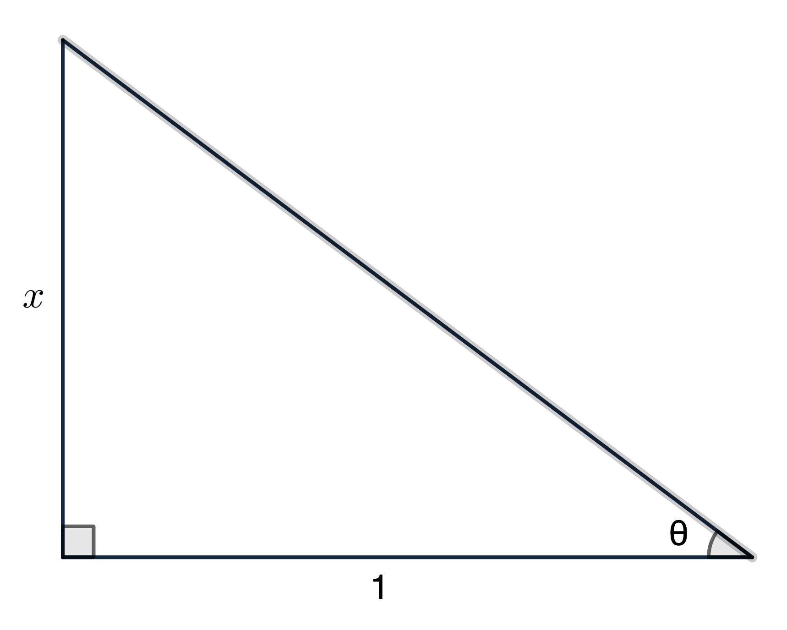

Now we use the Pythagorean Theorem to calculate that, in terms of $x$, $h^2 = 1^2 + x^2 \implies h = \sqrt{1+x^2}$:

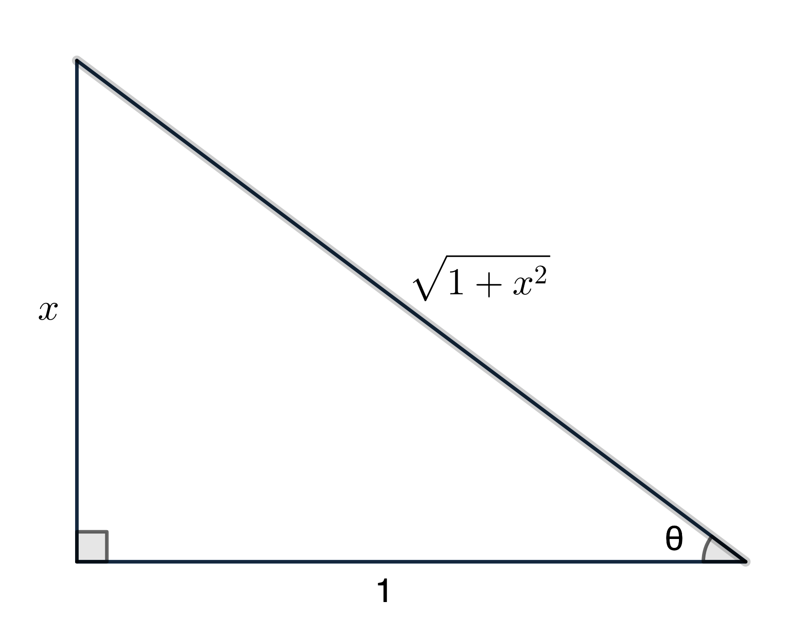

Now we can immediately answer the question:

$\displaystyle \sin \t = \frac{o}{h} = \frac{x}{\sqrt{1+x^2}};~\cos \t = \frac{a}{h} = \frac1{\sqrt{1+x^2}};~\sec \t = \frac1{\cos \t} = \sqrt{1+x^2};~\csc \t = \frac1{\sin \t} = \frac{\sqrt{1+x^2}}{x};~\cot \t = \frac1{\tan \t} = \frac1x$. 
(Note that we didn’t really need the triangle to do this last one; indeed, we didn’t really need the triangle at all: this Exercise could also have been done using the Pythagorean Identities, which the reader should now do.)
  

## Section 3: Trigonometric Functions of Acute Angles
### Formulas Section

__Trigonometric function values to memorize__ (through repeated use):

| rad | deg | sin | cos | tan | cot | sec | csc |
|:---:|:---:|:---:|:---:|:---:|:---:|:---:|:---:|
| 0 | 0 | 0 | 1 | 0 | NaN | 1 | NaN |
|$\displaystyle\frac{\pi}6$| 30 |$\displaystyle\frac12$|$\displaystyle\frac{\sqrt3}2$|$\displaystyle\frac1{\sqrt{3}}=\frac{\sqrt3}3$|$\sqrt3$|$\displaystyle\frac2{\sqrt3}=\frac{2\sqrt3}3$| 2 |
|$\displaystyle\frac{\pi}4$| 45 |$\displaystyle\frac1{\sqrt2}=\frac{\sqrt2}2$|$\displaystyle\frac{\sqrt2}2$| 1 | 1 |$\sqrt2$|$\sqrt2$|
|$\displaystyle\frac{\pi}3$| 60 |$\displaystyle\frac{\sqrt3}2$|$\displaystyle\frac12$|$\sqrt{3}$|$\displaystyle\frac{\sqrt3}3$| 2 |$\displaystyle\frac{2\sqrt3}3$|
 

__Solved Problems__

__11__ and __16__) Without using a calculator, give the exact value of the expression for $\t=60°$ given $f(\t) = \sin\t$ and $g(\t) = \cos\t$.

<a name="3.11" class="goback" onclick="winhisback()">__3.11__)</a>
$\left[f(\t)\right]^2$

__Sln__: $\left[f(\t)\right]^2 = (\sin 60°)^2 = \displaystyle \left(\frac{\sqrt3}2\right)^2 = \boxed{\frac34}$.
  
 
<a name="3.16" class="goback" onclick="winhisback()">__3.16__)</a>
$\displaystyle \frac{g(\t)}2$

__Sln__: $\displaystyle \frac{g(\t)}2 = \frac{\cos(60°)}2 = \frac{1/2}2 = \boxed{\frac14}$.
  
 
__22__ and __28__) Give the exact value of the expression without using a calculator

<a name="3.22" class="goback" onclick="winhisback()">__3.22__)</a> 
$\displaystyle \tan\frac{\pi}4 + \cot\frac{\pi}4$

__Sln__: $\displaystyle \tan\frac{\pi}4 + \cot\frac{\pi}4 = 1 + 1 = \boxed{2}$.
  
 
<a name="3.28" class="goback" onclick="winhisback()">__3.28__)</a> 
$1 + \tan^2 30°-\csc^2 45°$

__Sln__: $\displaystyle 1 + \tan^2 30° - \csc^2 45° = 1 + \left(\frac 1{\sqrt3}\right)^2 - (\sqrt2)^2 = 1 + \frac13 - 2 = \boxed{-\frac23}$.
  
 
__34__, __38__, __42__) Use a calculator to approximate the given expression accurate to two decimal places.

<a name="3.34" class="goback" onclick="winhisback()">__3.34__)</a> 
$\csc 55°$

__Sln__: Precisely how you enter expressions into calculators these days (2026) still varies somewhat, so, unfortunately, I can’t show you precisely how you’ll have to do it on your calculator of choice.&nbsp; For example, the iPhone’s &quot;built&#8209;in&quot; Calculator app (still) doesn’t have a dedicated $\csc$ button, so if you use that, you’ll have to either: a) enter in $\sin 55$ (being sure to be in degree mode!), tap $=$, and then select the &quot;1/x&quot; button and then tap $=$ again; or b) enter $1 \div \sin 55$ and then tap =.&nbsp; On the other hand, you can just type &quot;csc 55 degrees&quot; into a Google search bar and get the answer...but you must specify degrees because Google’s default is to assume radians (although the mode appears to switch automatically after the first specification of degrees; remember all this when using it to calculate the values of inverse trig functions).&nbsp; One way or another, you should get $\csc 55° \doteq \boxed{1.22}$ to the required two decimal places of precision. 
  

<a name="3.38" class="goback" onclick="winhisback()">__3.38__)</a> 
$\displaystyle \cot \frac{\pi}{18}$

__Sln__: When no units are provided for a trig function’s argument, you are to assume the units are radians.&nbsp; Thus to evaluate this on a calculator, &quot;Step 0&quot; is to make sure the calculator is in radian mode; one way to test for this is to evaluate $\sin \pi$: if you’re in radian mode, you should get 0, whereas in degree mode you’ll get 0.054803665.&nbsp; Now, as with $\csc$ and $\sec$, most &quot;conventional&quot; calculators don’t have a $\cot$ button&mdash;the way to evaluate $\cot x$ on such calculators is to use the fact that $\displaystyle \cot x = \frac1{\tan x}$, by entering either $1 \div \tan x$ or $\tan x$ followed by the 1/x button.&nbsp; However you do it, you should get $\displaystyle \cot \frac{\pi}{18} \doteq \boxed{5.67}$ to two decimal places.
  

<a name="3.42" class="goback" onclick="winhisback()">__3.42__)</a> 
$\tan 1$

__Sln__: Again, no units provided implies the units are understood to be radians, so this is $\tan (1\text{ rad}) \doteq 1.557407725 \doteq \boxed{1.56}$ to two decimal places.
  

__48__, __52__, __56__) Given $f(x) = \sin x,~g(x) = \cos x,~h(x) = 2x,~p(x) = \displaystyle \frac x2$, without a calculator:

<a name="3.48" class="goback" onclick="winhisback()">__3.48__)</a> 
Calculate $(f-g)(60°)$
 
__Sln__: $(f-g)(60°) = f(60°) - g(60°) = \sin 60° - \cos 60° = \displaystyle \boxed{\frac{\sqrt3}2 - \frac12 = \frac{\sqrt3 - 1}2}$.
  

<a name="3.52" class="goback" onclick="winhisback()">__3.52__)</a> 
Calculate $(g \circ p)(60°)$
 
__Sln__: $\displaystyle (g \circ p)(60°) = g(p(60°)) = g\left(\frac{60°}2\right) = g(30°) = \cos(30°) = \boxed{\frac{\sqrt3}2}$.
  

<a name="3.56" class="goback" onclick="winhisback()">__3.56__)</a> 
__a__) Evaluate $\displaystyle g\left(\frac{\pi}6\right)$ and state what point that corresponds to on the graph of $g$. 

__Sln__: $\displaystyle g\left(\frac{\pi}6\right) = \cos \frac{\pi}6 = \boxed{\frac{\sqrt3}2}$; thus its point on the graph of $g$ has co&#8209;ordinates $\boxed{\left(\frac{\pi}6, \frac{\sqrt3}2\right)}$.
 

__b__) Assume that $g$ is one&#8209;to&#8209;one on $0 \le x \le \pi$: what point does the result of part __a__ imply is on the graph of $g^{-1}$? 

__Sln__: Assuming that $g$ is one&#8209;to&#8209;one on $0 \le x \le \pi$, since $\displaystyle \frac{\pi}6$ is in that interval, by a theorem from an earlier Chapter, $\displaystyle g^{-1}\left(\frac{\sqrt3}2\right) = \frac{\pi}6$ and thus the point $\boxed{\left(\frac{\sqrt3}2, \frac{\pi}6\right)}$ is on the graph of $g^{-1}$.
 

__c__) What point is on the graph of $\displaystyle y = 2g\left(x - \frac{\pi}6\right),~x = \frac{\pi}6$?

__Sln__: $\displaystyle y = 2g\left(\frac{\pi}6 - \frac{\pi}6\right) = 2\cos(0) = 2(1) = 2$, so $\boxed{\left(\frac{\pi}6, 2\right)}$ is the required point.
  

<a name="3.64" class="goback" onclick="winhisback()">__3.64__)</a> 
__a__) Find the volume of a right&#8209;circular cone of slant angle $\t$ that circumscribes a sphere of radius $R$.
 
__Sln__: We can use two&#8209;dimensional (plane) geometry to solve this three&#8209;dimensional (solid) geometry problem because of the ___rotational symmetry___ of the figures involved: the sphere is simply a circle rotated around a diameter, which defines an &quot;axis of symmetry,&quot; and the circumscribing cone is simply an isosceles triangle, whose base is bisected by said axis of symmetry; which circumscribes the circle; and which is also rotated around said axis of symmetry.&nbsp; Because of this, the intersection with the sphere and the cone of any plane containing the axis of symmetry is a circle and a circumscribing isosceles triangle, both congruent to whichever such shapes were used to create the three&#8209;D objects in the first place.&nbsp; In other words, we can compute the required $h$ and $r$ by &quot;pretending&quot; that we are dealing not with a sphere and a circumscribing cone, but with a circle (of radius $R$) and a circumscribing isosceles triangle (of base angle $\t$), and then using the results in the given formula for the volume of the cone, $\frac13\pi r^2 h$.

We need to figure out $r$ and $h$ in terms of $R$ and $\t$ using algebra, geometry, and right triangle trigonometry.&nbsp; Referencing  the figure below, first note that $\displaystyle \tan\t = \frac h r \implies r\sin\t = h\cos\t$.&nbsp; Next, because the altitude of the triangle makes a right angle with the base, the angle between the altitude and a lateral side is $180° - \t$; and because the lateral sides are tangent to the circle, the angle between a lateral side and a radius to a point of tangency is $90°$; consequently, the angle between said radius and the altitude is also $\t$.&nbsp; Thus $\displaystyle \cos\t = \frac R{h-R} \implies \sec\t = \frac h{R} - 1 \implies h = R(\sec\t + 1)$.&nbsp; Combining this with $r\sin\t = h\cos\t$ gives $r\sin\t = R(\sec\t + 1)\cos\t \implies r = R(\csc\t + \cot\t)$, yielding: $$\boxed{V_{\text{cone}} = \frac13{\pi}R^3(1 + \sec\t)(\csc\t + \cot\t)^2}$$

  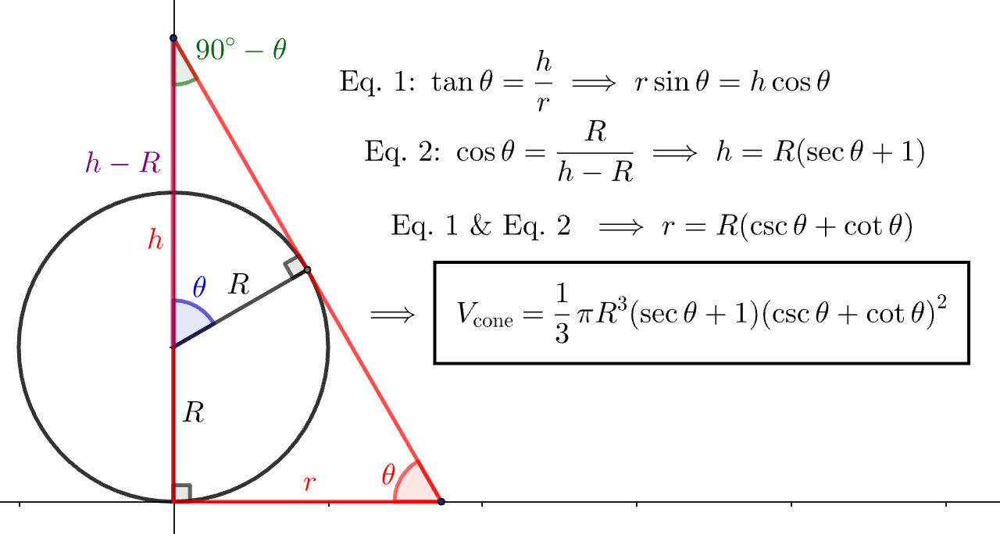

__b__) Give the cone volumes for a sphere of radius 2 cm and slant angles 30°, 45°, and 60°.

__Sln__: Having found the general formula in Part a) these are &quot;merely&quot; &quot;plug&#8209;and&#8209;chug&quot; (though teaching the reader how to use it is beyond our present scope, as confirmation of our results, for each $\t$ we include a diagram we produced with [GeoGebra’s 3-D Graphing Calculator](https://www.geogebra.org/classic#3d) because it automatically calculates decimal approximations of the graphed volumes):

$\t = 30°$: $\displaystyle V = \frac{\pi}3(2^3)(1+\sec(30°))[\csc(30°) + \cot(30°)]^2 = \frac{8\pi}3\left(1+\frac2{\sqrt3}\right)(2 + \sqrt3)^2 =$ 
$\displaystyle \frac{8\pi}3(7 + 4\sqrt3)\left(1+\frac{2\sqrt3}3\right) = \frac{8\pi}3\left(7 + \frac{14\sqrt3}3 + 4\sqrt3 + 8\right) =$  
= $\boxed{\frac{8\pi}3\left(15 + 26\frac{\sqrt3}3\right) \doteq 251.42\text{ cm}^3}$.

  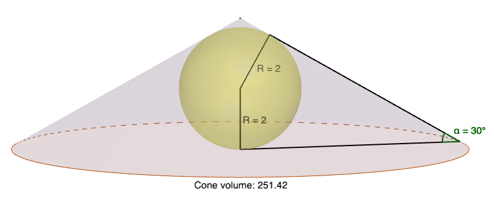

 

$\t = 45°$: $\displaystyle V = \frac{8\pi}3(1+\sec(45°))[\csc(45°) + \cot(45°)]^2 = \frac{8\pi}3(1+\sqrt2)(\sqrt2 + 1)^2 = \frac{8\pi}3(1+\sqrt2)^3 =$ 
$\displaystyle \frac{8\pi}3\left[1^3 + 3(1)^2\sqrt2 + 3(1)(\sqrt2)^2 + (\sqrt2)^3\right] = \boxed{\frac{8\pi}3\left(7 + 5\sqrt2\right) \doteq  117.88\text{ cm}^3}$.

  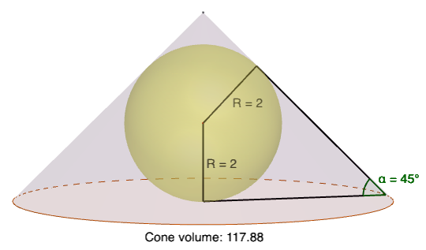

 

$\t = 60°$: $\displaystyle V = \frac{8\pi}3(1+\sec(60°))[\csc(60°) + \cot(60°)]^2 = \frac{8\pi}3(1+2)\left(\frac2{\sqrt3} + \frac1{\sqrt3}\right)^2 = 8\pi(\sqrt3)^2 =$ 
$\boxed{24\pi \doteq 75.40\text{ cm}^3}$.

  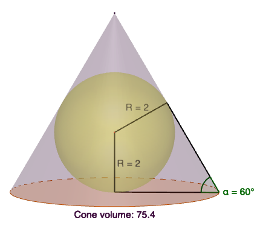

 

__c__) Use technology to find the angle $\t_{\min}$ that minimizes the cone volume for a sphere of radius 2 cm (and provide that minimum volume).

__Sln__: First note that there are two different things we can find here: 1) the cone’s slant angle $\t$, in degrees, that results in a minimum volume for the cone (the thing we are explicitly asked to find); and 2) that resulting minimum volume, in cubic centimeters (which we will also provide, because most, if not all, technology that provides the former, simultaneously provides the latter).&nbsp; Unfortunately, input syntax varies sufficiently across graphing calculators and GC apps that the most we can do here is provide a general description of what the reader must do for this Problem. 
 

Step 1: Use your GC to define a function with the formula for the volume found in Part a).&nbsp; (Some GC apps will let you define the function using the letters we used in Part a), but most physical GCs and some apps will require you to define it using $y$ for the volume and $x$ for $\t$, so you’ll have to input something like <sp style="background-color: lightgray;">y = 8 * &pi; * (1+sec(x)) * (csc(x) + cot(x))^2 / 3</sp>.&nbsp; Other potential &quot;complications&quot; at this stage include: i) your GC doesn’t have $\sec, \csc,$ and $\cot$ functions, so your function will need to look like <sp style="background-color: lightgray;">y = 8 * &pi; * (1+1/cos(x)) * (1/sin(x) + 1/tan(x))^2 / 3</sp>; ii) your GC defaults to radian mode and you’re uncertain how (or simply don’t want) to change it to degree mode, and yet you want the answer to be provided in degrees without having to convert it yourself&mdash;in that case, instead of $x$ (or $\t$) you’ll need to use <sp style="background-color: lightgray;">&pi;/180 * x</sp> (or similar if using $\t$.) 
 

Step 2: Use your GC’s &quot;find a function’s minimum&quot; functionality (including finding how to access and use that functionality if you don’t already know) to find, between 0° and 90°, the &quot;bottom&quot; of the graph of the function you defined in Step 1.&nbsp; (While more advanced GCs, such as the iPhone Desmos app, enable you to find a function’s (local) minimum from its displayed graph simply by tapping close to the minimum point, hardware GCs and more &quot;primitive&quot; GC apps will ask you to specify a &quot;lower bound&quot; and an &quot;upper bound&quot; for the required minimizing abscissa, i.e., an abscissa value less than and an abscissa value greater than the answer&mdash;these you must estimate from examination of the graph.&nbsp; For example, from the graph provided below, we can estimate that a lower bound on the minimizing abscissa is 68° and an upper bound is 72°.)
 

Step 3: Properly interpret the answer: usually, the result will be provided as an ordered (or labeled) pair&mdash;since we’re graphing volume as a function of slant angle, the first coordinate is the angle we seek, the second coordinate is the resulting minimum volume.&nbsp; (Also be sure that the answer you’ve obtained has the right units: if you get something like 1.23095942, you’ve obtained the right answer, but in radians, not degrees.)
 

Here’s an example, generated with GeoGebra, of what you should see and obtain...

  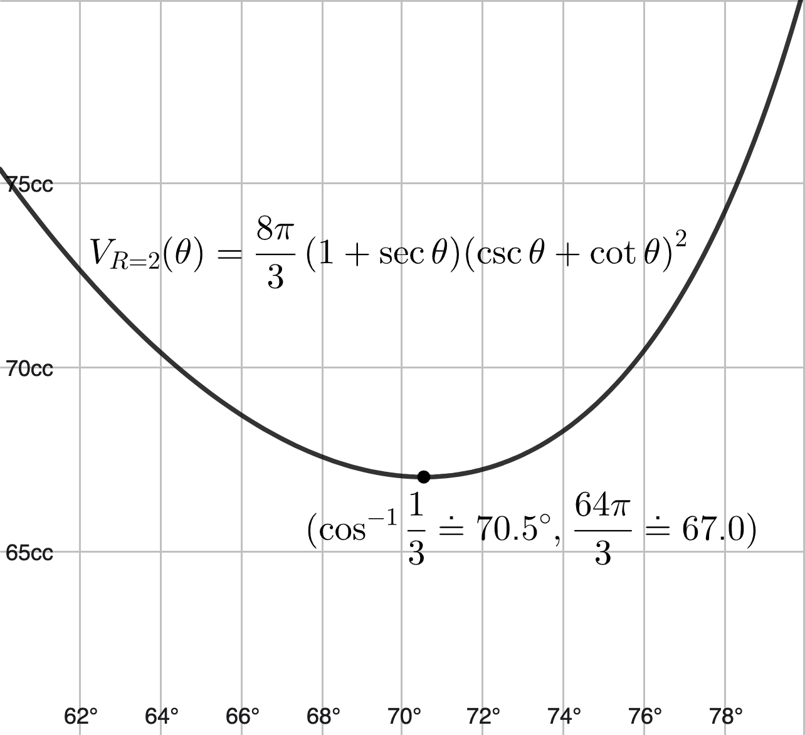

...except: (optional material) most GCs&dagger; will not provide you with the exact answer &mdash; $\displaystyle \left(\cos^{-1}\frac13, \frac{64\pi}3\right)$ &mdash; I have provided in the graph.&nbsp; Why have I provided the exact answer, even though it involves something we won’t be learning about until Chapter 8&mdash;the inverse trig functions&mdash;and partially requires Calculus to find?&nbsp; Because the part that doesn’t require Calculus turns out to be an excellent exercise in solving a factorable &quot;quartic&#8209;in&#8209;form&quot; polynomial, illustrating how such things can actually arise in practice.

In Calculus, we learn that if a ___continuous___ function attains a ___local extremum___ (maximum or minimum) at an abscissa, then a related function, called its ___derivative___, must equal zero at that abscissa; the implication is only &quot;one way,&quot; however: the derivative being zero at an abscissa doesn’t necessarily imply that the original function attains a local extremum there (you learn all about this in Calculus).&nbsp; Nevertheless, this provides a strategy for finding &quot;candidate&quot; abscissae for the locations of extrema, namely: computing the derivative of the function (one of two primary computational skills learned and drilled in Calculus); setting the derivative equal to zero and solving that equation; and then checking (using other methods) whether each zero of the derivative does indeed yield a (local) extremal value of the original function.

Of course, we do not learn how to compute the derivative of $\displaystyle V(\t) = \frac{8\pi}3 (1 + \sec\t)(\csc\t + \cot\t)^2$ in this course, so you’ll have to take my word for it that it is $\displaystyle \frac{8\pi}3 \left(\sec^2\t - 5\csc^2\t - 8\csc\t\cot\t - 3\cot^2\t\right)$, which we need to set equal to zero and then solve for $\t$.&nbsp; That expression equaling zero implies that $\sec^2\t - 5\csc^2\t - 8\csc\t\cot\t - 3\cot^2\t = 0$, and after multiplying that through by $\sin^2\t\cos^2\t$ and using the quotient and reciprocal identities, we get: 

$\sin^2\t - 5\cos^2\t - 8\cos^3\t - 3\cos^4\t = $ (after using $\sin^2\t = 1 - \cos^2\t$) 
$1 - 6\cos^2\t - 8\cos^3\t - 3\cos^4\t = $ (setting $\cos\t = x$) 
$1 - 6x^2 - 8x^3 - 3x^4 = $ (using the Rational Zeros Theorem from Chapter 5) 
$(1-3x)(x+1)^3 = 0 \implies x = \cos\t = \displaystyle \frac13$ or $-1$.  

Now, in the next section we learn that there is an angle, namely 180°, whose $\cos$ is $-1$, but that can’t be the angle we seek (why?), so it must be whatever angle $\t$ has $\displaystyle \cos\t = \frac13$; in Chapter 8 we learn that this angle is called $\displaystyle \cos^{-1}\frac13 \doteq 70.5° \doteq 1.23 \text{ radians}$.&nbsp; (Technically, all we’ve done at this point is find a possible location of an extremum: we have neither confirmed that it does give an extremal value of the function, nor which kind, i.e., a maximum or minimum; however, the graph of $V(\t)$ makes it clear that this $\t$ does indeed minimize the volume function.)

The GC gives us the decimal approximation of that minimum volume, 67.0 cm$^3$, but using trigonometric identities (or a right triangle), we can find its exact value: $\displaystyle \cos\t = \frac13 \implies \sec\t = 3$ and $\displaystyle \sin\t = \sqrt{1-\left(\frac13\right)^2} = \frac{\sqrt8}3 \implies \csc\t = \frac3{\sqrt8}$ and $\displaystyle \cot\t = \left(\frac13\right)/\left(\frac{\sqrt8}3\right) = \frac1{\sqrt8}$ so $\displaystyle V_{\min} = \frac{8\pi}3 (1+3)\left(\frac3{\sqrt8} + \frac1{\sqrt8}\right)^2 = \frac{8\pi}3(4)\left(\frac4{\sqrt8}\right)^2 = \boxed{\frac{64\pi}3\text{ cm}^3}$. 

&dagger; Some, with a &quot;Computer Algebra System,&quot; may: I haven’t really investigated to find out (yet).
  

<a name="3.68" class="goback" onclick="winhisback()">__3.68__)</a> 
A right triangle contains an angle of $\displaystyle \frac{\pi}8$ radians; one leg has a length of 3 meters: what are the possible lengths of the hypotenuse and why are there two possible answers? 
 
__Sln__: There are two possible answers because we’re not told whether the given leg is opposite or adjacent to the given angle.&nbsp; If opposite, then we have $\displaystyle \sin\left(\frac{\pi}8\right) = \frac 3{h} \implies h = \boxed{3\csc\frac{\pi}8 \doteq 7.839\text{ m}}$; if adjacent, then $\displaystyle \cos\left(\frac{\pi}8\right) = \frac 3{h} \implies h = \boxed{3\sec\frac{\pi}8 \doteq 3.247\text{ m}}$.
  

<a name="3.74" class="goback" onclick="winhisback()">__3.74__)</a> 
A 22&#8209;foot ladder, leaning against a wall (assumed perpendicular to the ground), makes an angle of 70° with the ground: how far up the building does the ladder touch? 

__Sln__: Assuming the ground is flat and the wall is perpendicular to it, the ground, wall, and ladder make a right triangle with the 22&#8209;foot ladder being the hypotenuse and the distance from the ground to where the ladder touches the wall, $y$, is the leg <i>opposite</i> the 70° &quot;elevation&quot; angle.&nbsp; We thus have $\displaystyle \sin(70°) = \frac y{22} \implies y = \boxed{22\sin(70°) \doteq 20.7\text{ ft}}$. 
  

<a name="3.78" class="goback" onclick="winhisback()">__3.78__)</a> 
A tourist 4000 ft from the base of Toronto’s CN Tower measures the angle of elevation to the top of the Towers’s Sky Pod as 20.1° and that to the top of the Tower itself as 24.4°: what is the height of the portion of the Tower above the Sky Pod? 

__Sln__: Refer to the figure below:

  

Let $h_T = $ the height of the Tower and $h_S = $ the height to the top of the Sky Pod: the height we seek is this $h_T - h_S$.&nbsp; Now $\displaystyle \frac{h_T}{4000} = \tan(24.4°) \implies h_T = 4000\tan(24.4°)$ and $\displaystyle \frac{h_S}{4000} = \tan(20.1°) \implies h_S = 4000\tan(20.1°)$ so $h_T - h_S = 4000(\tan(24.4°) - \tan(20.1°)) \doteq \boxed{350.7\text{ ft}}$.
  

<a name="3.84" class="goback" onclick="winhisback()">__3.84__)</a> 
A camera with 20° angles of depression and elevation is positioned 4 ft above the floor and 10 ft away from its 6 ft subject, George: will it be able to &quot;see&quot; both the top and bottom of George, and if not, how far back must it be moved so that it will? 

__Sln__: Refer to the figure below:

  

The height, $h$, that the camera can see above and below the direct line from it to George is related to the angle of elevation/depression by $\displaystyle \tan 20° = \frac h{10} \implies h = 10\tan 20° \doteq 3.64$ ft.&nbsp; Since the direct line from the camera to George is $4$ ft above his feet, but only $6 - 4 = 2$ ft below the top of his head, as positioned, <b>the camera will easily &quot;see&quot; the top of George’s head, but not the bottom of his feet, which it will miss by approximately $0.36$ ft</b>. 

In order to be able to see all of George by moving the camera further away while leaving it at $4$ ft above the ground, it should be placed $x$ feet away, where $\displaystyle \cot 20° = \frac x 4 \implies x = 4\cot 20° \doteq 11.0$ ft, i.e., <b>1 ft further away from George</b>.&nbsp; (Alternatively, the camera could be left $10$ ft away, but lowered by $0.36$ ft $=4.32$ inches.)
  

<a name="3.92" class="goback" onclick="winhisback()">__3.92__)</a> 
Find the exact value of $\sin 1° \cdot \sin 2° \cdot \sin 3° \cdot ...\cdot \sin 45° \cdot \sec 46° \cdot \sec 47° \cdot ... \cdot \sec 89°.$

__Sln__: (At first glance this Exercise doesn’t look like its answer will end up being one of the special trigonometric values this Section is supposed to be about, but it does end up being so.)

The key here is to recognize that, ___with one exception___&mdash;$\sin 45°$&mdash;the argument of each of the secant functions is the complementary angle of precisely one of the sine function arguments; for example, $89°$ is complementary to $1°,~ 88°$ is complementary to $2°,~46°$ is complementary to $44°$, etc.&nbsp; Therefore, the cofunction identity $\sec (90°-\t) = \csc \t$ enables us to replace each $\sec$ factor with a $\csc$ factor whose argument is identical to precisely one of the $\sin$ factors; for example, $\sec 89° = \csc 1°,~\sec 46° = \csc 44°$, etc.&nbsp; Each of these is the reciprocal of the sin factor whose argument it shares: $\displaystyle \csc 1° = \frac1{\sin 1°}$, etc.&nbsp; Thus:

$\sin 1° \cdot \sin 2° \cdot \sin 3° \cdot ... \cdot \sin 45° \cdot \sec 46° \cdot \sec 47° \cdot ... \cdot \sec 89° = $ 
$\sin 1° \cdot \csc 1° \cdot \sin 2° \cdot \csc 2° \cdot ... \cdot \sin 44° \cdot \csc 44° \cdot \sin 45° = $ 
$1 \cdot 1 \cdot ... \cdot 1 \cdot \sin 45° = \sin 45° = \boxed{\frac{\sqrt2}2}.$
  

## Section 4: Trigonometric Functions of Any Angle

In my opinion, everything presented as &quot;new&quot; in this Section is rendered redundant&mdash;and is better understood through&mdash;the material of the next Section, &quot;The Unit Circle&quot;: nothing in this Section should be &quot;memorized&quot; (independently).&nbsp; Rather, the unit circle should be memorized (as always, through repeated copying and use) and the general task taught in this Section&mdash;finding the trigonometric function values of non-acute angles&mdash;should be achieved through understanding and use of the unit circle.&nbsp; Accordingly, though I don’t discourage the reader from reading this section of the text (it will be necessary to learn the vocabulary taught therein to understand the wording of the problems), I ___do encourage___ the reader to read the next Section of the text before attempting the problems of this Section, and I will freely use the unit circle definitions and methods in presenting solutions to problems from this Section.
  

__Solved Problems__

__16__, __18__, and __20__) A point on the terminal side of an angle, $\t$, in standard position is given: find the exact value of each of the six trigonometric functions of $\t$.

<a name="4.16" class="goback" onclick="winhisback()">__4.16__)</a>
$(2,-2)$

__Sln__: First, graph the point to better visualize it and the angle in question:
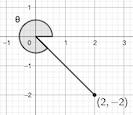
$\sin\t = \Frac{y\text{-coordinate}}{\text{distance of point from the origin}} = \Frac{-2}{\sqrt{2^2 + (-2)^2}} = -\Frac2{\sqrt8} = -\Frac2{2\sqrt2} = \boxed{-\Frac1{\sqrt2} = -\Frac{\sqrt2}2}$
$\cos\t = \Frac{x\text{-coordinate}}{\text{distance of point from the origin}} = \Frac2{2\sqrt2} = \boxed{\Frac1{\sqrt2} = \Frac{\sqrt2}2}$ 
(That’s how you should think of those two IMO.) 
$\tan\t = \Frac{\sin\t}{\cos\t} = \Frac{-\sqrt2/2}{\sqrt2/2} = \boxed{-1}$ 
$\cot\t = \Frac1{\tan\t} = \boxed{-1}$ 
$\sec\t = \Frac1{\cos\t} = \Frac1{(\sqrt2/2)} = \Frac2{\sqrt2} = \boxed{\sqrt2}$ 
$\csc\t = \Frac1{\sin\t} = \Frac1{(-\sqrt2/2)} = -\Frac2{\sqrt2} = \boxed{-\sqrt2}$
  

<a name="4.18" class="goback" onclick="winhisback()">__4.18__)</a>
$\left(-\Frac12, \Frac{\sqrt3}{2}\right)$

__Sln__: Here’s the point and the standard position angle it determines:
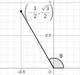
Since we need it for both the sin and cos, begin by computing the distance of the point from the origin:
$r = \sqrt{\left(-\Frac12\right)^2 + \left(\Frac{\sqrt3}2\right)^2} = \sqrt{\Frac14 + \Frac34} = \sqrt{\Frac44} = 1$, so
$$\boxed{\sin\t = \frac{\sqrt3}2, \cos\t = -\frac12}$$
and thus
$\tan\t = \Frac{\sqrt3/2}{-1/2} = \boxed{-\sqrt3}, \cot\t = \boxed{-1/\sqrt3 = -\sqrt3/3}, \sec\t = \boxed{-2}, \csc\t = \boxed{2/\sqrt3 = 2\sqrt3/3}$. 
  

<a name="4.20" class="goback" onclick="winhisback()">__4.20__)</a>
$\left(-\Frac{\sqrt2}2, -\Frac{\sqrt2}2\right)$

__Sln__: Here’s the point and its corresponding standard position angle:
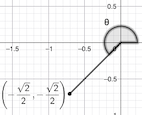
The denominator for the sin and cos is $r = \sqrt{\left(-\Frac{\sqrt2}2\right)^2 + \left(-\Frac{\sqrt2}2\right)^2} = \sqrt{\Frac12 + \Frac12} = 1$ so 
$$\boxed{\sin\t = -\frac{\sqrt2}2, \cos\t = -\frac{\sqrt2}2, \tan\t = 1, \cot\t = 1, \sec\t = -\sqrt2, \csc\t = -\sqrt2~}$$
  

__28__, __30__, and __32__) Use a coterminal angle to find the exact value of each expression. Do not use a calculator.

<a name="4.28" class="goback" onclick="winhisback()">__4.28__)</a>
$\sec 420°$

__Sln__: We need to find an angle $\t, 0 \le \t \lt 360°$, that is coterminal with 420°; since 420 $\gt$ 360, we subtract 360 from 420 to see if the result meets the requirement $0 \le \t \lt 360$: $420 - 360 = 60$ which is between 0 and 360, so $\t = 60°$ is the required coterminal angle.&nbsp; Thus $\sec 420° = \sec 60° = 1/\cos 60° = 1/(1/2) = \boxed{2~}$.
  

<a name="4.30" class="goback" onclick="winhisback()">__4.30__)</a>
$\sin\Frac{9\pi}4$

__Sln__: 
  

<a name="4.32" class="goback" onclick="winhisback()">__4.32__)</a>
$\csc\Frac{9\pi}2$

__Sln__:
  

__36__, and __40__) Name the quadrant in which the angle $\t$ lies.

<a name="4.36" class="goback" onclick="winhisback()">__4.36__)</a>
$\cos\t \gt 0, \tan\t \gt 0$

__Sln__:
  

<a name="4.40" class="goback" onclick="winhisback()">__4.40__)</a>
$\csc\t \gt 0, \cot\t \lt 0$

__Sln__:
  

__46__, __52__, and __58__) Find the reference angle of each angle.

<a name="4.46" class="goback" onclick="winhisback()">__4.46__)</a>
$330°$

__Sln__:
  

<a name="4.52" class="goback" onclick="winhisback()">__4.52__)</a>
$-240°$

__Sln__:
  

<a name="4.58" class="goback" onclick="winhisback()">__4.58__)</a>
$\Frac{19\pi}6$

__Sln__:
  

__64__, __70__, __76__, and __82__) Use the reference angle to find the exact value of each expression. Do not use a calculator..

<a name="4.64" class="goback" onclick="winhisback()">__4.64__)</a>
$\sin(-240°)$

__Sln__:
  

<a name="4.70" class="goback" onclick="winhisback()">__4.70__)</a>
$\cos\Frac{2\pi}3$

__Sln__:
  

<a name="4.76" class="goback" onclick="winhisback()">__4.76__)</a>
$\sec\Frac{11\pi}4$

__Sln__:
  

<a name="4.82" class="goback" onclick="winhisback()">__4.82__)</a>
$\csc\left(\Frac{-5\pi}2\right)$

__Sln__:
  

__88__, __94__, and __100__) Find the exact value of each of the remaining trigonometric functions of $\t$.

<a name="4.88" class="goback" onclick="winhisback()">__4.88__)</a>
$\cos\t = \Frac45, 270° \lt \t \lt 360°$

__Sln__:
  

<a name="4.94" class="goback" onclick="winhisback()">__4.94__)</a>
$\csc\t = 3, \cot\t \lt 0$

__Sln__:
  

<a name="4.100" class="goback" onclick="winhisback()">__4.100__)</a>
$\cot\t = -2, \sec\t \gt 0$

__Sln__:
  

<a name="4.112" class="goback" onclick="winhisback()">__4.112__)</a>
If $\cos\t = \Frac23$, find $\sec(\t + \pi)$.

__Sln__:
  

<a name="4.114" class="goback" onclick="winhisback()">__4.114__)</a>
Find the exact value of $\cos 1° + \cos 2° + ... + \cos 358° + \cos 359°$.

__Sln__: Like Problem __3.92__, the key here is to look for &quot;cancellations.&quot;&nbsp; Appealing to the unit circle, we note that the $x$-coordinate of its point at $181°$, i.e., $\cos 181°$&mdash;whatever value that may have&mdash;is the negative of the $x$-coordinate of the unit circle’s point at $1°$, i.e., $\cos 1°$.&nbsp; Therefore, $\cos 1° + \cos 181° = 0$, and similarly for every pair of angles $\t, \t + 180°$.&nbsp; That accounts for all the angles in the expression...<i>except</i> $180°$, whose cosine is $-1$.&nbsp; Written out algebraically, we have:

$\cos 1° + \cos 2° + ... + \cos 358° + \cos 359° = \cos 1° + \cos 181° + \cos 2° + \cos 182° + ... + \cos 179° + \cos 359° + \cos 180° = $ 
$0 + 0~+ ... +~0 + \cos 180° = \boxed{-1}$.&nbsp; (Take a moment&mdash;or several&mdash;to make sure you understand why $\cos 180°$ ___doesn’t___ have a term which cancels it out; hint: based on the pattern, what would that term be?&nbsp; Is that term in our sum?)
  

## Section 5: The Unit Circle; Properties of the Trig Functions
### Formulas Section

__The Unit Circle__:

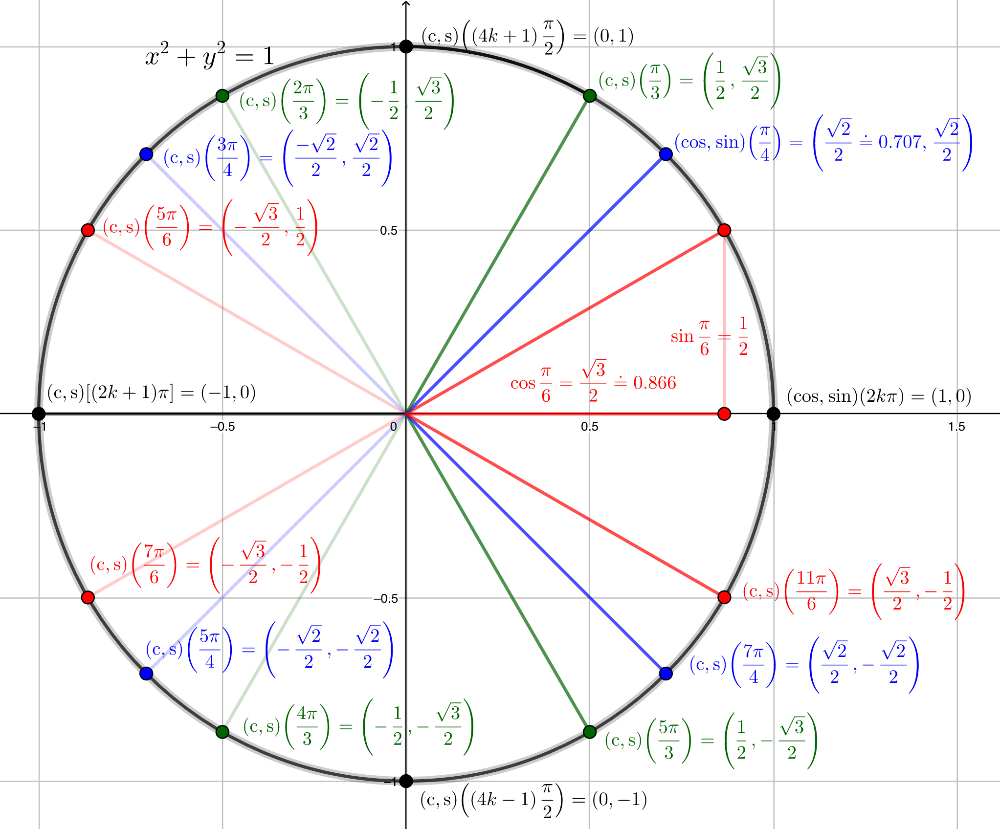

__Domain and range of the trig functions__:

| __Function__ | Domain | Range |
|---|---|---|
| sin | $\mathbb{R}$ (all real numbers*) | $[-1,1]$ (the closed interval from $-1$ to $1$, inclusive) |
| cos | $\mathbb{R}$ | $[-1,1]$ | | |
| tan | $\mathbb{R}$ ___except___ odd multiples of $\displaystyle\frac{\pi}2$, expressed $\mathbb{R}\backslash \displaystyle \{(2k+1)\frac{\pi}2, k\in \mathbb{Z}\text{, i.e., } k \text{ any integer}\}$  __Way to remember__: 'cause $\cos = 0$ at these domain values |  $\mathbb{R}$ |
| cot | $\mathbb{R}$ ___except___ integer multiples of $\pi$, expressed $\mathbb{R}\backslash \{k\pi, k\in \mathbb{Z}\}$  __Way to remember__: 'cause $\sin = 0$ at these domain values | $\mathbb{R}$ | 
| sec | $\mathbb{R}\backslash \displaystyle \{(2k+1)\frac{\pi}2, k\in \mathbb{Z}\}$, i.e., same as $\tan$, for the same reason | $(-\infty,-1] \cup[1,\infty) = \mathbb{R}\backslash (-1,1)$, i.e., all real numbers ___except___ the open interval $(-1,1)$ __Way to remember__: as the range of &quot;1 over the range of $\cos$&quot;|
| csc | $\mathbb{R}\backslash \{k\pi, k\in \mathbb{Z}\}$, i.e., same as $\cot$, for the same reason | $\mathbb{R}\backslash (-1,1)$, i.e., same as $\sec$, for the same reason |

__Periodicity__: The unit circle definitions of the trig functions should make it clear why sin, cos, sec, and csc take on their same values every change of $\pm2\pi$ in their argument, and tan and cot do so every change of $\pm\pi$; we say that sin, cos, sec, and csc are all __periodic with period__ (or ___have periodicity of___) $2\pi$, tan and cot have periodicity $\pi$; __as identities__: for any integer $k$ and any real* number $x$, $\sin(x+2k\pi) = \sin x;$ $\cos(x+2k\pi) = \cos x;$ $\sec(x+2k\pi) = \sec x;$ $\csc(x+2k\pi) = \csc x;$ $\tan(x+k\pi) = \tan x;$ and $\cot(x+k\pi) = \cot x.~$ (Note: these are not the only places where trig functions repeat their values&mdash;for example, $\sin 0 = \sin\pi = 0$&mdash;but they are &quot;guaranteed&quot; to repeat their values at these increments: $|x-y| = 2k\pi, k \in \mathbb{Z}$ is a ___sufficient___ condition for $\sin x = \sin y$, for example, but not a ___necessary___ condition.)&nbsp; In general, $f(x)$ is said to be __periodic with (fundamental) period__ $p$ (or __have periodicity__ $p$) if $p$ is the smallest number such that $f(x+p) = f(x)$ <i>for all</i> $x$ (for which $f$ is well-defined; it is a theorem that if $f(x+p) = f(x)$ for all $x$ (in the domain of $f$), then for any integer $k, f(x+kp) = f(x)$, again as long as $x+kp$ is in the domain of $f$).

__Even/odd-ness__: cos and sec are even functions, i.e., for all $x$ (in their domians), $\cos(-x) = \cos x; \sec(-x) = \sec x$; sin, tan, csc, and cot are odd functions: $\sin(-x) = -\sin x; \tan(-x) = -\tan x; \csc(-x) = -\csc x;$ and $\cot(-x) = -\cot x$ for all $x$ (in their respective domains).  

\* Actually, the sine and cosine functions are well&#8209;defined and periodic with period $2\pi$ for all ___complex___ numbers, but this is &quot;beyond the scope of this course.&quot;
  

__Solved Problems__

__10__ and __14__) The point $P$ on the unit circle that corresponds to a real number $t$ is given. Find $\sin t, \cos t, \tan t, \csc t, \sec t, \text{ and } \cot t$.

<a name="5.10" class="goback" onclick="winhisback()">__5.10__)</a>
$\left(-\Frac{\sqrt3}2, -\Frac12\right)$

__Sln__:
  

<a name="5.14" class="goback" onclick="winhisback()">__5.14__)</a>
$\left(-\Frac{\sqrt5}5, \Frac{2\sqrt5}5\right)$

__Sln__:
  

__16__ and __20__) The point $P$ on the circle $x^2 + y^2 = r^2$ that is also on the terminal side of an angle $\t$ in standard position is given. Find the value of each of all six trigonometric functions of $\t$.

<a name="5.16" class="goback" onclick="winhisback()">__5.16__)</a>
$(5, -12)$

__Sln__:
  

<a name="5.20" class="goback" onclick="winhisback()">__5.20__)</a>
$(-3, 1)$

__Sln__:
  

__24__, __28__, __32__, and __36__) Use the fact that the trigonometric functions are periodic to find the exact value of each expression. Do not use a calculator.

<a name="5.24" class="goback" onclick="winhisback()">__5.24__)</a>
$\sin 390°$

__Sln__:
  

<a name="5.28" class="goback" onclick="winhisback()">__5.28__)</a>
$\sec 420°$

__Sln__:
  

<a name="5.32" class="goback" onclick="winhisback()">__5.32__)</a>
$\csc \Frac{9\pi}2$

__Sln__:
  

<a name="5.36" class="goback" onclick="winhisback()">__5.36__)</a>
$\sec \Frac{25\pi}6$

__Sln__:
  

__42__, __46__, __50__, and __54__) Use the even&#8209;odd properties to find the exact value of each expression. Do not use a calculator.

<a name="5.42" class="goback" onclick="winhisback()">__5.42__)</a>
$\csc(-30°)$

__Sln__:
  

<a name="5.46" class="goback" onclick="winhisback()">__5.46__)</a>
$\sin(-\pi)$

__Sln__:
  

<a name="5.50" class="goback" onclick="winhisback()">__5.50__)</a>
$\sin\left(-\Frac{3\pi}2\right)$

__Sln__:
  

<a name="5.54" class="goback" onclick="winhisback()">__5.54__)</a>
$\csc\left(-\Frac{\pi}3\right)$

__Sln__:
  

__56__ and __60__) Find the exact value of each expression. Do not use a calculator.

<a name="5.56" class="goback" onclick="winhisback()">__5.56__)</a>
$\tan\left(-\Frac{5\pi}6\right) - \cot\Frac{7\pi}2$

__Sln__:
  

<a name="5.60" class="goback" onclick="winhisback()">__5.60__)</a>
$\cos\left(-\Frac{17\pi}4\right) - \sin\left(-\Frac{3\pi}2\right)$

__Sln__:
  

<a name="5.64" class="goback" onclick="winhisback()">__5.64__)</a>
For what numbers $\t$ is $f(\t) = \cot \t$ not defined?

__Sln__:
  

<a name="5.70" class="goback" onclick="winhisback()">__5.70__)</a>
What is the range of the cotangent function?

__Sln__:
  

<a name="5.76" class="goback" onclick="winhisback()">__5.76__)</a>
Is the cotangent function even, odd, or neither? Is its graph symmetric? With respect to what?

__Sln__:
  

<a name="5.86" class="goback" onclick="winhisback()">__5.86__)</a>
If $f(x) = \cot x$ and $f(a) = -3$, find the exact value of: __a__) $f(-a)$ and __b__) $f(a) + f(a + \pi) + f(a + 4\pi)$

__Sln__:
  

<a name="5.92" class="goback" onclick="winhisback()">__5.92__)</a>
Show that the range of the cotangent function is the set of all real numbers.

__Pf__:
  

<a name="5.98" class="goback" onclick="winhisback()">__5.98__)</a>
Show that the period of $f(\t) = \cot \t$ is $\pi$.

__Pf__: We must show that $\pi$ is the smallest positive real number such that $\cot(\t + \pi) = \cot \t$ for all $\t$ for which cot is well&#8209;defined.&nbsp; The proof consists of two parts: we show that $\cot$ has period $\pi$; and we show that $\pi$ is the smallest positive number for which this is true.

Part 1: For all $\t$ such that $\sin(\t + \pi) \ne 0$, $\cot(\t + \pi) = \displaystyle \frac{\cos(\t + \pi)}{\sin(\t + \pi)} = \frac{-\cos \t}{-\sin \t} = \frac{\cos \t}{\sin \t} = \cot \t$ (because if $\sin(\t + \pi) \ne 0$, then $\sin \t \ne 0$; proof?); this shows that $\pi$ is <i>a</i> period of cot. 

Part 2: We use the method suggested in the text as a hint for Problem 93: Suppose there exists $p$ between 0 and $\pi$, exclusive, i.e., $0 \lt p \lt \pi$, such that $\cot(\t + p) = \cot \t$ for all $\t$ for which it is well&#8209;defined; then $\cot p = \cot(0 + p) = \cot 0 = 0$, i.e., our assumption implies $\cot p = 0$, and there is only one value between 0 and $\pi$ for which this is true, namely $\frac{\pi}2.~$ But, for example, $\cot \frac{\pi}4 = 1$, whereas $\cot(\frac{\pi}4 + \frac{\pi}2) = \cot \frac{3\pi}4 = -1$; in other words, we’ve found a value of $\t$ such that $\cot(\t + \frac{\pi}2) \ne \cot \t$, so $p=\pi$ must be the smallest (positive) value for which $\cot(\t+p) = \cot(\t)$ is <i>always</i> true.$~~~\blacksquare$
  

## Section 6: Graphs of Sine and Cosine
### Formulas Section

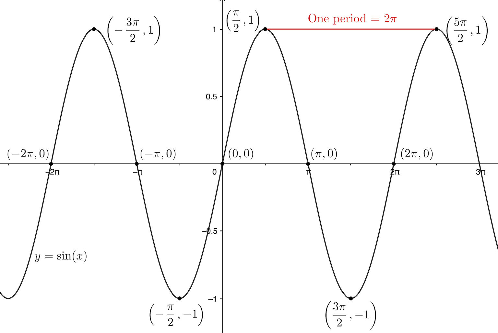

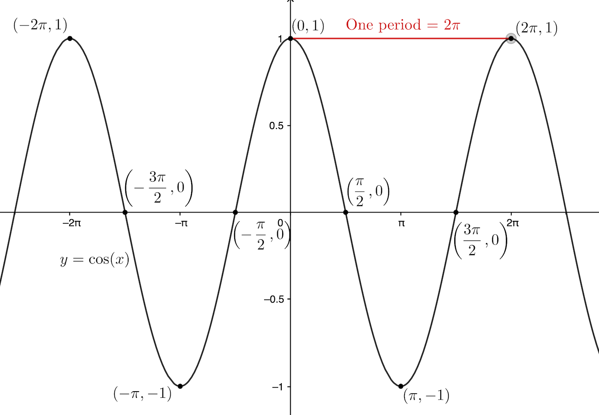

__Relationship between their (fundamental) graphs__: starting with the cofunction identity $\sin x = \cos\left(\displaystyle\frac{\pi}2-x\right)$, factoring $-1$ from the argument of the cos function and using the fact that cos is an even function $\displaystyle \implies \sin x = \cos\left[-1\left(x-\frac{\pi}2\right)\right] = \cos\left(x-\frac{\pi}2\right)$, so the (fundamental) graph of sin is the same as cos, horizontally shifted $\displaystyle\frac{\pi}2$ units to the right, or, equivalently, __the (fundamental) graph of cos is the same as sin, horizontally shifted $\displaystyle\frac{\pi}2$ units to the left__.

__Amplitude and period__: given $y = f(x) = A\sin(\omega x)\text{ or } = A\cos(\omega x), \omega \gt 0$ (if $\omega \lt 0$ begin the analysis by changing $A\sin(\omega x)$ to $-A\sin(|\omega| x)$, $A\cos(\omega x)$ to $A\cos(|\omega| x)$): the __amplitude__ of $f$ is $|A|$, which gives the maximum and minimum values (maxima and minima) attained by $f$ and the <i>factor</i> (i.e., multiplier) by which the (fundamental) graph is <i>vertically</i> &quot;stretched&quot; ($|A| \gt 1$) or &quot;compressed&quot; ($|A| \lt 1$); and the (fundamental) __period__ (see Section 5 above for the definition) of $f$ is $T = \displaystyle \frac{2\pi}{\omega}$, which gives the distance between consecutive maxima (and minima), and twice the distance between consecutive zeros and between any maximum and the next minimum and vice&#8209;versa (i.e., the distance between consecutive zeros, and between a maximum (resp. minimum) and the next minimum (resp. maximum) is half the period, $\displaystyle \frac T2$).&nbsp; Conversely: given the amplitude, $A$, the period, $T$, and whether the function has a zero, or a maximum or minimum, at zero (or information from which these properties can be deduced, e.g., the maximum or minimum value, the minimum distance between these, and the value at zero), one can immediately write down $\displaystyle f(x) = A\sin\left(\frac{2\pi}T x\right)$ (if $f(0) = 0$) or $\displaystyle f(x) = \pm A\cos\left(\frac{2\pi}T x\right)$ (if $f(0) = \pm A$). 
  

__Solved Problems__

__12__, __16__, and __20__) Determine the amplitude and period of each function without graphing.

<a name="6.12" class="goback" onclick="winhisback()">__6.12__)</a>
$y = \cos 3x$

__Sln__:
  

<a name="6.16" class="goback" onclick="winhisback()">__6.16__)</a>
$y = -3\cos 3x$

__Sln__:
  

<a name="6.20" class="goback" onclick="winhisback()">__6.20__)</a>
$y = \Frac95 \cos \left(-\Frac{3\pi}2 x\right)$

__Sln__:
  

__24__ and __30__) Match the given function to one of the graphs (A)–(J).

<a name="6.24" class="goback" onclick="winhisback()">__6.24__)</a>
$y = 3\cos 2x$

__Sln__:
  

<a name="6.30" class="goback" onclick="winhisback()">__6.30__)</a>
$y = -2\sin\left(\Frac12 x\right)$

__Sln__:
  

__42__, __50__, and __58__) Graph each function. Be sure to label key points and show at least two cycles. Use the graph to determine the domain and the range of each function.

<a name="6.42" class="goback" onclick="winhisback()">__6.42__)</a>
$y = \cos(-2x)$

__Sln__:
  

<a name="6.50" class="goback" onclick="winhisback()">__6.50__)</a>
$y = 4\sin\left(\Frac{\pi}2 x\right) - 2$

__Sln__:
  

<a name="6.58" class="goback" onclick="winhisback()">__6.58__)</a>
$y = -\Frac12 \sin\left(\Frac{\pi}8 x\right) + \Frac32$

__Sln__:
  

<a name="6.62" class="goback" onclick="winhisback()">__6.62__)</a>
Write the equation of a sine function that has amplitude 4 and period 1.

__Sln__:
  

__66__, __72__, and __76__) Find an equation for each graph.

<a name="6.66" class="goback" onclick="winhisback()">__6.66__)</a>

__Sln__: $-2\sin\Frac{\pi}2 x$
  

<a name="6.72" class="goback" onclick="winhisback()">__6.72__)</a>

__Sln__: $-\Frac12\sin\left(\Frac32 x\right) - 1$
  

<a name="6.76" class="goback" onclick="winhisback()">__6.76__)</a>

__Sln__: $4\sin 2x$
  

<a name="6.80" class="goback" onclick="winhisback()">__6.80__)</a>
Find the average rate of change of $f(x) = \cos 2x$ over the interval $0 \le x \le \Frac{\pi}2$. 

__Sln__:
  

<a name="6.84" class="goback" onclick="winhisback()">__6.84__)</a>
Given $f(x) = -3x, g(x) = \sin x$, find and graph $(f \circ g)(x)$ and $(g \circ f)(x)$.

__Sln__:
  

<a name="6.86" class="goback" onclick="winhisback()">__6.86__)</a>
Graph $g(x) = \left\{
\begin{array}{1 1}
2\sin x & 0 \le x \le \pi \\
\cos x + 1 & \pi \lt x \le 2\pi
\end{array}
\right.$

__Sln__:
  

<a name="6.90" class="goback" onclick="winhisback()">__6.90__)</a>
The voltage $V$, in volts, produced by an ac generator at time $t$, in seconds, is
$$V(t) = 120\sin(120\pi t)$$
__a__) What are the amplitude and period? 
__b__) Graph $V$ over two periods, beginning at $t=0$. 
__c__) If a resistance of $R=20$ ohms is present, what is the current $I$? (Hint: Ohm’s Law is $V = IR$.) 
__d__) What is the amplitude and period of the current $I$? 
__e__) Graph $I$ over two periods, beginning at $t = 0$.

__Sln__:
  

<a name="6.92" class="goback" onclick="winhisback()">__6.92__)</a>
A one&#8209;lane highway runs through a tunnel in the shape of one&#8209;half a sine curve cycle. The opening is 28 feet wide at road level and is 15 feet tall at its highest point. 

__a__) Find an equation for the sine curve that fits the opening.
Place the origin at the left end of the sine curve. 
__b__) If the road is 14 feet wide with 7&#8209;foot shoulders on each
side, what is the height of the tunnel at the edge of the road?

__Sln__:
  

<a name="6.99" class="goback" onclick="winhisback()">__6.99__)</a>
Find four of the points of intersection of $y = \tan x$ and $y = 1$

__Sln__:
  

## Section 7: Graphs of Tangent, Cotangent, Cosecant, and Secant
### Formulas Section

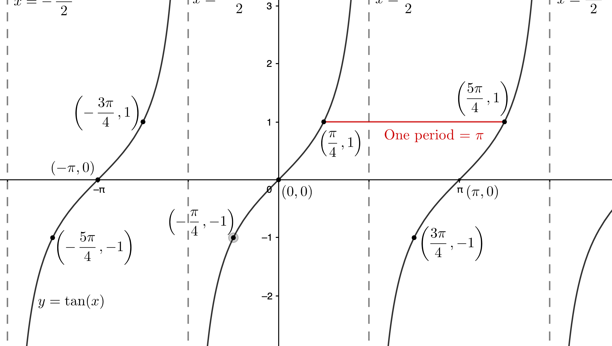

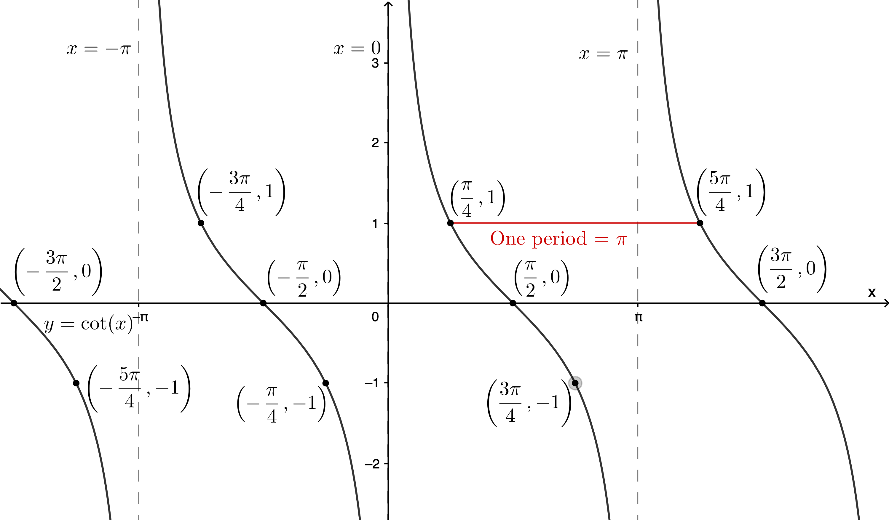

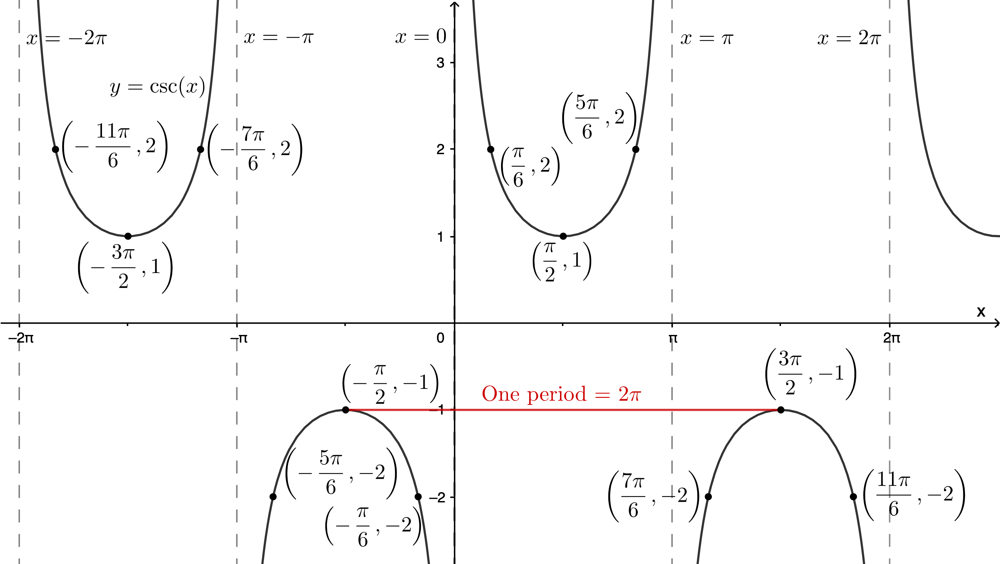

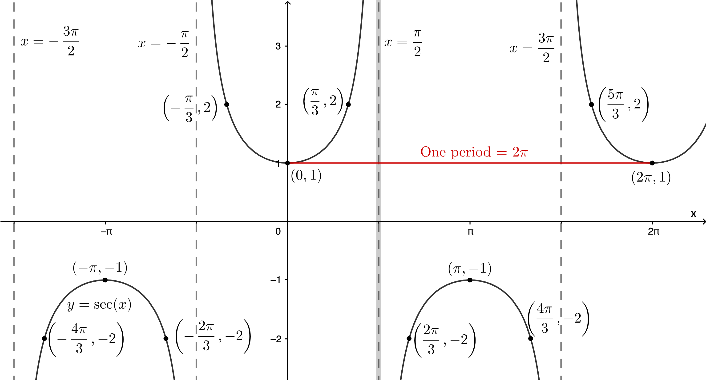

  

__Solved Problems__

<a name="7.8" class="goback" onclick="winhisback()">__7.8__)</a>

__Sln__:
  

<a name="7.14" class="goback" onclick="winhisback()">__7.14__)</a>

__Sln__:
  

<a name="7.22" class="goback" onclick="winhisback()">__7.22__)</a>

__Sln__:
  

<a name="7.28" class="goback" onclick="winhisback()">__7.28__)</a>

__Sln__:
  

<a name="7.34" class="goback" onclick="winhisback()">__7.34__)</a>

__Sln__:
  

<a name="7.40" class="goback" onclick="winhisback()">__7.40__)</a>

__Sln__:
  

<a name="7.44" class="goback" onclick="winhisback()">__7.44__)</a>

__Sln__:
  

<a name="7.48" class="goback" onclick="winhisback()">__7.48__)</a>

__Sln__:
  

<a name="7.50" class="goback" onclick="winhisback()">__7.50__)</a>

__Sln__:
  

<a name="7.51" class="goback" onclick="winhisback()">__7.51__)</a>

__Sln__:
  

## Section 8: Phase Shift; Sinusoidal Curve Fitting
### Formulas Section

In $\sin\text{ or }\cos(\omega x - \phi), \omega \gt 0$: period $T = \displaystyle \frac{2\pi}{\omega}$; &quot;phase&quot; (horizontal) shift $\displaystyle = \frac{\phi}{\omega}$, to the right if $\phi \gt 0$, to the left if $\phi \lt 0$.

  

__Solved Problems__

<a name="8.6" class="goback" onclick="winhisback()">__8.6__)</a>

__Sln__:
  

<a name="8.10" class="goback" onclick="winhisback()">__8.10__)</a>

__Sln__:
  

<a name="8.14" class="goback" onclick="winhisback()">__8.14__)</a>

__Sln__:
  

<a name="8.18" class="goback" onclick="winhisback()">__8.18__)</a>

__Sln__:
  

<a name="8.22" class="goback" onclick="winhisback()">__8.22__)</a>

__Sln__:
  

<a name="8.26" class="goback" onclick="winhisback()">__8.26__)</a>

__Sln__:
  

<a name="8.34" class="goback" onclick="winhisback()">__8.34__)</a>

__Sln__:
  

<a name="8.38" class="goback" onclick="winhisback()">__8.38__)</a>

__Sln__:
  

### Credits

Graphs generated using [GeoGebra](http://www.geogebra.org/).

### Please Donate:

<table>
  <tr>
    <td>
      <b>Venmo: @David-Goldsmith-13</b>
    </td>
    <td>
      <form action="https://www.paypal.com/cgi-bin/webscr"
            method="post"><input name="cmd"
            value="_xclick" type="hidden"> <input name="business"
            value="dgoldsmith_89@alumni.brown.edu" type="hidden"> <input
            name="item_name" value="SelectedSolutions Donation"
            type="hidden"> <input name="cn" value="Special Instructions
            (optional" type="hidden"> <input
            src="https://www.paypal.com/images/x-click-but04.gif"
            name="submit" alt="Make payments with PayPal - it's fast,
            free and secure!" align="middle" border="0" type="image"></form>
    </td>
  </tr>
</table>

