

<link rel="stylesheet" href="../../Styles.css">
<title>Solutions of Selected Exercises from Sullivan, M. "Algebra & Trigonometry, 9th Ed. Chapter 7 Part 2"</title>

$\definecolor{red}{RGB}{255,0,0}
\definecolor{orange}{RGB}{245, 165, 0}
\definecolor{yellow}{RGB}{255,215,0}
\definecolor{green}{RGB}{0,255,0}
\definecolor{indigo}{RGB}{0,0,255}
\definecolor{violet}{RGB}{138,43,226}
\definecolor{black}{RGB}{0,0,0}
\require{cancel}
\newcommand{\t}{\theta}
\newcommand{\w}{\omega}
\newcommand{\blksq}{\blacksquare}
\newcommand{\box}{\boxed}
\newcommand{\Frac}{\displaystyle \frac}
\newcommand{\chec}{\checkmark}
$

## 
 Selected Exercise Solutions

from

### 
Sullivan, M., 2012. <i>Algebra & Trigonometry, Ninth Edition.</i> Prentice Hall, Boston
### 
Chapter 7, Part 2: Trigonometric Functions, Sections 5-8 
### 
&copy; 2020, 2026 by
### 
[David Lawrence Goldsmith](https://www.linkedin.com/in/olydlg)

for

## 
[SelectedSolutionsDotNet](https://olydlg.github.io/selectedsolutionsdotnet/)

<i>Notes:  These solutions are provided &quot;as-is,&quot; for informational purposes only, with no warranty of any kind, expressed or implied, including that of correctness, adequacy, and/or suitability for any purpose, whatsoever.</i> Corrections are welcome and should be emailed to selectedsolutionsdotnet@gmail.com.

Purple font indicates clicking on the text will return you to your prior place; a $\blksq$ marks the end of a proof.
 

### Contents

<table>
  <tr>
   <th colspan=10>Section 5: The Unit Circle; Trig Function Properties</th>
  </tr>
  <tr>
    <td><a href="#5.10">5.10</a></td>
    <td><a href="#5.14">5.14</a></td>
    <td><a href="#5.16">5.16</a></td>
    <td><a href="#5.20">5.20</a></td>
    <td><a href="#5.24">5.24</a></td>
    <td><a href="#5.28">5.28</a></td>
    <td><a href="#5.32">5.32</a></td>
    <td><a href="#5.36">5.36</a></td>
    <td><a href="#5.42">5.42</a></td>
    <td><a href="#5.46">5.46</a></td>
  </tr>
  <tr>
    <td><a href="#5.50">5.50</a></td>
    <td><a href="#5.54">5.54</a></td>
    <td><a href="#5.56">5.56</a></td>
    <td><a href="#5.60">5.60</a></td>
    <td><a href="#5.64">5.64</a></td>
    <td><a href="#5.76">5.76</a></td>
    <td><a href="#5.86">5.86</a></td>
    <td><a href="#5.92">5.92</a></td>
    <td><a href="#5.98">5.98</a></td>
  </tr>
  <tr>
   <th colspan=10>Section 6: Graphs of Sine and Cosine Functions</th>
  </tr>
  <tr>
    <td><a href="#6.12">6.12</a></td>
    <td><a href="#6.16">6.16</a></td>
    <td><a href="#6.20">6.20</a></td>
    <td><a href="#6.24">6.24</a></td>
    <td><a href="#6.30">6.30</a></td>
    <td><a href="#6.42">6.42</a></td>
    <td><a href="#6.50">6.50</a></td>
    <td><a href="#6.58">6.58</a></td>
    <td><a href="#6.62">6.62</a></td>
    <td><a href="#6.66">6.66</a></td>
  </tr>
  <tr>
    <td><a href="#6.72">6.72</a></td>
    <td><a href="#6.76">6.76</a></td>
    <td><a href="#6.80">6.80</a></td>
    <td><a href="#6.84">6.84</a></td>
    <td><a href="#6.86">6.86</a></td>
    <td><a href="#6.90">6.90</a></td>
    <td><a href="#6.92">6.92</a></td>
    <td><a href="#6.99">6.99</a></td>
  </tr>
  <tr>
   <th colspan=10>Section 7: Graphs of tan, cot, sec, and csc </th>
  </tr>
  <tr>
    <td><a href="#7.8">7.8</a></td>
    <td><a href="#7.14">7.14</a></td>
    <td><a href="#7.22">7.22</a></td>
    <td><a href="#7.28">7.28</a></td>
    <td><a href="#7.34">7.34</a></td>
    <td><a href="#7.40">7.40</a></td>
    <td><a href="#7.44">7.44</a></td>
    <td><a href="#7.48">7.48</a></td>
    <td><a href="#7.50">7.50</a></td>
    <td><a href="#7.52">7.52</a></td>
  </tr>
  <tr>
   <th colspan=10>Section 8: Phase Shift; Sinusoidal Curve Fitting</th>
  </tr>
  <tr>
    <td><a href="#8.6">8.6</a></td>
    <td><a href="#8.10">8.10</a></td>
    <td><a href="#8.14">8.14</a></td>
    <td><a href="#8.18">8.18</a></td>
    <td><a href="#8.22">8.22</a></td>
    <td><a href="#8.26">8.26</a></td>
    <td><a href="#8.34">8.34</a></td>
    <td><a href="#8.38">8.38</a></td>
  </tr>
</table>

### Preface

In tutoring trigonometry (all math really, but especially trigonometry) I am often asked something like &quot;How do you remember all these formulas/identities?&quot;&nbsp; I always answer: &quot;I don’t, I remember where to look them up&quot; (which, in 2026, is ridiculously easy to do on the internet: just type &quot;trig identities&quot; into any browser and the default search engine will, in a matter of microseconds&mdash;indeed, before you even finish typing it in!&mdash;return umpteen lists of trig identities).&nbsp; However, remembering them, especially when you’re just learning them, isn’t really the issue; the issue is proper use of them: the whole point of the trig identities, etc., is to reduce complicated&#8209;looking problems to simpler problems, in a&mdash;quite literally&mdash;formulaic way.&nbsp; The issue is how to <i>use</i> the formulas to &quot;plug-and-chug,&quot; and a big stumbling block toward that goal is recognizing which formulas/identities are applicable in a particular situation.&nbsp; This is exacerbated by the plethora of new formulas being thrown at you in rapid succession.

The strategy I recommend for dealing with this problem, as tedious as it sounds, is this: at the top of each page of work, begin by re&#8209;copying all the formulas/identities you are responsible for learning in that lesson (at the very least: the more you write out, the more you will retain what you’ve taken the time to write out, so by all means, write out identities from earlier lessons as well, especially if you find that you’re still struggling with recognizing them in problems you’re working on; for what it’s worth here, I also emphasize this strategy when learning the properties of exponents and logarithmic identities&mdash;basically, any situation in which you’re being required to learn a lot of new synoptic information in a short period of time).&nbsp; To set the example and make abundantly clear what I mean, I will begin each section below with a re&#8209;statement of the formulas/identities being &quot;drilled&quot; in that section (as well as re&#8209;statement of the specific formulas/identities being used in each particular exercise).&nbsp; By doing so, I hope to drive home to the student that the way to &quot;memorize&quot; this material is by written repetition (even if it sometimes seems excessive).

## Section 5: The Unit Circle; Properties of the Trig Functions
### Formulas Section

__The Unit Circle__:

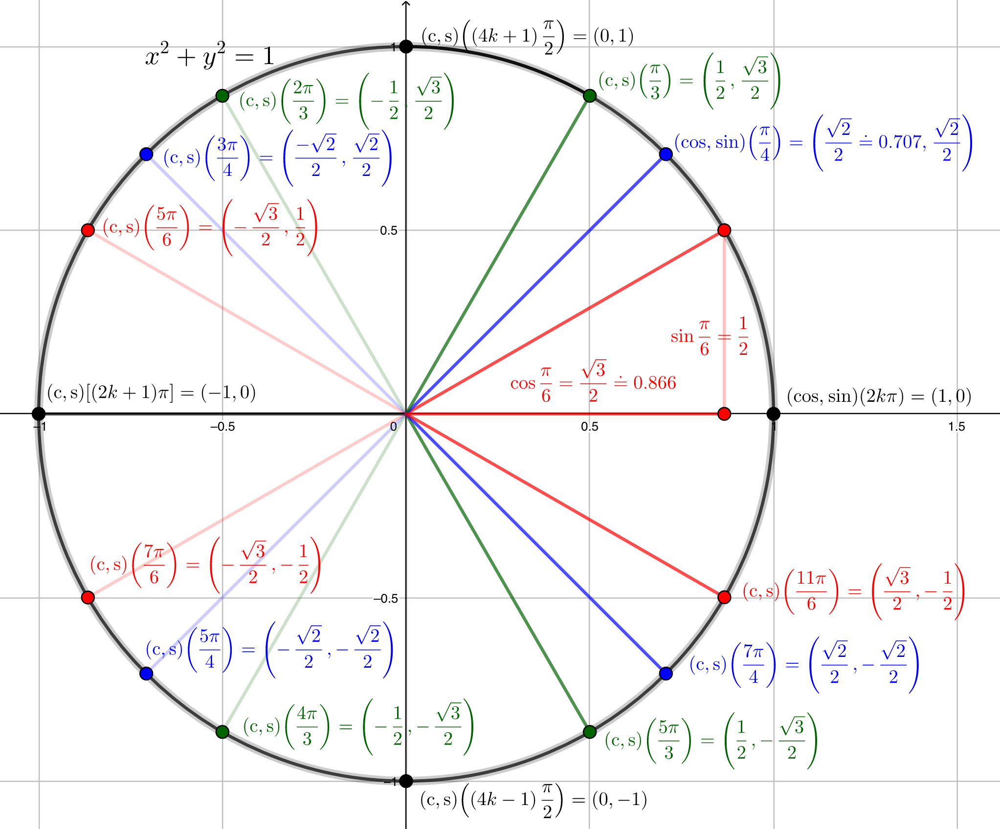

__Domain and range of the trig functions__:

| __Function__ | Domain | Range |
|---|---|---|
| sin | $\mathbb{R}$ (all real numbers*) | $[-1,1]$ (the closed interval from $-1$ to $1$, inclusive) |
| cos | $\mathbb{R}$ | $[-1,1]$ | | |
| tan | $\mathbb{R}$ ___except___ odd multiples of $\displaystyle\frac{\pi}2$, expressed $\mathbb{R}\backslash \displaystyle \{(2k+1)\frac{\pi}2, k\in \mathbb{Z}\text{, i.e., } k \text{ any integer}\}$  __Way to remember__: 'cause $\cos = 0$ at these domain values |  $\mathbb{R}$ |
| cot | $\mathbb{R}$ ___except___ integer multiples of $\pi$, expressed $\mathbb{R}\backslash \{k\pi, k\in \mathbb{Z}\}$  __Way to remember__: 'cause $\sin = 0$ at these domain values | $\mathbb{R}$ | 
| sec | $\mathbb{R}\backslash \displaystyle \{(2k+1)\frac{\pi}2, k\in \mathbb{Z}\}$, i.e., same as $\tan$, for the same reason | $(-\infty,-1] \cup[1,\infty) = \mathbb{R}\backslash (-1,1)$, i.e., all real numbers ___except___ the open interval $(-1,1)$ __Way to remember__: as the range of &quot;1 over the range of $\cos$&quot;|
| csc | $\mathbb{R}\backslash \{k\pi, k\in \mathbb{Z}\}$, i.e., same as $\cot$, for the same reason | $\mathbb{R}\backslash (-1,1)$, i.e., same as $\sec$, for the same reason |

__Periodicity__: The unit circle definitions of the trig functions should make it clear why sin, cos, sec, and csc take on their same values every change of $\pm2\pi$ in their argument, and tan and cot do so every change of $\pm\pi$; we say that sin, cos, sec, and csc are all __periodic with period__ (or ___have periodicity of___) $2\pi$, tan and cot have periodicity $\pi$; __as identities__: for any integer $k$ and any real* number $x$, $\sin(x+2k\pi) = \sin x;$ $\cos(x+2k\pi) = \cos x;$ $\sec(x+2k\pi) = \sec x;$ $\csc(x+2k\pi) = \csc x;$ $\tan(x+k\pi) = \tan x;$ and $\cot(x+k\pi) = \cot x.~$ (Note: these are not the only places where trig functions repeat their values&mdash;for example, $\sin 0 = \sin\pi = 0$&mdash;but they are &quot;guaranteed&quot; to repeat their values at these increments: $|x-y| = 2k\pi, k \in \mathbb{Z}$ is a ___sufficient___ condition for $\sin x = \sin y$, for example, but not a ___necessary___ condition.)&nbsp; In general, $f(x)$ is said to be __periodic with (fundamental) period__ $p$ (or __have periodicity__ $p$) if $p$ is the smallest number such that $f(x+p) = f(x)$ <i>for all</i> $x$ (for which $f$ is well-defined; it is a theorem that if $f(x+p) = f(x)$ for all $x$ (in the domain of $f$), then for any integer $k, f(x+kp) = f(x)$, again as long as $x+kp$ is in the domain of $f$).

__Even/odd-ness__: cos and sec are even functions, i.e., for all $x$ (in their domians), $\cos(-x) = \cos x; \sec(-x) = \sec x$; sin, tan, csc, and cot are odd functions: $\sin(-x) = -\sin x; \tan(-x) = -\tan x; \csc(-x) = -\csc x;$ and $\cot(-x) = -\cot x$ for all $x$ (in their respective domains).  

\* Actually, the sine and cosine functions are well&#8209;defined and periodic with period $2\pi$ for all ___complex___ numbers, but this is &quot;beyond the scope of this course.&quot;
  

__Solved Problems__

__10__ and __14__) The point $P$ on the unit circle that corresponds to a real number $t$ is given. Find $\sin t, \cos t, \tan t, \csc t, \sec t, \text{ and } \cot t$.

<a name="5.10" class="goback" onclick="winhisback()">__5.10__)</a>
$\left(-\Frac{\sqrt3}2, -\Frac12\right)$

__Sln__: Typos exist, so when the instructions specify something like "The [given] point $P$ [is] on the unit circle," I like to verify that  claim (here it matters because if the point isn’t actually on the unit circle&mdash;like problems soon to come&mdash;then the solution is less immediate): $\sqrt{\left(-\Frac{\sqrt3}2\right)^2 + \left(-\Frac12\right)^2} = \sqrt{\Frac34 + \Frac14} = 1~\chec.~$ Having confirmed that the point is on the unit circle, $\cos t$ and $\sin t$ are simply the $x$&#8209; and $y$&#8209;coordinate of the point, respectively: $\box{\cos t = -\frac{\sqrt3}2,~\sin t = -\frac12}$.&nbsp; To get the rest, use the ratio and reciprocal identities: $\tan t = \Frac{\sin t}{\cos t} = \Frac{-1/2}{-\sqrt3/2} = \box{\frac1{\sqrt3} = \frac{\sqrt3}3}$, $\cot t = 1/\tan t = \box{\sqrt3}$, $\sec t = 1/\cos t = 1/(-\sqrt3 /2) = \box{-\frac2{\sqrt3} = -\frac{2\sqrt3}3}$, $\csc t = 1/\sin t = \box{-2}.$&nbsp; Notes: 1) a &quot;check&quot;&mdash;left to the reader&mdash;is to verify the identities $\tan^2 t + 1 = \sec^2 t$ and $\cot^2 t + 1 = \csc^2 t$ using the values obtained for those functions; 2) just as you eventually started preferring &quot;improper&quot; fractions to &quot;mixed numbers,&quot; you’ll eventually no longer be ___required___ to rationalize denominators, which is why I’ve boxed both forms above.
  

<a name="5.14" class="goback" onclick="winhisback()">__5.14__)</a>
$\left(-\Frac{\sqrt5}5, \Frac{2\sqrt5}5\right)$

__Sln__: We assume that this point is indeed on the unit circle, leaving the check for the reader (whom we encourage to try to do the check in their head; hint: you really only need to verify that $x^2 + y^2 = 1$).&nbsp; Assuming that, we immediately have: $\box{\cos t = -\frac{\sqrt5}5,~\sin t = \frac{2\sqrt5}5} \implies \tan t = \Frac{2\sqrt5/5}{-\sqrt5/5} = \box{-2} \implies \cot t = \box{-\frac12},~\sec t = 1/(-\sqrt5/5) = \box{-\sqrt5},~\csc t = 1/(2\sqrt5/5) = \box{\frac{\sqrt5}2}.$ 
$\cot^2 t + 1 = \csc^2 t$ check: $\left(-\Frac12\right)^2 + 1 = \Frac54 = \left(\Frac{\sqrt5}2\right)^2~\chec$; the $\tan^2 t + 1 = \sec^2 t$ check is left to the reader.
  

__16__ and __20__) The point $P$ on the circle $x^2 + y^2 = r^2$ that is also on the terminal side of an angle $\t$ in standard position is given. Find the value of each of all six trigonometric functions of $\t$.

<a name="5.16" class="goback" onclick="winhisback()">__5.16__)</a>
$(5, -12)$

__Sln__: We don’t need to verify that the point lies on the described circle because any given point lies on the origin&#8209;centered circle whose radius equals the distance of the point from the origin; but we do need to determine the distance, $r$, of the point from the origin, because, given a point, $(x,y)$, the $\cos$ of the the angle described $\t$, is $x/r$ and $\sin\t = y/r$.&nbsp; Now, $r = \sqrt{x^2 + y^2} = \sqrt{5^2 + (-12)^2} = \sqrt{169} = 13$, so $\box{\cos\t = \frac5{13},~\sin\t = -\frac{12}{13} \implies \tan\t = -\frac{12}5,~\cot\t = -\frac5{12},~\sec\t = \frac{13}5,~\csc\t = -\frac{13}{12}.}$ 
$\tan^2\t + 1 = \sec^2\t$ check: $\left(-\Frac{12}5\right)^2 + 1 = \Frac{144}{25} + \Frac{25}{25} = \Frac{169}{25} = \left(\Frac{13}5\right)^2~\chec.$
  

<a name="5.20" class="goback" onclick="winhisback()">__5.20__)</a>
$(-3, 1)$

__Sln__: $r = \sqrt{(-3)^2 + 1^2} = \sqrt{10} \implies \box{\cos\t = -\frac{3}{\sqrt{10}},~\sin\t = \frac1{\sqrt{10}},~\tan\t = -\frac13,~\cot\t = -3,~\sec\t = -\frac{\sqrt{10}}3,~\csc\t = \sqrt{10}}.$&nbsp; (Denominator rationalization and checks are left to the reader, whom we encourage to attempt in your head.)
  

__24__, __28__, __32__, and __36__) Use the fact that the trigonometric functions are periodic to find the exact value of each expression. Do not use a calculator.

<a name="5.24" class="goback" onclick="winhisback()">__5.24__)</a>
$\sin 390°$

__Sln__: Working in degrees, the period of the $\sin$ function is $360$, which is a succinct way of saying that $\sin(\t° + k\cdot 360°) = \sin\t°$ for any $\t$ and any integer $k$ (recall that the integers are $\{0, \pm1, \pm2, \pm3,...\} = \mathbb{Z}$).&nbsp; Now, this is true for all $\t$, but we’re only being required to memorize the trig function values for angles in the interval $[0,360)$... ___precisely because___ the 360° periodicity of the $\sin, \cos, \sec,$ and $\csc$ functions means that we don’t have to memorize values for angles outside this interval: we can always express such angles as $\t° + k\cdot 360°$ for ___some___ integer $k$ and $\t$ in that interval (proof?)&nbsp; So we need to find $\t \in [0,360)$ such that there exists an integer $k$ such that $\t + k\cdot 360 = 390$ (note that for this application we don’t really care what $k$ is, just that it’s and integer). 

In this case, the required values are not very difficult to &quot;just see&quot;: clearly $390 = 30 + 1\cdot 360$ so $\sin 390° = \sin(30° + 360°) = \sin 30° = \box{\frac12}$.&nbsp; But I’m going to do this &quot;the hard way&quot; as an illustration, because that’s the way that always works, i.e., when it’s not so easy to &quot;just see&quot; the required $\t$; I’m also going to pretend like I’m using a calculator because I know that many students today are reliant on those.&nbsp; Divide 390 by 360: you get 1.08333333. The integer part, 1, is the $k$; to get $\t$, subtract off the 1 and multiply what’s left by 360: you should get 30, the required $\t°$. (__Do not__ re&#8209;enter 0.08333333 in by hand because your calculator stores more precision than it displays and if you don’t take advantage of that, you may end up with less precision than available, e.g., you may get 29.9 instead of the precise answer of 30.) We’re going to use this approach when we need to work in radians.
  

<a name="5.28" class="goback" onclick="winhisback()">__5.28__)</a>
$\sec 420°$

__Sln__: Working in degrees, $\sec$ has period $360$ (because $\cos$ has that period) so we need to figure out $\t \in [0,360)$ such that $420 = \t + k\cdot 360,~k\in\mathbb{Z}$.&nbsp; We use our division method: $420/360$ &quot;$=$&quot; $1.16666667$ (remember, more digits are stored in memory); subracting $1$ displays $0.16666667$, and multiplying the display by 360 should give $60 = \t$ in degrees. Thus $\sec 420° = \sec(60° + 360°) = \sec 60° = 1/\cos 60° = 1/(1/2) = \box{2}.$ 
  

<a name="5.32" class="goback" onclick="winhisback()">__5.32__)</a>
$\csc \Frac{9\pi}2$

__Sln__: Working in radians, the period of $\csc$ is $2\pi$ (the same as $\sin$ because $\csc \t = 1/\sin\t$ so that whenever $\sin$ repeats a value, so does $1/\sin$), i.e., $\csc(\t + 2k\pi) = \csc \t$ for all $\t$ and any $k\in \mathbb{Z}$; but just as with degrees, we can always express any radian value as $\t + 2k\pi$ with $\t \in [0,2\pi)$ and some $k\in\mathbb{Z}$ (proof?); and we do this the same way: by dividing by the period and seeing how much is left over.&nbsp; However, when we’re working in radians, we want to see our results as multiples of $\pi$, e.g., $\Frac{\pi}4, \Frac{2\pi}3, \Frac{11\pi}6$, because that’s how the special angles whose trig function values we’re learning are expressed; and we need to remember that &quot;what’s left&quot; is a fraction of the whole period, $2\pi$.&nbsp; The way this looks is as follows:

$\Frac{9\cancel{\pi}/2}{2\cancel{\pi}} = \Frac94 = 2 + \Frac14$, which is how many multiples of $2\pi$ $\Frac{9\pi}2$ is. In other words, $\Frac{9\pi}2 = \t + 2k\pi$ with $k=2$ and $\t = \Frac14(2\pi) = \Frac{\pi}2 \in [0,2\pi)$ as required. Thus $\csc \Frac{9\pi}2 = \csc\left(\Frac{\pi}2 + 2(2\pi)\right) = \csc\left(\Frac{\pi}2\right) = 1/\sin(\pi/2) = 1/1 = \box{1}$. 
  

<a name="5.36" class="goback" onclick="winhisback()">__5.36__)</a>
$\sec \Frac{25\pi}6$

__Sln__: $\Frac{25\cancel{\pi}/6}{2\cancel{\pi}} = \Frac{25}{12} = 2 + \Frac1{12}$, i.e., $\Frac{25\pi}6 = \Frac1{12}(2\pi) + 2(2\pi) = \Frac{\pi}6 + 2(2\pi)$ so $\sec \Frac{25\pi}6 = \sec\Frac{\pi}6 = 1/\cos(\pi/6) = 1/(\sqrt3/2) = \box{\frac2{\sqrt3}}.$
  

__42__, __46__, __50__, and __54__) Use the even&#8209;odd properties to find the exact value of each expression. Do not use a calculator.

<a name="5.42" class="goback" onclick="winhisback()">__5.42__)</a>
$\csc(-30°)$

__Sln__: These are easier: because $\sin(-\t) = -\sin\t$ for all $\t$, $\csc(-\t) = -\csc\t$ for all $\t$ (including that $\csc(-\t)$ is undefined when $\csc\t$ is undefined), so $\csc(-30°) = -\csc(30°) = -1/\sin(30°) = -1/(1/2) = \box{-2}$. 
  

<a name="5.46" class="goback" onclick="winhisback()">__5.46__)</a>
$\sin(-\pi)$

__Sln__: $\sin(-\t) = -\sin\t$ for all $\t$ so $\sin(-\pi) = -\sin \pi = -1\cdot 0$ (because $0$ is the $y$&#8209;coordinate of the point on the unit circle on the terminal side of the angle in standard position whose measure is $\pi$ radians) $ = \box{0}$.
  

<a name="5.50" class="goback" onclick="winhisback()">__5.50__)</a>
$\sin\left(-\Frac{3\pi}2\right)$

__Sln__: $\sin\left(-\Frac{3\pi}2\right) = -\sin\left(\Frac{3\pi}2\right) = -(-1) = \box{1}$.
  

<a name="5.54" class="goback" onclick="winhisback()">__5.54__)</a>
$\csc\left(-\Frac{\pi}3\right)$

__Sln__: $\csc\left(-\Frac{\pi}3\right) = -\csc\left(\Frac{\pi}3\right) = -1/\sin(\pi/3) = -1/(\sqrt3/2) = \box{-\frac2{\sqrt3}}$.
  

__56__ and __60__) Find the exact value of each expression. Do not use a calculator.

<a name="5.56" class="goback" onclick="winhisback()">__5.56__)</a>
$\tan\left(-\Frac{5\pi}6\right) - \cot\Frac{7\pi}2$

__Sln__: $\tan\left(-\Frac{5\pi}6\right) = -\tan\left(\Frac{5\pi}6\right) = -\Frac{\sin(5\pi/6)}{\cos(5\pi/6)} = -\Frac{1/2}{-\sqrt3/2} = \Frac1{\sqrt3}$; $\Frac{7\pi/2}{2\pi} = \Frac74 = 1 + \Frac34 \implies \cot\Frac{7\pi}2 = \cot\left(\Frac{3\pi}2 + 2\pi\right) = \cot\Frac{3\pi}2 = \Frac{\cos(3\pi/2)}{\sin(3\pi/2)} = \Frac0{-1} = 0$  
so $\tan\left(-\Frac{5\pi}6\right) - \cot\Frac{7\pi}2 = \Frac1{\sqrt3} - 0 = \box{\frac1{\sqrt3}}$.
  

<a name="5.60" class="goback" onclick="winhisback()">__5.60__)</a>
$\cos\left(-\Frac{17\pi}4\right) - \sin\left(-\Frac{3\pi}2\right)$

__Sln__: $\cos\left(-\Frac{17\pi}4\right) = \cos\left(\Frac{17\pi}4\right) = \cos\left(\Frac{\pi}4 + 2(2\pi)\right) = \cos\Frac{\pi}4 = \Frac{\sqrt2}2$; $\sin\left(-\Frac{3\pi}2\right) = -\sin\left(\Frac{3\pi}2\right) = -(-1) = 1$  
so $\cos\left(-\Frac{17\pi}4\right) - \sin\left(-\Frac{3\pi}2\right) = \box{\Frac{\sqrt2}2-1 = \Frac{\sqrt2 - 2}2}$.
  

<a name="5.64" class="goback" onclick="winhisback()">__5.64__)</a>
For what numbers $\t$ is $f(\t) = \cot \t$ not defined?

__Sln__: $\cot\t = \Frac{\cos\t}{\sin\t}$ so $\cot\t$ is undefined for $\t$ such that $\sin\t = 0$. These are the standard position angles whose terminal side intersects the unit circle with a $y$&#8209;coordinate of 0, which, in radians, is all integer multiples of $\pi$; in set notation, $\cot\t$ is undefined on $\box{\{k\pi: k\in\mathbb{Z}\}}$.
  

<a name="5.76" class="goback" onclick="winhisback()">__5.76__)</a>
Is the cotangent function even, odd, or neither? Is its graph symmetric? With respect to what?

__Sln__: $\cot(-x) = \Frac{\cos(-x)}{\sin(-x)} = \Frac{\cos x}{-\sin x} = -\Frac{\cos x}{\sin x} = -\cot x$ so $\cot x$ is $\box{\text{odd}}$, which implies that $\box{\text{it’s graph is symmetric with respect to the origin}}$. (Its graph is given below in the &quot;Formulas Section&quot; for Section 7.)
  

<a name="5.86" class="goback" onclick="winhisback()">__5.86__)</a>
If $f(x) = \cot x$ and $f(a) = -3$, find the exact value of: __a__) $f(-a)$ and __b__) $f(a) + f(a + \pi) + f(a + 4\pi)$

__Sln__: __a__) $\cot$ is odd, so $\cot(-a) = -\cot a = -(-3) = \box{3}$. 

__b__) $\cot$ has period $\pi$ (see Problem 5.98 below for a proof) so $\cot(x + k\pi) = \cot x$ for all $x$ (for which it is well&#8209;defined) and any integer  $k$; therefore $\cot a  + \cot(a + \pi) + \cot(a + 4\pi) = \cot a + \cot a + \cot a = -3 + (-3) + (-3) = \box{-9}$.
  

<a name="5.92" class="goback" onclick="winhisback()">__5.92__)</a>
Show that the range of the cotangent function is the set of all real numbers.

__Pf__: We need to show that given any real number $x$, there exists a real number $\t$ such that $\cot\t = x$; we’re going to use co&#8209;ordinate geometry (also known as Analytic Geometry). We divide the proof into three cases: $x=0, x \gt 0, x \lt 0$. 

Case $x = 0$: $\cot\Frac{\pi}2 = \Frac{\cos(\pi/2)}{\sin(\pi/2)} = \Frac01 = 0$ so $0$ is in the range of $\cot$.  

Case $x \gt 0$: Given an arbitrary real number $x \gt 0$, consider the point $(x,1)$ on the line $y=1$ in the Cartesian plane, as depicted below:

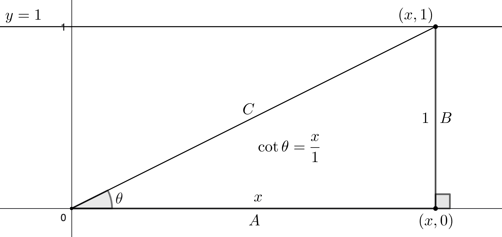

Each such $x$ corresponds to a unique point on that line and thus determines a unique standard position angle, $\t$, when connected to the origin by a segment, $C$. Thus it also determines a unique triangle consisting of side $C$ and sides $A$ (connecting $(0,0)$ to $(x,0)$) and $B$ (connecting $(x,0)$ to $(x,1)$). Furthermore, $\Delta ABC$ is a right triangle (because side $B$ is parallel to the $y$&#8209;axis&mdash;proof?&mdash;which is perpendicular to the $x$&#8209;axis by convention) which implies that $\cot\t = \Frac x1 = x$. In other words, for each such $x$, there exists some real number $\t$ such that $\cot\t = x$. 

Case $x \lt 0$: The argument is essentially identical, except that each $x \lt 0$ determines a unique standard position angle with a measure greater than $\pi/2$ so we must construct the right triangle on the other side of the $y$&#8209;axis and use the signed length of $B$&mdash;which is still the $x$&#8209;coordinate of the point, i.e., the given value of $x$&mdash;in the right triangle ratio definition of $\cot.~~\blksq$ 
  

<a name="5.98" class="goback" onclick="winhisback()">__5.98__)</a>
Show that the period of $f(\t) = \cot \t$ is $\pi$.

__Pf__: We must show that $\pi$ is the smallest positive real number such that $\cot(\t + \pi) = \cot \t$ for all $\t$ for which cot is well&#8209;defined.&nbsp; The proof consists of two parts: we show that $\cot$ has period $\pi$; and we show that $\pi$ is the smallest positive number for which this is true.

Part 1: For all $\t$ such that $\sin(\t + \pi) \ne 0$, $\cot(\t + \pi) = \displaystyle \frac{\cos(\t + \pi)}{\sin(\t + \pi)} = \frac{-\cos \t}{-\sin \t} = \frac{\cos \t}{\sin \t} = \cot \t$ (because if $\sin(\t + \pi) \ne 0$, then $\sin \t \ne 0$; proof?); this shows that $\pi$ is <i>a</i> period of cot. 

Part 2: We use the method suggested in the text as a hint for Problem 93: Suppose there exists $p$ between 0 and $\pi$, exclusive, i.e., $0 \lt p \lt \pi,$ such that $\cot(\t + p) = \cot \t$ for all $\t$ for which it is well&#8209;defined; then $\cot p = \cot(0 + p) = \cot 0 = 0$, i.e., our assumption implies $\cot p = 0$, and there is only one value between 0 and $\pi$ for which this is true, namely $\frac{\pi}2.~$ But, for example, $\cot \frac{\pi}4 = 1$, whereas $\cot(\frac{\pi}4 + \frac{\pi}2) = \cot \frac{3\pi}4 = -1$; in other words, we’ve found a value of $\t$ such that $\cot(\t + \frac{\pi}2) \ne \cot \t$, so $p=\pi$ must be the smallest (positive) value for which $\cot(\t+p) = \cot(\t)$ is <i>always</i> true.$~~\blksq$
  

## Section 6: Graphs of Sine and Cosine
### Formulas Section

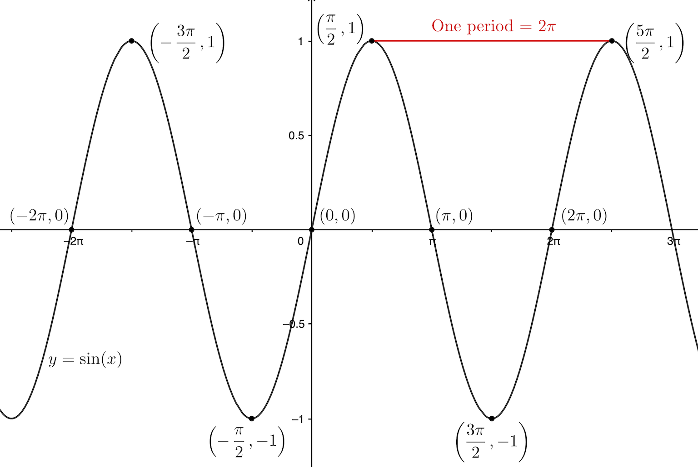

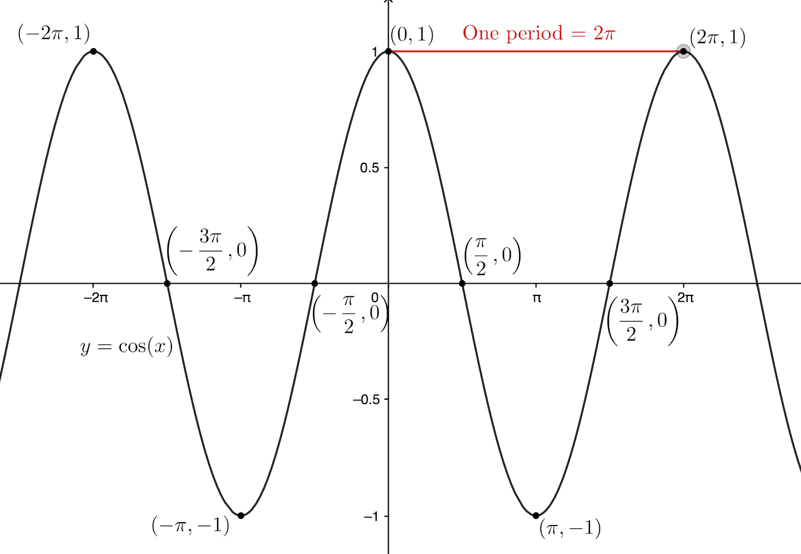

__Relationship between their (fundamental) graphs__: starting with the cofunction identity $\sin x = \cos\left(\displaystyle\frac{\pi}2-x\right)$, factoring $-1$ from the argument of the cos function and using the fact that cos is an even function $\displaystyle \implies \sin x = \cos\left[-1\left(x-\frac{\pi}2\right)\right] = \cos\left(x-\frac{\pi}2\right)$, so the (fundamental) graph of sin is the same as cos, horizontally shifted $\displaystyle\frac{\pi}2$ units to the right, or, equivalently, __the (fundamental) graph of cos is the same as sin, horizontally shifted $\displaystyle\frac{\pi}2$ units to the left__.

__Amplitude and period__: given $y = f(x) = A\sin(\w x)\text{ or } = A\cos(\w x), \w \gt 0$ (if $\w \lt 0$ begin the analysis by changing $A\sin(\w x)$ to $-A\sin(|\w| x)$, $A\cos(\w x)$ to $A\cos(|\w| x)$): the __amplitude__ of $f$ is $|A|$, which gives the maximum and minimum values (maxima and minima) attained by $f$ and the <i>factor</i> (i.e., multiplier) by which the (fundamental) graph is <i>vertically</i> &quot;stretched&quot; ($|A| \gt 1$) or &quot;compressed&quot; ($|A| \lt 1$); and the (fundamental) __period__ (see Section 5 above for the definition) of $f$ is $T = \displaystyle \frac{2\pi}{\w}$, which gives the distance between consecutive maxima (and minima), and twice the distance between consecutive zeros and between any maximum and the next minimum and vice&#8209;versa (i.e., the distance between consecutive zeros, and between a maximum (resp. minimum) and the next minimum (resp. maximum) is half the period, $\displaystyle \frac T2$).&nbsp; Conversely: given the amplitude, $A$, the period, $T$, and whether the function has a zero, or a maximum or minimum, at zero (or information from which these properties can be deduced, e.g., the maximum or minimum value, the minimum distance between these, and the value at zero), one can immediately write down $\displaystyle f(x) = A\sin\left(\frac{2\pi}T x\right)$ (if $f(0) = 0$) or $\displaystyle f(x) = \pm A\cos\left(\frac{2\pi}T x\right)$ (if $f(0) = \pm A$). 
  

__Solved Problems__

__12__, __16__, and __20__) Determine the amplitude and period of each function without graphing.

<a name="6.12" class="goback" onclick="winhisback()">__6.12__)</a>
$y = \cos 3x$

__Sln__: $\cos 3x = A\cos\w x$ with $A = 1, \w = 3$ so the amplitude is $\box{1}$ and the period $T = \box{\frac{2\pi}{3}}.$ (A check for the period calculation is to compute $T/4$ and confirm that when you put it in for $x$, the argument for the $\cos$ function becomes $\pi/2$; we leave this for the reader.)
  

<a name="6.16" class="goback" onclick="winhisback()">__6.16__)</a>
$y = -3\cos 3x$

__Sln__: $y = A\cos\w x$ with $A = -3, \w = 3$ so the amplitude is $|A| = \box{3}$ and the period is again $\box{\frac{2\pi}3}$.
  

<a name="6.20" class="goback" onclick="winhisback()">__6.20__)</a>
$y = \Frac95 \cos \left(-\Frac{3\pi}2 x\right)$

__Sln__: Because $\cos$ is an even function, $\Frac95 \cos \left(-\Frac{3\pi}2 x\right) = \Frac95 \cos \left(\Frac{3\pi}2 x\right) \implies A = \box{\frac95}, T = \Frac{2\cancel{\pi}}{3\cancel{\pi}/2} = \box{\frac43}$. Check: $T/4 = 1/3 \implies (3\pi/2)(1/3) = \pi/2.~~\chec$
  

__24__ and __30__) Match the given function to one of the graphs (A)–(J).

<a name="6.24" class="goback" onclick="winhisback()">__6.24__)</a>
$y = 3\cos 2x$

__Sln__: $A = 3, T = 2\pi/2 = \pi$ and since it’s the $\cos$ function, $y(0) = 3$: the graph which matches these criteria is $\box{\text{I}}$:

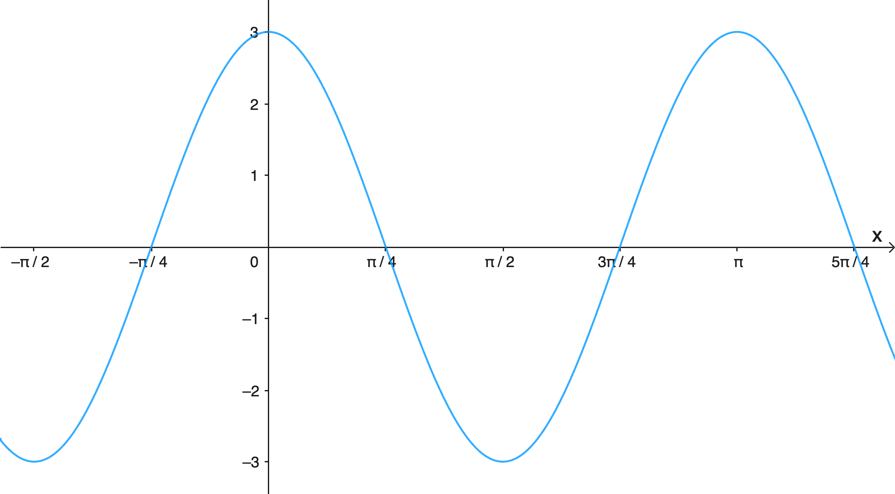

 

<a name="6.30" class="goback" onclick="winhisback()">__6.30__)</a>
$y = -2\sin\left(\Frac12 x\right)$

__Sln__: $|A| = |-2| = 2, T = (2\pi)/(1/2) = 4\pi$, which narrows it down to graph A, B, C, or D. Since it’s $\sin$, $y(0) = 0$ which eliminates A and C; since $A \lt 0$, $y(T/4=\pi) \lt 0$, i.e., the graph &quot;leaves $(0,0)$ going down,&quot; so the answer is $\box{\text{D}}$:

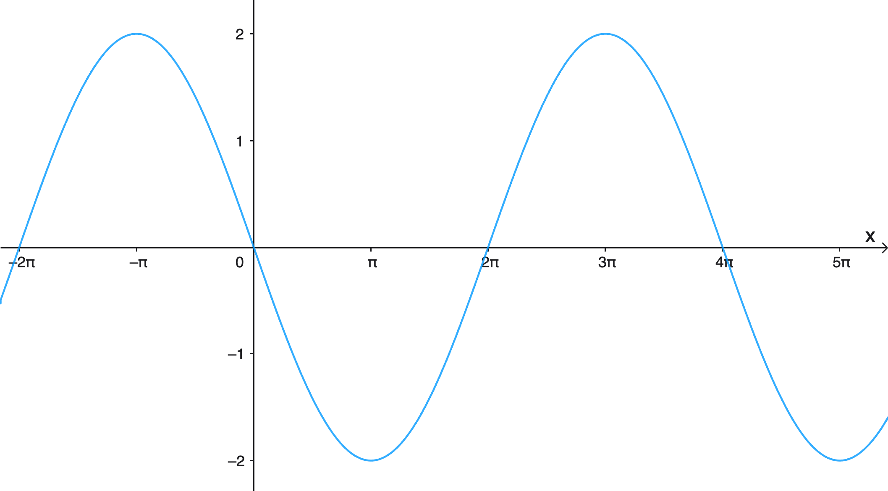

 

__42__, __50__, and __58__) Graph each function. Be sure to label key points and show at least two cycles. Use the graph to determine the domain and the range of each function.

<a name="6.42" class="goback" onclick="winhisback()">__6.42__)</a>
$y = \cos(-2x)$

__Sln__: First: the domain of any pure sinusoid, $A\sin(\w x + \phi) + B \text{ or } A\cos(\w x + \phi) + B, A, B, \w, \phi$ constants ($\phi$ is a Greek letter I learned to pronounce &quot;fee&quot; but I believe some pronounce it &quot;fī&quot;), is $\box{\mathbb{R}}$, so that should be &quot;automatic,&quot; i.e., you don’t need the graph for that.&nbsp; Similarly, you don’t need the graph to determine the range: it is always the closed interval $[B -|A|, B + |A|]$ (because the range of $\sin$ and $\cos$ is $[-1,1]$ so the range of $A$ times both of these is $[-|A|, |A|]$ and then adding $B$ just shifts the entire interval by $B$); in this case $A = 1$ and $B= 0$ so the range is $[0 - 1, 0 + 1] = \box{[-1,1]}$.&nbsp; $y = \cos(-2x) = \cos(2x) \implies T = 2\pi/2 = \pi$, so this will be the (horizontal) distance between consecutive maxima and consecutive minima; $\pi/2$ will be the distance between consecutive zeros; and $\pi/4$ will be the distance between any zero and the neighboring maximum and minimum.&nbsp; $\cos(-2(0)) = \cos(0) = 1$, so $(0,1)$ is on the graph and it is a maximum (why, exactly?), so there will be zeros $\pi/4$ units to the left and to the right, i.e., $(-\pi/4, 0)$ and $(\pi/4, 0)$ are on the graph; minima of $y=-1$ occur at $x=\pm\pi/2$, $y=0$ (again) at $x=\pm3\pi/4$, and $y=1$ (again) at $x=\pm\pi$.&nbsp; The graph below illustrates what, in my opinion, constitutes &quot;minimum sufficient labeling&quot; of a sinusoidal graph (note, for example, that I prefer to provide three periods, one to the left of zero and two to the right).

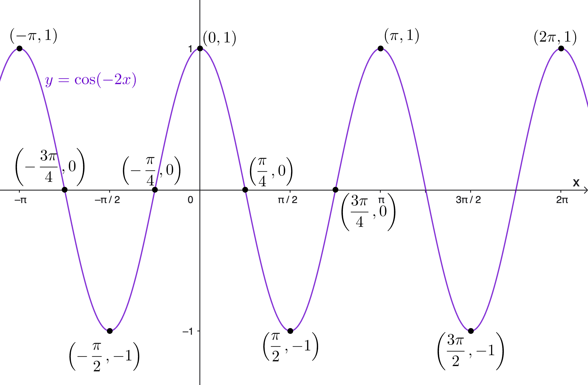

 

<a name="6.50" class="goback" onclick="winhisback()">__6.50__)</a>
$y = 4\sin\left(\Frac{\pi}2 x\right) - 2$

__Sln__: The domain is $\box{\mathbb{R}}, |A| = 4, B = -2$ so the range is $[-2-4, -2+4] = \box{[-6,2]}$; $y(0) = 0 - 2 = -2, T = \Frac{2\pi}{\pi/2} = 4$ so $y(T/4 = 1) = 4 - 2 = 2, y(T/2 = 2) = - 2, y(3T/4 = 3) = -4 - 2 = -6, y(T) = -2,$ etc. Here is a sufficiently labeled graph:

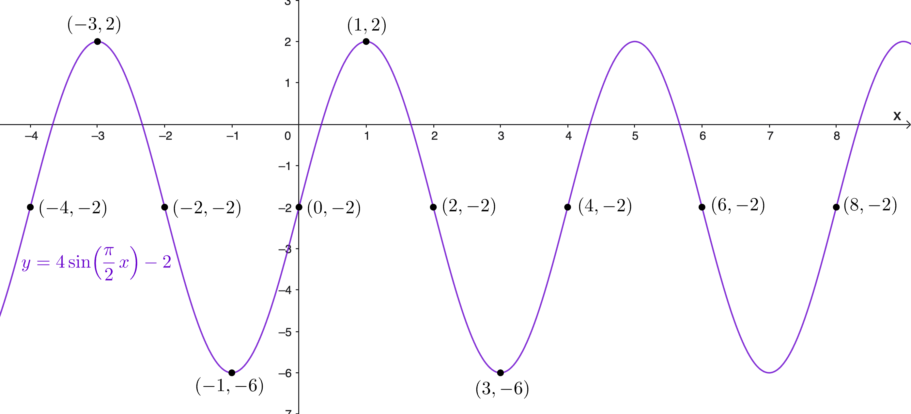

 

<a name="6.58" class="goback" onclick="winhisback()">__6.58__)</a>
$y = -\Frac12 \sin\left(\Frac{\pi}8 x\right) + \Frac32$

__Sln__: The domain is $\box{\mathbb{R}}, |A| = \Frac12, B = \Frac32$ so the range is $\left[\Frac32-\Frac12,\Frac32+\Frac12\right] = \box{[1,2]}$, $T = \Frac{2\pi}{\pi/8} = 16$ so the quarter period points are four units apart; $y(0) = \Frac32$ and $A \lt 0$ means that the graph first descends from this value as $x$ increases, so $y(4) = 1, y(8) = \Frac32, y(12) = 2, y(16) = \Frac32,$ etc. Here’s what you should get:

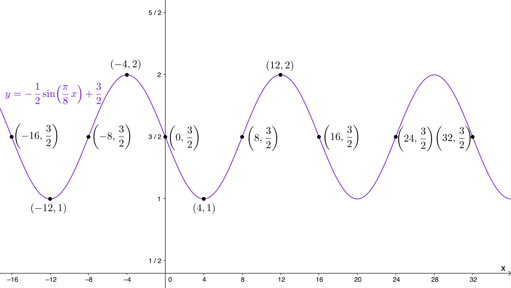

 

<a name="6.62" class="goback" onclick="winhisback()">__6.62__)</a>
Write the equation of a sine function that has amplitude 4 and period 1.

__Sln__: Most simply, we need to write a function of the form $y(x) = A\sin(\w x)$, where $|A|$ is the amplitude and $T = 2\pi/\w$ is the period; therefore the most straightforward solution is derived from using the amplitude as given ($|4| = 4$) and  setting $T = 1 = 2\pi/\w$ yielding $\w = 2\pi$ to obtain:
$$\box{y(x) = 4\sin(2\pi x)}$$
But (infinitely) many other functions satisfy the requirements.
  

__66__, __72__, and __76__) Find an equation for each graph.

<a name="6.66" class="goback" onclick="winhisback()">__6.66__)</a>

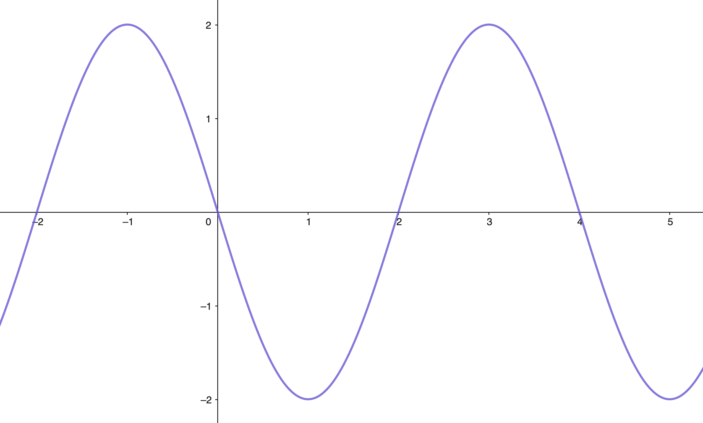

__Sln__: For these, until Chapter 8, the answers will look like $y(x) = A\sin(\w x) + B$ or $y(x) = A\cos(\w x) + B$, depending on whether $y(0) = B (\implies \sin)$ or $y(0) = B \pm A (\implies \cos)$, where $|A| = (\text{maximum} - \text{minimum})/2$ and $B = (\text{maximum} + \text{minimum})/2$ (in Chapter 8 we learn how to deal with sinusoids of the form $A\sin(\w x + \phi) + B$).&nbsp; In this case, the maximum is $2$ and the minimum is $-2$ so $|A| = (2 - (-2))/2 = 2$ and $B = (2 + (-2))/2 = 0 = y(0)$ (according to the graph) so we know our answer will look like $y(x) = \pm2\sin(\w x)$.&nbsp; To calculate $\w$ we need the period $T$ to use $T = 2\pi/\w \implies \w = 2\pi/T$; now, $T = (x$&#8209;coordinate of any maximum $- x$&#8209;coordinate of the maximum immediately to its left$)$, which in this case yields $T = (3 - (-1)) = 4 \implies \w = 2\pi/4 = \pi/2$.&nbsp; So now we know the answer looks like $y(x) = \pm2\sin(\pi x/2)$, all we need to do is figure out the sign; the easiest way to do this is to evaluate the function at $T/4$ and see which sign is required to make the value agree with the graph: $\pm2\sin(\pi(1)/2) = \pm2(1)$ and since the point actually on the graph is $(1,-2)$, we conclude that we need the negative sign: 

$$\box{y(x) = -2\sin\left(\frac{\pi x}2\right)}$$

The check is to evaluate our answer at other key values of $x$ and confirm that those points are on the graph; example: $-2\sin(\pi(3)/2) = -2(-1) = 2.~\chec$
  

<a name="6.72" class="goback" onclick="winhisback()">__6.72__)</a>

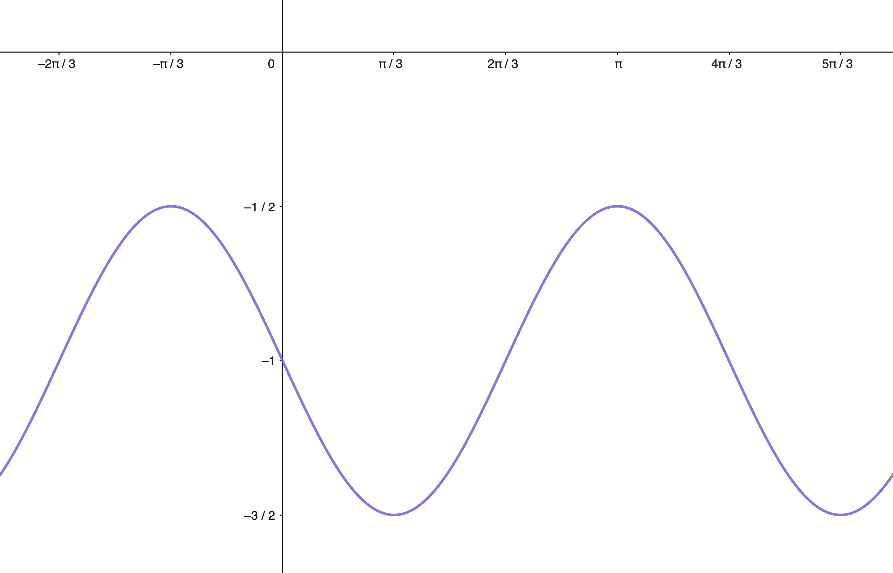

__Sln__: The maximum and minimum are, respectively, $-\Frac12, -\Frac32 \implies |A| = \Frac12\left[-\Frac12 - \left(-\Frac32\right)\right] = \Frac12$, $B = \Frac12\left[-\Frac12 + \left(-\Frac32\right)\right] = -1 = y(0)$ so we know the answer will look like $\pm\Frac12\sin(\w x) - 1$.&nbsp; Next, $T = \pi - \left(-\Frac{\pi}3\right) = \Frac{4\pi}3 \implies \w = \Frac{2\pi}{4\pi/3} = \Frac32 \implies y(x) = \pm\Frac12\sin\left(\Frac{3x}2\right) - 1$.&nbsp; Finally, $y(T/4 = \pi/3) = -\Frac32 = -\Frac12 - 1 = -\Frac12\sin\left(\Frac{3\pi/3}2\right) - 1$ so the required equation is:
$$\box{y(x) = -\frac12\sin\left(\frac{3x}2\right) - 1}$$
Check: $y(3T/4 = \pi) = -1/2\sin(3\pi/2) - 1 = 1/2 - 1 = -1/2.~\chec$
  

<a name="6.76" class="goback" onclick="winhisback()">__6.76__)</a>

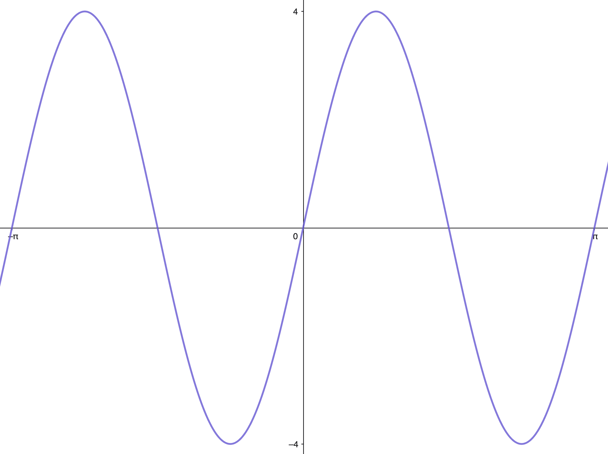

__Sln__: The maximum is $4$, the minimum is $-4$ so $|A|= 0.5(4-(-4)) = 4, B = 0.5(4+(-4)) = 0 = y(0)$ so $y(x) = \pm4\sin(\w x)$; $T = \Frac{\pi}4 - \left(-\Frac{3\pi}4\right) = \pi \implies \w = \Frac{2\pi}{\pi} = 2 \implies y(x) = \pm4\sin(2x)$; $y(\pi/4) = 4 \implies$ 
$$\box{y(x) = 4\sin 2x}$$
Check: $y(3\pi/4) = 4\sin(2(3\pi/4)) = -4.~\chec$
  

<a name="6.80" class="goback" onclick="winhisback()">__6.80__)</a>
Find the average rate of change of $f(x) = \cos 2x$ over the interval $0 \le x \le \Frac{\pi}2$. 

__Sln__: ___By definition___, the ___average___ rate of change of a function $f(x)$ over the interval $I: a \le x \le b$ (or $I = [a,b]$) is:
$$\Delta_I f \equiv \frac{f(b) - f(a)}{b - a}$$
where $\Delta$ is the capital Greek letter &quot;delta&quot; and the left hand side is read &quot;delta sub I of f.&quot;&nbsp; So for $f(x) = \cos 2x, I = [0, \pi/2]$, $\Delta_I f = \Frac{\cos(2(\pi/2)) - \cos(2(0))}{\pi/2 - 0} = \Frac{-1 - 1}{\pi/2} = \box{-\frac4{\pi}}.$ 
  

<a name="6.84" class="goback" onclick="winhisback()">__6.84__)</a>
Given $f(x) = -3x, g(x) = \sin x$, find and graph $(f \circ g)(x)$ and $(g \circ f)(x)$.

__Sln__: $(f \circ g)(x) = f(g(x)) = -3g(x) = \box{-3\sin x}$, $(g \circ f)(x) = g(f(x)) = \sin(-3x) = \box{-\sin(3x)}$; here are both graphed on the same set of axes:

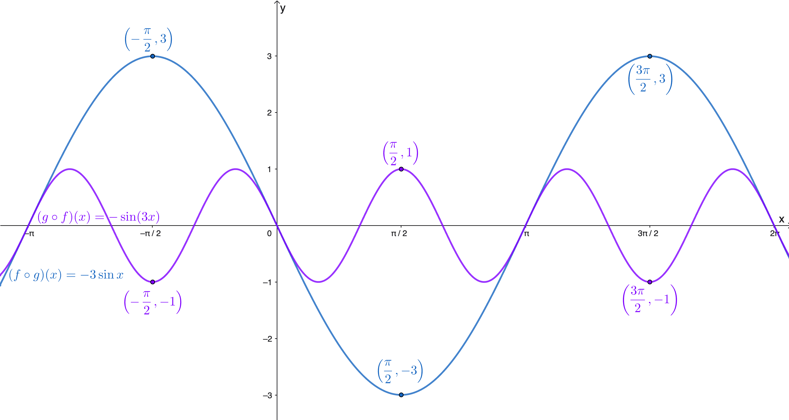

 

<a name="6.86" class="goback" onclick="winhisback()">__6.86__)</a>
Graph $g(x) = 
\begin{cases}
2\sin x, & 0 \le x \le \pi \\
\cos x + 1, & \pi \lt x \le 2\pi
\end{cases}$

__Sln__: This exercise is, perhaps, more difficult to execute on a graphing utility (GU) than &quot;by hand&quot;: for the latter, all one has to do is sketch that portion of $y = 2\sin x$ between $x = 0$ and $x = \pi$ and that portion of $y = \cos x + 1$ between $x = \pi$ and $x = 2\pi$, which by this point shouldn’t be that challenging; but GUs tend not to be designed to make graphing piecewise&#8209;defined functions as straightforward as graphing &quot;regular&quot; functions; and yet nowadays, using a GU to graph ___any___ function it is capable of graphing is an essential mathematical skill.

We cannot provide details of the syntax required on all available GUs (we are not even sure we know of all available GUs); what we can do is include in our GeoGebra graph of the function the syntax required to produce that graph in GeoGebra:

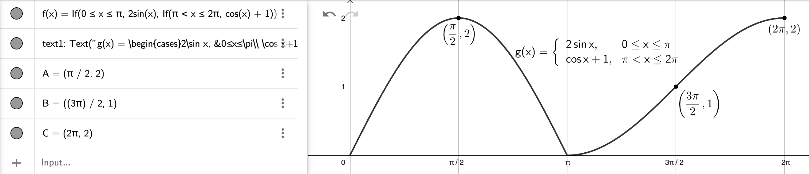

Note in particular that it includes an If(Condition, Then) command nested inside the Else portion of an If(Condition, Then, Else) command&mdash;we suspect that some similar syntax will be required in the reader’s GU of choice.   
 

<a name="6.90" class="goback" onclick="winhisback()">__6.90__)</a>
The voltage $V$, in volts, produced by an ac generator at time $t$, in seconds, is
$$V(t) = 120\sin(120\pi t)$$
__a__) What are the amplitude and period? 
__b__) Graph $V$ over two periods, beginning at $t=0$. 
__c__) If a resistance of $R=20$ ohms is present, what is the current $I$? (Hint: Ohm’s Law is $V = IR$.) 
__d__) What is the amplitude and period of the current $I$? 
__e__) Graph $I$ over two periods, beginning at $t = 0$.

__Sln__: a) Amplitude $= \box{120\text{ volts}}$, the period $T = \Frac{2\pi}{120\pi} = \box{\frac1{60}\text{ sec}^{-1}}$. 
b)
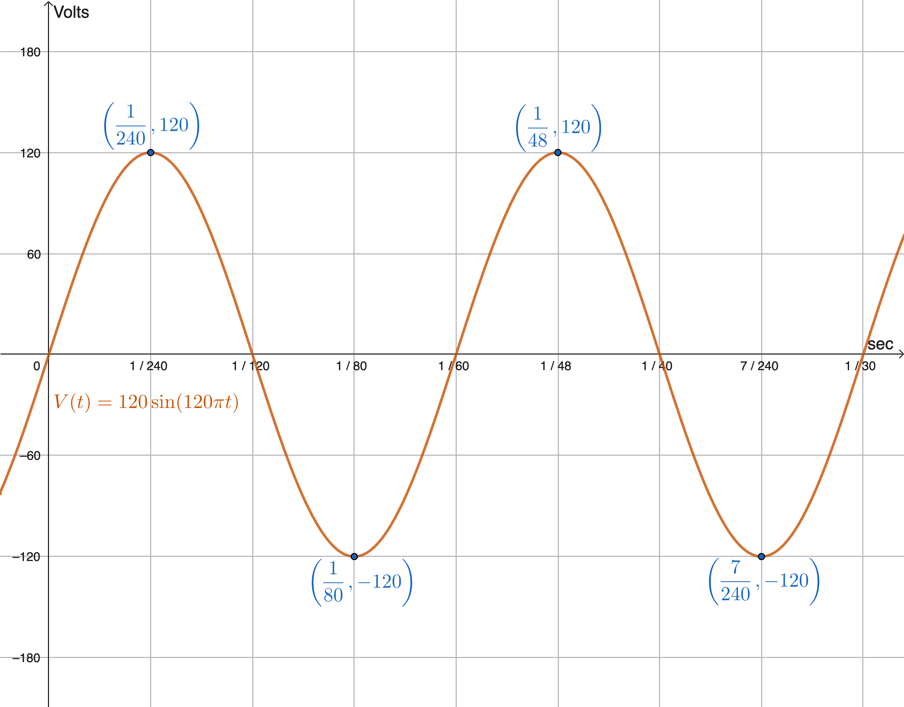

c) $V = IR \implies I(t) = V(t)/R = \box{6\sin(120\pi t)}$ (when $V$ is in volts, $R$ in ohms $\implies I$ has units of amperes). 
d) Amplitude $= \box{6\text{ amperes}}$, $T$ is the same as for $V$, $\box{\frac1{60}\text{ sec}^{-1}}$.  
e)
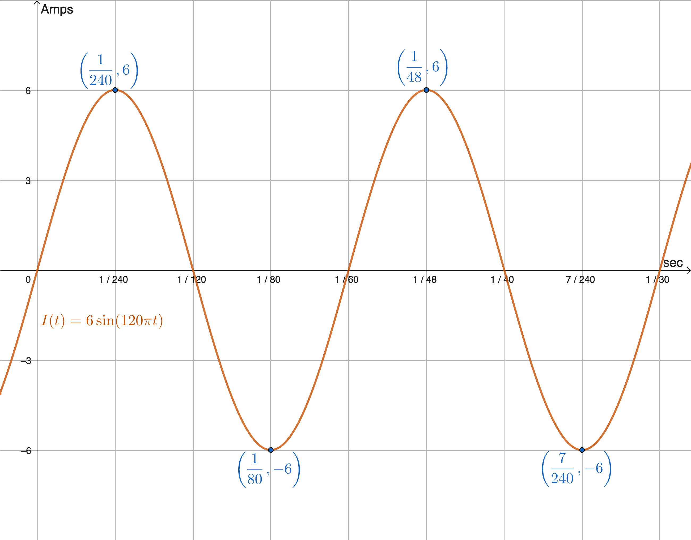

 

<a name="6.92" class="goback" onclick="winhisback()">__6.92__)</a>
A one&#8209;lane highway runs through a tunnel in the shape of one&#8209;half a sine curve cycle. The opening is 28 feet wide at road level and is 15 feet tall at its highest point. 

__a__) Find an equation for the sine curve that fits the opening.
Place the origin at the left end of the sine curve. 
__b__) If the road is 14 feet wide with 7&#8209;foot shoulders on each
side, what is the height of the tunnel at the edge of the road?

__Sln__: a) 28 feet $= T/2 \implies T = 56 = 2\pi/\w \implies \w = 2\pi/56 = \Frac{\pi}{28}$; 15 feet at its highest point $\implies A = 15$, and the origin at the left end of the sine curve $\implies (0,0)$ is on the curve $\implies$ the required equation is:
$$\box{y(x) = 15\sin\left(\frac{\pi}{28}x\right)}$$
b) $y(x)$ gives the height of the tunnel $x$ feet away from the left end of the tunnel, so we simply need to evaluate $y(7) = 15\sin(\pi(7)/28) = 15\sin(\pi/4) = \box{\frac{15\sqrt2}2 \doteq 10.6\text{ feet}}$. (A half&#8209;cycle of a sine curve centered on a maximum or minimum is ___symmetric___ about the horizontal position of that extremum, so the height of the tunnel at the right edge of the road is the same as at the left edge, which the reader can confirm by evaluating $y(21=7+14)$.)
  

<a name="6.99" class="goback" onclick="winhisback()">__6.99__)</a>
Find four of the points of intersection of $y = \tan x$ and $y = 1$.

__Sln__: In other words, find four ordered pairs $(x,y)$ such that each pair makes both equations simultaneously true.&nbsp; Clearly, this requires that $y=1$ in each ordered pair, so we must find four values of $x$ such that $\tan x = 1$.&nbsp; We could (really should) appeal to the unit circle to figure this out, but this section is about the graphs of $\sin$ and $\cos$, so let’s see if we can figure it out using those graphs. 

Now, $\tan x = \Frac{\sin x}{\cos x} = 1 \implies \sin x = \cos x$ so the way to figure this out using the graphs of $\sin$ and $\cos$ is to plot them together and figure out where their graphs intersect: the $x$&#8209;coordinates of those intersections are the required values of $x$.&nbsp; The way to do this using GeoGebra is to define two functions, `f(x) = sin(x)` and `g(x) = cos(x)` (GeoGebra automatically plots them for you) and then use the `Intersect(f, g, <lower bound>, <upper bound>)` command, where `<lower bound>` is an $x$ value a little less than the $x$&#8209;coordinate of a point of intersection, and `<upper bound>` is an $x$ value a little greater (you determine these from  inspection of the graph); you do this for each intersection point you want to find, and GeoGebra finds them for you...except, it finds numerical approximations, not exact values.&nbsp; In real life, this is sufficient, because a real life problem like this, if you get one, almost certainly won’t have &quot;nice looking&quot; exact answers; but this one does, and I’ve tried to indicate what they are by instructing GeoGebra to put and label the horizontal ticks at multiples of $\pi/4$.&nbsp; Thus careful inspection of the graph below 

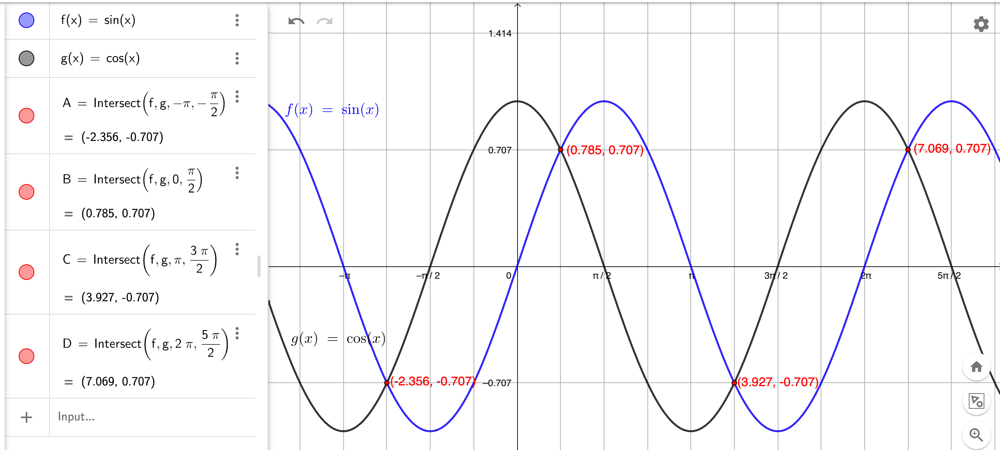

should suggest that four values of $x$ which meet our requirements are: $-\Frac{3\pi}4, \Frac{\pi}4, \Frac{5\pi}4,$ and  $\Frac{9\pi}4 \implies$ one answer is:
$$\box{\left(-\Frac{3\pi}4, 1\right), \left(\Frac{\pi}4, 1\right), \left(\Frac{5\pi}4, 1\right), \left(\Frac{9\pi}4, 1\right)}$$
(Due to the periodicity of $\sin$ and $\cos$, there are infinitely many points of intersection of these two curves, and therefore infinitely many acceptable answers to this problem.)&nbsp; The check is left to the reader (you should be able to do it in your head, using the unit circle).
  

## Section 7: Graphs of Tangent, Cotangent, Cosecant, and Secant
### Formulas Section

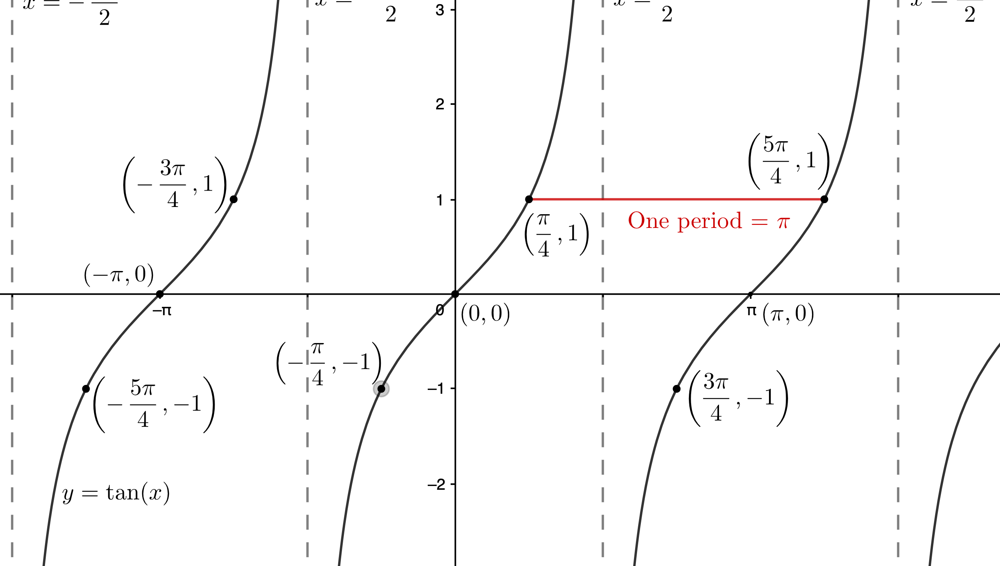

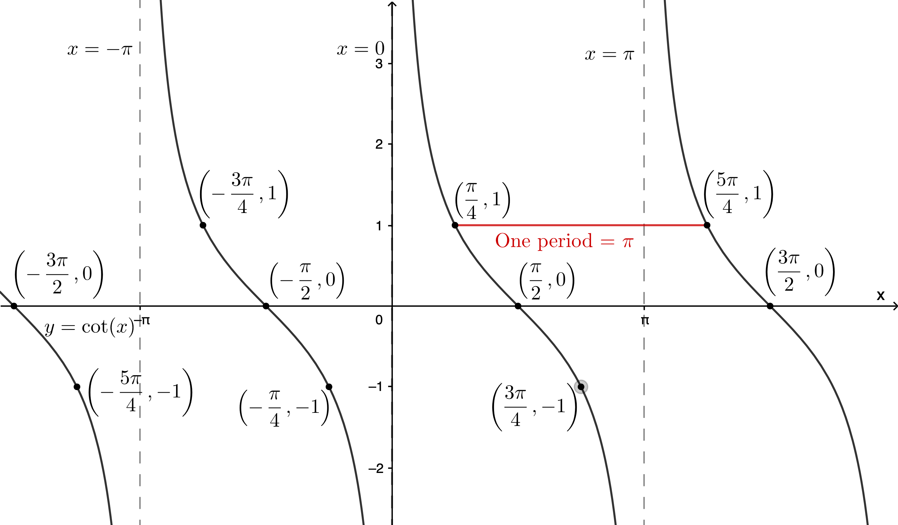

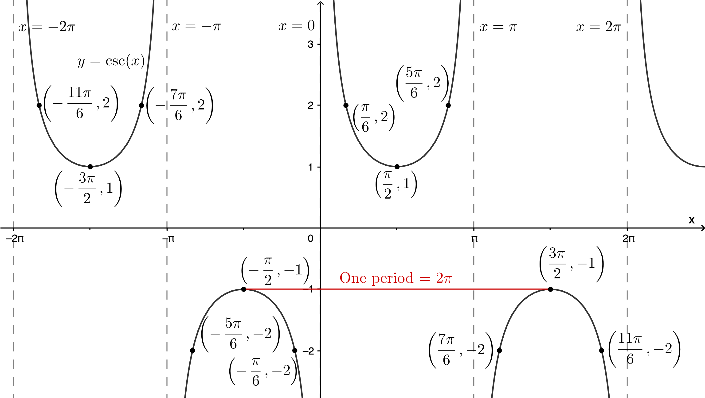

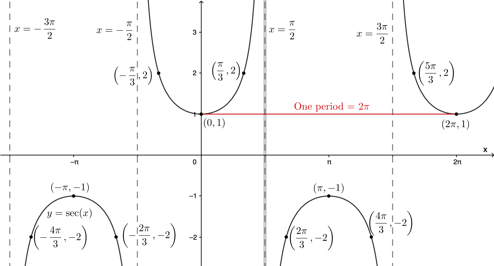

 

__Solved Problems__

<a name="7.8" class="goback" onclick="winhisback()">__7.8__)</a>
What is the $y$&#8209;intercept of $\cot x$?

__Sln__:
  

<a name="7.14" class="goback" onclick="winhisback()">__7.14__)</a>
For what numbers $x$, $-2\pi \le x \le 2\pi$, does the graph of $y = \csc x$ have vertical asymptotes?

__Sln__:
  

__22__, __28__, __34__, and __40__: Graph the given function, showing at least two cycles, labeling important points (and asymptotes), and state the function’s domain and range.

<a name="7.22" class="goback" onclick="winhisback()">__7.22__)</a>
$y = \tan\left(\Frac12 x\right)$

__Sln__:
  

<a name="7.28" class="goback" onclick="winhisback()">__7.28__)</a>
$y = -4\sec x$

__Sln__:
  

<a name="7.34" class="goback" onclick="winhisback()">__7.34__)</a>
$y = 2\cot x - 1$

__Sln__:
  

<a name="7.40" class="goback" onclick="winhisback()">__7.40__)</a>
$y = 3\sec\left(\Frac14 x\right) + 1$

__Sln__:
  

<a name="7.44" class="goback" onclick="winhisback()">__7.44__)</a>
Find the average rate of change of $f(x) = \sec(2x)$ from $0$ to $\Frac{\pi}6$.

__Sln__:
  

<a name="7.48" class="goback" onclick="winhisback()">__7.48__)</a>
Given: $f(x) = \Frac12 x,~g(x) = 2\csc x$, find and graph $(f \circ g)(x)$ and $(g \circ f)(x)$.

__Sln__:
  

<a name="7.50" class="goback" onclick="winhisback()">__7.50__)</a>
Graph $g(x) = \begin{cases}
\csc x, & 0 \lt x \lt \pi \\
0, & x = \pi \\
\cot x, & \pi \lt x \lt 2\pi
\end{cases}
$

__Sln__:
  

<a name="7.52" class="goback" onclick="winhisback()">__7.52__)</a>

__Sln__:
  

## Section 8: Phase Shift; Sinusoidal Curve Fitting
### Formulas Section

In $\sin\text{ or }\cos(\w x - \phi), \w \gt 0$: period $T = \displaystyle \frac{2\pi}{\w}$; &quot;phase&quot; (horizontal) shift $\displaystyle = \frac{\phi}{\w}$, to the right if $\phi \gt 0$, to the left if $\phi \lt 0$.

  

__Solved Problems__

<a name="8.6" class="goback" onclick="winhisback()">__8.6__)</a>

__Sln__:
  

<a name="8.10" class="goback" onclick="winhisback()">__8.10__)</a>

__Sln__:
  

<a name="8.14" class="goback" onclick="winhisback()">__8.14__)</a>

__Sln__:
  

<a name="8.18" class="goback" onclick="winhisback()">__8.18__)</a>

__Sln__:
  

<a name="8.22" class="goback" onclick="winhisback()">__8.22__)</a>

__Sln__:
  

<a name="8.26" class="goback" onclick="winhisback()">__8.26__)</a>

__Sln__:
  

<a name="8.34" class="goback" onclick="winhisback()">__8.34__)</a>

__Sln__:
  

<a name="8.38" class="goback" onclick="winhisback()">__8.38__)</a>

__Sln__:
 

### Credits

Graphs generated using [GeoGebra](http://www.geogebra.org/).

### Please Donate:

<table>
  <tr>
    <td>
      <b>Venmo: @David-Goldsmith-13</b>
    </td>
    <td>
      <form action="https://www.paypal.com/cgi-bin/webscr"
            method="post"><input name="cmd"
            value="_xclick" type="hidden"> <input name="business"
            value="dgoldsmith_89@alumni.brown.edu" type="hidden"> <input
            name="item_name" value="SelectedSolutions Donation"
            type="hidden"> <input name="cn" value="Special Instructions
            (optional" type="hidden"> <input
            src="https://www.paypal.com/images/x-click-but04.gif"
            name="submit" alt="Make payments with PayPal - it's fast,
            free and secure!" align="middle" border="0" type="image"></form>
    </td>
  </tr>
</table>

