
$\definecolor{red}{RGB}{255,0,0}
\definecolor{orange}{RGB}{245, 165, 0}
\definecolor{yellow}{RGB}{255,215,0}
\definecolor{green}{RGB}{0,255,0}
\definecolor{indigo}{RGB}{0,0,255}
\definecolor{violet}{RGB}{138,43,226}
\definecolor{black}{RGB}{0,0,0}$
$\require{cancel}$

#### 
Sullivan, M., 2012. <i>Algebra & Trigonometry, Ninth Edition.</i> Prentice Hall, Boston
#### 
 Selected Problem Solutions from C8S3: Trig Equations
#### 
to be included in the main Chapter write up
#### 
&copy; 2022 by David Lawrence Goldsmith

__10__) ___True or False___ The equation $\sin\theta = 2$ has a real solution
that can be found using a calculator.

__Sln__: $\boxed{\text{False}}: |\sin\theta~| \le 1~\forall\theta\in \mathbb{R}$ so $\sin \theta = 2$ has no real solution, with or without a calculator.
  

In Problems __16__, __22__, __28__, & __34__, solve each equation on the interval $0 \le \theta \lt 2\pi$.

__16__) $4\cos^2 \theta - 3 = 0$

__Sln__: $4\cos^2 \theta - 3 = 0 \implies \cos^2\theta = \displaystyle\frac34 \implies \cos\theta = \pm\frac{\sqrt3}2 \implies$ $$\boxed{\theta \in \left\{\frac{\pi}6,\frac{5\pi}6,\frac{7\pi}6,\frac{11\pi}6\right\}}$$

__Chk__: Left to the reader.
  

__22__) $\displaystyle\cot\frac{2\theta}3 = -\sqrt3$

__Sln__: $\displaystyle\cot\frac{2\theta}3 = -\sqrt3 \implies \tan\frac{2\theta}3 = -\frac1{\sqrt3} \implies \frac{2\theta}3 = \tan^{-1}\left(-\frac1{\sqrt3}\right) \implies \frac{2\theta}3 = \frac{5\pi}6 + k\pi, k \in \mathbb{Z} \implies$ $\displaystyle\theta = \frac32\left(\frac{5\pi}6 + k\pi\right) = \frac{5\pi}4 + \frac{3k\pi}2$, which is in $\left[0,2\pi\right)$ only for $k=0$, so the only appropriate solution is $$\boxed{\theta = \frac{5\pi}4}$$

__Chk__: The most efficient way to verify that this is a solution <i>and the only solution</i> in $\left[0,2\pi\right)$ is graphically:

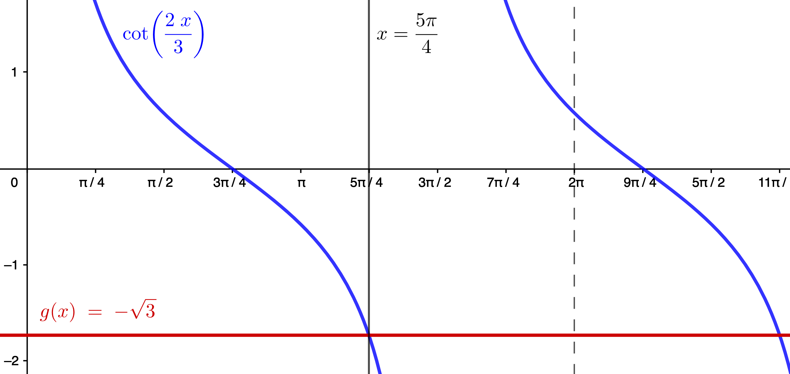
  

__28__) $5\csc\theta - 3 = 2$

__Sln__: $5\csc\theta - 3 = 2 \implies 5\csc\theta = 5 \implies \csc\theta = 1 \implies \sin\theta = 1 \implies$ $$\boxed{\theta=\frac{\pi}2}$$ and this is the only solution in $[0,2\pi)$.

__Chk__: Left to the reader. 
  

__34__) $\displaystyle\cos\left(\frac{\theta}3 - \frac{\pi}4\right) = \frac12$

__Sln__: $\displaystyle\cos\left(\frac{\theta}3 - \frac{\pi}4\right) = \frac12 \implies \displaystyle\frac{\theta}3 - \frac{\pi}4 = \frac{\pi}3 + 2k\pi$ or $\displaystyle \frac{\theta}3 - \frac{\pi}4 = \frac{5\pi}3 + 2k\pi,~k\in \mathbb{Z}$; 

$\displaystyle\frac{\theta}3 - \frac{\pi}4 = \frac{\pi}3 + 2k\pi \implies \frac{\theta}3 = \frac{\pi}3+\frac{\pi}4+2k\pi = \frac{7\pi}{12}+2k\pi \implies \theta = \frac{7\pi}4 + 6k\pi$, which is in $[0,2\pi)$ only for $k=0.$

$\displaystyle\frac{\theta}3 - \frac{\pi}4 = \frac{5\pi}3 + 2k\pi \implies \frac{\theta}3 = \frac{5\pi}3+\frac{\pi}4+2k\pi = \frac{23\pi}{12}+2k\pi \implies \theta = \frac{23\pi}4 + 6k\pi$, which isn’t in $[0,2\pi)$ for any  $k.$

Therefore, the only solution in $[0, 2\pi)$ is: $$\boxed{\theta = \frac{7\pi}4}$$

__Chk__: 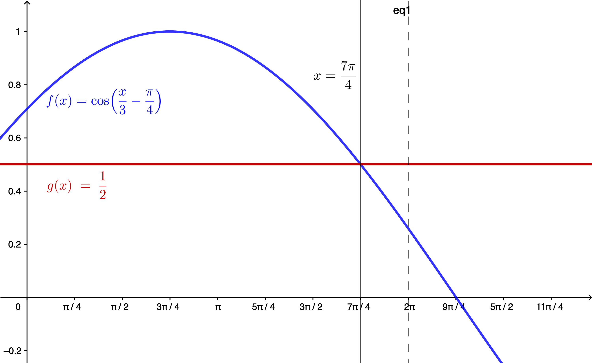
 

In Problems __38__ & __44__, give a general formula for all the solutions of the equation and list six such.

__38__) $\displaystyle \cos \theta =-\frac{\sqrt3}2$

__Sln__: $\displaystyle \cos \theta =-\frac{\sqrt3}2 \implies \boxed{\theta = \frac{5\pi}6 + 2k\pi \text{ or } \theta = \frac{7\pi}6 + 2k\pi,~ k\in\mathbb{Z},}$ so six explicit values may be obtained by choosing, for example, $k=-1, 0, 1 \displaystyle\implies \theta = \frac{5\pi}6-2\pi = \boxed{-\frac{7\pi}6},~\theta = \frac{7\pi}6-2\pi = \boxed{-\frac{5\pi}6},~\theta = \frac{5\pi}6+0 = \boxed{\frac{5\pi}6},~\theta = \frac{7\pi}6+0 = \boxed{\frac{7\pi}6},$ $\displaystyle~\theta = \frac{5\pi}6+2\pi = \boxed{\frac{17\pi}6},\text{ and }\theta = \frac{7\pi}6+2\pi = \boxed{\frac{19\pi}6}$ 

__Chk__: Due to the $2\pi$-periodicity of $\cos$, $\displaystyle\cos\left(\frac{5\pi}6+2k\pi\right) = \cos\frac{5\pi}6 = -\frac{\sqrt3}2~\forall k \in \mathbb{Z}$, and similarly for $\displaystyle\frac{7\pi}6.~$ Here’s a graph depicting the specific solutions found above: 

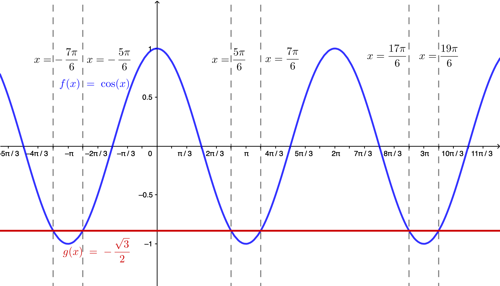
 

__44__) $\displaystyle \tan \frac{\theta}2 = -1$

__Sln__: $\displaystyle \tan \frac{\theta}2 = -1 \implies \frac{\theta}2 = \frac{3\pi}4 + k\pi \implies \boxed{\theta = \frac{3\pi}2 + 2k\pi, k \in \mathbb{Z}} \implies 6$ specific values are: $\displaystyle \frac{3\pi}2-4\pi = \boxed{-\frac{5\pi}2},~\frac{3\pi}2-2\pi = \boxed{-\frac{\pi}2},~\boxed{\frac{3\pi}2},~\frac{3\pi}2+2\pi = \boxed{\frac{7\pi}2},~\frac{3\pi}2+4\pi = \boxed{\frac{11\pi}2},~\frac{3\pi}2+6\pi = \boxed{\frac{15\pi}2}$

__Chk__: Check of the general case is left to the reader (hint: $\tan$ is $\pi$-periodic); check of our specific values is furnished by the following graph:

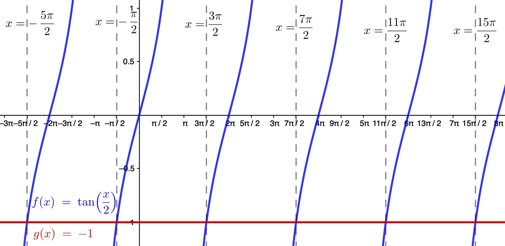
 

In Problems __50__ & __56__, use a calculator to solve each equation on the interval $0\le \theta \lt 2\pi$; round answers to two decimal places.

__50__) $\sin\theta = -0.2$

__Sln__: Most, if not all, calculators will observe the convention that the range of the inverse sine function is $\left[-\frac{\pi}2,\frac{\pi}2\right]$ (see Sec. 8.1), and thus the result they give&mdash;$\sin^{-1}(-0.2) \doteq -0.20$ (to two decimal places)&mdash;does not satisfy the stated requirement that we give solutions in the interval $0\le\theta\lt2\pi$; we need to (learn to) recognize that this result, interpreted as a "signed" angle (measured in radians), is acute (less than $\pi/2$, in absolute value), and "lies" in the fourth quadrant.&nbsp; Thus the fourth-quadrant angle in the required interval is $2\pi-|\sin^{-1}(-0.2)| \doteq \boxed{6.08}.~$ But there is also a third-quadrant angle which has $-0.2$ as its sine: this is obtained from $\pi + |\sin^{-1}(-0.2)| \doteq \boxed{3.34}.$

__Chk__: $\sin(6.08) \doteq -0.20, \sin(3.34)\doteq-0.20~\checkmark$
  

__56__) $4\cos\theta + 3 = 0$

__Sln__: $4\cos\theta + 3 \color{red}{-3}$ $ = 0 \color{red}{-3}$ $\to (\cancel{4}\cos\theta)\color{blue}/\cancel{4}$ $= -3\color{blue}/4$ $\to \theta = \cos^{-1}(-0.75) \doteq \boxed{2.42}.~$ That is the second-quadrant solution; there is also a third-quadrant solution that satisfies the requirement of being in the interval $0 \le \theta \lt 2\pi$ (why?), which is obtained (most easily) from $2\pi-\cos^{-1}(-0.75) \doteq \boxed{3.86}.$

__Chk__: $\cos(2.42) \doteq -0.75, \cos(3.86) \doteq -0.75~\checkmark$
  

In Problems __62__, __68__, __74__, & __80__, solve each equation on the interval $[0, 2\pi).$

__62__) $\displaystyle \left(\cot \theta + 1\right)\left(\csc \theta - \frac12\right) = 0$

__Sln__: $\displaystyle \left(\cot \theta + 1\right)\left(\csc \theta - \frac12\right) = 0 \implies \cot \theta + 1 = 0$ or $\csc\theta-1/2=0.~$ $\cot \theta + 1 = 0 \to \cot\theta = -1 \implies$, in the required interval, $\displaystyle \theta = \frac{3\pi}4, \frac{7\pi}4.$ $\csc\theta-1/2=0 \to \csc\theta = 1/2 \implies \sin\theta = 2$, which is not true for any $\theta.~$ Thus the solution set in the required interval is: $$\boxed{ \left\{ \frac{3\pi}4, \frac{7\pi}4 \right\} }$$

__Chk__: $(\cot(3\pi/4)+1)(\csc(3\pi/4)-1/2) = (-1+1)(\sqrt2-1/2) = (0)(\sqrt2-1/2) = 0~\checkmark$ $(\cot(7\pi/4)+1)(\csc(7\pi/4)-1/2) = (-1+1)(-\sqrt2-1/2) = (0)(-\sqrt2-1/2) = 0~\checkmark$

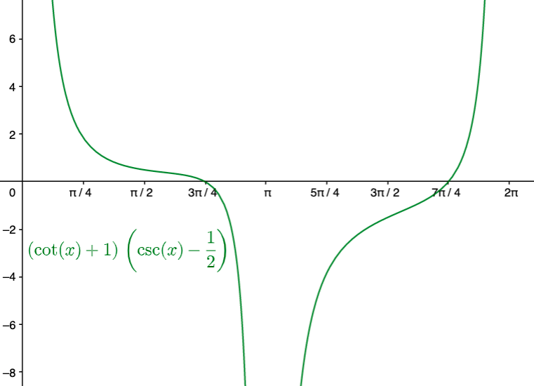
 

__68__) $\cos \theta - \sin(-\theta) = 0$

__Sln__: $\sin(-\theta) = -\sin\theta$ for all $\theta$ thus $\cos \theta - \sin(-\theta) = 0 = \cos \theta - (-\sin\theta) = \cos \theta + \sin\theta \implies \cos\theta = -\sin\theta$, i.e., the equation is true "where" $\cos = \sin$ in absolute value, but they differ in sign.&nbsp; sine and cosine differ in sign in the second and fourth quadrants, and the angles therein where they have the same absolute value are $\boxed{\frac{3\pi}4\text{ and }\frac{7\pi}4}.$

__Chk__: $\cos(3\pi/4)-\sin(-3\pi/4) = -1/\sqrt2-(-1/\sqrt2) = 0~\checkmark$ $\cos(7\pi/4) - \sin(-7\pi/4) = 1/\sqrt2-(1/\sqrt2) = 0~\checkmark$
  

__74__) $2\cos^2 \theta - 7 \cos \theta - 4 = 0$

__Sln__: Let $x=\cos\theta$; then $2\cos^2 \theta - 7 \cos \theta - 4 = 2x^2-7x-4 = 0 \implies x =\displaystyle \frac{-(-7) \pm \sqrt{(-7)^2-4(2)(-4)}}{2(2)} = \frac{7\pm\sqrt{49+32}}4 = \frac{7\pm9}4$ $\implies \cos\theta = 4$ or $-1/2.~$ There is no $\theta$ such that $\cos\theta = 4$ (why?), so the only solutions in $[0,2\pi)$ are: $\theta = \boxed{\left\{ \frac{2\pi}3, \frac{4\pi}3\right\}}$

__Chk__: $2\cos^2(\frac{2\pi}3) - 7\cos(\frac{2\pi}3) - 4 = 2(-1/2)^2 - 7(-1/2) - 4 = 2(1/4) + 7/2 - 8/2 = 0~\checkmark$
$2\cos^2(\frac{4\pi}3) - 7\cos(\frac{4\pi}3) - 4 = 2(-1/2)^2 - 7(-1/2) - 4 = 0~\checkmark$

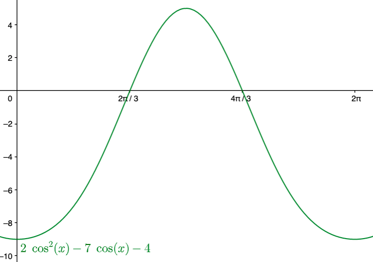
 

__80__) $\sec \theta = \tan \theta + \cot \theta$

__Sln__: Multiply through by $\cos\theta$, yielding $1 = \sin \theta + \displaystyle \frac{\cos^2 \theta}{\sin\theta} = \frac{\sin^2\theta + \cos^2\theta}{\sin\theta} = \frac1{\sin\theta}\implies$ $\sin\theta = 1 \implies \theta = \frac{\pi}2$; but $\sec(\pi/2)$ and $\tan(\pi/2)$ are both undefined, so $\boxed{\text{no real solution}}.$

__Chk__: 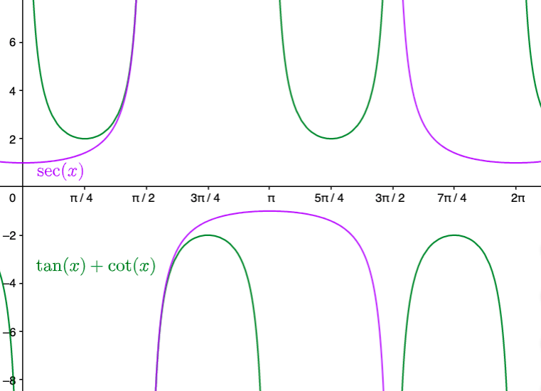

__Comments__: 

A) In this problem, the "check step" is absolutely <i>necessary</i> because the multiplication through by $\cos\theta$ possibly introduced spurious solutions everywhere that cosine is equal to zero (indeed, it did!) 

B) Our "check graph" suggests that $\sec\theta$ and $\tan\theta + \cot\theta$ are "asymptotically equal" as $\theta$ "approaches" $\pi/2$, and thus we might be tempted to say that they <i>are</i> equal there (and in a subject called "Complex Analysis," we do), but there are good reasons for refusing to call them equal here, where we’re limiting our consideration to real numbers.

 C) If you try to solve this graphically by looking for the zeros of the graph of $y=\tan x+ \cot x - \sec x$&mdash;typically a good strategy&mdash;the graph you obtain is:
 
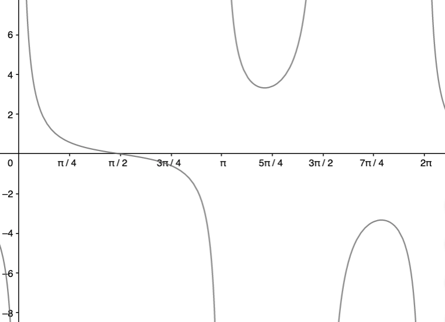 

Now, because of the "asymptotic equality" at $\pi/2$ discussed in Comment B, this graph makes it look like $\pi/2$ <i>is</i> a solution; thus, again, we find that the check step is absolutely necessary to recognize that the graph produced by the graphing calculator is suggesting a spurious solution (a correct graph of this function would put an open circle at the point $(\frac{\pi}2,0)$, but the graphing calculator isn’t "smart" enough to include that for us automatically): graphing calculators are powerful tools, but we have to know how to use them "safely."
  

In Problems __86__ & __92__, use a graphing utility to solve each equation; express the solution(s) rounded to two decimal places.

__86__) $\sin x - \cos x = x$

__Sln__: Below is one way to do it in GeoGebra:

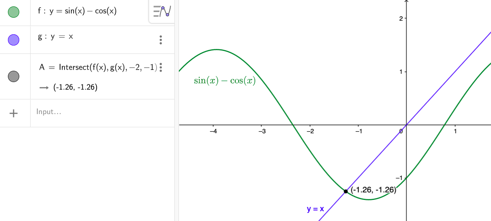

__Chk__: $\sin(-1.26) - \cos(-1.26) \doteq -1.26~\checkmark$
  

__92__) $4\cos(3x) - e^x = 1, x \gt 0$

__Sln__: Here is another way to do this in GeoGebra:

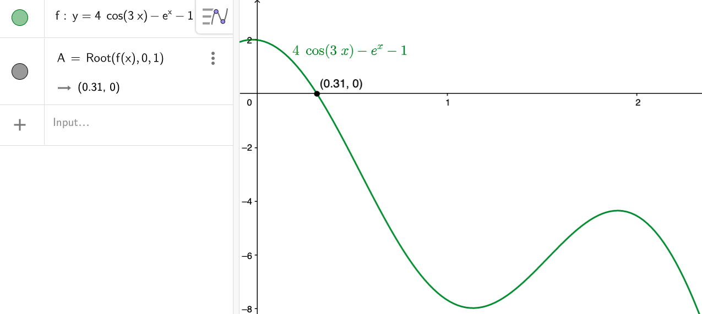

__Chk__: $4\cos(3(0.31)) - e^{0.31} \doteq 2.391 - 1.363 = 1.028~\checkmark~$ (Note: if this strikes the reader as a pretty poor fit, that’s because we’re performing the check with the rounded-to-two-decimal-places answer&mdash;if we generated the answer with more precision, and used that in the check, we’d get a better match in the check step.)
  

__102__) __a__) Graph $f(x) = 2\sin x$ and $g(x) = -2\sin x + 2$ on the
same Cartesian plane for the interval $[0,2\pi]$; __b__) Solve $f(x) = g(x)$ on the interval $[0,2\pi]$ and label the points of intersection on the graph drawn in part __a__; __c__) Solve $f(x) \gt g(x)$ on the interval $[0,2\pi]$; __d__) Shade the region bounded by $f(x) = 2\sin x$ and $g(x) = -2\sin x + 2$ between the two points found in part __b__ on the graph drawn in part __a__.

__Sln__: __a__) 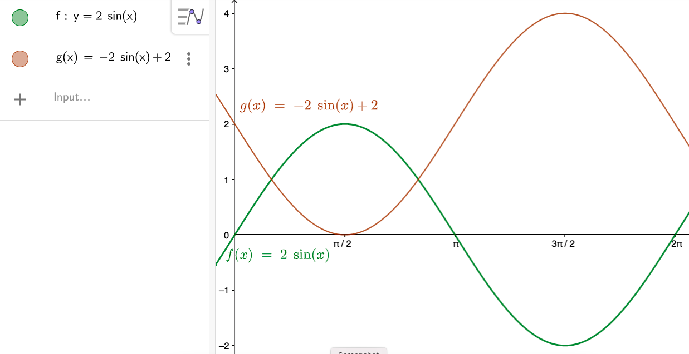

__b__) $2\sin x = -2\sin x + 2 \to 4\sin x = 2 \to \sin x = \displaystyle \frac12 \implies x = \boxed{\frac{\pi}6\text{ or }\frac{5\pi}6}$ (in $[0,2\pi]$)

__Chk__: $2\sin\frac{\pi}6 = 1, -2\sin\frac{\pi}6 + 2 = -1 + 2 = 1~\checkmark$ and the check for $\frac{5\pi}6$ is the same.

Here’s the modified graph:

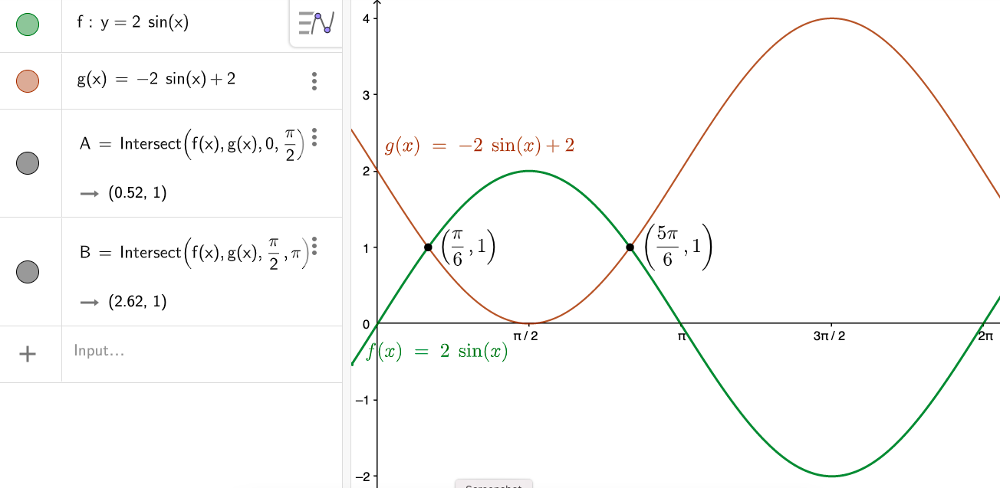

__c__) From the graph, we see that $f(x)$ is "above" $g(x)$, i.e., $f(x) > g(x)$, on the interval between&mdash;but not including&mdash;the points where the two graphs intersect; thus the solution to the inequality&mdash;the values of $x$ (not $y$) which make the inequality a true statement&mdash;is the (open) interval $$\boxed{\frac{\pi}6 \lt x \lt \frac{5\pi}6 \text{, or }\left(\frac{\pi}6, \frac{5\pi}6\right)}$$

__d__) Here’s one way to do this in GeoGebra:

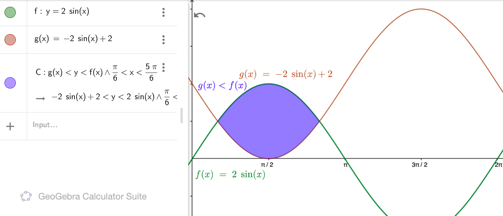
 

__104__) __The Ferris Wheel__ [A] Ferris Wheel...250 feet in diameter...makes 1 revolution every 40 seconds; the function: $$h(t) = 125\sin\left(0.157t - \frac{\pi}2\right) + 125$$
represents the height $h$, in feet, of a seat on the wheel as a function of time $t$, where $t$ is measured in seconds; the ride begins when $t=0.~$ 

__a__) During the first 40 seconds of the ride, at what time $t$ is an individual on the Ferris Wheel exactly 125 feet above the ground?

__Sln__: We set $125 = h(t) = 125\sin\left(0.157t - \frac{\pi}2\right) + 125$ and solve this equation for $t$: 

$125 \color{red}-125$ $= 125\sin\left(0.157t - \frac{\pi}2\right) + 125 \color{red}{-125}$ $\implies 125\sin\left(0.157t - \frac{\pi}2\right) = 0 \implies \sin\left(0.157t - \frac{\pi}2\right) = 0 \implies$ $0.157t - \frac{\pi}2 = k\pi, k \in \mathbb{Z} \implies \displaystyle t = \frac{k\pi}{0.157} + \frac{\pi}{2(0.157)}, k\in \mathbb{Z}.~$ $k \lt 0 $ gives negative values of $t$ (why?); $k = 0 \to t = 0 + \pi /(0.314) = 10.0$ sec. (to three significant figures); $k = 1 \to t = \pi /0.157 + \pi /0.314 = 30.0$ sec. (again, to three sig. figs.); and $k \ge 2 \to t \gt 40.~$  Thus the times within the first 40 sec. at which an individual is 125 ft. above the ground are $$\boxed{10.0 \text{ and }30.0\text{ sec.}}$$

__Chk__: $h(10.0) = 125\sin\left(0.157(10.0)-\frac{\pi}2\right) + 125 = 125$ (to three sig. figs.)

$h(30.0) = 125\sin\left(0.157(30.0)-\frac{\pi}2\right) + 125 = 125$ (ditto.)
 

__b__) During the first 80 seconds of the ride, at what time $t$ is an individual on the Ferris Wheel exactly 250 feet above the ground?

__Sln__: We must solve: $250 = 125\sin\left(0.157t - \frac{\pi}2\right) + 125 \implies 125 = 125\sin\left(0.157t - \frac{\pi}2\right) \implies \sin\left(0.157t - \frac{\pi}2\right) = 1 \implies$ $0.157t - \frac{\pi}2 = \frac{\pi}2 + 2k\pi \implies t = (1+2k)\pi / (0.157), k \in \mathbb{Z}.~$ Again $k \lt 0 \to t \lt 0$ (again, why?); $k = 0 \to t = \pi / (0.157) = 20.0$ sec.; $k = 1 \to t = 3\pi / (0.157) = 60.0$ sec.; and $k \ge 2 \to t \gt 80$, so within the first 80 seconds, the rider beginning the ride at $t=0$ is at 250 ft. at $$\boxed{t = 20.0\text{ and } 60.0\text{ sec.}}$$

__Chk__: $h(20.0) = 125\sin\left(0.157(20.0)-\frac{\pi}2\right) + 125 = 250~\checkmark$

$h(60.0) = 125\sin\left(0.157(60.0)-\frac{\pi}2\right) + 125 = 250~\checkmark$
 

__c__) During the first 40 seconds of the ride, over what interval of time $t$ is an individual on the Ferris Wheel more than 125 feet above the ground?

__Sln__: We want to solve the inequality $125\sin\left(0.157 t - \frac{\pi}2\right) + 125 \gt 125$ over the domain $0\le t \le 40.~$ From Part a) we know that the individual is <i>at</i> 125 ft. at 10.0 and 30.0 seconds, and from Part b) we know that at 20.0 sec., the individual is at 250 ft., which is more than 125 ft.&nbsp; Thinking about the graph of the sine curve and/or the "physics" of the situation (if the individual is at 125 ft. at 10 sec., then up at 250 ft. at 20 sec., then back down to 125 ft. at 30 sec., s/he must be going up from 125 ft. between 10 and 20 sec., and then going down from 250 to 125 ft.&mdash;but still above 125 ft.&mdash;between 20 and 30 sec.), we conclude that the required time interval is: $$\boxed{10.0 \lt t \lt 30.0\text{ sec.}}$$

__Chk__: The easiest way to confirm this answer is with a graph:

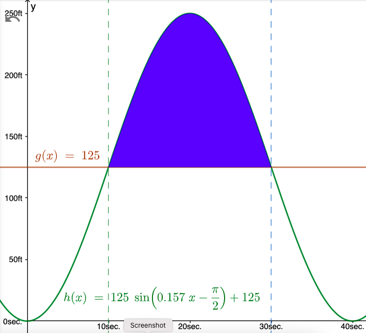
 

__108__) __Carrying a Ladder Around a Corner__ Two hallways, one of width 3 feet, the other of width 4 feet, meet at a right angle; see the illustration in the text.&nbsp; It can be shown that the length $L$ of
the ladder [depicted in the illustration] as a function of $\theta$ is: $$L(\theta) = 4\csc \theta + 3\sec \theta.$$

__a__) In calculus, you will be asked to find the length of the longest ladder that can turn the corner by solving the equation: $$3\sec \theta \tan \theta - 4\csc \theta \cot \theta = 0, 0° \lt \theta \lt 90°$$(which gives the $\theta$ that maximizes $L$, $\theta_{\max}$): find $\theta_{\max}$ by solving this equation for $\theta$.

__Sln__: First note that all the functions involved are well-defined and non-zero on the given interval (why, exactly?)&nbsp; Now multiply "through" by $\sin\theta\tan\theta$: $\color{red}(\sin\theta\tan\theta)$$[3\sec \theta \tan \theta - 4\csc \theta \cot \theta = 0] \implies 3\tan^3 \theta - 4 = 0$
(because 
 
 $(\sin\theta\tan\theta)(\sec \theta \tan \theta) = \displaystyle\frac{\sin\theta}{\cos\theta}\tan^2\theta = \tan^3\theta$, and $(\sin\theta\tan\theta)(\csc \theta \cot \theta) = \displaystyle\frac{\sin\theta}{\sin\theta}\frac{\tan\theta}{\tan\theta} = (1)(1) = 1$) 
 
 $\implies \tan^3\theta = \displaystyle\frac43 \implies \boxed{\theta_{\max} = \tan^{-1}\left(\sqrt[\large{3}]{\frac43}\right) \doteq 47.743°}$

__Chk__: $3\sec(47.743°)\tan(47.743°)-4\csc(47.743°)\cot(47.743°) \doteq 3(1.487)(1.101)-4(1.351)(0.909) \doteq 4.910 - 4.910 = 0~\checkmark$&nbsp;  (Checking the exact answer is possible&mdash;using identities for the $\sec, \csc,$ and $\cot$ of $\tan^{-1}(x)$&mdash;but is an algebraic nightmare we leave to the masochistic reader.)

__b__) What is the length of the longest ladder that can be carried around the corner?

__Sln__: The point of Part a) is that we can now answer this question simply by evaluating $L(\theta_{\max}) = 4\csc(\theta_{\max}) + 3\sec(\theta_{\max}) \doteq 4(1.351)+3(1.487) \doteq \boxed{9.866\text{ ft}}$ (the given answer differs from the indicated computation by 0.001 due to the use of greater precision in its calculation).

__Chk__: The "check" is provided by the graph we shall give in answer to Part c).

__c__) Graph $L=L(\theta), 0° \le \theta \le 90°$ and find the angle $\theta$ that minimizes the length $L$.

__Sln__: Here is the graph in GeoGebra:

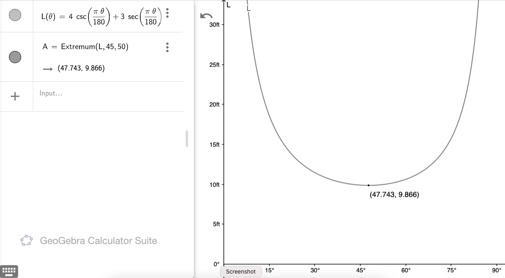

Note that, since GeoGebra assumes that the inputs to trig functions are in radians, in order to be able to provide the abscissa (i.e., the horizontal coordinate, in this case, $\theta$) in degrees, we need to multiply it by the conversion factor from degrees to radians, $\pi/180$, before the trigonometric function evaluations.&nbsp; To find the length function’s minimum point&mdash;the angle which minimizes the length, and that minimum length&mdash;we use GeoGebra’s Extremum function, which takes as arguments the function we want to minimize, and then lower and upper "bounds" on an estimate of what we suspect the minimal abscissa to be.&nbsp; (If you take Calculus, not only will you learn how to find the equation used to find the minimum, you may even learn why the Extremum function requires lower and upper bounds on the minimum in order to find it.)

__d__) Why are the answers to __b__ and __c__ the same?

__Sln__: $L$ is the length of a ladder that makes the indicated angle $\theta$ when the ladder touches the corner and both "outer" walls; but that doesn’t mean the ladder can necessarily make it around the corner!&nbsp; Indeed, any ladder longer than this "minimum-maximum" length <i>can’t</i> make it around the corner (unless the ladder can bend): the minimum of this length function is the <i>only</i> length that can touch the three indicated points (the "inside" corner and the two "outer" walls) and make it around the corner.&nbsp; But certainly any ladder <i>shorter</i> than this length, and making the indicated angle with the corner, can easily make it around the corner, because it will only touch, at most, two of those three "constraining" points.&nbsp; So this ladder is <i>both</i> the longest ladder that can make it around the corner, and the shortest ladder that simultaneously touches both the walls and the corner.
  

__118__) __Brewster’s Law__ If the angle of incidence and the angle of refraction are complementary angles, the angle of incidence is referred to as the Brewster angle $\theta_B$.&nbsp; The Brewster angle is related to the indices of refraction of the two media, $n_1$ and $n_2$, by the equation $$n_1\sin \theta_B = n_2\cos \theta_B,$$where $n_1$ is the index of refraction of the incident medium and $n_2$ is the index of refraction of the refractive medium.&nbsp; Determine the Brewster angle for a light beam traveling through water (at 20°C) that makes an angle of incidence with a smooth, flat slab of crown glass.

__Sln__: The incident medium is water, which, from the text, has an index of refraction of $1.33 = n_1$; the refractive medium is crown glass, which, also from the text, has an index of refraction of $1.52 = n_2$; thus we must solve $1.33\sin\theta_B = 1.52\cos\theta_B$ for $\theta_B.~$ We have: $\tan\theta_B = 1.52/1.33 \implies \displaystyle \theta_B = \tan^{-1}\frac{1.52}{1.33} \doteq \boxed{48.8°}$

__Chk__: $\displaystyle\frac{\sin(48.8°)}{\sin(90°-48.8°)} \doteq 1.14 \doteq \frac{1.52}{1.33}~\checkmark$
