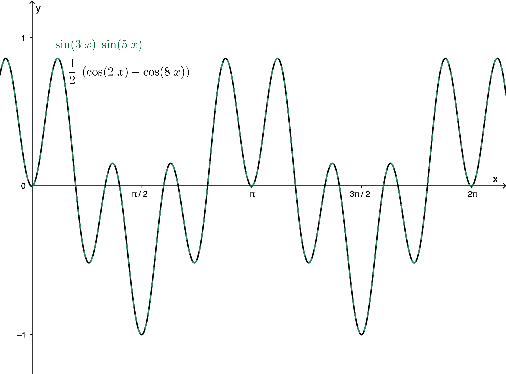
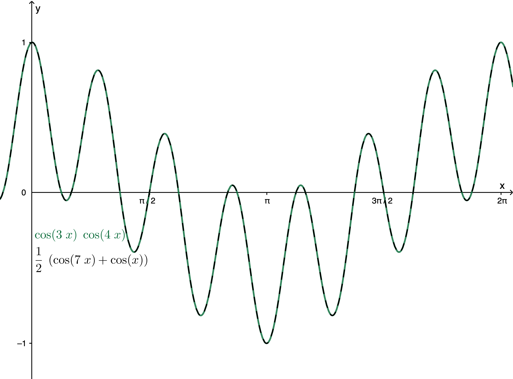
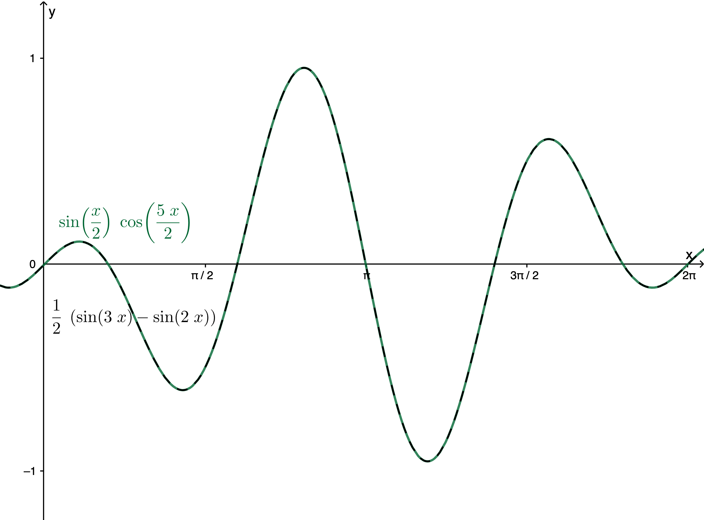
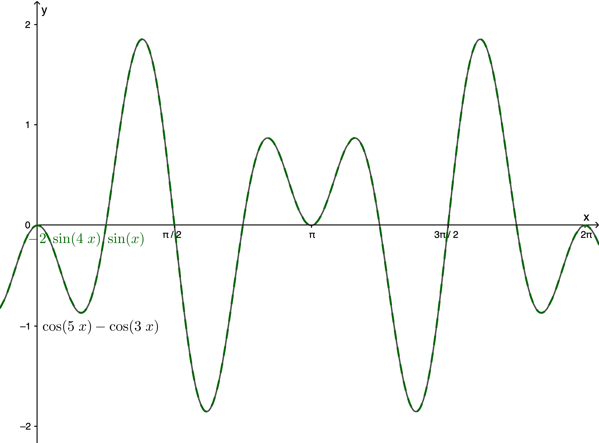
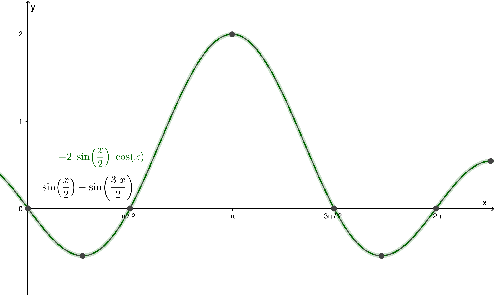
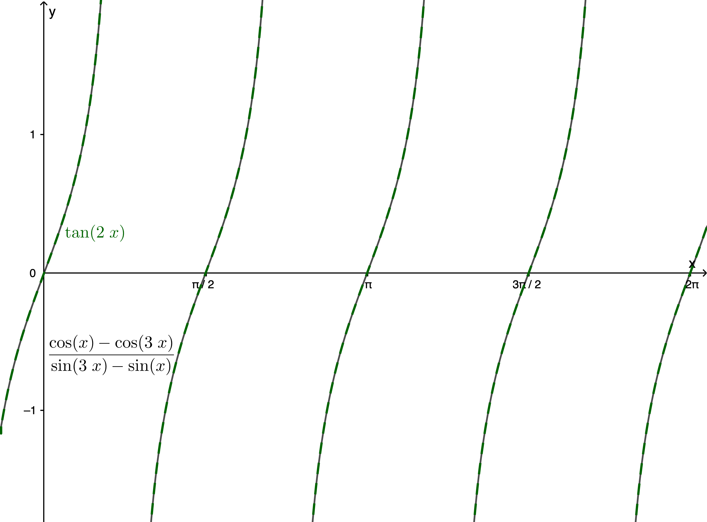
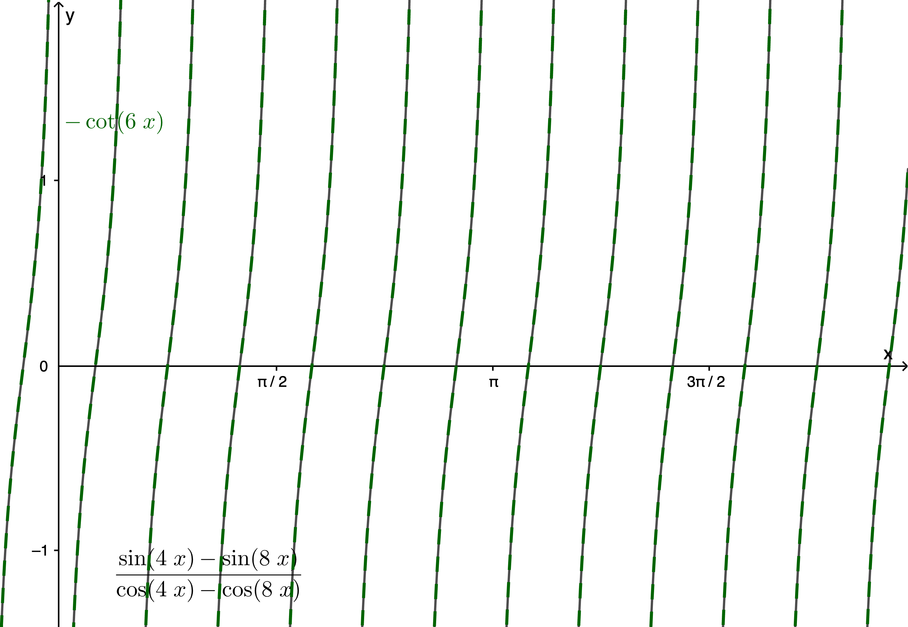
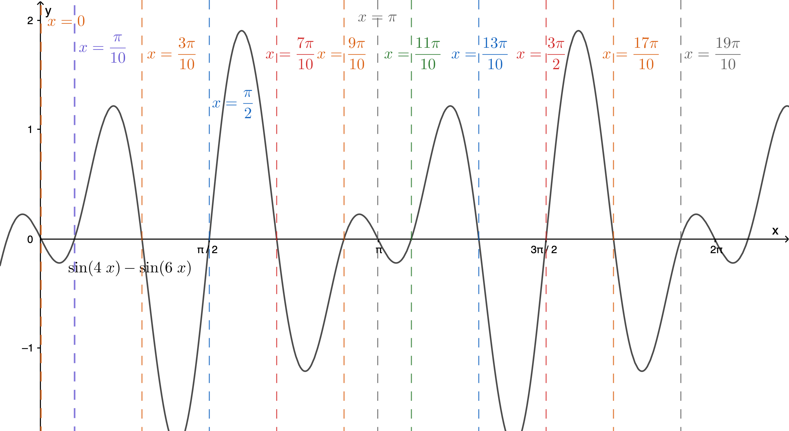

$\definecolor{red}{RGB}{255,0,0}
\definecolor{orange}{RGB}{245, 165, 0}
\definecolor{yellow}{RGB}{255,215,0}
\definecolor{green}{RGB}{0,255,0}
\definecolor{indigo}{RGB}{0,0,255}
\definecolor{violet}{RGB}{138,43,226}
\definecolor{black}{RGB}{0,0,0}$
$\require{cancel}$

#### 
Sullivan, M., 2012. <i>Algebra & Trigonometry, Ninth Edition.</i> Prentice Hall, Boston
#### 
 Selected Exercise Solutions from C8S7: Product-to-Sum and Sum-to-Product Formulas
#### 
to be included in the main Chapter write up
#### 
&copy; 20202 by David Lawrence Goldsmith

__10__, __14__, __16__) Express each product as a sum containing only sines or only cosines.

__10__) $\sin(3\theta)\sin(5\theta)$

__Sln__: Using $(\sin a)(\sin b) = \frac12\left[\cos(a-b) - \cos(a+b)\right]$ we have:

 $\sin(3\theta)\sin(5\theta) = \frac12\left[\cos(3\theta-5\theta) - \cos(3\theta+5\theta)\right] = \frac12\left[\cos(-2\theta) - \cos(8\theta)\right] = \boxed{\frac12\left[\cos(2\theta) - \cos(8\theta)\right]}$

__Chk__: We can check these by graphing both the starting expression and the ending expression to confirm that the graphs are coincident:

 

__14__) $\cos(3\theta)\cos(4\theta)$

__Sln__: $(\cos a)(\cos b) = \frac12[\cos(a+b) + \cos(a-b)]$ so $\cos(3\theta)\cos(4\theta) = \cos(3\theta+4\theta) + \cos(3\theta-4\theta) = \frac12[\cos(7\theta) + \cos(-\theta)] = \boxed{\frac12[\cos(7\theta) + \cos(\theta)]}$

__Chk__: 
 

__16__) $\displaystyle \sin\frac{\theta}2 \cos\frac{5\theta}2$

__Sln__: $(\sin a)(\cos b) = \frac12[\sin(a+b) + \sin(a-b)]$ so 

$\displaystyle \sin\frac{\theta}2 \cos\frac{5\theta}2 = \frac12\left[\sin\left(\frac{\theta}2 + \frac{5\theta}2\right) + \sin\left(\frac{\theta}2 - \frac{5\theta}2\right)\right] = \frac12[\sin(3\theta) + \sin(-2\theta)] = \boxed{\frac12[\sin(3\theta) - \sin(2\theta)]}$

__Chk__: 
 

__20__, __24__) Express each sum or difference as a product of sines and/or cosines.

__20__) $\cos(5\theta) - \cos(3\theta)$

__Sln__: $\displaystyle \cos a - \cos b = -2\sin\left(\frac{a+b}2\right)\sin\left(\frac{a-b}2\right)$ so

$\displaystyle \cos(5\theta) - \cos(3\theta) = -2\sin\left(\frac{5\theta + 3\theta}2\right)\sin\left(\frac{5\theta - 3\theta}2\right) = \boxed{-2\sin(4\theta)\sin(\theta)}$

__Chk__: 
 

__24__) $\displaystyle \sin\frac{\theta}2 - \sin\frac{3\theta}2$

__Sln__: $\displaystyle \sin a - \sin b = 2\sin\left(\frac{a-b}2\right)\cos\left(\frac{a+b}2\right)$ so

$\displaystyle \sin\frac{\theta}2 - \sin\frac{3\theta}2 = 2\sin\left[\frac12\left(\frac{\theta}2 -\frac{3\theta}2\right)\right]\cos\left[\frac12\left(\frac{\theta}2 +\frac{3\theta}2\right)\right] = 2\sin\left(-\frac{\theta}2\right)\cos\theta = \boxed{-2\sin\left(\frac{\theta}2\right)\cos\theta}$

__Chk__: 
 

__28__, __34__, __40__) Establish the given identity

__28__) $\displaystyle \frac{\cos\theta - \cos(3\theta)}{\sin(3\theta) - \sin\theta} = \tan(2\theta)$

__Sln__: $\displaystyle \cos\theta - \cos(3\theta) = -2\sin\left(\frac{\theta + 3\theta}2\right)\sin\left(\frac{\theta - 3\theta}2\right) = -2\sin(2\theta)\sin(-\theta) = 2\sin(2\theta)\sin \theta$

$\displaystyle \sin(3\theta) - \sin\theta = 2\sin\left(\frac{3\theta-\theta}2\right)\cos\left(\frac{3\theta+\theta}2\right) = 2\sin\theta\cos(2\theta)$ so 

$\displaystyle \frac{\cos\theta - \cos(3\theta)}{\sin(3\theta) - \sin\theta} = \frac{\cancel{2}\sin(2\theta)\cancel{\sin\theta}}{\cancel{2}\cancel{\sin\theta}\cos(2\theta)} = \tan(2\theta)~\checkmark$ 

(except for $\theta = k\pi, k \in \mathbb{Z}$, where $\tan(2\theta) = 0$, but the given expression is undefined; despite this, the graph below makes it look like they are equal there, because <i>everywhere else</i>, i.e., including <i>arbitrarily close</i> to integer multiples of $\pi$, they are equal, and thus those multiples $\pi$ are the only places where they are unequal, and then only because of the "technicality" of the denominator of the original expression being undefined at those $\theta$).

__Chk__: 
 

__34__) $\displaystyle \frac{\sin(4\theta) - \sin(8\theta)}{\cos(4\theta) - \cos(8\theta)} = -\cot(6\theta)$

__Sln__: $\displaystyle \sin(4\theta) - \sin(8\theta) = 2\sin\left(\frac{4\theta - 8\theta}2\right)\cos\left(\frac{4\theta + 8\theta}2\right) = 2\sin(-2\theta)\cos(6\theta) = -2\sin(2\theta)\cos(6\theta)$

$\cos(4\theta) - \cos(8\theta) = -2\sin(6\theta)\sin(-2\theta) = 2\sin(6\theta)\sin(2\theta)$ 

so, except for at $\displaystyle \frac{k\pi}6, k \in \mathbb{Z}$, where both $\cot(6\theta)$ and the original expression are undefined*

$\displaystyle \frac{\sin(4\theta) - \sin(8\theta)}{\cos(4\theta) - \cos(8\theta)} = \frac{-\cancel{2}\cancel{\sin(2\theta)}\cos(6\theta)}{\cancel{2}\sin(6\theta)\cancel{\sin(2\theta)}} = -\cot(6\theta)~\checkmark$

\* It is far from obvious that the general solution of $\cos(4\theta) - \cos(8\theta) = 0$ is $\displaystyle \frac{k\pi}6, k \in \mathbb{Z}$, and this fact certainly isn’t discoverable simply by recasting the equation as $\cos(4\theta) = \cos(8\theta)$ and then discarding the cosines, even if we account for the periodicity of cosine and write $8\theta = 4\theta + 2k\pi, k \in \mathbb{Z} \implies 4\theta = 2k\pi \implies \theta = k\pi/2$ (which is part of the solution set, but not all of it).&nbsp; If one graphs $y = \cos(4\theta) - \cos(8\theta)$, however, it is pretty clear that $\theta = k\pi/2, k \in \mathbb{Z}$ isn’t "hitting" all the zeros.&nbsp; One does obtain the full solution set, however, by solving the equivalent-by-identity equation $2\sin(6\theta)\sin(2\theta) = 0 \to \sin(6\theta) = 0$ or $\sin(2\theta) = 0$: $\sin(2\theta) = 0 \implies 2\theta = k\pi, k \in \mathbb{Z} \to \theta = \displaystyle \frac{k\pi}2$, while $\sin(6\theta) = 0 \implies 6\theta = k\pi, k \in \mathbb{Z} \to \theta = \displaystyle \frac{k\pi}6$, which includes the values $k\pi/2$ for $k$ a multiple of 3; in other words, $\theta = \displaystyle \frac{k\pi}6$ "covers" the entire solution set (there is no need to further specify the values $k\pi/2$).&nbsp; Thus this is an example of a situation where it is beneficial to graph the expression before jumping to conclusions regarding the solution set; and that once we see that the situation is more complicated than might be immediately apparent, we can try recasting the original expression using identities to see if they shed some light on the situation.&nbsp; In any event, the "check graph" below confirms that the identity being invalid at multiples of $\pi/6$, due to both sides of the identity being "undefined" there, is a "technicality": they are equal everywhere else, including arbitrarily close to those "bad" values, and thus we can "get away with" saying that it valid everywhere.

__Chk__: 
 

__40__) $\displaystyle \frac{\sin(\alpha) - \sin(\beta)}{\cos(\alpha) - \cos(\beta)} = -\cot\frac{\alpha + \beta}2$

__Sln__: This is "just" a generalization of __34__) (with the same technicality caveat about where the identity is "not true" because the left and right sides are, strictly speaking, undefined).&nbsp; We have:

$\displaystyle \sin(\alpha) - \sin(\beta) = 2\sin\left(\frac{\alpha - \beta}2\right)\cos\left(\frac{\alpha + \beta}2\right)$, $\displaystyle \cos(\alpha) - \cos(\beta) = -2\sin\left(\frac{\alpha + \beta}2\right)\sin\left(\frac{\alpha - \beta}2\right)$, so

$\displaystyle \frac{\sin(\alpha) - \sin(\beta)}{\cos(\alpha) - \cos(\beta)} = \frac{\cancel{2}\cancel{\sin\left(\frac{\alpha - \beta}2\right)}\cos\left(\frac{\alpha + \beta}2\right)}{-\cancel{2}\sin\left(\frac{\alpha + \beta}2\right)\cancel{\sin\left(\frac{\alpha - \beta}2\right)}} = -\cot\left(\frac{\alpha + \beta}2\right)~\checkmark$

__Chk__: I used GeoGebra’s 3-D graphing calculator&mdash;because $\displaystyle \frac{\sin(\alpha) - \sin(\beta)}{\cos(\alpha) - \cos(\beta)} \text{ and } -\cot\frac{\alpha + \beta}2$ are functions of two variables, and the graph of such a function is a surface in three dimensions&mdash;to perform the same kind of graphical check of this identity as we’ve done with the others, but it didn’t look as "nice," so "check is left to the reader."
  

__46__) Solve $\sin(4\theta) - \sin(6\theta) = 0$ on $0 \le \theta \lt 2\pi$.

__Sln__: Exercise __34__) taught us that if we try to solve this kind of equation by rearranging it to $\sin(4\theta) = \sin(6\theta)$ and inferring that we must then have $6\theta = 4\theta + 2k\pi, k \in \mathbb{Z}$, we are liable to miss solutions.&nbsp; Instead, we rewrite $\sin(4\theta) - \sin(6\theta) = 0$ as $\displaystyle 2\sin\left(\frac{4\theta - 6\theta}2\right)\cos\left(\frac{4\theta + 6\theta}2\right) = 2\sin(-\theta)\cos(5\theta) = -2\sin(\theta)\cos(5\theta) = 0 \implies \sin(\theta) = 0\text{ or }\cos(5\theta) = 0.~$ $\sin(\theta) = 0 \to \theta = k\pi, k \in \mathbb{Z}$; $\cos(5\theta) = 0 \to 5\theta = (2k+1)\pi/2, k \in \mathbb{Z} \to \theta = (2k+1)\pi/10.~$ In this case, the solutions given by $k\pi$ would only be covered by $\theta = (2k+1)\pi/10$ if $(2k+1)/10$ could be an integer, which it can’t (why?), so we need both formulas to generate the complete solution set.&nbsp; Over $0 \le \theta \lt 2\pi$, this is $$\boxed{\left\{0, \frac{\pi}{10}, \frac{3\pi}{10}, \frac{\pi}2, \frac{7\pi}{10}, \frac{9\pi}{10}, \pi, \frac{11\pi}{10}, \frac{13\pi}{10}, \frac{3\pi}3, \frac{17\pi}{10}, \frac{19\pi}{10}\right\}}$$

__Chk__: 
 

__50__) Given: the range $R$ of a projectile propelled downward from the top of an inclined plane with initial speed $v_0$ and angle relative to the inclined plane $\theta$ is given by:
$$R(\theta) = \frac{2v_0^2 \sin\theta\cos(\theta-\phi)}{g\cos^2\phi}$$where $\phi$ is the angle
the plane makes with respect to the horizontal, and $g$ is the acceleration due to gravity. 

__a__) Show that, for fixed $v_0$ and $\phi$, the maximum range down the incline is given by: $$R_{\max} = \frac{v_0^2}{g(1-\sin\phi)}$$

__Sln__: The problem isn’t explicit about this, but we need to make two assumptions for the maximum to be a unique maximum: a) the sign of $g$&mdash;the acceleration due to gravity&mdash;is taken to be positive; b) both $\theta$ and $\phi$ are in the interval $[0,\pi/2)$ (this is actually more "permissive" than necessary, but is basically saying that both angles are acute, which is physically consistent with the situation described).&nbsp; The first assumption is necessary to ensure that $\displaystyle \frac{2v_0^2}{g\cos^2\phi} \ge 0$ (otherwise, the "extremum" would be negative, and thus a "minimum"); we don’t need the second assumption quite yet.&nbsp; Now "expand" $\sin\theta\cos(\theta-\phi)$ using the product-to-sum identity: 

$\sin\theta\cos(\theta-\phi) = \frac12\left[\sin(\theta + \theta - \phi) + \sin(\theta - \theta + \phi) \right] = \frac12\left[\sin(2\theta - \phi) + \sin(\phi) \right].~$ Since $\phi$ is "fixed," i.e., constant, $\sin\phi$ is also constant, so the maximum value of the expression $\frac12\left[\sin(2\theta - \phi) + \sin(\phi) \right]$ occurs where $\sin(2\theta-\phi)$ has its maximum (make sure you understand why), which is for $2\theta-\phi = \frac{\pi}2$ (why? hint: in part, because of assumption b) $\implies \theta = \frac{\phi}2 + \frac{\pi}4.~$ This gives the value of $\theta$ for which $R$ is maximal; to find that actual maximal value of $R$, we substitute $\frac{\phi}2 + \frac{\pi}4$ in for $\theta$ in the (expanded) formula for $R(\theta)$:

$\displaystyle R\left(\frac{\phi}2 + \frac{\pi}4\right)  = \frac{\cancel{2}v_0^2}{g\cos^2\phi}\frac1{\cancel{2}}\left\{\sin\left[2\left(\frac{\phi}2 + \frac{\pi}4\right)-\phi\right] + \sin\phi\right\} = \frac{v_0^2}{g\cos^2\phi}\left[\sin\left(\cancel{\phi} + \frac{\pi}2 - \cancel{\phi}\right) + \sin\phi\right] =$

$\displaystyle \frac{v_0^2(1 + \sin\phi)}{g(1-\sin^2\phi)} = \boxed{\frac{v_0^2}{g(1-\sin\phi)}}$ (where we relied in the last cancellation on the assumption that $\phi \lt \frac{\pi}2$). 

(I must confess: this one stumped me for a while, because this class of problem&mdash;an "optimization" problem, i.e., one in which we are asked to find a maximum or a minimum value of a function&mdash;is frequently not addressed till Calculus (except for parabolas, of course), in which the student learns a general method for approaching such problems, and I had a hard time seeing how to establish this without that material.&nbsp; I eventually concluded that there must be some content in the text explaining how to go about this without Calculus; I didn’t find such in this Section, but did in the previous one&mdash;moral: when in doubt, read the text!)

__b__) Determine $R_{\max}$ for $v_0 = 50$ m/s, $\phi = 35$&deg;, and $g = 9.8\text{ m/s}^2$.

__Sln__: Left to the reader.
 
