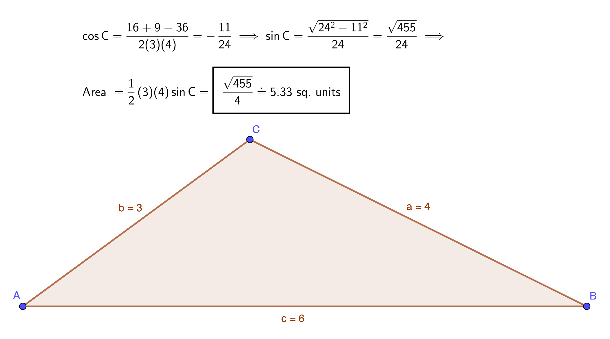

$\require{cancel}$

## 
 Selected Exercise Solutions

from

### 
Sullivan, M., 2012. <i>Algebra & Trigonometry, Ninth Edition.</i> Prentice Hall, Boston
### 
Chapter 9: Applications of Trigonometric Functions 
### 
&copy; 2020, 2025 by
### 
David Lawrence Goldsmith

for

## 
[SelectedSolutionsDotNet](https://olydlg.github.io/selectedsolutionsdotnet/)

<i>Note:  These solutions are provided "as-is," for informational purposes only, with no warranty of any kind, expressed or implied, including that of correctness, adequacy, and/or suitability for any purpose, whatsoever.</i> Corrections are welcome and should be emailed to selectedsolutionsdotnet@gmail.com.

### _Section 1: Applications Involving Right Triangles_

__28__) What should be the angle of depression of a camera mounted 9’ (feet) above the floor so as to be focused at a point 12’ away and 6’ above the floor?

__Sln__:  
 

__31__) An airplane leaves an airport bearing N40&deg;E for half a mile, then turns 90&deg; towards the SE; after one mile, what bearing should the control tower use to locate the aircraft?

__Sln__:  
 

__34__) A surveyor sights the top of the Willis Tower as 2593’ away at an elevation angle of 34&deg;, and the top of the Tower’s antenna as 2743’ away. Give: __a__) her (horizontal) distance from the Tower; __b__) the height of the Tower; __c__) the elevation angle from the surveyor to the top of the antenna; and __d__) the length of the antenna.

__Sln__:  
 

__40__) At an altitude of $h$ mi., a satellite orbiting the Earth (radius 3960 mi.) can monitor $d$ mi. (along the Earth’s circumference) in any direction from its position. Give: __a__) a formula relating $h$ to the (plane) central angle $\theta$ (in radians) subtended by any two most distant observable points (see figure); __b__) a formula relating $d$ and $\theta$; __c__) a formula relating $d$ and $h$; __d__) How high must the orbit be for $d=2500$ mi.? __e__) How far can it see if the altitude is 300 mi.?

__Sln__: We shall do the general case:

Since the satellite can see an equal distance in any direction (it is reasonable to assume), segment $OC$ bisects the central angle $\theta$ (as shown); from a theorem of geometry, we know that segment $OA$ is perpendicular to segment $AC$, and thus triangle $OAC$ is "right" with hypotenuse $OC=r+h$; and "leg" $OA=r$ is the side "adjacent" to an angle of measure $\frac{\theta}2$ (as shown). Thus we have $\cos\left(\frac{\theta}2\right) = \frac{r}{r+h} \implies \sec\left(\frac{\theta}2\right) = 1 + \frac{h}r \implies $ 

__a__) $\boxed{h=r\left[\sec\left(\frac{\theta}2\right) - 1\right]=r\sec\left(\frac{\theta}2\right) - r}$ mi.

__b__) $2d$ is to the circumference of the circle, $2\pi r$, as $\theta$ is to the number of radians in the whole circle, $2\pi$, i.e.,$\displaystyle \frac{2d}{2\pi r} = \frac{\theta}{2\pi} \implies \boxed{d=\frac{r\theta}2}$ mi.

__c__) Part __b__ $\implies \frac{\theta}2 = \frac{d}r \implies \boxed{h=r\sec\left(\frac{d}r\right)-r}$ mi.

__d__) Therefore, with $r=3960, d=2500, h = 3960(\sec(2500/3960)-1) \doteq \boxed{946\text{ mi.}}$;

__e__) and if $h=300, \cos\left(\frac{\theta}2\right) = \frac{3960}{3960+300} = \frac{3960}{4260} \implies \frac{\theta}2 = \cos^{-1}\left(\frac{66}{71}\right) \doteq 0.378\text{ rad.} \implies \boxed{d \doteq (0.378)(3960) \doteq 1495\text{ mi.}}$
  

### _Section 2: Law of Sines_

__10, 20, 30__) Solve the indicated triangles (unboxed data given).

__10 Sln__: 
 

__20__) $A=70°$, $B=60°$, $c=4$.

__Sln__: 
 

__30__) $b = 2, c = 3, B = 40°$

__Sln__: $\sin C = \displaystyle \frac{\sin B}b c \implies C = \sin^{-1}\left[\frac{\sin 40°}2 (3)\right] \doteq 74.619°$ OR $=180 - \sin^{-1}\displaystyle \left[\frac{\sin 40°}2 (3)\right] \doteq 105.381°$; since both of these are less than $180°-40°=140°$, both are viable angles in a triangle satisfying the given information, so the given information is consistent with __two different triangles__: one whose angles measure $40°, \boxed{74.619°}$, and $140°-74.619°=\boxed{65.381°}$:

and one whose angles measure $40°, \boxed{105.381°}$, and $140°-105.381°=\boxed{34.619°}$:

 

__40__) A surveyor measures a 25° angle of elevation to the top of a mountain, and then moves 1000 feet farther away and measures an elevation angle of 15°: how high is the mountain?

__Sln__: 
 

__50__) A navigator at sea spies two lighthouses known to be 3 mi. away from one another; the angle from the ship to one of the lighthouses is 15°, that to the other is 35°. Calculate the ship’s distances from the lighthouses and to a point on the shore perpendicular to the line between the lighthouses, i.e., its shortest distance from the shore.

__Sln__: Call the ship’s position point $R$ and the point on the shore closest to the ship $S$. Referring to the figure, since angle $\angle RSP$ is "right," we know that angle $\angle RPS = 90°-15°=75°$ and, similarly, that angle $\angle RQS = 90°-35° = 55°$; the Law of Sines thus yields $\displaystyle \frac{|RP|}{\sin 55°} = \frac{3}{\sin 50°} \implies |RP|= \frac3{\sin 50°}\sin 55° \doteq \boxed{ 3.21\text{ mi.}}$ and $\displaystyle |RQ| = \frac3{\sin 50°}\sin 75° \doteq \boxed{3.78\text{ mi.}}~$ Finally, the distance to shore, $|RS| = \frac{|RQ|}{\sin 90°}\sin 55° \doteq \boxed{3.1\text{ mi.}}$

 

__60__) Show that, for any triangle, $$a=b\cos C + c\cos B$$

__Pf__: $\displaystyle \frac{a}{\sin A} = \frac{b}{\sin B} \implies a = \frac{b}{\sin B}\sin A = \frac{b}{\sin B}\sin(180-(B+C))=\frac{b}{\sin B}\sin(B+C) = $ $\displaystyle \frac{b}{\sin B}(\sin B \cos C + \sin C \cos B) = b\cos C+\frac{b}{\sin B} \sin C \cos B$; using $\displaystyle \frac{c}{\sin C} = \frac{b}{\sin B}$ to substitute $c$ in for $\displaystyle \frac{b}{\sin B} \sin C$ gives us the required result.$~~~\blacksquare$
  

### _Section 3: Law of Cosines_

__16__) Solve the triangle $a=c=4, b=3$

__Sln__: The triangle is isosceles so we already know angle $A = $ angle $C$; the Law of Cosines for $a$ gives $16=16+9-2(4)(3)\cos A \implies A = C = \cos^{-1}(\frac38) \doteq \boxed{67.98°}$, and thus $B = 180°-2\cos^{-1}(\frac38) \doteq \boxed{44.05°}$ (the 0.01° error is due to rounding of the first result).

  

__32__) Solve the triangle $a = 9, b = 7, c = 10$

__Sln__: $100=81+49-126\cos C \implies \boxed{C = \cos^{-1} \displaystyle \left(\frac5{21}\right) \doteq 76.23°}$

$81=100+49-140\cos A \implies \boxed{A = \cos^{-1}\displaystyle \left(\frac{17}{35}\right) \doteq 60.94°}$

$49=100+81-180\cos B \implies \boxed{B = \cos^{-1}\displaystyle \left(\frac{11}{15}\right) \doteq 42.83°}$

Check: $76.23°+60.94°+42.83° = 180.00°~\checkmark$
  

__42__) Solve the triangle $a = 10, b = 10, c = 15$

__Sln__: We note immediately that $A=B$ and proceed with:

$100=100+225-300\cos A \implies \boxed{A=B=\cos^{-1}\displaystyle \left(\frac34\right) \doteq 41.41°}$ 

$225= 200-200\cos C \implies \boxed{C = \cos^{-1}\displaystyle \left(-\frac18\right) \doteq 97.18°}$

Check: $97.18°+2(41.41)° = 180.00°~\checkmark$
  

__48__) A "regulation" Little League Baseball diamond is a square 60’ on a side, with the Pitching Rubber (PR) 46’ from Home Plate (HP) on a line from HP to Second Base (SB) (see figure).

__a__) How far is the PR from First Base (FB)?

__Sln__: The triangle formed by HP, FB, and SB is "isosceles right," so the angle opposite the segment from PR to FB, $|PR-FB|$ in the figure, is 45°; consequently $|PR-FB|^2 = 60^2+46^2-2(60)(46)\cos 45° \implies |PR-FB| = \sqrt{5716-2760\sqrt2} \doteq \boxed{42.58’}$ 

__b__) How far is it from the PR to SB?

__Sln__: The distance from HP to SB is the hypotenuse of an isosceles right triangle whose leg length is 60’, so the Pythagorean Theorem readily gives that distance as $60\sqrt2’$; consequently, the distance from PR to SB is $(60\sqrt2 - 46)’ \doteq \boxed{38.85’}$.

__c__) From facing HP, through what angle does a pitcher on the PR need to turn to face FB?

__Sln__: The angle we seek, $\theta$, is opposite the 60’ side of a triangle whose other two side lengths are 46’ and the distance computed in part a). The Law of Cosines for $\theta$ is thus $60^2=46^2+5716-2760\sqrt2-2(46)\sqrt{5716-2760\sqrt2}\cos \theta \implies$ $\displaystyle \theta = \cos^{-1}\left(\frac{4232-2760\sqrt2}{92\sqrt{5716-2760\sqrt2}}\right) \doteq \cos^{-1} 0.0839331812 \doteq \boxed{85.19°}$ 
  

__58__) Show that for any triangle

$$\frac{\cos A}a + \frac{\cos B}b + \frac{\cos C}c =\frac{a^2 + b^2 + c^2}{2abc}$$

__Pf__: We may assume that none of the $a,b,c = 0$ (why?), so multiplying through by $2abc$ we see that the claim is equivalent to: $a^2 + b^2 + c^2 = 2bc\cos A + 2ac\cos B + 2ab\cos C$; but by the LoC, this right-hand-side is equal to: $b^2+c^2-\cancel{a^2}+\cancel{a^2}+\cancel{c^2}-\cancel{b^2}+a^2+\cancel{b^2}-\cancel{c^2}.~~~\blacksquare$
  

### _Section 4: Area of a Triangle_

__10__) Find the area of the given (pictured) triangle.

__Sln__: 
 

__16__) Find the area of a triangle with sides $a=6, b=4$ and angle  $C=60°$.

__Sln__: By convention, the angle labeled $C$ is between the sides labeled $a,b$ so we can jump straight to the formula: $\text{Area }= \frac12(6)(4)\sin 60° = 12\frac{\sqrt3}{2} =\boxed{6\sqrt3 \doteq 10.39\text{ sq. units}}$
  

__24__) Find the area of a triangle with sides $a = 4, b = 3, c = 6$.

__Sln__: 
 

__34__) Find the area of a circular segment of radius 5 in. and central angle 40°.

__Sln__: We shall do the general case: in general, the area of a segment of a circle, of radius $r$, subtended by central angle $\theta$, is the area of the subtended sector minus the area of the subtended triangle (see figure).

Now, the area of the sector, $A_{sec}$, is to the total area of the circle, $\pi r^2$, as the central angle is to the angle measure of one whole circle, i.e., $2\pi$ (measured in radians) or 360 (measured in degrees), i.e., $$\frac{A_{sec}}{\pi r^2} = \frac{\theta\text{ radians}}{2\pi \text{ radians}} = \frac{\theta \text{ degrees}}{360 \text{ degrees}}$$

(Note that the right hand side is a dimensionless fraction, but only if the units of the numerator and denominator are consistent; thus, numerically, one must use 360 if one leaves the angle measure in degrees, but "mature" mathematical practice is to use radians, resulting in the "$\pi$-free" formula given in the figure.) This gives (for $\theta$ in radians): $$A_{sec} = \frac{\theta}{2\pi}\pi r^2 = \frac{\theta r^2}2$$

By the main result of this Section, the area of the subtended triangle is $\frac12r^2\sin \theta$, and thus the general formula for the area of a segment of a circle of radius $r$ and central angle $\theta$ ($\theta$ between 0 and $\pi$, and measured in radians) is:

$$A_{seg} = \frac12r^2(\theta - \sin \theta)$$

So, using the formula, the answer for the stated data is $\displaystyle \frac{25}{2} (40\frac{\pi}{180}-\sin 40°) \doteq \boxed{0.692\text{ sq. in.}}$
  

__38__) Find the area of the shaded region (see figure).

__Sln__: This one is easier than it appears, if you remember your geometry: because angle $A$ subtends a diameter, it is "right" and thus the triangle is a right triangle, where the diameter is the hypotenuse, so the unlabeled side must have length $\sqrt{10^2-8^2} = \sqrt{36} = 6$ (bonus points if you recognized that this is just a "3-4-5" triangle scaled by a factor of 2), and the area of the triangle is thus simply $\frac12(8)(6) = 24$; also because the line segment subtended by $A$ is a diameter, the area of the sector of the circle is simply half the area of the whole circle, i.e., $\frac{\pi r^2}2 = 12.5\pi$. Thus the area of the shaded region is: $$\boxed{12.5\pi - 24 \doteq 15.27\text{ sq. in}}$$
 

__44__) Referring to the figure, calculate: __a__) $\text{Area }\triangle OBC$; and __b__) $\text{Area } \triangle OBD$; both in terms of $\theta$, and then __c__) use these results and the fact that $\text{Area }\triangle OBC \lt \text{Area }\overset{\frown}{OBC} \lt \text{Area } \triangle OBD$, where $\overset{\frown}{OBC}$ is the circular sector $OBC$ and its area is given to be $\frac{\theta}2, \theta$ (must be) in radians, to show that: $$1 \lt \frac{\theta}{\sin \theta} \lt \frac1{\cos \theta}.$$

__Sln__: The solutions to __a__) and __b__) are in the figure:

For __c__) we thus have: $$\frac{\sin \theta}2 \lt \frac{\theta}2 \lt \frac{\sin \theta}{2\cos \theta}$$ and multiplying through by $\displaystyle\frac2{\sin \theta}$ (which is well-defined and positive, since $\theta$ is assumed to be "acute") gives us the desired result.$~~~\blacksquare$

Comment: this result is important in Calculus.
  

__46__) Calculate the area accessible to a 100’ rope tied to one corner of a 20’-by-10’ barn.

__Sln__: The rope can access three-quarters of a circle of radius 100’, i.e., $0.75\pi (100’)^2 \doteq 23,562$ sq. ft., before the walls of the barn begin to limit what it can access, and this "area of limited access," $A’$, is the challenging part to calculate, so we have focused on that in the figure below:

 
$A’$ consists of two circular sectors, one a portion of a circle of radius $100-20=80’$ (rendered blue in the figure), the other a portion of a circle of radius $100-10=90’$ (green); and two obtuse triangles, pictured pink and orange in the figure. To calculate the areas of the sectors, we need to calculate their subtending angles ($\theta~\&~\phi$ in the figure); fortunately, that information will be sufficient to calculate the triangle areas as well, since each of these triangles includes two known sides, and each such pair of sides, in turn, includes angles of $\frac{\pi}2-\theta~\&~\frac{\pi}2-\phi$, respectively.

To calculate the subtending angles, we need to figure out where the two restricted circles intersect; to do this, note that, as set up in the figure with the rope anchored at the origin, the equation of the "blue" circle is $(x-20)^2+y^2=80^2$ and that for the "green" circle is $x^2+(y-10)^2=90^2$. These are two simultaneous quadratics in two variables, so we are going to be "clever" to solve them: first, we are going to scale everything down by a factor of 10 (basically to reduce the number of zeros we have to carry around; when we get the final answer, we will need to remember to multiply it by 10). Doing this, multiplying out, and doing a little rearranging we find that: $64-4+4x=x^2+y^2=81-1+2y$, i.e., $y=2x-10$; substituting this into the first equation and simplifying yields: $5x^2-44x+40=0 \implies x=\displaystyle \frac{44\pm\sqrt{44^2-4(5)(40)}}{10} = \frac{44\pm4\sqrt{71}}{10}$; remembering that we need to multiply this by 10 gives us the $x$-coordinate of the intersection as $44\pm4\sqrt{71}$...but which one, plus or minus? Calculating their decimal approximations and comparing these to the diagram, we conclude that the required answer $44+4\sqrt{71} \doteq 77.7’$. Substituting this (actually, this divided by 10, because the equation is scaled) in for $x$ in the second equation and doing the algebra (left to the reader) gives $y = 10 + 2\sqrt{(67+2\sqrt{71})(23-2\sqrt{71})} \doteq 55.4’$ (again, after remembering to multiply by 10).

Recognizing that the coordinates of the point of intersection are in fact distances, we see that $\displaystyle \theta = \tan^{-1 }\left(\frac{y}{x-20}\right) \doteq 0.765\text{ rad.}$ and $\displaystyle \phi = \tan^{-1}\left(\frac{x}{y-10}\right) \doteq 1.042\text{ rad.}~$ Thus, the area of the "blue" sector is $\displaystyle \frac12(80)^2\tan^{-1 }\left(\frac{y}{x-20}\right) \doteq 2450\text{ sq. ft.}$ and that of the "green" sector is $\displaystyle \frac12(90)^2\tan^{-1 }\left(\frac{x}{y-10}\right) \doteq 4220\text{ sq. ft.}$. Finally, using the identities $\displaystyle \sin\left(\frac{\pi}2-t\right)=\cos(t)$ and $\displaystyle \cos\left[\tan^{-1}\left(\frac{p}q\right)\right] = \frac{q}{\sqrt{p^2+q^2}}$, we compute the area of the "pink" triangle to be $\displaystyle \frac12(10)(80)\cos \theta = 400\frac{x-20}{\sqrt{(x-20)^2+y^2}} \doteq  289\text{ sq. ft.}$ and that of the "orange" triangle to be $\displaystyle \frac12(20)(90)\cos \phi = 900\frac{y-10}{\sqrt{x^2+(y-10)^2}} \doteq 454\text{ .sq ft.}$

The total accessible area is thus:
$$\boxed{7500\pi + 3200\tan^{-1}\frac{y}{x-20} + 4050\tan^{-1}\frac{x}{y-10} + 400\frac{x-20}{\sqrt{(x-20)^2+y^2}} + 900\frac{y-10}{\sqrt{x^2+(y-10)^2}} \doteq 30,973\text{ sq. ft.}},$$
where $x=44+4\sqrt{71} \doteq 77.7’, y=10 + 2\sqrt{(67+2\sqrt{71})(23-2\sqrt{71})} \doteq 55.4’$, and the discrepancy between the final approximation and the sum of the intermediate approximations is due to rounding the earlier figures (i.e., the final approximation reflects using much more precise approximations for the intermediate results throughout the calculation). 
  

### _Section 5: Simple Harmonic Motion (SHM); Damped Motion; Combining Waves_

__12__) Find an equation of motion for an object experiencing SHM with an amplitude of $a=4$, a period of $T=\frac{\pi}2$, and, at time $t=0$, moving "down," i.e., in the negative direction, from its "resting" (more properly referred to as its "equilibrium") position.

__Sln__: By convention, the equilibrium position is usually taken to be $0$, so the more convenient choice between $\sin \& \cos$ is the one that is zero when its argument is zero, i.e., $\sin$; $T = \frac{2\pi}{\omega} = \frac{\pi}2 \implies \omega = 4$, and the maximum displacement from equilibrium, i.e., the amplitude, is 4, which is four times the maximum value of $\sin$, so we might think the final answer is $d(t) = 4\sin(4t)$; but wait: a "microsecond" after time $t=0,~d(t)$ should be negative (because the object is posited to be moving in the negative direction at time $t=0$), but $\sin$ is positive for small positive values of its argument; therefore, the correct final answer is: $$\boxed{d(t)=-4\sin(4t)}$$
 

__20__) Given: $d = 4 + 3\sin(\pi t)$; __a__) describe the motion of the object; and give: __b__) the maximum displacement from equilibrium; __c__) the time required for one oscillation; __d__) the frequency.

__Sln__: __a__) This is still SHM...but not around $d=0$; rather, it is "around" $d=4$, with a maximum of $d=4+3=7$ meters and a minimum of $d=4-3=1$ meter; __b__) The maximum displacement from equilibrium, however, is still just the amplitude, $\boxed{3\text{ meters}}$; __c__) $\omega=\pi$ radians per second so the time required for one oscillation, i.e., the period, is $\frac{2\pi}{\pi} = \boxed{2\text{ seconds per cycle}}$; and __d__) the frequency is just the reciprocal of the period, so $\boxed{\frac12\text{ cycles per second = 0.5 Hz}}$.
  

__24__) Graph $e^{-\large\frac t{4\pi}}\cos(t), 0 \le t \le 2\pi$

__Sln__: This should be "easy" using a graphing utility, so we provide the answer as a "check," and as a demonstration of "minimum adequate labeling."

    

__30__) Use the method of adding $y$-coordinates to graph $\sin(2x) + \cos x$.

__Sln__: The graph below illustrates the method, as well as, of course, the result:

  

__44__) An object of mass $m=10$ g attached to a spring with damping factor $b=0.7$ g/sec and "intrinsic" (SHM) period $T=3$ sec is displaced downward (i.e., in the negative direction) $a=5$ cm from equilibrium and released.

__a__) Write an equation for $d(t)$.

__Sln__: Using the "Theorem for Damped Motion" from the text:
$$d(t) = ae^{-bt/(2m)}\cos \left(t\sqrt{\omega^2-\left(\frac{b}{2m}\right)^2}\right)$$
and noting that $d(0)$ should be negative, we obtain:
$$\boxed{d(t) = -5e^{-(0.7/20) t}\cos\left(t\sqrt{\left(\frac{2\pi}3\right)^2-\left(\frac{0.7}{20}\right)^2}\right)\doteq-5e^{-0.035t}\cos(2.094 t)}$$

__b__) Graph $d(t)$ for five oscillations.

__Sln__:  
  

__48__) Given $\displaystyle d(t) = -30e^{-0.5t/70}\cos\left(t\sqrt{\left(\frac{\pi}2\right)^2-\frac{0.25}{4900}}\right)$ meters, negative $d$ to the left of equilibrium, mass in kilograms, time in seconds.

__a__) Describe the motion of the object, including its mass and the damping factor.

__Sln__: The motion is (horizontal) damped harmonic motion; the mass, obtained from the relation $2m=70$, is $\boxed{m = 35\text{ kg}}$; the damping factor is  $\boxed{b=0.5\text{ kg/sec}}$.

__b__) State the displacement at $t=0$.

__Sln__: $\boxed{d(0)=-30\text{ m}}$, i.e., 30 m to the left of equilibrium.

__c__) Graph $d(t)$.

__Sln__: 

__d__) State the displacement at the start of the second oscillation.

__Sln__: The start of the second oscillation occurs when the argument of the $\cos$ function, $\doteq 2.094t$, equals $2\pi$, i.e., when $t \doteq 2\pi/2.094$; at this value of $t$, however, $\cos(2.094t) = 1$, so to get the displacement, we merely need to evaluate $-30e^{-(2\pi/2.094)/140} \doteq \boxed{-29.155\text{ m}}$.

__e__) What happens to the displacement of the object as $t$ gets very large?

__Sln__: Well, let’s see: GeoGebra gives $d(10^3) \doteq -0.023712$ and, accurate to 15 decimal places(!), $d(10^6) = 0$. What’s happening, of course, is that as $t$ gets very large, $e^{-t/140}$ goes to zero (albeit rather slowly by human standards) whereas $\cos$ remains bounded between $-1$ and $1$, so their product $\boxed{\text{goes to zero}}$; this is as it should be, because this function is supposed to model a damped harmonic oscillator, which, physically, eventually stops oscillating due to the damping (that’s what "damping" does: it eventually "dampens out" the motion).
  

__52__) Give a formula for the height (above the ground, presumably) of a compartment on a 165 foot <i>diameter</i> ferris wheel, whose height at the bottom is 15 feet, and which rotates at 1.6 revolutions per minute. 

__Sln__: Here’s a diagram of the situation:

The height, $h$, of the compartment is SHM of amplitude 82.5 ft&mdash;but whose "center" is that radius plus an additional 15 feet above "height zero," i.e., ground level&mdash;and angular speed $\displaystyle \omega = \frac{2\pi\text{ radians}}{1\cancel{\text{rev}}}\left(\frac{1.6\cancel{\text{ rev}}}{1\text{ min}}\right) = 3.2\pi\frac{\text{rad}}{\text{min}}$; consequently, a formula which gives the height in feet as a function of time in minutes is:
$$\boxed{h(t) = 97.5-82.5\cos(3.2\pi t)}$$
Checks: $h(0) = 97.5-82.5\cos(3.2\pi (0)) = 97.5-82.5 = 15~ \checkmark$

At 1.6 rev/min, it takes $t=\frac12\cancel{\text{ rev}}\frac{1\text{ min}}{1.6\cancel{\text{ rev}}} = \frac1{3.2}$ min to complete half a revolution, i.e., to get to the top, and

$h(\frac1{3.2}) = 97.5-82.5\cos(3.2\pi\frac1{3.2}) = 97.5-82.5\cos(\pi)=97.5+82.5=180 = 165+15~\checkmark$

Similarly, we calculate that to get half-way up takes $t=\frac1{6.4}$ min and 

$h(\frac1{6.4}) = 97.5-82.5\cos(3.2\pi\frac1{6.4})=97.5-82.5\cos(\frac{\pi}2)=97.5-82.5(0)=97.5=15+82.5~\checkmark$

The checks for 3/4 of the way around and one full revolution are left to the reader.

### Credits
Graphs generated using [GeoGebra](http://www.geogebra.org/).

### Please Donate:
<form action="https://www.paypal.com/cgi-bin/webscr"
          method="post"><input name="cmd"
            value="_xclick" type="hidden"> <input name="business"
            value="dgoldsmith_89@alumni.brown.edu" type="hidden"> <input
            name="item_name" value="SelectedSolutions Donation"
            type="hidden"> <input name="cn" value="Special Instructions
            (optional" type="hidden"> <input
            src="https://www.paypal.com/images/x-click-but04.gif"
            name="submit" alt="Make payments with PayPal - it's fast,
            free and secure!" align="middle" border="0" type="image"></form>

