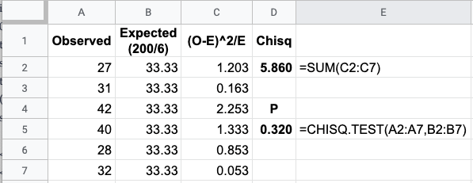
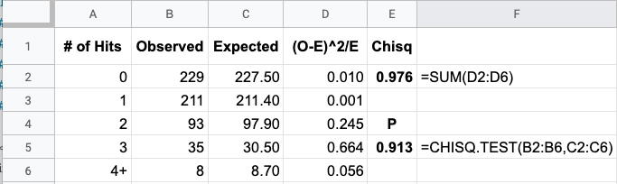
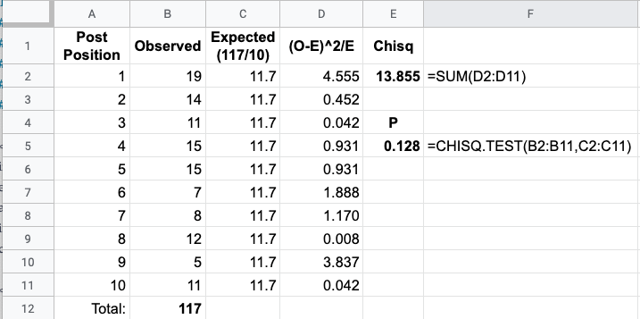
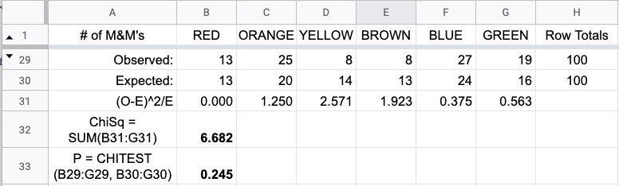
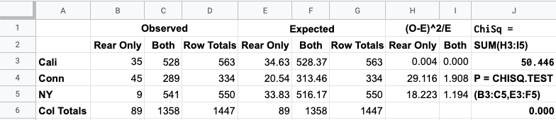

## 
Selected Exercise Solutions

from

### 
Triola, M. F., with L. Iossi, 2018, <i>Elementary Statistics, 13^th Edition</i>, Pearson, Boston.
### 
Chapter 11: Goodness-of-Fit and Contingency Tables 
### 
&copy; 2019, 2025 by
### 
David Lawrence Goldsmith

for

## 
[SelectedSolutionsDotNet](https://olydlg.github.io/selectedsolutionsdotnet/)

<i>Note 1:  These solutions are provided "as-is," for informational purposes only, with no warranty of any kind, expressed or implied, including that of correctness, adequacy, and/or suitability for any purpose, whatsoever.</i> Corrections are welcome and should be emailed to selectedsolutionsdotnet@gmail.com.

### _Section 1: Goodness-of-Fit_

__7__) Given the following "loaded" die roll results:

Roll Result | 1 | 2 | 3 | 4 | 5 | 6| Total
--- | --- | --- | --- | --- | --- | --- | ---
Count | 27 | 31 | 42 | 40 | 28 | 32 | 200

test the null hypothesis that the loading of the die had no effect, i.e., that the results are not "statistically distinguishable" from a "fair" die.

__Sln__: The null hypothesis that the results are not statistically distinguishable from a fair die is equivalent to the hypothesis that the results could have come from a uniform distribution, i.e., that the expected probability of each outcome remains $1/6^{\text{th}}$; thus we want to perform a goodness-of-fit test. We use [Google Sheets](https://docs.google.com/spreadsheets) ("GSheets"), with the pictured results:

Since $P$ is (much) greater than the specified $0.05$ significance level, we __fail to reject the null hypothesis__ and conclude that the results are not statistically distinguishable from those which one might obtain from a fair die: the loading of the die <i>appears</i> to have had no effect.
  

__10__) Do South London World War II bomb hits fit a Poisson distribution?

__Sln__: The data and results of a $\chi^2$ goodness-of-fit test are included below:

Since $P$ is (much, MUCH) greater than the specified 0.05 significance level, we __fail to reject the null hypothesis__ and conclude that the bomb hit counts probably do fit a Poisson distribution.
  

__13__) Does post position matter in the Kentucky Derby horse race?

__Sln__: If it doesn’t matter, we’d expect the likelihood of winning to be equal at each post position, i.e., we’d expect the results to come from a uniform distribution; since we’re limiting consideration to just the first 10 post positions, we expect the probability of winning from each post position to be $1/10^{\text{th}}$; also due to this limitation, despite the data coming from 141 runnings of the Kentucky Derby, we actually have only 117 results, so the expected number of wins at each post position is 117/10 = 11.7.

The data and results of a $\chi^2$ goodness-of-fit test are included in the table below:

Since $P$ is greater than the specified 0.05 significance level, we __fail to reject the null hypothesis__ and conclude that post position does not appear to make a difference in the Kentucky Derby: bettors would be ill-advised to factor post position into their betting choices.
  

__16__) Major League Baseball player birth-months: are the birth-months of MLB players equally distributed, statistically speaking, among the months of the year?

__Sln__: If so, then the expected number of births (not adjusted for the different number of days in each month) in each month is 1/12^th of the total number&mdash;3746&mdash;of MLB players sampled, i.e., 312$\frac16$ players with birthdays in each month.  The data and results of a $\chi^2$ goodness-of-fit test are given in the table below:

Since the $P$-value of 0.000 is less than the specified significance level of 0.05, we __reject the null hypothesis__ that MLB players’ birthdays are, statistically speaking, equally distributed among the months of the year: some months would appear to have more MLB player birthdays than others. Additionally, although the test itself doesn’t tell us in which month(s) there are more birthdays, an examination of the $(O-E)^2/E$ values does suggest that more MLB birthdays occur after July 31, as was claimed.
  

__19__) Using Text Data Set 27 "M&M Weights," test, at a 0.05 significance level, Mars, Inc.’s claim that M&M’s are 16% green, 20% orange, 14% yellow, 24% blue, 13% red, and 13% brown.

__Sln__: Note: despite the data being weights, to get the answer in the back of the book, one needs to assume that these claimed percentages are "by number," i.e., count, not "by weight." Summary data, i.e., observed counts for each color, and results of a $\chi^2$ goodness-of-fit test are given in the table below:

Since $P$ is greater than the specified 0.05 significance level, we __fail to reject the null hypothesis__ that Mars, Inc.’s color count distribution is as claimed: there is insufficient evidence to dispute the claim that M&M’s come as, by count, 16% green, 20% orange, 14% yellow, 24% blue, 13% red, and 13% brown. 
  

__22__) At a 0.01 significance level, test the null hypothesis that the distribution of the leading digits of the text author’s most recent 250 check amounts fits Benford’s Law. Does the conclusion change if we use a significance level of 0.05?

__Sln__: Data and $\chi^2$ g.o.f. test results are given in the table below:

The $P$-value of 0.015 is greater than a significance level of 0.01, so at that s.l., we __fail to reject the null hypothesis__ that the distribution of leading digits conforms to Benford’s Law; however, at an s.l. of 0.05, we would __reject the null hypothesis__ and conclude that there is sufficient evidence to believe that the distribution ___does not___ conform to Benford’s Law: these results are "border-line," in the sense that they result in a $P$-value which causes us to reach different conclusions for two not-exceedingly-different significance levels.
  

__25__) Are the female heights in Text Data Set 1 "Body Data" distributed normally?

__Sln__: Note: "half" the work of this Exercise is efficiently extracting just the female heights from the data set; the other "half" is getting the frequency counts&mdash;both observed and expected&mdash;right. I’m not going to detail the machinations I went through to accomplish the former; but this wouldn’t be much of a "solution" if I didn’t at least provide the spreadsheet functions and methods I used to obtain the answers. Accordingly, the first table below shows said functions, while the second table shows the numerical results. (Note that where my numerical results differ, ever-so-slightly, from those in the back of the book, it is because&mdash;and I checked to confirm this&mdash;the answers in the back to Parts C and D use the rounded-to-four-decimal-places answers in the back to Part B, whereas the numerical values I present here use unrounded values throughout the calculations.)

So, here are the spreadsheet functions used:

(where Column A, which I’ve hidden for visual clarity, contains the raw data of female heights) and the numerical results:

Since $P = 0.831$ is (very much) larger than the specified 0.01 s.l., we __fail to reject the null hypothesis__ that the data come from a normally-distributed population: there is insufficient evidence to conclude that the female heights are not drawn from a normally-distributed population.
  

### _Section 2: Contingency Tables_

__7__) At a 0.05 significance level, do the data given in this Exercise suggest that, among teens, drinking alcohol while driving and texting while driving are independent behaviors?

__Sln__: The data and the contingency table results are given below:

Given the $P$-value of 0.000, we __reject the null hypothesis__ that the surveyed behaviors are independent of one another among teenagers: there is sufficient evidence to conclude that these behaviors are not independent of one another among teenagers. (However, the usual caveats regarding voluntary reporting when using surveys apply.)   
 

__10__) On average, does the 2011 rule change in the NFL regarding overtime play appear to have affected the outcome of overtime games?

__Sln__: A little background is in order: before the rule change, in the event of a tie at the regular end of a game, a full overtime period was played, regardless of which team scored first in the overtime period: there was no "sudden death" situation. The rule change created a "sudden death" situation: if either team scored a "touchdown"&mdash;the highest-scoring play in American football&mdash;that team would immediately win, regardless of how much time was left in the period. Superficially, relative to before the rule change, this would appear to give an advantage to whichever team possesses the ball first, which in turn is determined by a coin toss before the period commences; thus, superficially, whichever team wins the coin toss would appear to have an advantage under this new overtime rule. But do actual overtime game results after the rule change support this, or does the loser of the coin toss have just as much chance of winning the game as they did before the rule change?

The data and contingency table results are:
 

With a $P$-value of 0.626, we __fail to reject the null hypothesis__ that the rule change had no effect on whether or not the winner of the coin toss gained an advantage after the rule change: it appears that the result of the coin toss has just as much (or as little) impact on the final outcome of the game as it did prior to the 2011 rule change.
  

__13__) In penalty kick situations, do soccer goalies have to decide which way to jump before they can see which direction the ball is coming from, i.e., is jump direction independent of ball direction? Test using a 0.05 significance level.

__Sln__: Data regarding ball direction and jump direction, as well as contingency table results are given in the following table:

Since the $P$-value of 0.0056 is less than the specified significance level of 0.05, we __reject the null hypothesis__ that jump direction is independent of ball direction: it appears that, at least to some extent, goalies do have enough time to choose jump direction based on ball direction. (One might note in passing, however, that two of the expected frequencies just barely exceed the threshold of 5, which the text specifies as required to justify the use of this $\chi^2$-based contingency table procedure.)
  

__16__) Is outcome&mdash;injury or fatality vs. not&mdash;of a motorcycle accident independent of helmet color? From a safety standpoint, are certain helmet colors better than others, and if so which appears to be best?

__Sln__: Interestingly, this problem does not specify a significance level to use! This is significant (no pun intended) because the $P$-value resulting from the contingency table analysis below:

namely, 0.041, results in a different action with respect to the null hypothesis depending on whether we choose a significance level of 0.05 or 0.01: if we choose the former, we should __reject the null hypothesis__ that accident outcome is independent of helmet color, whereas if we choose the 0.01 significance level, we should __fail to reject the null hypothesis__! In this case, the safety-minded motorcycle driver would probably want to choose the 0.05 s.l., reject the null hypothesis that helmet color is independent of accident outcome, and choose a helmet color based on the interpretation that there is sufficient evidence to support the notion that certain helmet colors reduce the likelihood of injury or death. 

As regards the second part of the question: although rejection of the null hypothesis in and of itself doesn’t tell us ___which___ color is best, an examination of the $(O-E)^2/E$ results points to white helmets exhibiting the greatest relative difference between expected and observed outcomes; subsequent examination of the actual observed vs. expected "cases" (i.e., actual incidents of injury or death) indicates that indeed the observed frequency of cases for white helmets, 112, is notably less than its expected frequency of 135; thus, though there is of course no guarantee, white would appear to be the safest helmet color choice, for the motorcycle driver inclined to interpret these results as indicating that helmet color does indeed make a difference.
  

__19__) Based on the given data (collected by the text author), and using a 0.05 significance level, are car license plate display laws in California, Connecticut, and New York obeyed with "more-or-less" equal compliance, or does compliance appear to depend on the state?

__Sln__: The data and resulting contingency table analysis are given below:

At the specified s.l. of 0.05, the $P$-value of 0.000 compels us to __reject the null hypothesis__ that compliance with these states’ license plate display laws is independent of the state in question: there is sufficient evidence to conclude that these laws are obeyed more in some of these states than in others. Of the three, New York, with an expected compliance frequency of 33.83 but an observed compliance frequency of only 9, appears to be the "most compliant" state, while Connecticut, with an expected compliance frequency of 20.54 but an observed compliance frequency of 45, appears to be the "most recalcitrant" state.
 

### Credits
Spreadsheets, including calculations, generated with [Google Sheets](https://docs.google.com/spreadsheets).

### Please Donate:
<table>
  <tr style="border: none; background: transparent;">
    <td style="border: none;">
      <b>Venmo: @David-Goldsmith-13</b>
    </td>
    <td style="border: none;">
      <form action="https://www.paypal.com/cgi-bin/webscr"
            method="post"><input name="cmd"
            value="_xclick" type="hidden"> <input name="business"
            value="dgoldsmith_89@alumni.brown.edu" type="hidden"> <input
            name="item_name" value="SelectedSolutions Donation"
            type="hidden"> <input name="cn" value="Special Instructions
            (optional" type="hidden"> <input
            src="https://www.paypal.com/images/x-click-but04.gif"
            name="submit" alt="Make payments with PayPal - it's fast,
            free and secure!" align="middle" border="0" type="image"></form>
    </td>
  </tr>
</table>
