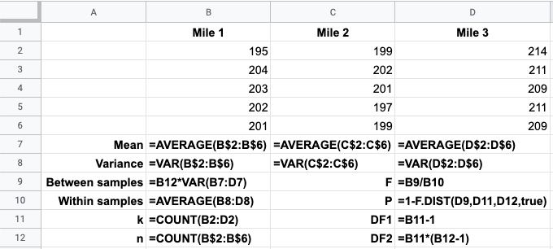
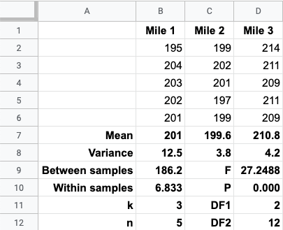
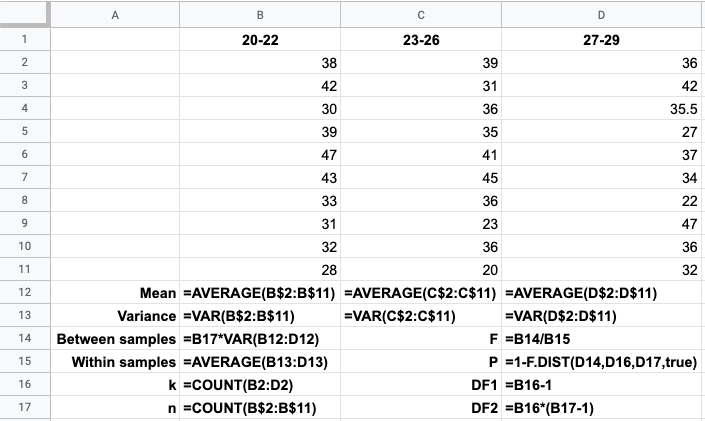
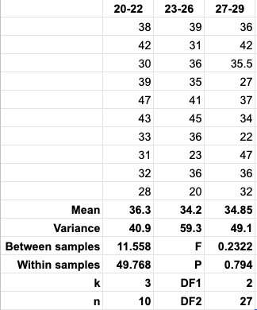
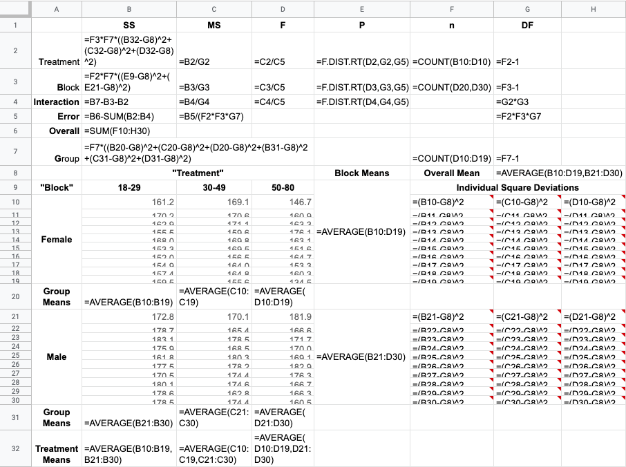
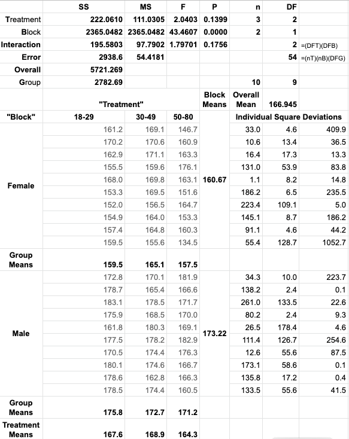
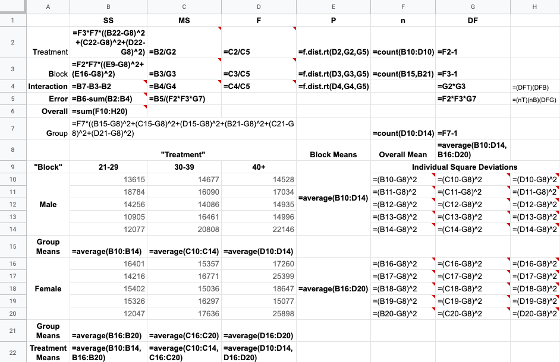
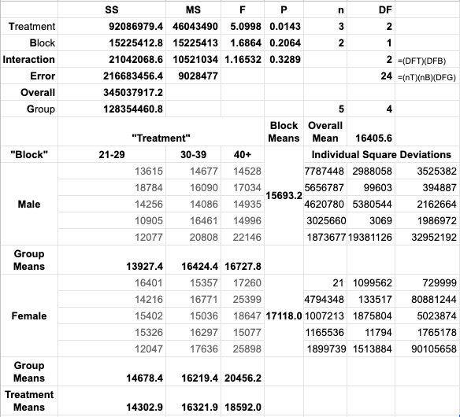

## 
Selected Exercise Solutions

from

### 
Triola, M. F., with L. Iossi, 2018, <i>Elementary Statistics, 13^th Edition</i>, Pearson, Boston.
### 
Chapter 12: ANOVA 
### 
&copy; 2019, 2025 by
### 
David Lawrence Goldsmith

for

## 
[SelectedSolutionsDotNet](https://olydlg.github.io/selectedsolutionsdotnet/)

<i>Note 1:  These solutions are provided "as-is," for informational purposes only, with no warranty of any kind, expressed or implied, including that of correctness, adequacy, and/or suitability for any purpose, whatsoever.</i> Corrections are welcome and should be emailed to selectedsolutionsdotnet@gmail.com.

### Section 1: One-Way ANOVA

__11__) "Triathlon Times" Use a 0.05 significance level to test the null hypothesis that Jeff Parent’s bicycle times over sampled miles are statistically indistinguishable. Is there sufficient evidence to believe that one of the sampled miles may have included a hill?

__Sln__: Below are two views&mdash;formulas and results&mdash;of a [Google Sheets](https://docs.google.com/spreadsheets) (GSheets) table containing the one-way ANOVA results for the data, which we note must be converted to a uniform unit, i.e., minutes or seconds&mdash;in this case we opted for seconds&mdash; prior to analysis:

With a $P$-value of 0.000, we easily __reject the null hypothesis__ that Mr. Parent’s test mile times are statistically indistinguishable; examining the data, it appears reasonable to suspect that Mile 3, with a mean time of 210.8 seconds (compared to mean times of 201 and 199.6 seconds for Miles 1 and 2, respectively) contains a hill.
  

__14__) "Speed Dating" At a 0.05 significance level, use the given ratings data to test the null hypothesis that age doesn’t matter as far as females rating males is concerned.

__Sln__: Again, we give two views of the same GSheet, first, with the formulas used to do the one-way ANOVA analysis:

second with the results of that analysis:

With a $P$-value of $0.794$, we easily <b>fail to reject</b> the null hypothesis: there is insufficient evidence to believe that the mean "date-ability" rating given to men by women depends on the age of the women.
  

### Section 2: Two-Way ANOVA

__7__) Infer conclusions, at a 0.05 level of significance, from the two-way ANOVA table resulting from given height data, both the data and the table being provided in the problem statement. 

__Sln__: By now, hopefully, the student should be facile at inferring conclusions regarding hypothesis tests from provided $P$-values, so why am I providing a solution to this Exercise? Because I’ve been using (free, Web-based) [Google Sheets](https://docs.google.com/spreadsheets) to generate my tables and statistical results, and (as of December, 2019) I wasn’t readily able to find an existing function call or available plug-in to automatically produce two-way ANOVA tables from suitable data; so, with help&mdash;and vocabulary&mdash;from the classic text Box, G. E. P., W. G. Hunter, & J. S. Hunter, 1978, ___Statistics for Experimenters___, Wiley & Sons, NY (BH&H), I figured out how to generate such tables in GSheets "from scratch"; having done that, I feel I should share.

So, below are two GSheet screenshots: the first shows the formulas used for all computations (the rows containing the data and the individual square deviation formulas have been partially hidden so that I could get the whole table in one screenshot, but the reader should be able to infer the formulas from context and the first row which has been provided in full):

 
and the second shows the results of the calculations, which agree exactly with the XLSTAT results shown in the text:

Finally, with an interaction $P$-value of 0.1756, at a significance level of 0.05, we __fail to reject the null hypothesis that there is no interaction effect__, i.e., there is insufficient evidence to infer an interaction between age group and gender in this adult height data; having failed to find an interaction effect, we proceed to examine the $P$-values associated with the variations due to gender (the "blocks") and due to age (the "treatments"; these terms, adopted from BH&H and common in the literature of two-way ANOVA, may be arbitrarily assigned to the groupings, i.e., we could have chosen to call the age groups the "blocks" and gender the "treatments," without affecting the ultimate conclusions). With a $P$-value of 0.1399, at the 0.05 significance level, we __fail to reject the null hypothesis that there is no age effect__ on adult heights; but with a $P$-value of 0.0000, we __do reject the null hypothesis of no effect of gender__ on adult heights: gender does appear to be a factor in determining adult height.
  

__9__) "Marathon Times" For the indicated, randomly-selected NYC marathon times, grouped by age and gender, use a 0.05 significance level to test null hypotheses concerning an interaction effect, and the individual effects of age and gender. 

__Sln__: GSheet formula and result two-way ANOVA tables are:

With a $P$-value of 0.3289, we __fail to reject__ the null hypothesis that there is no interaction effect between age and gender; similarly, with a $P$-value of 0.2064, we also __fail to reject__ the null hypothesis that there is no gender effect; on the other hand, with a $P$-value of 0.0143, at the specified significance level (0.05), we do __reject__ the null hypothesis of no effect due to age: there is sufficient evidence to believe that age has an effect on marathon running times.

### Credits
Spreadsheets, including calculations, generated with [Google Sheets](https://docs.google.com/spreadsheets).

### Please Donate:
<form action="https://www.paypal.com/cgi-bin/webscr"
          method="post"><input name="cmd"
            value="_xclick" type="hidden"> <input name="business"
            value="dgoldsmith_89@alumni.brown.edu" type="hidden"> <input
            name="item_name" value="SelectedSolutions Donation"
            type="hidden"> <input name="cn" value="Special Instructions
            (optional" type="hidden"> <input
            src="https://www.paypal.com/images/x-click-but04.gif"
            name="submit" alt="Make payments with PayPal - it's fast,
            free and secure!" align="middle" border="0" type="image"></form>

